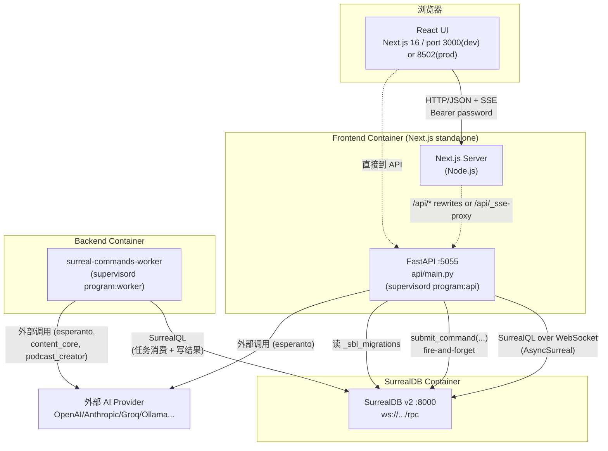
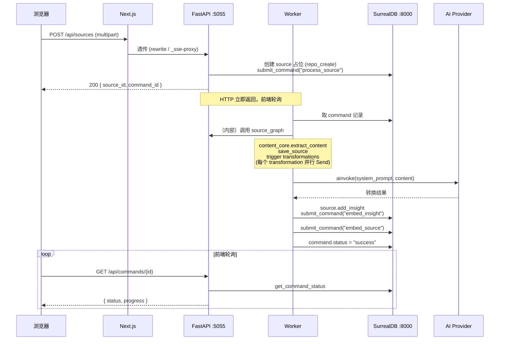

# 专题 A：架构全景

> 说明：本报告基于实际代码、import、router 注册和文件结构（不是照抄 CLAUDE.md）。

## 一、它是什么

**Open Notebook** 是一个开源的、隐私优先的 NotebookLM 替代品，让用户上传多模态内容（PDF、音频、视频、网页、文本），生成笔记与洞察，做语义搜索，与 AI 对话，并产出播客。

从工程视角看，它是一个**三层 + 一个异步 Worker 的单体应用**：

- **前端层**：Next.js 16 (App Router) + React 19 + TypeScript，端口 3000（开发）或 8502（容器内，见 `supervisord.conf`、`docker-compose.yml`）。
- **API 层**：FastAPI，端口 5055，Python 3.12，包结构上拆为 `api/`（HTTP/路由/服务）和 `open_notebook/`（领域、图、AI、数据库、工具）。
- **数据库层**：SurrealDB v2，端口 8000，承担"图 + 文档 + 向量"三重职责。
- **Worker**：`surreal-commands-worker` 进程（见 `supervisord.conf` 第 17–26 行），与 API 共享同一 Python 代码库（`commands/`），异步消费长任务（向量化、源处理、播客生成）。

> 注意：根 CLAUDE.md 写 "frontend @ port 3000"，但 `docker-compose.yml`（端口映射 `8502:8502`）与 `supervisord.conf`（`environment=NODE_ENV="production",PORT="8502"`）显示**生产镜像里前端在 8502**。3000 只是 `npm run dev` 的开发端口。

## 二、为什么这样分

层与层之间存在清晰的、单向的、协议化的依赖：

1. **关注点分离**：UI（React）、业务编排（FastAPI + LangGraph）、持久化（SurrealDB）各自演进。前端永远不知道 SurrealQL，前端甚至不知道 LangGraph 的存在。
2. **协议边界明确**：前端 ↔ API 是 HTTP/JSON + SSE；API ↔ 数据库是 SurrealQL（async WebSocket）；API ↔ Worker 是 SurrealDB 中的"任务表"（`surreal_commands`）。
3. **多 Provider AI 抽象**：通过 `esperanto` 统一 8+ 家厂商，并通过数据库里的 `Credential`/`Model` 表 + 环境变量回退，实现"UI 配置或 .env 配置都行"。
4. **长任务不阻塞 HTTP**：向量化、播客生成、source ingestion 都丢给 `surreal-commands` Worker，HTTP 端立即返回 `command_id`，前端轮询 `/api/commands/{id}`。
5. **可替换的部署形态**：`Dockerfile`（多容器）+ `Dockerfile.single`（单容器内嵌 SurrealDB）+ `docker-compose.yml`（生产）+ `Makefile`（开发）+ `supervisord.conf`（进程编排）覆盖从本地开发到 K8s 的多种部署。

## 三、模块清单（按子系统分组）

### 3.1 HTTP/API 子系统（`api/`）

| 模块 | 它是什么 | 为什么存在 | 关键接口/职责 | 依赖了谁 |
|---|---|---|---|---|
| `api/main.py` | FastAPI 应用入口 | 集中装配：CORS、密码中间件、全局异常映射、lifespan 启动迁移、router 注册 | `app = FastAPI(lifespan=...)`；`@asynccontextmanager lifespan`；为 9 种 `OpenNotebookError` 子类注册 → HTTP 状态码 handler | `api/auth.py`、`api/routers/*`、`open_notebook.database.async_migrate`、`open_notebook.exceptions`、`open_notebook.podcasts.migration` |
| `api/auth.py` | `PasswordAuthMiddleware` + `check_api_password` 依赖 | 全局 HTTP 入口鉴权（开发态单一密码），白名单 `/`、`/health`、`/docs`、`/api/auth/status`、`/api/config` | `BaseHTTPMiddleware.dispatch`；读 `OPEN_NOTEBOOK_PASSWORD` 或 `OPEN_NOTEBOOK_PASSWORD_FILE`（Docker secrets） | `open_notebook.utils.encryption.get_secret_from_env` |
| `api/routers/*.py` | 21 个 APIRouter（auth, chat, commands, config, context, credentials, embedding, embedding_rebuild, episode_profiles, insights, languages, models, notebooks, notes, podcasts, search, settings, source_chat, sources, speaker_profiles, transformations） | 把 HTTP 路径翻译成业务调用；薄一层 | `router = APIRouter()`；端点函数调服务/domain | 各 `open_notebook.domain.*`、`open_notebook.graphs.*`、`open_notebook.ai.*`、`api.models` |
| `api/*_service.py`（17 个服务） | 业务编排 | 封装跨层流程（domain + graph + 命令），让 router 保持薄 | `sources_service`、`chat_service`、`podcast_service`、`notebook_service`、`notes_service`、`transformations_service`、`insights_service`、`models_service`、`credentials_service`（最大，915 行）、`episode_profiles_service`、`embedding_service`、`search_service`、`settings_service`、`context_service`、`command_service`、`podcast_api_service` | domain、graphs、`surreal_commands` |
| `api/client.py` | **服务端** httpx 客户端 `APIClient` | 给那些仍按"调自己的 API"风格写的服务用（如 `sources_service.get_all_sources` 反过来调 `/api/sources`） | `api_client = APIClient()`；内含 notebooks/search/transformations/notes/embedding/sources/insights/episode_profiles 接口 | 无（独立 httpx 调用），运行期依赖 `OPEN_NOTEBOOK_PASSWORD`、`API_BASE_URL` |
| `api/models.py` | Pydantic v2 请求/响应 schema（693 行） | router 与外部世界之间的类型契约；含 `ChatRequest`、`SourceCreate`、`PodcastGenerationRequest` 等 | `BaseModel` 子类、`field_validator` | 无 |
| `api/command_service.py` | `CommandService` 提交/查询 `surreal-commands` 任务 | 统一异步任务的入口与状态查询；保证 `commands` 模块在提交前被 import | `submit_command_job`、`get_command_status`、`list_command_jobs`、`cancel_command_job` | `surreal_commands`、`commands.podcast_commands`（确保注册） |

router 注册在 `api/main.py:290-312`，全部挂 `/api` 前缀；`commands_router` 单独 import 以避免命名冲突。

### 3.2 AI 子系统（`open_notebook/ai/`）

| 模块 | 它是什么 | 为什么存在 | 关键接口/职责 | 依赖了谁 |
|---|---|---|---|---|
| `ai/models.py` | `Model`（ObjectModel 表 `model`）、`DefaultModels`（RecordModel 单例 `open_notebook:default_models`）、`ModelManager` 工厂 + 全局 `model_manager` 单例 | 把"数据库里的 model 元数据"实时具象化为 esperanto 的 `LanguageModel/EmbeddingModel/SpeechToText/TextToSpeech`；提供默认模型查找 + 类型分发 | `Model.get_models_by_type`、`Model.get_by_credential`、`DefaultModels.get_instance`（每次都 fetch fresh，绕过缓存）、`ModelManager.get_model(model_id)`、`get_default_model(type)`、`get_embedding_model`、`get_speech_to_text`、`get_text_to_speech` | `esperanto.AIFactory`、`open_notebook.database.repository`、`open_notebook.domain.base`、`open_notebook.domain.credential`、`open_notebook.ai.key_provider`（延迟 import） |
| `ai/provision.py` | `provision_langchain_model(content, model_id, default_type, **kwargs)` | 给 LangGraph 节点一个统一的"挑选并实例化 LLM"入口；含**大上下文降级**：token > 105,000 → `large_context_model`；并保证返回 `LanguageModel` | 返回 `BaseChatModel`（`.to_langchain()`） | `open_notebook.ai.models.model_manager`、`open_notebook.utils.token_count`、`open_notebook.exceptions.ConfigurationError` |
| `ai/key_provider.py` | DB-first + 环境变量回退的 API Key 提供 | 兼容"UI 配置优先"与".env 优先"两种部署；通过把 DB 里的 key 注入 `os.environ` 让 esperanto 能读到 | `PROVIDER_CONFIG`（13 家厂商）、`get_api_key(provider)`、`provision_provider_keys(provider)`、`provision_all_keys()`；针对 vertex/azure/openai_compatible 有专门 `_provision_*` | `open_notebook.domain.credential.Credential` |
| `ai/connection_tester.py` | 用最小调用验证凭证是否可用 | 配置 UI 里点"Test"按钮的后端实现；不污染主流程 | `test_provider_connection(provider, model_type, config_id)`、`test_individual_model`、`TEST_MODELS` 字典、`_test_ollama_connection`、`_test_openai_compatible_connection` | `esperanto`、`open_notebook.domain.credential`、`open_notebook.ai.models` |
| `ai/model_discovery.py`（888 行） | 通过各 Provider 的 `/models` 端点列出可用模型，并按 `classify_model_type` 推断类型 | 让"添加凭证后自动登记模型"成为可能；UI 的一键导入 | 各 provider 的 `_get_*_models()`、`classify_model_type` | `esperanto`、`Credential` |

### 3.3 数据库子系统（`open_notebook/database/`）

| 模块 | 它是什么 | 为什么存在 | 关键接口/职责 | 依赖了谁 |
|---|---|---|---|---|
| `database/repository.py` | SurrealDB 异步仓储层 | 隔离 SurrealQL；每个操作打开一次连接（无池化），适合 HTTP 请求级使用 | `db_connection()`（async ctx mgr）、`repo_query`、`repo_create`、`repo_update`、`repo_upsert`、`repo_insert`、`repo_delete`、`repo_relate`、`parse_record_ids`、`ensure_record_id` | `surrealdb.AsyncSurreal`、`surrealdb.RecordID`、`os` env (`SURREAL_URL/USER/PASSWORD/NAMESPACE/DATABASE`) |
| `database/async_migrate.py` | 异步迁移管理器 | 在 API 启动时自动跑迁移，避免"忘了 migrate" | `AsyncMigration.from_file`、`AsyncMigrationRunner.run_all/run_one_up/run_one_down`、`AsyncMigrationManager.run_migration_up`；版本表 `_sbl_migrations`；`get_latest_version/bump_version/lower_version` | `database.repository.db_connection/repo_query`；硬编码 15 个 up + 15 个 down 文件 |
| `database/migrate.py` | 同步包装 | 为遗留同步代码提供 `MigrationManager` | `asyncio.run(...)` 包装 async 版 | `async_migrate` |
| `database/migrations/*.surquel` | 30 个 SurrealQL 脚本（1–15 + 1_down–15_down） | 唯一的 schema 演进载体 | DDL/DML：建表、加字段、回填（11+ 与 credential 系统相关，14+ 与 podcast 模型注册相关，15 给 credential 加 flexible `config` 对象） | 由 `async_migrate` 读入执行 |

### 3.4 领域子系统（`open_notebook/domain/`）

| 模块 | 它是什么 | 为什么存在 | 关键接口/职责 | 依赖了谁 |
|---|---|---|---|---|
| `domain/base.py` | `ObjectModel`（带自增 ID 的可变记录）与 `RecordModel`（带固定 ID 的单例） | 给所有 domain model 统一 CRUD + 关系（`relate`）+ 多态 `get(id)`（按表名前缀派发子类）+ 时间戳 | `ObjectModel.save/delete/relate/get/get_all/_prepare_save_data`；`RecordModel.get_instance/update/_load_from_db` | `database.repository.*`、`exceptions` |
| `domain/notebook.py`（768 行，核心域） | `Notebook`、`Source`、`Note`、`SourceInsight`、`SourceEmbedding`、`ChatSession`、`Asset`；模块级函数 `text_search`、`vector_search` | 整个产品的"词汇表"——研究项目、源、笔记、洞察、对话会话 | `Notebook.get_sources/get_notes/get_context/get_delete_preview/delete`；`Source.vectorize/get_status/get_context/add_insight`；`Note.save`（自动提交 `embed_note`）；`text_search/query/vector_search` | `surreal_commands.submit_command`、`database.repository`、`base`、`exceptions` |
| `domain/credential.py` | `Credential`（ObjectModel，表 `credential`） | 取代旧 `ProviderConfig` 单例；每张凭证独立记录；SecretStr + Fernet 加密落盘 | `to_esperanto_config()`、`get_by_provider(provider)`、`get_linked_models()`；`_prepare_save_data` 加密；`get/get_all` 重写以解密 | `database.repository`、`base`、`utils.encryption` |
| `domain/content_settings.py` | `ContentSettings`（RecordModel `open_notebook:content_settings`） | 内容处理引擎选择 + 嵌入策略 + YouTube 偏好语言 | 字段：`default_content_processing_engine_doc/url`、`default_embedding_option`、`auto_delete_files`、`youtube_preferred_languages` | `base` |
| `domain/transformation.py` | `Transformation`（用户定义的可复用 prompt）+ `DefaultPrompts`（含 `transformation_instructions`） | 让用户在 UI 里造"模板化 AI 加工"，自动应用到新 source | `name/title/description/prompt/apply_default` | `base` |
| `domain/provider_config.py`（444 行） | 旧 `ProviderConfig` 单例 + `ProviderCredential` | **仅为迁移而存在**——已被 `Credential` 替换 | 提供旧 → 新数据结构以供 `/credentials/migrate-from-provider-config` 读取 | `base`、`encryption` |

### 3.5 LangGraph 工作流子系统（`open_notebook/graphs/`）

| 模块 | 它是什么 | 为什么存在 | 关键接口 | 依赖了谁 |
|---|---|---|---|---|
| `graphs/chat.py` | 单节点 chat workflow + SqliteSaver checkpointer | 维护对话记忆（按 thread_id），用 `chat/system.jinja` 渲染系统提示；处理 `model_override`；处理 sync↔async 跨越（ThreadPoolExecutor 套新 loop） | `graph = agent_state.compile(checkpointer=memory)`；节点 `call_model_with_messages` | `ai_prompter.Prompter`、`ai.provision`、`config.LANGGRAPH_CHECKPOINT_FILE`、`utils.clean_thinking_content`、`utils.error_classifier.classify_error` |
| `graphs/ask.py` | 多阶段搜索综合 workflow | 把一个问题拆成多个搜索 → 并行答 → 综合最终答案；`ask/entry`/`ask/query_process`/`ask/final_answer` 三模板 | `graph = agent_state.compile()`；节点 `call_model_with_messages`（生成 `Strategy`）、`provide_answer`、`write_final_answer`；用 `Send` 做扇出 | `ai.provision`、`domain.notebook.vector_search`、`utils.error_classifier` |
| `graphs/source.py` | 内容摄入 workflow | content-core 提取 → 存 source → 触发用户默认 transformation（并行扇出）→ 写 insight | `source_graph = workflow.compile()`；节点 `content_process`、`save_source`、`transform_content`；条件边 `trigger_transformations` | `content_core.extract_content`、`ai.models.ModelManager`、`domain.notebook.Source/Asset`、`graphs.transformation`、`domain.content_settings.ContentSettings` |
| `graphs/source_chat.py` | 针对**单个 source** 的 chat workflow | 把指定源的全文/insights 注入上下文，回答"关于这篇资料的问题"；SqliteSaver 持久化 | `source_chat_graph`；节点 `_call_model_with_source_context_inner`；用 `ContextBuilder` 组装上下文 | `ai.provision`、`ContextBuilder`、`domain.notebook.Source/SourceInsight` |
| `graphs/transformation.py` | 单节点 workflow：跑一个 Transformation | 给 source 做模板化 LLM 调用，把结果作为 insight 落盘 | `graph`；节点 `run_transformation` | `ai.provision`、`ai_prompter.Prompter`、`domain.transformation.Transformation/DefaultPrompts` |
| `graphs/prompt.py` | "通用模式链" workflow | 给那些非结构化的 prompt 执行场景（带可选 OutputParser） | `PatternChainState`、`graph`、节点 `call_model` | `ai.provision`、`ai_prompter` |
| `graphs/tools.py` | LangChain tools | 仅 `get_current_timestamp`；预留给将来给 chat 模型 bind_tools | `@tool get_current_timestamp()` | `langchain.tools` |

### 3.6 Podcast 子系统（`open_notebook/podcasts/`）

| 模块 | 它是什么 | 为什么存在 | 关键接口 | 依赖了谁 |
|---|---|---|---|---|
| `podcasts/models.py` | `SpeakerProfile`、`EpisodeProfile`、`PodcastEpisode`（均继承 `ObjectModel`）+ 模块级 `_resolve_model_config(model_id)` | 把播客相关元数据持久化；都通过 `record<model>` ID 引用 LLM/TTS（不再用裸字符串）；PodcastEpisode 持有 profile 快照 + `command` 字段（指向 surreal-commands 任务） | `SpeakerProfile.resolve_tts_config`、`EpisodeProfile.resolve_outline_config/resolve_transcript_config`、`PodcastEpisode.get_job_status/get_job_detail`、`get_by_name` | `database.repository`、`base`、`ai.models.Model`、`ai.key_provider`、`surreal_commands`（可选） |
| `podcasts/migration.py` | 把旧的 `outline_provider/outline_model/...` 字符串迁移到 `outline_llm/transcript_llm/voice_model` 模型 ID | 一次性、幂等；找不到匹配 Model 时若存在该 provider 的 credential 则自动建一个 Model | `migrate_podcast_profiles()`；`_find_or_create_model` | `database.repository.repo_query`、`Credential`、`ai.models.Model` |

### 3.7 命令/任务子系统（`commands/`）

`commands/__init__.py` 导入并 re-export 所有命令，让 `surreal-commands-worker --import-modules commands` 能注册它们。

| 模块 | 它是什么 | 为什么存在 | 关键命令 | 依赖了谁 |
|---|---|---|---|---|
| `commands/embedding_commands.py`（1063 行） | 异步嵌入任务族 | 把"note/insight/source 嵌入"从 HTTP 请求路径剥离；支持批处理 + 重试 + 大文本 mean pooling | `embed_note_command`、`embed_insight_command`、`embed_source_command`、`rebuild_embeddings_command`、`create_insight_command` | `surreal_commands.command/CommandInput/CommandOutput`、`utils.chunking`、`utils.embedding`、`database.repository` |
| `commands/source_commands.py` | 内容摄入命令 | 把 source_graph（含 content-core 提取、保存、转换）跑在 Worker 里；`ValueError` 触发 `stop_on` 永久失败 | `process_source_command` | `graphs.source.source_graph`、`graphs.transformation`、`domain.notebook.Source`、`domain.transformation.Transformation` |
| `commands/podcast_commands.py` | 播客生成命令 | 在 Worker 里调用 `podcast_creator` 库；先解析所有 profile 的模型/凭证，再生成 outline + transcript + TTS | `generate_podcast_command` | `podcasts.models`、`_resolve_model_config`、`podcast_creator` |
| `commands/example_commands.py` | 测试用示例 | 测试 `surreal-commands` 框架本身的夹具 | `process_text_command`、`analyze_data_command` | `surreal_commands` |

### 3.8 工具/横切（`open_notebook/utils/`）

| 模块 | 它是什么 | 为什么存在 | 关键接口 | 依赖了谁 |
|---|---|---|---|---|
| `utils/chunking.py`（494 行） | 内容类型感知的文本切分 | 让嵌入对不同结构（HTML/Markdown/Plain）用合适 splitter；chunk size 可由 `OPEN_NOTEBOOK_CHUNK_SIZE` 配置 | `ContentType`、`detect_content_type*`、`chunk_text`、`CHUNK_SIZE`、`CHUNK_OVERLAP` | `langchain_text_splitters`、`token_utils` |
| `utils/embedding.py` | 嵌入生成 | 统一入口：单条（自动分块 + mean pooling）、批量（按 50 一批，可配） | `generate_embedding`、`generate_embeddings`、`mean_pool_embeddings` | `ai.models.model_manager`、`chunking`、`numpy` |
| `utils/context_builder.py`（495 行） | 上下文装配器 | 在 source_chat / notebooks context 端点用；按优先级在 token 预算内挑内容 | `ContextItem`、`ContextConfig`、`ContextBuilder.build()` | `domain.notebook.vector_search`、`token_utils` |
| `utils/token_utils.py` | token 计数（tiktoken o200k_base） | 给 `provision_langchain_model` 的"大上下文"判定和 ContextBuilder 预算用 | `token_count`、`token_cost` | `tiktoken`（缺省有粗估回退） |
| `utils/text_utils.py` | 文本清洗 + `<think>` 标签剥离 | 应对扩展思考模型在响应里塞 `<think>…</think>` | `clean_thinking_content`、`parse_thinking_content`、`remove_non_ascii/printable` | 无 |
| `utils/encryption.py` | Fernet 字段级加密 | 给 `Credential.api_key` 等敏感字段落盘加密 | `get_secret_from_env`、`get_fernet`、`encrypt_value`、`decrypt_value` | `cryptography.fernet` |
| `utils/error_classifier.py` | 把原始 LLM/网络异常映射成 `OpenNotebookError` 子类 | 让所有 graph 节点统一用 `try/except → raise typed`；最终 main.py 的 handler 翻译成 HTTP 码 | `classify_error(exc) -> (ExceptionClass, message)` | `exceptions` |
| `utils/graph_utils.py` | LangGraph 辅助 | `get_session_message_count`（从 sqlite checkpoint 反查） | — | `langgraph.checkpoint.sqlite` |
| `utils/version_utils.py` | 版本比较与 GitHub 最新版获取 | 给"前端检测新版本"和兼容性检查用 | `compare_versions`、`get_installed_version`、`get_version_from_github` | `packaging` |

### 3.9 入口/配置/异常（`open_notebook/` 根）

| 文件 | 它是什么 | 为什么存在 | 关键内容 |
|---|---|---|---|
| `open_notebook/__init__.py` | 包标识 | 让 `import open_notebook.xxx` 成立 | 空 |
| `open_notebook/config.py` | 路径常量 | 集中管理 `./data/sqlite-db`、`./data/uploads`、`./data/tiktoken-cache`；并 `os.makedirs` 保证存在 | `DATA_FOLDER`、`LANGGRAPH_CHECKPOINT_FILE`、`UPLOADS_FOLDER`、`TIKTOKEN_CACHE_DIR` |
| `open_notebook/exceptions.py` | 异常类层级 | 单一根 `OpenNotebookError`；10 个子类（DatabaseOperationError、InvalidInputError、NotFoundError、AuthenticationError、ConfigurationError、ExternalServiceError、RateLimitError、NetworkError、FileOperationError、UnsupportedTypeException、NoTranscriptFound） | 全部用于 `main.py` 全局 handler |

### 3.10 Prompts（`prompts/`）

四组 Jinja2 模板，目录即工作流名：`ask/`（entry、query_process、final_answer）、`chat/system`、`source_chat/system`、`podcast/outline + transcript`。由 `ai_prompter.Prompter(prompt_template="ask/entry")` 按路径加载，模板与 Python 代码解耦。

### 3.11 前端子系统（`frontend/src/`）

| 子目录 | 它是什么 | 为什么存在 | 关键文件/职责 |
|---|---|---|---|
| `app/` | Next.js App Router 路由 | 路由组 `(auth)/login` 与 `(dashboard)/{notebooks,sources,search,podcasts,settings,advanced,transformations}`；`app/api/{search,sources,_sse-proxy}` 是 Next.js 端的服务端代理；`app/config/route.ts` 给客户端返回运行期 `apiUrl` | `(dashboard)/layout.tsx`（鉴权 + ErrorBoundary + ModalProvider + CommandPalette）；`proxy.ts`（根 `/` → `/notebooks` 重定向） |
| `components/` | React 组件 | 按特性域分组：`auth/`、`common/`（CommandPalette、ErrorBoundary、ConnectionGuard、ModelSelector…）、`layout/`（AppShell、AppSidebar）、`providers/`（Theme/Query/I18n/Modal）、`ui/`（Radix 28 个原子）、`notebooks/`、`sources/`、`source/`（单源详情 + ChatPanel）、`search/`（StreamingResponse 等 SSE 渲染）、`podcasts/`（EpisodeProfilesPanel、SpeakerProfilesPanel、GeneratePodcastDialog）、`settings/`（MigrationBanner、ModelTestResultDialog）、`errors/` | UI 用 shadcn/ui + Tailwind |
| `lib/api/` | Axios 客户端 + 14 个资源模块 | 单一 `apiClient` 实例 + 每个资源一个 namespace（`sourcesApi`、`chatApi`、`credentialsApi`、`podcastsApi`…）；interceptor 加 Bearer、处理 FormData、401 → 跳登录 | `client.ts`（动态 baseURL，调 `getApiUrl()`）、`query-client.ts` |
| `lib/hooks/` | TanStack Query 封装 + 业务 hooks | 把"取数据 + 失效"集中；含 `useNotebookChat`、`useSourceChat`、`useAsk`（SSE 流式）、`useCredentials`、`useModels`、`usePodcasts`、`useAuth`、`useTranslation`、`useVersionCheck` | 依赖 `lib/api/*`、`lib/stores/*` |
| `lib/stores/` | Zustand 状态 | `auth-store`（token，localStorage 持久化 `auth-storage` key）、`navigation-store`、`sidebar-store`、`notebook-{columns,view}-store`、`theme-store` | `zustand/middleware persist` |
| `lib/types/` | TypeScript 类型 | API 形状、领域模型（Notebook/Source/Note/Podcast）、config | — |
| `lib/utils/` | 纯函数工具 | `error-handler.ts`（i18n 映射 + 回退到后端 message）、`source-context.ts`、`source-references.tsx`、`date-locale.ts` | — |
| `lib/locales/` | 14 种语言翻译 + i18next | 国际化；按特性切分键 | `index.ts`（i18next 配置）、`use-translation.ts` |
| `lib/config.ts` | 运行期 API URL 发现 | 优先级：`/config` 端点 → `NEXT_PUBLIC_API_URL` → 相对路径走 Next.js rewrites | `getApiUrl()`、`getConfig()` |
| `lib/i18n.ts` + `theme-script.ts` | i18next 初始化、主题防闪 | — | — |

### 3.12 部署/编排（根目录）

| 文件 | 它是什么 | 为什么存在 |
|---|---|---|
| `Dockerfile` | 多阶段镜像（builder + runtime） | 单镜像里包含前端 standalone build、后端 venv、tiktoken 离线缓存、ffmpeg、supervisor；产物 `lfnovo/open_notebook:v1-latest` |
| `Dockerfile.single` | 单容器变体 | 内嵌 SurrealDB 二进制；一行 `docker run` 起所有部件 |
| `docker-compose.yml` | 生产 compose | 起 `surrealdb`（v2，端口 8000）+ `open_notebook`（端口 8502 + 5055）；env 注入加密 key 与 Surreal 连接 |
| `supervisord.conf` / `supervisord.single.conf` | 进程编排 | 在容器内同时跑 `[program:api]`、`[program:worker]`、`[program:frontend]`，前端先等 `wait-for-api.sh` |
| `Makefile` | 开发与发布脚本 | `make api`/`worker`/`frontend`/`start-all`/`status`/`stop-all`/`docker-release` |
| `run_api.py` | 本地启动脚本 | `uv run uvicorn api.main:app --reload`，默认 127.0.0.1:5055 |
| `pyproject.toml`、`uv.lock` | Python 依赖锁 | 用 `uv` 管理；`make api`/`make worker` 都用 `uv run` |
| `scripts/wait-for-api.sh` | 健康探活 | 容器启动顺序保障 |
| `scripts/export_docs.py` | 导出 docs | `make export-docs` |

## 四、运行时调用图

### 4.1 三层运行时



### 4.2 典型请求时序：上传一个 PDF source 并嵌入



### 4.3 模块依赖图

```mermaid
flowchart LR
    subgraph FE["Frontend (frontend/src)"]
        Pages["app/ (routes)"]
        Comps["components/"]
        Hooks["lib/hooks/"]
        APIclient["lib/api/ (axios)"]
        Stores["lib/stores/ (zustand)"]
    end

    subgraph API["API Layer (api/)"]
        Main["main.py"]
        Routers["routers/*.py"]
        Services["*_service.py"]
        ApiModels["models.py"]
        Auth["auth.py"]
    end

    subgraph Core["open_notebook (core lib)"]
        Graphs["graphs/*.py"]
        Domain["domain/*.py"]
        Base["domain/base.py"]
        AI["ai/*.py"]
        DB["database/*.py"]
        Utils["utils/*.py"]
        Except["exceptions.py"]
        Config["config.py"]
    end

    subgraph Worker["Worker (commands/)"]
        Cmds["embedding/source/podcast/example commands"]
    end

    subgraph Prompts["prompts/ (Jinja2)"]
        Tpls["ask/ chat/ source_chat/ podcast/"]
    end

    subgraph External["外部依赖"]
        Esperanto[esperanto]
        LangGraph[langgraph + langchain]
        ContentCore[content_core]
        PodcastCreator[podcast_creator]
        AiPrompter[ai_prompter]
        SurrealCommands[surreal_commands]
        SurrealSDK[surrealdb (python)]
    end

    subgraph DataStore["Data"]
        SurrealDB[(SurrealDB)]
        SQLite[(SQLite checkpoint)]
        FileSys[(./data/uploads)]
    end

    Pages --> Comps --> Hooks --> APIclient
    Hooks --> Stores
    APIclient -- HTTP --> Main

    Main --> Routers
    Routers --> Services
    Routers --> ApiModels
    Main --> Auth
    Routers --> Graphs
    Services --> Cmds

    Graphs --> AI
    Graphs --> Domain
    Graphs --> Tpls
    Graphs --> Utils
    Graphs --> Except

    Domain --> Base
    Domain --> DB
    Domain --> Utils
    Domain --> Except
    Domain --> SurrealCommands
    Base --> DB
    Base --> Except

    AI --> Esperanto
    AI --> Domain
    AI --> Utils
    AI --> Except

    DB --> SurrealSDK

    Cmds --> Graphs
    Cmds --> Domain
    Cmds --> Utils
    Cmds --> SurrealCommands
    Cmds --> PodcastCreator

    Graphs --> ContentCore
    Graphs --> LangGraph
    Graphs --> AiPrompter
    AI --> LangGraph

    DB --> SurrealDB
    SurrealCommands --> SurrealDB
    Graphs --> SQLite
    Domain --> FileSys
```

## 五、模块依赖方向（边界与规则）

### 5.1 顶层方向

```
frontend  ──HTTP──►  api  ──SurrealQL/submit_command──►  surrealdb
                    │
                    └──►  open_notebook.*
                              ├── domain  ──► database, utils, exceptions
                              ├── graphs  ──► ai, domain, utils, prompts
                              ├── ai      ──► domain.credential, utils, exceptions, esperanto
                              ├── database─► surrealdb SDK
                              └── utils   ──► (no internal deps except domain.notebook for vector_search in context_builder)
commands  ──►  graphs, domain, utils, surreal_commands
```

### 5.2 关键边界

1. **`api/` 是唯一的 HTTP 入口**：没有任何 router 不在 `api/routers/` 下被注册；`api/client.py` 与 `api/chat_service.py` 是"API 自己调自己"的遗留模式（用 httpx），新代码更多直接走 domain/graph。
2. **`open_notebook/` 不感知 HTTP**：没有任何模块 import `fastapi`。这一边界让 `commands/worker` 可以无 HTTP 上下文地复用全部 domain/graph/ai 代码。
3. **`open_notebook/ai/` 不感知 LangGraph 细节**：`ai/provision.py` 是 LangChain 适配层（返回 `BaseChatModel`），但 `ai/models.py` 只对接 esperanto；让 LangGraph 可被替换。
4. **`open_notebook/database/` 不感知 domain**：repository 只提供泛型 `repo_query/create/...`，domain model 通过 `base.py` 的 ORM 风格封装使用它。这是为了将来可换数据库。
5. **`commands/` 依赖 `graphs` 与 `domain`**：worker 进程与 api 进程共享 Python 代码库，靠 `surreal_commands` 在 DB 中传消息。
6. **`prompts/` 是"资源"**：不被任何 Python 模块 import；只在运行期被 `ai_prompter.Prompter(prompt_template="…")` 按路径读。
7. **`frontend/` 只通过 HTTP `/api/*` 与后端通信**：没有任何对 `open_notebook.*` 或 SurrealDB 的直接访问；唯一例外是 `app/api/_sse-proxy.ts` 在 Next.js server 端转发到 `INTERNAL_API_URL`（默认 `http://localhost:5055`）。
8. **`open_notebook.utils.context_builder` 反向依赖 `domain.notebook.vector_search`**：注释明说要避免循环依赖——这是少数 utils→domain 的反向引用，存在是因为上下文构建语义上离不开"如何取一段内容的向量"。

### 5.3 异常流向

```
任意位置抛 OpenNotebookError 子类
   │
   ▼
LangGraph 节点用 classify_error() 包装外部异常
   │
   ▼
api/main.py 的 9 个 @app.exception_handler 翻译成 HTTP 状态码
   │
   ▼
前端 lib/utils/error-handler.ts 的 getApiErrorMessage() 优先 i18n 映射，否则直显后端消息
```

## 六、关键观察

1. **异步一致性**：除 `graphs/chat.py` 与 `graphs/source_chat.py` 因 LangGraph 节点签名限制要用"新 loop in ThreadPool"绕路外，其余全栈 async；HTTP/DB/AI/命令提交全部 `await`。

2. **"双写"配置系统**：旧的 `.env`（被 `key_provider.PROVIDER_CONFIG` 读取）与新的 `Credential` 表并存；`ModelManager.get_model` 的优先级是 **`model.credential` 字段 > DB 默认凭证 > 环境变量**。这意味着用户既可以用 UI 安全地存 key，也可以纯 .env 部署。

3. **数据库 Schema 演进靠硬编码**：`AsyncMigrationManager.__init__` 显式列出 15 个 up + 15 个 down 文件路径（`async_migrate.py:98-171`）。**新增 migration 需要改 Python 代码**，不是自动发现。

4. **无连接池**：`db_connection` 每次操作开/关一次连接（`repository.py:47-62`）。CLAUDE.md 明确承认这是 serverless 友好但低吞吐的取舍。

5. **API 自调 API 的痕迹**：`api/client.py`（529 行）和 `api/chat_service.py` 都用 httpx 调自己的 `/api/*`。这是个"重构中间态"——服务层正在从"调 API"迁移到"直接调 domain"。`sources_service.py` 第 11 行同时 import `api_client` 与 `Source`，说明同一文件里两种风格混用。

6. **凭证明文 API key 永不出 API**：`routers/credentials.py` 在所有返回路径剥离 `api_key`，仅返回 `has_api_key` 布尔；只有 `provision_provider_keys` 与 `to_esperanto_config` 这两条内部路径会读出明文。

7. **CORS 默认全开**：`main.py:62-64` 默认 `*`；生产部署必须显式设 `CORS_ORIGINS`。所有错误响应也用 `_cors_headers(request)` 主动补头（`main.py:67-88`），避免浏览器拿不到错误体。

8. **播客的两阶段生成**：outline → transcript，分别可挂不同 LLM（`outline_llm` / `transcript_llm`）+ 每 speaker 独立 TTS；旧字段（`outline_provider` 等）保留仅为迁移期兼容，运行期被忽略。

9. **Source ingestion 双路径**：
   - 同步：`routers/sources.py` 直接 `execute_command_sync` 当场跑（用于小文本）
   - 异步：`submit_command("process_source")` 进队列，前端轮询
   
   两条路径都走同一个 `source_graph`，保证语义一致。

10. **tiktoken 离线缓存**：`Dockerfile:39-41` 在构建期把 `o200k_base` 编码下载到 `/app/tiktoken-cache`，刻意放在 `/app/data` 卷挂载之外，避免被用户数据卷覆盖（issue #264）；`config.py:19` 读 `TIKTOKEN_CACHE_DIR` 环境变量。

## 七、未解决疑问

1. **`api/client.py` 与 `api/*_service.py` 谁是真"业务编排层"？** 现存两条风格：服务直接调 `api_client.get_*`（间接、慢）与服务直接调 domain（直接、快）。`sources_service` 两者都用。后续专题应澄清"服务层"的官方契约。

2. **`graphs/chat.py` 的 sync/async 桥架是否仍必要？** 当前用 `ThreadPoolExecutor + new_event_loop` 是因为 LangGraph 节点被认作 sync；但 `graphs/ask.py` 与 `graphs/source.py` 又是纯 async 节点。这个不一致需要核实 langgraph 版本是否仍要求 sync 节点。

3. **`source_chat.py` 是否真的"builds context twice"？** graphs/CLAUDE.md 提到这个低效，但本报告未深入读完整 255 行；后续"图专题"应验证。

4. **`provider_config.py` 444 行存在的真实必要**：除迁移，是否还有任何运行期路径会读它？需要 grep 验证（粗看 `from open_notebook.domain.provider_config import ProviderConfig` 在 `routers/credentials.py` 的迁移路径里出现，但应彻底枚举）。

5. **Worker 与 API 进程的命令注册同步**：`api/command_service.py:23` 在提交前主动 `import commands.podcast_commands`——是否意味着 API 进程也注册了命令（即便它不消费）？如果只 import 部分命令，可能存在 `submit_command("embed_source")` 时 API 进程未注册的隐患。需要核实 `surreal_commands` 的注册语义。

6. **SurrealDB 的"图"特性是否真的被使用？** `repo_relate` 创建 `RELATE …->reference->…` 等边，但目前所有查询都是 `SELECT` + `fetch`，没有用到图遍历语法（如 `->`、`<-`）。这点要核实（可能"图数据库"被当成带关系的文档库存）。

## 八、实际读过的关键文件清单

根级与配置：
- `/Users/shanquan/code/m_code/ai/open-notebook/CLAUDE.md`
- `/Users/shanquan/code/m_code/ai/open-notebook/api/CLAUDE.md`
- `/Users/shanquan/code/m_code/ai/open-notebook/open_notebook/CLAUDE.md`
- `/Users/shanquan/code/m_code/ai/open-notebook/open_notebook/ai/CLAUDE.md`
- `/Users/shanquan/code/m_code/ai/open-notebook/open_notebook/database/CLAUDE.md`
- `/Users/shanquan/code/m_code/ai/open-notebook/open_notebook/domain/CLAUDE.md`
- `/Users/shanquan/code/m_code/ai/open-notebook/open_notebook/graphs/CLAUDE.md`
- `/Users/shanquan/code/m_code/ai/open-notebook/open_notebook/podcasts/CLAUDE.md`
- `/Users/shanquan/code/m_code/ai/open-notebook/frontend/src/CLAUDE.md`
- `/Users/shanquan/code/m_code/ai/open-notebook/frontend/src/lib/api/CLAUDE.md`
- `/Users/shanquan/code/m_code/ai/open-notebook/open_notebook/utils/CLAUDE.md`
- `/Users/shanquan/code/m_code/ai/open-notebook/commands/CLAUDE.md`
- `/Users/shanquan/code/m_code/ai/open-notebook/prompts/CLAUDE.md`
- `/Users/shanquan/code/m_code/ai/open-notebook/Dockerfile`
- `/Users/shanquan/code/m_code/ai/open-notebook/Dockerfile.single`
- `/Users/shanquan/code/m_code/ai/open-notebook/docker-compose.yml`
- `/Users/shanquan/code/m_code/ai/open-notebook/supervisord.conf`
- `/Users/shanquan/code/m_code/ai/open-notebook/Makefile`
- `/Users/shanquan/code/m_code/ai/open-notebook/run_api.py`

API 层：
- `/Users/shanquan/code/m_code/ai/open-notebook/api/main.py`
- `/Users/shanquan/code/m_code/ai/open-notebook/api/auth.py`
- `/Users/shanquan/code/m_code/ai/open-notebook/api/client.py`
- `/Users/shanquan/code/m_code/ai/open-notebook/api/command_service.py`
- `/Users/shanquan/code/m_code/ai/open-notebook/api/sources_service.py`
- `/Users/shanquan/code/m_code/ai/open-notebook/api/chat_service.py`
- `/Users/shanquan/code/m_code/ai/open-notebook/api/podcast_service.py`
- `/Users/shanquan/code/m_code/ai/open-notebook/api/routers/sources.py`
- `/Users/shanquan/code/m_code/ai/open-notebook/api/routers/chat.py`

open_notebook：
- `/Users/shanquan/code/m_code/ai/open-notebook/open_notebook/config.py`
- `/Users/shanquan/code/m_code/ai/open-notebook/open_notebook/exceptions.py`
- `/Users/shanquan/code/m_code/ai/open-notebook/open_notebook/ai/models.py`
- `/Users/shanquan/code/m_code/ai/open-notebook/open_notebook/ai/provision.py`
- `/Users/shanquan/code/m_code/ai/open-notebook/open_notebook/ai/key_provider.py`
- `/Users/shanquan/code/m_code/ai/open-notebook/open_notebook/database/repository.py`
- `/Users/shanquan/code/m_code/ai/open-notebook/open_notebook/database/async_migrate.py`
- `/Users/shanquan/code/m_code/ai/open-notebook/open_notebook/database/migrate.py`
- `/Users/shanquan/code/m_code/ai/open-notebook/open_notebook/domain/base.py`
- `/Users/shanquan/code/m_code/ai/open-notebook/open_notebook/domain/notebook.py`
- `/Users/shanquan/code/m_code/ai/open-notebook/open_notebook/domain/credential.py`
- `/Users/shanquan/code/m_code/ai/open-notebook/open_notebook/domain/content_settings.py`
- `/Users/shanquan/code/m_code/ai/open-notebook/open_notebook/domain/transformation.py`
- `/Users/shanquan/code/m_code/ai/open-notebook/open_notebook/domain/provider_config.py`
- `/Users/shanquan/code/m_code/ai/open-notebook/open_notebook/graphs/ask.py`
- `/Users/shanquan/code/m_code/ai/open-notebook/open_notebook/graphs/chat.py`
- `/Users/shanquan/code/m_code/ai/open-notebook/open_notebook/graphs/source.py`
- `/Users/shanquan/code/m_code/ai/open-notebook/open_notebook/graphs/source_chat.py`
- `/Users/shanquan/code/m_code/ai/open-notebook/open_notebook/graphs/transformation.py`
- `/Users/shanquan/code/m_code/ai/open-notebook/open_notebook/graphs/prompt.py`
- `/Users/shanquan/code/m_code/ai/open-notebook/open_notebook/graphs/tools.py`
- `/Users/shanquan/code/m_code/ai/open-notebook/open_notebook/podcasts/models.py`
- `/Users/shanquan/code/m_code/ai/open-notebook/open_notebook/podcasts/migration.py`
- `/Users/shanquan/code/m_code/ai/open-notebook/open_notebook/utils/__init__.py`
- `/Users/shanquan/code/m_code/ai/open-notebook/open_notebook/utils/embedding.py`

commands：
- `/Users/shanquan/code/m_code/ai/open-notebook/commands/__init__.py`
- `/Users/shanquan/code/m_code/ai/open-notebook/commands/source_commands.py`

frontend：
- `/Users/shanquan/code/m_code/ai/open-notebook/frontend/src/proxy.ts`
- `/Users/shanquan/code/m_code/ai/open-notebook/frontend/src/lib/config.ts`
- `/Users/shanquan/code/m_code/ai/open-notebook/frontend/src/lib/api/client.ts`
- `/Users/shanquan/code/m_code/ai/open-notebook/frontend/src/app/(dashboard)/layout.tsx`
- `/Users/shanquan/code/m_code/ai/open-notebook/frontend/src/app/api/_sse-proxy.ts`
- `/Users/shanquan/code/m_code/ai/open-notebook/frontend/src/app/config/route.ts`
