# Open Notebook 机制深入：AI 多厂商供给与凭证系统

> 一句话总览：Open Notebook 通过 **Credential（加密凭证记录）+ Model（模型元数据）+ ModelManager（运行时工厂）+ key_provider（DB 优先 / env 回退）+ Esperanto AIFactory（统一厂商抽象）** 五层协作，把"一个模型 ID"翻译成真正可调用的 LLM / Embedding / STT / TTS 客户端，同时保留"UI 配 key"和"`.env` 配 key"两条兼容路径。

---

## 目录

1. [架构总览](#1-架构总览)
2. [核心模块逐一拆解](#2-核心模块逐一拆解)
3. [关键调用链（时序图）](#3-关键调用链时序图)
4. [凭证生命周期（状态机）](#4-凭证生命周期状态机)
5. [DB 优先 / env 回退决策树](#5-db-优先--env-回退决策树)
6. [加密机制](#6-加密机制)
7. [厂商分类对照表](#7-厂商分类对照表)
8. [错误与降级](#8-错误与降级)
9. [设计亮点与 Gotcha](#9-设计亮点与-gotcha)
10. [与其它模块的协作关系](#10-与其它模块的协作关系)

---

## 1. 架构总览

### 1.1 分层职责

整套机制可以理解成"翻译器+保险丝"：上层只关心"我要用某个模型 ID"或"我要用 chat 类型的默认模型"，下层把这种抽象请求翻译成对厂商 SDK 的真实调用，并在此过程中完成凭证解密、env 注入、大上下文升级等暗箱操作。

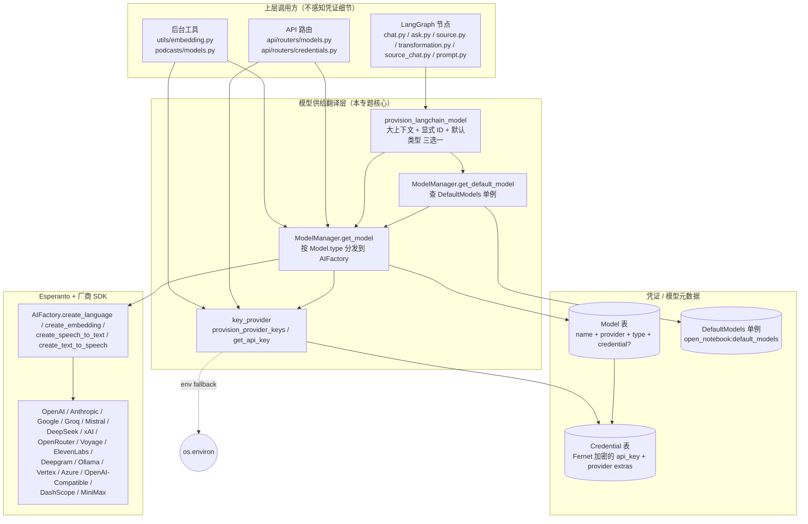

### 1.2 关键观察

- **三个数据库实体 + 一个翻译函数**：`Model` / `Credential` / `DefaultModels` 三张表是真相之源；`provision_langchain_model()` 则是 LangGraph 节点与模型层之间唯一的桥梁（参见 `open_notebook/ai/provision.py:10`）。
- **两条凭证流通路径**：
  1. **首选**：`Model.credential` 字段直接指向某条 `Credential` 记录，调用 `credential.to_esperanto_config()` 拿到 config 字典，直接交给 `AIFactory.create_*(config=...)`。这条路径完全绕开 `os.environ`。
  2. **回退**：Model 没绑 credential 时，`key_provider.provision_provider_keys(provider)` 会把 DB 里第一条 Credential 的内容写进 `os.environ`，让 Esperanto 按老方式从 env 读。
- **"DB 优先"是策略而非强制**：`provision_provider_keys` 的语义是"如果 DB 有就覆盖 env；如果没有，env 原值不动"。这让 `.env` 和 UI 配置可以共存，但 DB 的优先级更高（见 `open_notebook/ai/key_provider.py:113-142`）。

---

## 2. 核心模块逐一拆解

下面按 What/Why/How 三段式拆解 9 个关键模块。每个模块都附上真实文件位置和行号。

### 2.1 `Model`（模型元数据）

- **是什么**：继承自 `ObjectModel` 的 SurrealDB 记录，表名 `model`。字段 `name / provider / type / credential`，其中 `credential` 是可空的外键，指向 `credential` 表（见 `open_notebook/database/migrations/12.surrealql:29`）。
- **为什么存在**：把"用户在 UI 里声明的一个模型条目"和"真实的厂商 SDK 调用"解耦。`Model` 本身不含任何密钥，因此可以被序列化、列表、引用，而不会泄露敏感信息。
- **与谁协作**：
  - 被 `DefaultModels` 单例的 7 个字段引用（chat/transformation/large_context/embedding/stt/tts/tools）。
  - 被 `EpisodeProfile.outline_llm / transcript_llm` 和 `SpeakerProfile.voice_model` 引用（podcast 模块）。
  - 被 `ModelManager.get_model()` 加载，驱动 `AIFactory`。

**关键方法**（`open_notebook/ai/models.py:19-59`）：

| 方法 | 说明 |
| --- | --- |
| `get_models_by_type(model_type)` | 按 `type` 字段查询所有模型；UI 选择默认模型时大量使用 |
| `get_by_credential(credential_id)` | 反向查询：某条 Credential 关联了哪些 Model（删除前判断级联） |
| `get_credential_obj()` | 懒加载关联的 `Credential` 对象；导入放在函数体内避免循环引用（`models.py:53-54`） |
| `_prepare_save_data()` | 保存前把 `credential` 字符串转成 `RecordID`（SurrealDB 要求强类型外键） |

### 2.2 `DefaultModels`（默认模型单例）

- **是什么**：继承自 `RecordModel` 的单例，固定 record_id = `open_notebook:default_models`。承载 7 个"默认槽位"。
- **为什么存在**：LangGraph 节点大多数场景只关心"用默认 chat 模型"或"用默认 embedding 模型"，而不是具体 ID。这个单例让运行时默认值可以通过 UI 实时调整而无需重启。
- **关键 Quirk**：`get_instance()` 故意绕过父类的单例缓存，每次调用都重新查库（`open_notebook/ai/models.py:73-95`）。这是为了"UI 改了立刻生效"，代价是每次 `get_default_model()` 都打一次 DB。

**槽位 → 类型映射**（来自 `ModelManager.get_default_model`，`open_notebook/ai/models.py:221-264`）：

| 槽位字段 | 用途 | 回退逻辑 |
| --- | --- | --- |
| `default_chat_model` | 通用对话 | 无回退 |
| `default_transformation_model` | Source 变换 | 为空时回退到 `default_chat_model` |
| `default_tools_model` | 工具调用 | 为空时回退到 `default_chat_model` |
| `large_context_model` | 超 105k token 的输入 | 无回退（可选） |
| `default_embedding_model` | 向量化 | 无回退 |
| `default_text_to_speech_model` | TTS | 无回退 |
| `default_speech_to_text_model` | STT | 无回退 |

### 2.3 `ModelManager`（运行时工厂）

- **是什么**：无状态工厂，模块级单例 `model_manager = ModelManager()`（`open_notebook/ai/models.py:267`）。它自己不缓存模型实例——缓存交给 Esperanto。
- **为什么存在**：把"加载 Model 记录 → 解析凭证 → 选 AIFactory 方法"这条链路集中到一个地方，避免在每个调用点重复写凭证解析逻辑。
- **核心方法 `get_model(model_id, **kwargs)` 的决策路径**（`open_notebook/ai/models.py:102-176`）：

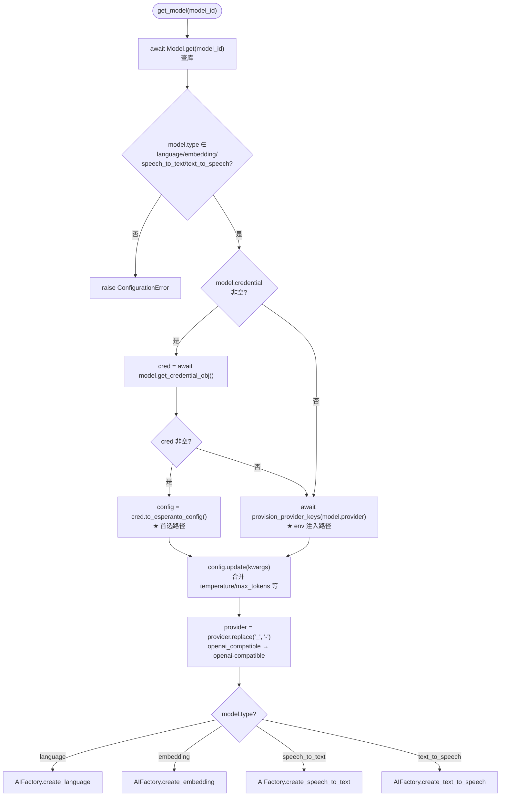

- **类型断言（assert）的用意**：`get_speech_to_text` / `get_text_to_speech` / `get_embedding_model` 三个便捷方法都用 `assert isinstance(...)` 校验返回值（`models.py:192-219`）。这是"早失败"设计——如果用户把一个 language 模型配到了 embedding 槽位，会在调用第一时间暴露而不是在向量维度不匹配时才出问题。

### 2.4 `Credential`（加密凭证记录）

- **是什么**：继承自 `ObjectModel` 的 SurrealDB 记录，表名 `credential`。每个记录描述"一个 provider 的一组认证 + 端点配置"。字段在 `migrations/12.surrealql:6-23` 定义。
- **为什么存在**：替代旧的 `ProviderConfig` 单例（`open_notebook:provider_configs`，见 `migrations/11.surrealql`）。原因有二：
  1. 旧单例要求所有 provider 的 key 挤在一个记录里，无法表达"同一个 provider 多个账号"（例如公司 OpenAI + 个人 OpenAI）。
  2. 单例的并发更新容易丢失字段；改成"每个 Credential 一条记录"后，更新粒度变细。
- **与谁协作**：
  - 被 `Model.credential` 字段引用（多对一关系：多个 Model 可以共享一条 Credential）。
  - 被 `key_provider._get_default_credential()` 查询，用于 env 注入路径。
  - 被 `api/credentials_service.test_credential()` 和 `connection_tester._test_*_connection()` 加载后直接发起测试 API 调用。

**关键字段速览**（`open_notebook/domain/credential.py:58-84`）：

| 字段 | 类型 | 说明 |
| --- | --- | --- |
| `name` | `str` | 用户给这条凭证起的昵称 |
| `provider` | `str` | 小写 provider 名，决定走哪套字段（`azure` 有 `endpoint_*`，`vertex` 有 `project/location`） |
| `modalities` | `List[str]` | 这条凭证支持的能力，默认从 `PROVIDER_MODALITIES` 推断 |
| `api_key` | `Optional[SecretStr]` | Pydantic 的 `SecretStr`，日志和 `repr` 都会自动脱敏 |
| `base_url / endpoint / api_version` | `Optional[str]` | URL 类厂商（Ollama / Azure）用 |
| `endpoint_llm / endpoint_embedding / endpoint_stt / endpoint_tts` | `Optional[str]` | Azure 的按模态分端点 |
| `project / location / credentials_path` | `Optional[str]` | Vertex AI 专用 |
| `num_ctx` | `Optional[int]` | Ollama 上下文窗口覆盖，存进 `config` FLEXIBLE 对象（migration 15） |
| `config` | `Optional[Dict]` | FLEXIBLE object，未来新增 provider 选项不用改表结构 |
| `decryption_error` | `Optional[str]` | 解密失败时的错误标记，用于 `get_all()` 容错返回 |

**`to_esperanto_config()` 的职责**（`credential.py:102-137`）：把上述字段拍平成 `AIFactory.create_*` 期望的 `config` 字典。注意它**只收集非空字段**，这意味着更新时不会意外清空厂商默认值。

**`_prepare_save_data()` 的双重职责**（`credential.py:227-259`）：
1. 把 `api_key` 的 `SecretStr` 解封 → 用 Fernet 加密 → 以密文字符串写入 DB。
2. 把 `num_ctx` 等便利字段同步进 `config` 对象（migration 15 的 FLEXIBLE 字段），保证 SCHEMAFULL 表不会丢弃它们；同时从已有 `config` 起步避免覆盖未知键（向前兼容）。

### 2.5 `key_provider`（DB 优先 / env 回退）

- **是什么**：一个纯函数模块，没有类。对外暴露 `get_api_key()` / `provision_provider_keys()` / `provision_all_keys()` 三个异步函数。
- **为什么存在**：Esperanto 的 `AIFactory` 默认从 `os.environ` 读 key（这是绝大多数 AI 库的惯例）。Open Notebook 希望"UI 改 key 立即生效"，但又不打算重写 Esperanto。折中方案就是：**在调用 AIFactory 之前，把 DB 里的 key 抄写进 `os.environ`**。这就是 `provision_provider_keys` 字面意思。
- **与谁协作**：
  - 被 `ModelManager.get_model()` 在"Model 没绑 credential"分支调用（`models.py:135-142`）。
  - 被 `api/routers/models.py` 的 `discover_models` / `sync_models` 调用（`routers/models.py:504, 534`）——因为 `model_discovery` 内部用 `os.environ` 读 key。
  - 被 `open_notebook/podcasts/models.py:26-28` 的 `_resolve_model_config` 在 fallback 分支调用。
  - 被 `open_notebook/graphs/source.py` 间接调用（通过 `ModelManager`）。

**`PROVIDER_CONFIG` 映射表**（`key_provider.py:28-73`）：每个 simple provider 只需要一个 env_var，例如 `"openai": {"env_var": "OPENAI_API_KEY"}`。复杂 provider（vertex / azure / openai_compatible）各有一个独立的 `_provision_*` 函数处理多字段。

**`provision_all_keys()` 的 deprecation 警告**（`key_provider.py:286-289`）：注释明确说**不要在请求时调用**——因为删除 key 后旧 env 不会被清理，会留下"幽灵凭证"。推荐只在启动时调用。

### 2.6 `connection_tester`（凭证可用性验证）

- **是什么**：一组异步函数，用最小代价（最便宜的模型 / 最短的输入）验证一组凭证是否可用。返回 `(success: bool, message: str)` 元组。
- **为什么存在**：用户填完 key 后立刻反馈"通不通"，而不是等到真正调用 chat 时才报错。这是 UX 必需品。
- **与谁协作**：
  - 被 `api/credentials_service.test_credential()` 调用（`credentials_service.py:365-474`），后者被 `POST /credentials/{id}/test` 路由暴露。
  - 内部根据 provider 类型分发到三条路径：
    1. URL 类（Ollama / OpenAI-compatible）：直接 `GET /api/tags` 或 `/models`，不经过 Esperanto。
    2. Azure：直接 `GET /openai/models?api-version=...`，因为 Azure 需要 deployment name。
    3. 其它：用 `AIFactory.create_language(model_name=TEST_MODELS[provider])` 建实例，然后 `lc_model.ainvoke("Hi")`。

**`TEST_MODELS` 表的语义**（`connection_tester.py:18-37`）：每个 provider 都映射到"最便宜的测试模型"，例如 `anthropic → claude-3-haiku-20240307`，`groq → llama-3.1-8b-instant`。这些模型的存在是为了让 429/401/403 错误能被可靠触发，而不是测模型的实际能力。

**`test_individual_model()` 的细节**（`connection_tester.py:256-329`）：和 `test_provider_connection` 不同——它测试的是**具体的 `Model` 记录**，会真实调用 `esp_model.achat_complete / aembed / agenerate_speech / atranscribe`。对 TTS 测试，它会先查 `DEFAULT_TEST_VOICES` 表找一个合法 voice，必要时调 `available_voices` 动态获取（`connection_tester.py:171-180, 290-300`）。

**错误归一化**（`connection_tester.py:236-253`）：`_normalize_error_message()` 用关键字匹配把厂商五花八门的报错文案归一化成几个稳定类别：
- `401/unauthorized` → "Invalid API key"
- `403/forbidden` → "API key lacks required permissions"
- `rate limit` → **success=True** "Rate limited - but connection works"（关键：限流说明 key 是对的）
- `model not found` → **success=True** "API key valid (test model not available)"（同理）
- `connection/network/timeout` → 各自的连通性提示

### 2.7 `model_discovery`（厂商模型列表拉取）

- **是什么**：一个 provider → 异步函数的注册表（`PROVIDER_DISCOVERY_FUNCTIONS`，`model_discovery.py:719-737`），每个函数去对应厂商的 `/models` 端点拉可用模型列表。
- **为什么存在**：用户配完 key 后，不可能记得自己厂商到底有哪些模型；UI 提供"Discover models"按钮，一键拉列表并（可选）自动注册成 `Model` 记录。
- **与谁协作**：
  - 被 `api/routers/models.py` 的 `GET /models/discover/{provider}` 和 `POST /models/sync/{provider}` 调用（`routers/models.py:491-546`）。
  - 被 `api/credentials_service.discover_with_config()` 复用（但这个版本走"显式 config"路径，绕开 env，更适合刚保存还没注入 env 的凭证）。
  - 内部**严重依赖 `os.environ`**——这是为什么 `routers/models.py` 的 discover/sync 端点要先调 `provision_provider_keys(provider)`。

**provider 分类（按 discovery 行为）**：

| 类型 | provider | 行为 |
| --- | --- | --- |
| OpenAI 风格 `/models` | openai, groq, mistral, deepseek, xai, openrouter, dashscope, minimax | GET `/v1/models` + Bearer token |
| 静态列表 | anthropic, voyage, elevenlabs, deepgram | 厂商没 listing API，硬编码 |
| 自部署 | ollama | GET `/api/tags`，不需 key |
| 显式 config 必需 | openai_compatible | 从 Credential 读 `base_url` |
| OAuth 类 | vertex, azure | 注册表里标 `None`，提示走 `/credentials/{id}/discover`（service account / api-key 头部分别处理） |

**`classify_model_type()` 的优先级**（`model_discovery.py:157-190`）：为了让拉回来的模型自动归类到 `language/embedding/stt/tts`，按"特异性优先"顺序匹配：`speech_to_text → text_to_speech → embedding → language`。例如 Mistral 的 `voxtral-mini-tts` 必须先匹配 tts，否则会被 STT 规则错误吃掉（注释 `model_discovery.py:114-120` 专门解释了这个顺序）。

**`sync_provider_models()` 的 N+1 规避**（`model_discovery.py:788-801`）：注册前先一次性 SELECT 该 provider 全部已有模型，构造 `(name_lower, type_lower)` 集合，循环里 O(1) 查重。否则每条 discovered model 都要打一次 DB。

### 2.8 `encryption`（Fernet 加密工具）

- **是什么**：四个函数的小模块：`get_secret_from_env / get_fernet / encrypt_value / decrypt_value`，加上一个 `looks_like_fernet_token` 启发式判断。
- **为什么存在**：DB 里要存第三方厂商的 API key，必须加密 at-rest。Fernet（AES-128-CBC + HMAC-SHA256）是 Python 生态里最成熟的对称加密原语，由 `cryptography` 库提供（`pyproject.toml` 没直接声明，由 `esperanto` 间接引入；`uv.lock:469` 锁定到 `cryptography==48.0.1`）。
- **与谁协作**：仅被 `Credential._prepare_save_data / _from_db_row / get / get_all / save` 调用。

**关键设计**：

1. **任意字符串都能当 key**（`encryption.py:104-112`）：用户写 `OPEN_NOTEBOOK_ENCRYPTION_KEY=my-secret` 也能跑——内部用 `SHA-256(password)` 派生标准 Fernet key（32 字节 → urlsafe base64）。代价是无法用人类可读密钥的位强度。
2. **Docker secrets 支持**（`encryption.py:29-59`）：先查 `OPEN_NOTEBOOK_ENCRYPTION_KEY_FILE`（文件路径），再回退到 `OPEN_NOTEBOOK_ENCRYPTION_KEY`。这是 swarm/k8s 部署的标准 secret 注入模式。
3. **懒加载**（`encryption.py:93-101`）：模块级 `_ENCRYPTION_KEY` 变量首次调用才填充，避免 import 时就报错——这对测试和 startup 顺序友好。
4. **优雅降级**（`encryption.py:167-198`）：`decrypt_value` 遇到 `InvalidToken` 时调 `looks_like_fernet_token` 启发式判断——看起来像 Fernet token 就报"key 不对"，否则当作 legacy 明文返回。这让系统从"无加密"升级到"加密"时不用做数据迁移。
5. **必须显式配置**（`encryption.py:62-87`）：`_get_or_create_encryption_key` 找不到 key 时 **raise ValueError**（不像 `domain/CLAUDE.md` 旧描述说的"仅警告"）。API 层 `require_encryption_key()` 据此拒绝创建/更新凭证（`credentials_service.py:199-205`）。

### 2.9 `api/credentials_service`（业务编排）

- **是什么**：FastAPI 路由和 Credential 领域模型之间的业务层。集中了所有"跨多个模块"的流程：测试连通性、拉模型列表、注册模型、从旧 ProviderConfig 迁移、从 env 迁移。
- **为什么存在**：路由层保持"薄"，所有 ValueError → HTTPException 的转换统一在这里发生；同时 `model_discovery` 和 `connection_tester` 之间的协调逻辑（例如 discover 时不依赖 env，而 sync 时要先 provision env）需要一个专门的层来组织。
- **与谁协作**：
  - 被 `api/routers/credentials.py` 的所有端点调用。
  - 内部调用 `Credential` / `connection_tester` / `model_discovery` / `encryption`。

**两个迁移端点的差异**（`credentials_service.py:718-915`）：

| 端点 | 输入源 | 处理对象 | 何时用 |
| --- | --- | --- | --- |
| `POST /credentials/migrate-from-provider-config` | `open_notebook:provider_configs` 单例（旧） | 把旧 `ProviderCredential` 列表逐条转成 `Credential` 记录 | 从老版本（migration 11）升级 |
| `POST /credentials/migrate-from-env` | `os.environ` | 检测每个 provider 的 env 变量，存在则生成一条默认 Credential | 从 `.env` 文件切换到 UI 管理 |

两者共享一个收尾步骤：扫描该 provider 下所有"未绑 credential"的 `Model` 记录，把它们 link 到新创建的 Credential 上（`credentials_service.py:779-796, 871-886`）。

---

## 3. 关键调用链（时序图）

### 3.1 典型路径：用户在 chat 里发一条消息

这是最常见也最完整的链路——从 HTTP 入口一路打到厂商 SDK。注意 LangGraph 节点是 **同步** 的，而 `provision_langchain_model` 是 **异步** 的，中间通过 `ThreadPoolExecutor` 桥接（`open_notebook/graphs/chat.py:39-71`）。

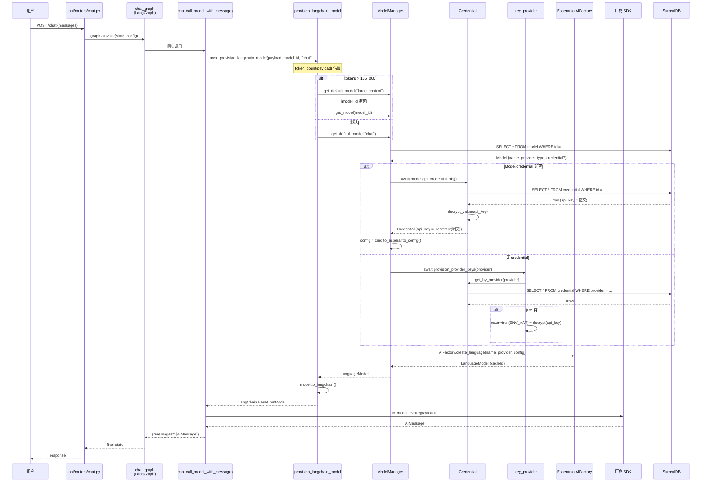

### 3.2 验证路径：用户点击 "Test Connection"

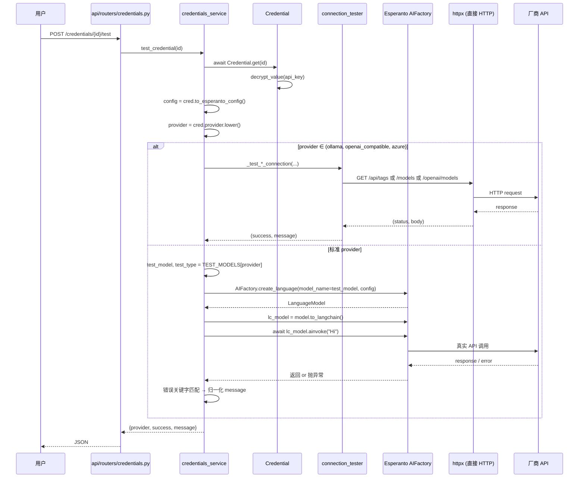

### 3.3 注册路径：用户点击 "Discover Models"

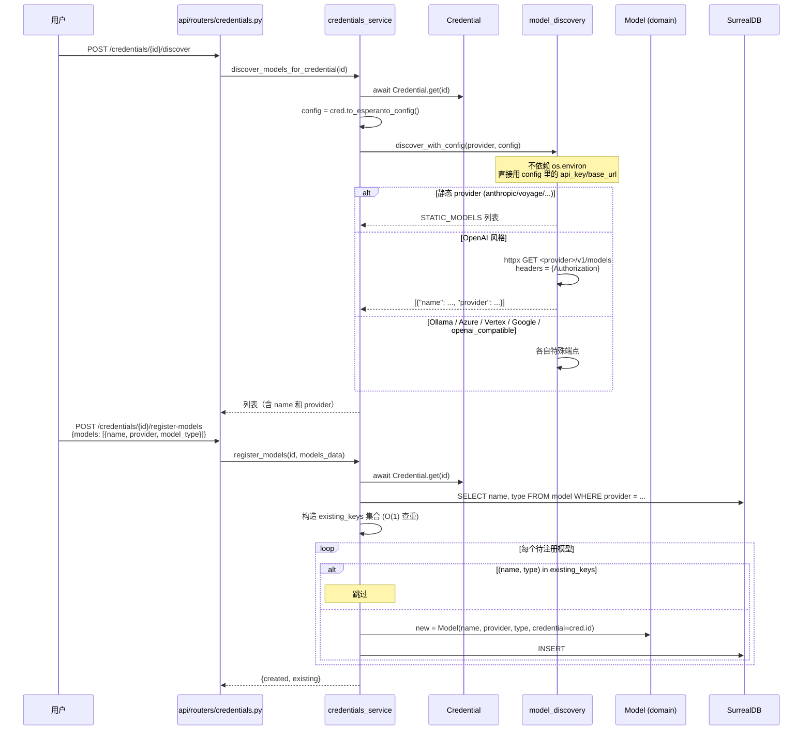

---

## 4. 凭证生命周期（状态机）

凭证从用户输入到最终被销毁，会经历 6 个主要状态。下图标注了每个状态的触发事件和不变量。

```mermaid
stateDiagram-v2
    [*] --> FormInput: 用户打开 /credentials/new

    state FormInput {
        direction LR
        s1: 表单填写
        s2: URL 校验 (SSRF)
        s3: require_encryption_key()
        s1 --> s2: submit
        s2 --> s3: 通过
        s2 --> s1: 失败 (ValueError)
        s3 --> s2: 失败 (encryption key 未配)
    }

    FormInput --> Encrypted: POST /credentials<br/>encrypt_value(api_key)<br/>repo_create
    note right of Encrypted
        不变量:
        - DB 中 api_key 是 Fernet 密文
        - 内存对象 api_key 是 SecretStr(明文)
        - 返回给前端 only has_api_key: bool
    end note

    Encrypted --> Tested: POST /credentials/{id}/test
    state Tested {
        direction LR
        t1: to_esperanto_config()
        t2: AIFactory.create_*
        t3: ainvoke("Hi")
        t1 --> t2 --> t3
    }
    Tested --> Encrypted: 返回 (success, message)

    Encrypted --> Provisioned: ModelManager.get_model(model)<br/>或 provision_provider_keys
    note right of Provisioned
        不变量:
        - Esperanto 缓存了 LanguageModel 实例
        - 若走 env 路径, os.environ[VAR] 已被覆盖
    end note

    Provisioned --> Provisioned: 后续调用直接命中 Esperanto 缓存

    Encrypted --> Updated: PUT /credentials/{id}
    Updated --> Encrypted: 新密文覆盖旧密文<br/>注意: Esperanto 缓存不会自动失效

    Encrypted --> Deleted: DELETE /credentials/{id}
    state Deleted {
        direction LR
        d1: get_linked_models()
        d2: migrate_to 指定?
        d3: 是 → 重绑到新 credential
        d4: 否 → 级联删除 model
        d5: repo_delete(credential)
        d1 --> d2
        d2 --> d3 --> d5
        d2 --> d4 --> d5
    end
    Deleted --> [*]

    note left of Updated
        Gotcha: 如果 Esperanto 已缓存旧实例,
        更新 api_key 后旧 key 仍会被使用,
        直到进程重启或缓存失效
    end note
```

**关键不变量**：

1. **DB 里 api_key 永远是密文**（除非 legacy 数据）。`_prepare_save_data()` 在序列化前调 `encrypt_value`（`credential.py:236-240`）。
2. **内存对象 api_key 永远是 SecretStr(明文)**。`get()` / `get_all()` / `_from_db_row()` 三个入口都做了 `decrypt_value + SecretStr` 包装（`credential.py:156-169, 172-213, 277-286`）。
3. **API 响应永不暴露 api_key**。`credential_to_response()`（`credentials_service.py:208-231`）只返回 `has_api_key: bool`。

---

## 5. DB 优先 / env 回退决策树

这是整个系统最容易踩坑的地方，单独画一张完整决策树。两条路径（Model.credential vs env）的选择是**按 Model 维度**而非全局策略。

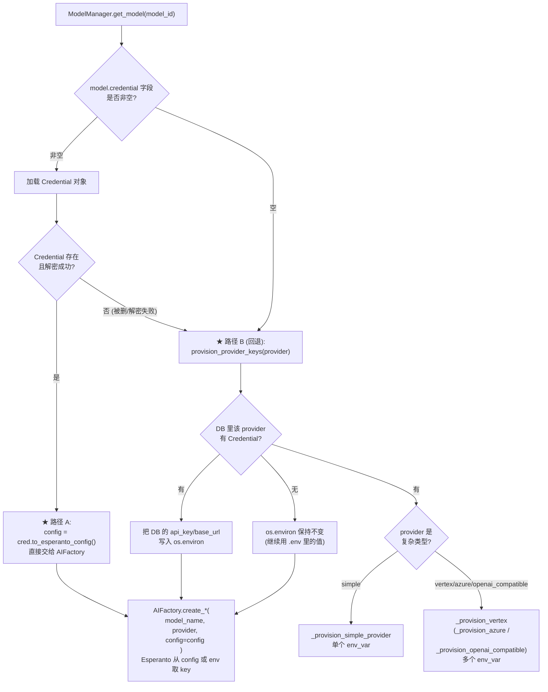

**两个路径的本质差异**：

| 维度 | 路径 A（Model.credential） | 路径 B（env 注入） |
| --- | --- | --- |
| 触发条件 | Model 显式绑了 credential | Model 没绑，或 credential 加载失败 |
| config 来源 | `credential.to_esperanto_config()` 字典 | `os.environ` 被 provision 后由 Esperanto 内部读取 |
| 支持多账号 | 是（每个 Model 可绑不同 Credential） | 否（同 provider 多 Credential 时只取 `credentials[0]`，见 `key_provider.py:79-81`） |
| 全局副作用 | 无 | **修改 `os.environ`**，可能影响同进程其它代码 |
| 缓存语义 | 每次 get_model 都重读 Credential | 启动时 provision 后就一直用 env |
| 适合场景 | UI 配置的现代用法 | `.env` 党、CI/CD、无法改 DB 的场景 |

**Gotcha：`provision_all_keys()` 的"幽灵 env"问题**（`key_provider.py:283-307`）：如果在请求时调用这个函数把所有 provider 的 env 都注入，那么用户后续在 UI 里**删除**某条 Credential，`os.environ` 里的旧值不会被清理——Esperanto 仍然能读到 key，造成"UI 删了但实际还能用"的诡异现象。注释里因此把这个函数标记为"仅启动时使用"。

---

## 6. 加密机制

### 6.1 密钥来源

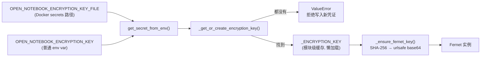

**关键点**：

- `_ENCRYPTION_KEY` 是**进程级缓存**，一旦填充就不再变化（`encryption.py:93-101`）。意味着**轮换密钥需要重启进程**，且旧数据必须手动重新加密（系统未提供 rotation 工具）。
- `_ensure_fernet_key` 的派生函数用 `SHA-256`，所以 `OPEN_NOTEBOOK_ENCRYPTION_KEY=abc` 和 `OPEN_NOTEBOOK_ENCRYPTION_KEY=abc `（尾部空格）会产生不同的 Fernet key——后者解不开前者加密的数据。

### 6.2 加密字段范围

只有 `Credential.api_key` 一个字段被加密（`credential.py:236-240`）。其它字段如 `base_url / endpoint / project / location` 都以明文存储。这是一个有意为之的取舍：

- API key 泄露 = 直接冒用账号，必须加密。
- base_url 等是公开的服务端点信息，泄露风险低；明文存储便于 SQL 查询、日志调试、UI 显示。

### 6.3 日志脱敏

Pydantic 的 `SecretStr` 是第一道防线：`logger.info(cred)` 打印出来是 `api_key=SecretStr('**********')`（`credential.py:61`）。`credential_to_response()` 是第二道：响应 DTO 根本没有 `api_key` 字段，只有 `has_api_key: bool`（`credentials_service.py:226`）。

**坑点**：如果你在 debug 时手写 `logger.debug(cred.api_key.get_secret_value())`，就会把明文写进日志——SecretStr 不会阻止显式调用。Code review 时要警惕这种写法。

### 6.4 解密失败的容错

`Credential.get_all()` 遇到解密失败时不会抛异常，而是构造一个 `decryption_error` 标记的占位 Credential（`credential.py:179-213`）：

```python
error_cred = cls(
    name=row.get("name", "Unknown"),
    provider=row.get("provider", "unknown"),
    modalities=row.get("modalities", []),
    decryption_error="Failed to decrypt API key. The encryption key may have changed.",
)
object.__setattr__(error_cred, "api_key", SecretStr("UNDECRYPTABLE"))
```

这样 UI 能列出"有问题的凭证"让用户删除或修复，而不是整个页面 500。

---

## 7. 厂商分类对照表

### 7.1 按配置形态分类

Open Notebook 把 17 个支持的 provider 分成 4 个配置"形状"。形状决定了 UI 表单字段、`_provision_*` 函数、以及 discovery 行为。

| 形态 | Provider | 必需字段 | 可选字段 | UI 表单差异 |
| --- | --- | --- | --- | --- |
| **simple_api_key** | openai, anthropic, groq, mistral, deepseek, xai, openrouter, voyage, elevenlabs, deepgram, dashscope, minimax | `api_key` | — | 单输入框 |
| **url_based** | ollama | `base_url` | `api_key`（多数本地不要） | URL 输入框为主 |
| **multi_field** | vertex | `project, location` | `credentials_path` | 多输入框 + 文件路径 |
| **multi_field** | azure | `api_key, endpoint, api_version` | `endpoint_llm/embedding/stt/tts` | 多输入框，按模态分组 |
| **openai_compatible** | openai_compatible | `base_url`（`required_any`） | `api_key` | URL + 可选 key |
| **special** | google | `api_key` (GOOGLE_API_KEY 或 GEMINI_API_KEY) | — | 单输入框，支持两个 env 变量名 |

### 7.2 按能力（modalities）分类

来自 `api/credentials_service.py:66-84` 的 `PROVIDER_MODALITIES` 表：

| Provider | language | embedding | speech_to_text | text_to_speech |
| --- | --- | --- | --- | --- |
| openai | ✓ | ✓ | ✓ | ✓ |
| anthropic | ✓ | — | — | — |
| google | ✓ | ✓ | ✓ | ✓ |
| groq | ✓ | — | ✓ | — |
| mistral | ✓ | ✓ | ✓ | ✓ |
| deepseek | ✓ | — | — | — |
| xai | ✓ | — | — | ✓ |
| openrouter | ✓ | ✓ | — | — |
| voyage | — | ✓ | — | — |
| elevenlabs | — | — | ✓ | ✓ |
| deepgram | — | — | — | ✓ |
| ollama | ✓ | ✓ | — | — |
| vertex | ✓ | ✓ | — | ✓ |
| azure | ✓ | ✓ | ✓ | ✓ |
| openai_compatible | ✓ | ✓ | ✓ | ✓ |
| dashscope | ✓ | — | — | — |
| minimax | ✓ | — | — | — |

这个表在两处用到：
1. `migrate_from_env` 时给新 Credential 自动填 modalities 字段。
2. UI 显示 provider 支持哪些模态，决定表单显示哪些字段。

### 7.3 模型分类（type）模式匹配

`model_discovery.classify_model_type()` 用关键词匹配把模型名归类。各 provider 的匹配规则集中注释在 `model_discovery.py:36-155`。举例：

| Provider | "language" 模式 | "embedding" 模式 | "speech_to_text" 模式 | "text_to_speech" 模式 |
| --- | --- | --- | --- | --- |
| openai | gpt-4, gpt-3.5, o1, o3, chatgpt, text-davinci... | text-embedding, embedding | whisper | tts |
| google | gemini, palm, bison, chat | embedding, textembedding | (无, 用户手填) | tts |
| mistral | mistral, mixtral, codestral... | mistral-embed | voxtral-mini-latest, voxtral-small-latest | voxtral-mini-tts, voxtral-tts |
| groq | llama, mixtral, gemma, whisper | — | whisper | — |
| elevenlabs | — | — | scribe | eleven |
| deepgram | — | — | — | aura |

**匹配顺序的微妙性**：`classify_model_type` 按 `["speech_to_text", "text_to_speech", "embedding", "language"]` 顺序检查（`model_discovery.py:183`）。这意味着：
- `whisper` 模型（groq）会先被识别为 STT，即使 groq 也用 whisper 做 language。
- `voxtral-mini-tts` 必须先匹配 tts（特异性高），否则会被 STT 规则错误吃掉（`model_discovery.py:114-120` 的专门注释）。

---

## 8. 错误与降级

### 8.1 错误分类体系

整个 AI 供给链路抛出的错误都来自 `open_notebook/exceptions.py` 的 `OpenNotebookError` 家族：

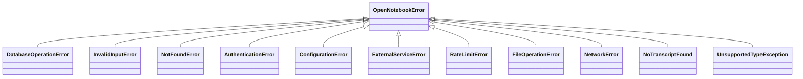

**本专题主要触发 4 个**：

| 异常类 | 触发点 | HTTP 状态 | 典型场景 |
| --- | --- | --- | --- |
| `ConfigurationError` | `ModelManager.get_model` / `provision_langchain_model` | 422 | Model ID 不存在、type 非法、默认模型未配置 |
| `AuthenticationError` | `connection_tester` 归一化 | 401 | API key 无效（401/unauthorized） |
| `RateLimitError` | `connection_tester` 归一化 | 429 | 厂商限流 |
| `NetworkError` / `ExternalServiceError` | `connection_tester` 归一化 | 502 | 连不上厂商、超时 |

### 8.2 降级路径

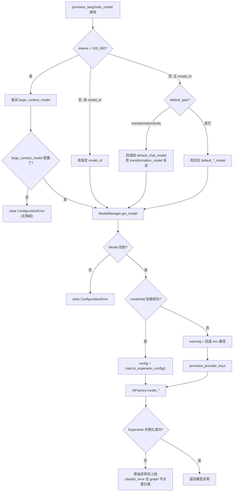

**关键观察**：

1. **没有"模型实例化失败时自动降级到更便宜模型"的逻辑**。CLAUDE.md 里提到的"Model fallback: If primary model fails, falls back to cheaper/smaller model"在当前代码里**找不到对应实现**——这是过时描述。真实行为是：失败直接抛异常，由上层 graph 节点用 `classify_error()` 转成用户友好消息。
2. **transformation / tools 类型回退到 chat 是"约定式"的**，不是显式 fallback 链。如果 `default_transformation_model` 没设，`get_default_model("transformation")` 直接返回 `default_chat_model` 的 ID（`models.py:235-237`）。这要求 chat 模型必须能胜任 transformation 任务（实测绝大多数都能）。
3. **`large_context_model` 是"升级"而非"降级"**。它是唯一一个由 token 数自动触发的路径，且**没有反向降级**——如果 large_context_model 未配置，即使 tokens > 105k 也会直接抛 `ConfigurationError`（`provision.py:45-48`）。

### 8.3 connection_tester 的特殊错误映射

| 原始错误关键字 | 映射结果 | success | 解释 |
| --- | --- | --- | --- |
| `401` / `unauthorized` | "Invalid API key" | false | 真失败 |
| `403` / `forbidden` | "API key lacks required permissions" | false | 真失败 |
| `rate limit` | "Rate limited - but connection works" | **true** | 限流说明 key 有效 |
| `not found` + `model` | "API key valid (test model not available)" | **true** | 测试模型厂商没有，但 key 对 |
| `connection` / `network` | "Connection error - check network/endpoint" | false | 网络问题 |
| `timeout` | "Connection timed out" | false | 超时 |

把"rate limit"和"model not found"算作 success 是**有意为之**——测试的目的是验证 key，而不是验证测试模型是否存在。用户看到 success 就知道"key 能用"，至于测试模型不存在，那是 `TEST_MODELS` 表需要更新的问题。

---

## 9. 设计亮点与 Gotcha

### 9.1 设计亮点

1. **"两条路径"共存而非"一刀切"**：`Model.credential` 直配 vs `provision_provider_keys` env 注入，让 UI 党和 `.env` 党都能用，且 DB 路径完全无副作用（不污染 `os.environ`）。这是逐步迁移的典范。

2. **`DefaultModels.get_instance()` 强制 fresh read**（`models.py:73-95`）：故意绕过父类的 singleton 缓存，每次都查库。代价是多一些 DB 调用，收益是 UI 改默认模型立刻生效，无需重启。对研究"何时该用缓存何时不用"是一个很好的教学样本。

3. **`num_ctx` 用 FLEXIBLE 字段做向前兼容**（`credential.py:52-57, 243-258` + `migrations/15.surrealql`）：SCHEMAFULL 表加 FLEXIBLE object 字段，新版本写入的 key 老版本读出来不丢。这个模式值得在所有"配置类"表里复用。

4. **测试连通性时的"success even rate limited"**（`connection_tester.py:244-245`）：把 UX 放在"绝对正确"之上。用户心智模型是"我的 key 对不对"，而不是"测试模型存不存在"。

5. **`looks_like_fernet_token` 的优雅降级**（`encryption.py:145-164`）：基于长度（≥100 字符）和 AES 块大小（密文长度是 16 的倍数）的启发式判断，让系统从"无加密时代"平滑升级到"加密时代"而无需数据迁移。这种"渐进升级"思维在生产系统里极其重要。

6. **N+1 规避的两个实例**：
   - `sync_provider_models` 一次性 SELECT 全部已有模型构造 set（`model_discovery.py:788-801`）。
   - `register_models` 同样模式（`credentials_service.py:690-695`）。

7. **`_resolve_model_config` 复用 podcast 模块**（`open_notebook/podcasts/models.py:11-29`）：podcast 的 outline/transcript/tts 配置都走同一个 helper，避免每个地方重复写"加载 Model → 解析 credential"逻辑。

### 9.2 Gotcha 清单

1. **`OPEN_NOTEBOOK_ENCRYPTION_KEY` 未设置时不是"仅警告"，而是 raise ValueError**（`encryption.py:83-87`）。`require_encryption_key()` 在 POST/PUT credential 时拒绝（`credentials_service.py:199-205`）。但**读取**已有 Credential 时如果 key 没配，会触发同样的异常——`get_all` 的 try/except 会把所有行都标成 `decryption_error`（`credential.py:179-213`）。CLAUDE.md 旧的"仅警告"描述是过时的。

2. **`os.environ` 是进程全局状态**：`provision_provider_keys` 修改了它就意味着所有线程、所有后续请求都能看到。如果你在异步并发场景下对不同 Credential 做测试（例如两个 openai Credential 轮换），它们会互相污染 env，导致结果不可预测。这是为什么 `Model.credential` 路径（不污染 env）是首选。

3. **`provision_all_keys()` 的"幽灵 env"问题**：注释明确说**不要在请求时用**（`key_provider.py:286-289`）。删除 Credential 后 env 里的旧值不会被清理。

4. **Esperanto 的实例缓存 vs Credential 更新**：`ModelManager.get_model` 注释里写"Esperanto will cache the actual model instance"（`models.py:103`）。意味着你更新了 Credential 的 api_key，已缓存的 LanguageModel 仍持旧 key。生产环境改 key 后**需要重启 API 进程**。系统没有提供"清空缓存"的端点。

5. **`SecretStr` 的 JSON 序列化**：`Credential` 用 Pydantic 的 `SecretStr`，但 SurrealDB 不认识这个类型。`_prepare_save_data` 负责解封成字符串后加密（`credential.py:236-240`）。如果你绕过这个方法直接 `model_dump()` 写库，会写成 `"**********"` 这样的垃圾值——因为 `SecretStr.__str__()` 返回 `'**********'`。

6. **`provider` 名字的下划线 vs 连字符**：DB 里存 `openai_compatible`（下划线），Esperanto 期望 `openai-compatible`（连字符）。`ModelManager.get_model` 在分发前做了 `.replace("_", "-")`（`models.py:148`）。如果你直接调 `AIFactory.create_language(provider="openai_compatible")` 会失败——必须先 normalize。

7. **`token_count` 估算的偏差**：`provision_langchain_model` 用 `o200k_base` 编码估算 token 数（`provision.py:19`），阈值硬编码 `105_000`（`provision.py:23`）。不同模型的实际 token 化器（例如 Claude 用 BPE 变体）可能有 5-10% 偏差。意味着 100k 的内容可能在 Claude 上实际是 110k，但不会被升级到 large_context。

8. **`get_by_provider` 的多 Credential 选择策略**：`key_provider._get_default_credential` 直接返回 `credentials[0]`（`key_provider.py:79-81`），按 `created ASC` 排序的第一条（`credential.py:142-143`）。这意味着"同一个 provider 多 Credential"在 env 路径下是**未定义行为**——只有 `Model.credential` 显式绑定才能可靠区分。

9. **删除 Credential 的级联策略**：默认**级联删除**所有 link 到它的 Model（`credentials_service.py:336-338` + `routers/credentials.py:336-340`）。如果想保留 Model，必须显式传 `?migrate_to=<other_cred_id>`。如果 Credential 解密失败（`ValueError`），会走 `repo_delete` 直接 SQL 删除（`routers/credentials.py:276-321`），不走 ORM 路径。

10. **`PROVIDER_CONFIG` 不含 vertex/azure/openai_compatible**（`key_provider.py:28-73`）：这三个复杂 provider 各有独立的 `_provision_*` 函数和独立的 env 变量集合。如果你用 `PROVIDER_CONFIG.get("azure")` 会拿到 None——这是一个常被忘记的特殊情况。

11. **`url_map` 在 `discover_with_config` 里写死了厂商域名**（`credentials_service.py:530-539`）：意味着如果 OpenAI 等厂商改了 listing API 的 URL，得改两处代码（`model_discovery.py` 和 `credentials_service.py`）。维护时容易漏。

12. **测试 STT 用真实语音片段**（`connection_tester.py:220-233`）：`_get_test_audio()` 优先用 `assets/test_speech.mp3`（一段"Hello there"的真实录音），找不到才回退到合成静音 WAV。用真实语音是为了让 STT 返回非空文本——证明模型确实在工作。如果测试报告"Connection successful (test clip produced no transcription)"，说明 bundle 资源丢了。

13. **Azure 测试不用 Esperanto**：`_test_azure_connection` 直接 HTTP GET `/openai/models`（`connection_tester.py:40-94`）。原因是 Azure 要按 deployment 名调用模型，而每个用户的 deployment 名不同，无法用统一 TEST_MODELS。代价是这个测试只验证"key + endpoint 对不对"，不验证"deployment 是否存在"。

14. **Vertex discovery 是静态列表**：`discover_with_config` 对 vertex 返回硬编码的 5 个模型（`credentials_service.py:606-616`）。原因是 Vertex 要 service account OAuth2，不能直接用 API key 调 listing。用户需要手动添加 vertex 模型。

15. **同步/异步桥接的脆弱性**：LangGraph 节点是同步函数（`call_model_with_messages`），而 `provision_langchain_model` 是 async。`chat.py:39-71` 用 `ThreadPoolExecutor + new_event_loop` 桥接，如果未来 LangGraph 改成原生 async，这段代码可以删掉，但目前是必须的"丑陋但能用"代码。

---

## 10. 与其它模块的协作关系

### 10.1 模块依赖图

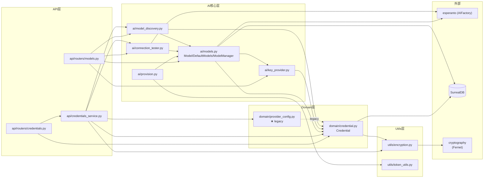

### 10.2 关键协作点

| 协作对 | 关系 | 文件位置 |
| --- | --- | --- |
| LangGraph 节点 ↔ provision | 节点 sync 调 async，用 ThreadPoolExecutor 桥接 | `graphs/chat.py:39-71`、`graphs/source_chat.py`、`graphs/transformation.py:45`、`graphs/ask.py:57,111,130`、`graphs/prompt.py:26` |
| Podcast 模块 ↔ `_resolve_model_config` | 复用 Model→Credential 解析逻辑 | `podcasts/models.py:11-29` |
| embedding 流程 ↔ ModelManager | 通过 `get_embedding_model()` 拿默认 embedding 模型 | `utils/embedding.py:138`、`api/routers/embedding.py:18`、`api/routers/search.py:23,139,191` |
| Source ingestion ↔ ModelManager | 读取默认 STT 模型，传给 content-core | `graphs/source.py:62-76` |
| API `/credentials/migrate-from-provider-config` ↔ legacy | 从旧 `ProviderConfig` 单例迁数据 | `credentials_service.py:718-823`、`domain/provider_config.py` |
| API `/credentials/migrate-from-env` ↔ env | 从 `os.environ` 逆向生成 Credential | `credentials_service.py:826-915` |
| EpisodeProfile / SpeakerProfile ↔ Model | 通过 `record<model>` 外键引用 | `podcasts/models.py:137-189`、`migrations/14.surrealql` |
| Migration 11→12→15 ↔ Credential | 建立 schema：单例→独立表→FLEXIBLE config | `migrations/11.surrealql`、`12.surrealql`、`15.surrealql` |

### 10.3 演进时间线（从 schema 变化看）

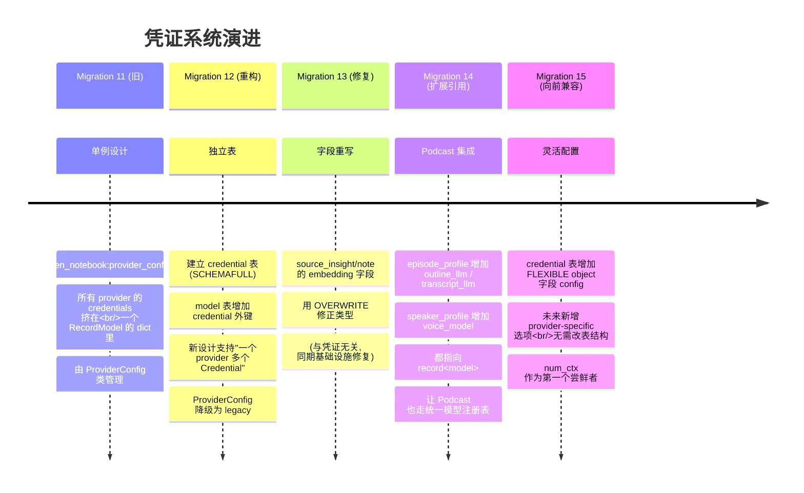

这个演进路径清晰地展示了"**单例 → 独立表 → 关系网 → 灵活扩展**"四步走，是 Open Notebook 在生产环境中逐步打磨出的设计。每一步都有明确的动机和向后兼容保证，可作为其它"配置类"系统演进的参考。

---

## 附：快速参考表

### 关键文件清单

| 文件 | 职责 | 行数（关键段） |
| --- | --- | --- |
| `open_notebook/ai/models.py` | Model / DefaultModels / ModelManager 三大核心 | 全文 267 行 |
| `open_notebook/ai/provision.py` | LangGraph 入口的 provision 函数 | 全文 61 行 |
| `open_notebook/ai/key_provider.py` | DB/env 回退逻辑 | 全文 307 行 |
| `open_notebook/ai/connection_tester.py` | 凭证可用性测试 | 全文 329 行 |
| `open_notebook/ai/model_discovery.py` | 厂商模型列表拉取 | 全文 888 行 |
| `open_notebook/domain/credential.py` | Credential 领域模型 + 加密集成 | 全文 286 行 |
| `open_notebook/utils/encryption.py` | Fernet 加密工具 | 全文 198 行 |
| `api/credentials_service.py` | 业务编排 + 两个迁移端点 | 全文 915 行 |
| `api/routers/credentials.py` | HTTP 路由层（薄） | 全文 435 行 |
| `api/routers/models.py` | 模型 + 默认值 + auto-assign + sync | 全文 780 行 |
| `open_notebook/database/migrations/11.surrealql` | 旧 provider_configs 单例 | 10 行 |
| `open_notebook/database/migrations/12.surrealql` | credential 表 + model.credential 外键 | 29 行 |
| `open_notebook/database/migrations/14.surrealql` | podcast profile 引用 model | 27 行 |
| `open_notebook/database/migrations/15.surrealql` | credential.config FLEXIBLE | 6 行 |

### 关键函数索引

| 函数 | 文件:行号 | 一句话职责 |
| --- | --- | --- |
| `provision_langchain_model` | `ai/provision.py:10` | LangGraph 节点入口，按 token 数 / model_id / 默认类型三选一 |
| `ModelManager.get_model` | `ai/models.py:102` | 加载 Model，解析 Credential，调 AIFactory |
| `ModelManager.get_default_model` | `ai/models.py:221` | 按类型查 DefaultModels，含 transformation/tools 回退 |
| `DefaultModels.get_instance` | `ai/models.py:73` | 强制 fresh read，绕过 singleton 缓存 |
| `Credential.to_esperanto_config` | `domain/credential.py:102` | 把 Credential 字段拍平成 AIFactory config 字典 |
| `Credential._prepare_save_data` | `domain/credential.py:227` | 加密 api_key + 同步 num_ctx 到 config bag |
| `Credential.get_all` | `domain/credential.py:172` | 解密所有行，失败行降级为 error_cred |
| `key_provider.get_api_key` | `ai/key_provider.py:87` | DB 第一条 Credential → env 回退 |
| `key_provider.provision_provider_keys` | `ai/key_provider.py:246` | 把 DB 的 key 写进 os.environ（路径 B） |
| `connection_tester.test_provider_connection` | `ai/connection_tester.py`（间接，通过 credentials_service） | 用 TEST_MODELS 做最小调用 |
| `connection_tester.test_individual_model` | `ai/connection_tester.py:256` | 测试具体 Model 记录端到端 |
| `model_discovery.classify_model_type` | `ai/model_discovery.py:157` | 按名字模式判断 language/embedding/stt/tts |
| `model_discovery.sync_provider_models` | `ai/model_discovery.py:764` | 拉列表 + 自动注册（含 N+1 规避） |
| `encryption.encrypt_value / decrypt_value` | `utils/encryption.py:128, 167` | Fernet 加解密 + 优雅降级 |
| `encryption.get_secret_from_env` | `utils/encryption.py:29` | Docker secrets（VAR_FILE）+ 普通 env 二合一 |
| `credentials_service.test_credential` | `api/credentials_service.py:365` | 路由层测试入口，按 provider 分发 |
| `credentials_service.discover_with_config` | `api/credentials_service.py:477` | 不依赖 env 的 discovery（用显式 config） |
| `credentials_service.register_models` | `api/credentials_service.py:673` | 批量注册 Model 并 link 到 Credential |
| `credentials_service.migrate_from_env` | `api/credentials_service.py:826` | 从 .env 迁到 DB |
| `credentials_service.migrate_from_provider_config` | `api/credentials_service.py:718` | 从旧单例迁到新表 |

### 依赖版本

| 包 | 版本 | 来源 |
| --- | --- | --- |
| `esperanto` | `>=2.20.0,<3` | `pyproject.toml:37` |
| `cryptography` | `48.0.1`（lock file） | 间接依赖（esperanto 引入），提供 `Fernet` |
| `pydantic` | `>=2.9.2` | `pyproject.toml:18`，提供 `SecretStr` |
| `surrealdb` | `>=1.0.4` | `pyproject.toml:38`，提供 `RecordID` |
| `loguru` | `>=0.7.2` | `pyproject.toml:19` |
| `httpx[socks]` | `>=0.27.0` | `pyproject.toml:34`，connection_tester 用 |

---

*本文档基于 commit `cac4e01` 时的代码撰写，所有行号引用均对应该 commit 的实际源文件。*
