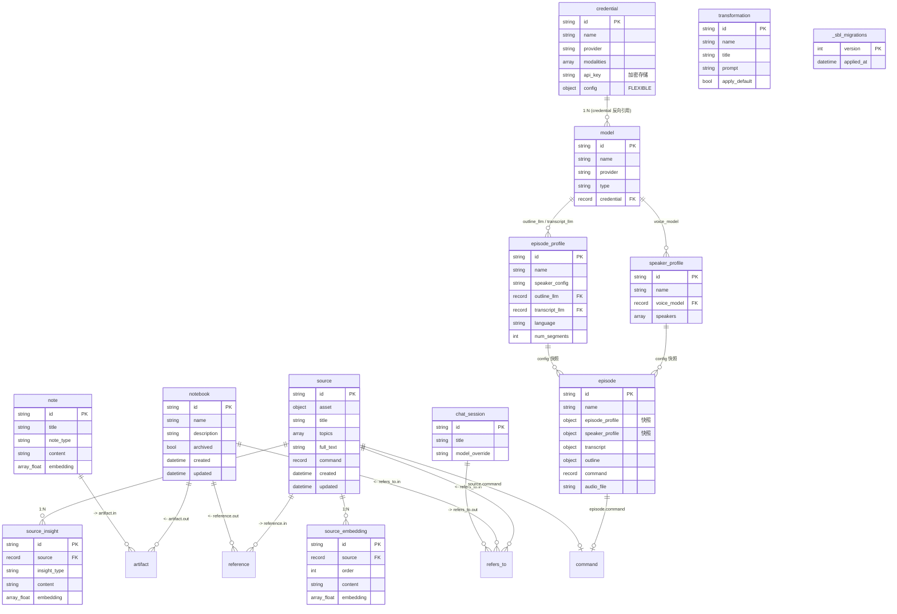
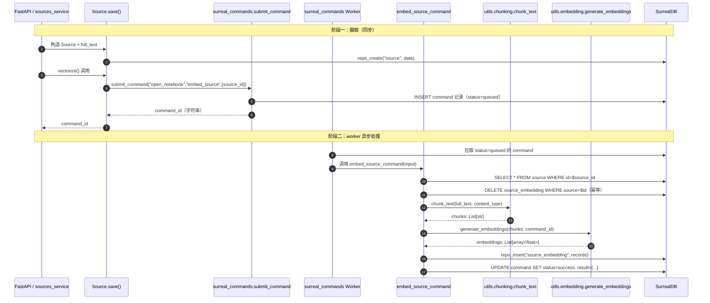
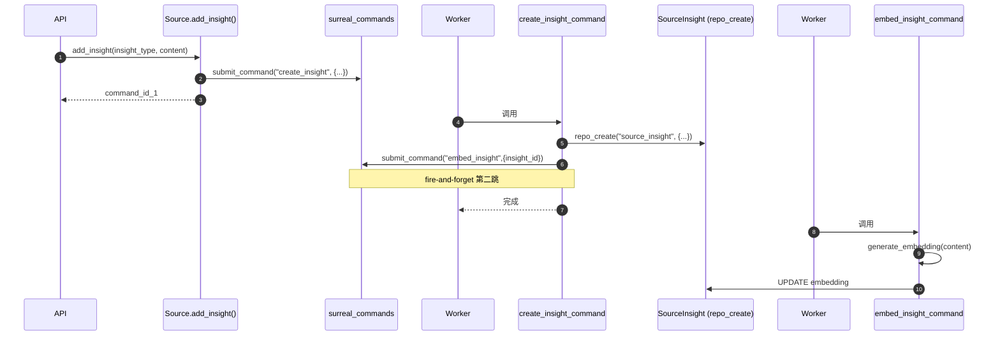
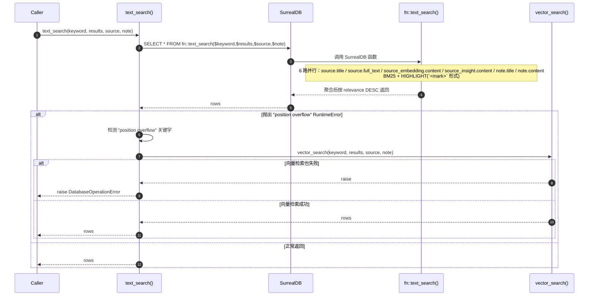
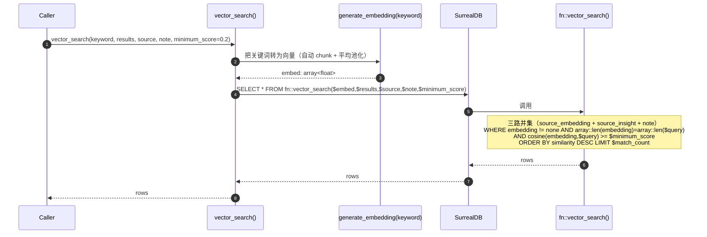
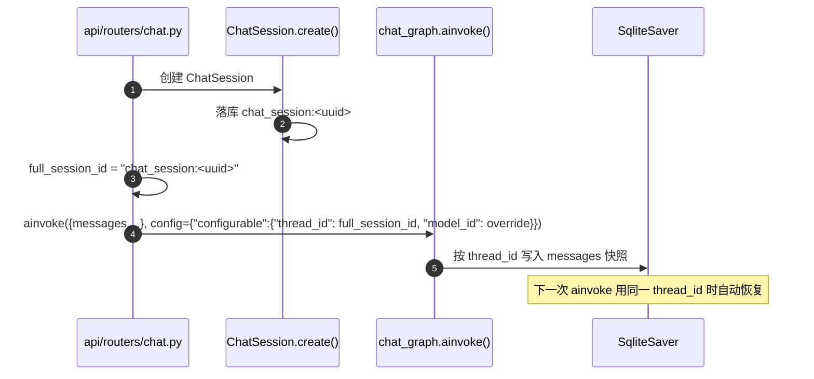
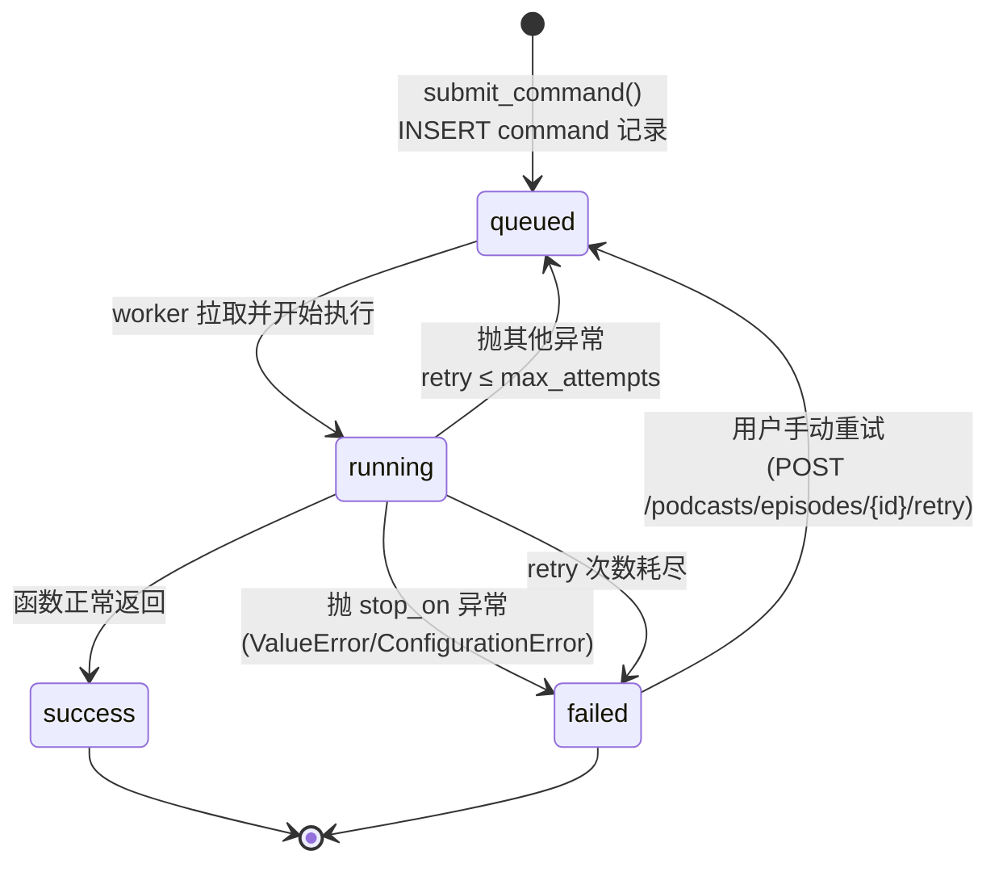

# 03. 数据流与状态管理

> 一句话总览：Open Notebook 以 **SurrealDB** 作为单一事实源（记录 + 向量 + 全文索引 + 图边），**LangGraph SqliteSaver** 持久化聊天会话的中间消息状态，**surreal-commands** 异步任务队列追踪 embedding/insight/podcast 等长任务的执行状态，三者通过 `thread_id` / `command_id` / RecordID 关联。

---

## 目录

1. [领域模型总览](#1-领域模型总览)
2. [核心领域模型逐一拆解](#2-核心领域模型逐一拆解)
3. [SurrealDB 表结构详表](#3-surrealdb-表结构详表)
4. [图边语义表](#4-图边语义表)
5. [嵌入写入流](#5-嵌入写入流)
6. [检索读取流（含 fallback）](#6-检索读取流含-fallback)
7. [LangGraph checkpoint 与 ChatSession 的职责分工](#7-langgraph-checkpoint-与-chatsession-的职责分工)
8. [异步任务状态机](#8-异步任务状态机)
9. [Migration 影响表](#9-migration-影响表)
10. [Gotcha](#10-gotcha)

---

## 1. 领域模型总览

### 1.1 继承类图

Open Notebook 的领域模型分两条继承支线，对应两种不同的持久化语义：

```mermaid
classDiagram
    class BaseModel {
        <<Pydantic v2>>
    }
    class ObjectModel {
        +Optional~str~ id
        +ClassVar~str~ table_name
        +ClassVar~set~ nullable_fields
        +Optional~datetime~ created
        +Optional~datetime~ updated
        +async get_all()*
        +async get(id)*
        +async save()
        +async delete()
        +async relate(relationship, target_id)
        +_prepare_save_data()
    }
    class RecordModel {
        +ClassVar~str~ record_id
        +ClassVar~bool auto_save
        +_instances: Dict
        +__new__(cls, **kwargs)
        +async _load_from_db()
        +async get_instance()*
        +async update()
        +async patch(model_dict)
        +clear_instance()
    }

    class Notebook {
        +str name
        +str description
        +Optional~bool~ archived
        +async get_sources()
        +async get_notes()
        +async get_chat_sessions()
        +async get_delete_preview()
        +async delete(delete_exclusive_sources)
    }
    class Source {
        +Optional~Asset~ asset
        +Optional~str~ title
        +Optional~List~str~~ topics
        +Optional~str~ full_text
        +Optional~Union~str,RecordID~~ command
        +async get_status()
        +async vectorize()
        +async add_insight()
    }
    class Note {
        +Optional~str~ title
        +Optional~Literal note_type
        +Optional~str~ content
        +async save() // 自动 submit embed_note
        +add_to_notebook()
        +get_context()
    }
    class SourceEmbedding {
        +str content
        +async get_source()
    }
    class SourceInsight {
        +str insight_type
        +str content
        +async get_source()
        +async save_as_note()
    }
    class ChatSession {
        +Optional~str~ title
        +Optional~str~ model_override
        +async relate_to_notebook()
        +async relate_to_source()
    }
    class Credential {
        +str name
        +str provider
        +List~str~ modalities
        +SecretStr api_key
        +Dict config
        +to_esperanto_config()
        +get_by_provider()
    }
    class Model {
        +str name
        +str provider
        +str type
        +Optional~str~ credential
        +get_models_by_type()
        +get_by_credential()
    }
    class Transformation {
        +str name
        +str title
        +str description
        +str prompt
        +bool apply_default
    }
    class EpisodeProfile {
        +str name
        +str speaker_config
        +Optional~str~ outline_llm
        +Optional~str~ transcript_llm
        +int num_segments
        +resolve_outline_config()
    }
    class SpeakerProfile {
        +str name
        +Optional~str~ voice_model
        +List~Dict~ speakers
        +resolve_tts_config()
    }
    class PodcastEpisode {
        +str name
        +Dict episode_profile
        +Dict speaker_profile
        +Optional~Union~str,RecordID~~ command
        +get_job_status()
    }
    class ContentSettings {
        +default_content_processing_engine_doc
        +default_embedding_option
        +auto_delete_files
        +youtube_preferred_languages
    }
    class DefaultModels {
        +default_chat_model
        +default_embedding_model
        +large_context_model
        +...
    }
    class DefaultPrompts {
        +transformation_instructions
    }

    BaseModel <|-- ObjectModel
    BaseModel <|-- RecordModel
    ObjectModel <|-- Notebook
    ObjectModel <|-- Source
    ObjectModel <|-- Note
    ObjectModel <|-- SourceEmbedding
    ObjectModel <|-- SourceInsight
    ObjectModel <|-- ChatSession
    ObjectModel <|-- Credential
    ObjectModel <|-- Model
    ObjectModel <|-- Transformation
    ObjectModel <|-- EpisodeProfile
    ObjectModel <|-- SpeakerProfile
    ObjectModel <|-- PodcastEpisode
    RecordModel <|-- ContentSettings
    RecordModel <|-- DefaultModels
    RecordModel <|-- DefaultPrompts
```



**两种持久化语义对比**：

| 维度 | `ObjectModel` | `RecordModel` |
|---|---|---|
| 主键 | 自动生成的随机 ID（`<table>:<random>`） | 固定的 `record_id` ClassVar（如 `open_notebook:default_models`） |
| 实例数 | 多条 | 单例（同一 `record_id` 全局唯一） |
| 创建路径 | `repo_create(table, data)` → 数据库分配 ID | `repo_upsert(table, fixed_id, data)` |
| 读取方式 | `get(id)` 多态分发（按 ID 前缀查子类） | `get_instance()` 单例 + lazy DB 加载 |
| 时间戳 | `repo_create` / `repo_update` 自动注入 `created` / `updated` | 不强制（依赖 `repo_upsert` MERGE） |
| 测试影响 | 多条记录互不干扰 | `__new__` 缓存单例；测试间需 `clear_instance()` |
| 典型代表 | `Notebook` / `Source` / `Note` / `Credential` | `ContentSettings` / `DefaultModels` / `DefaultPrompts` |

**关键代码定位**：
- `ObjectModel` 与 `RecordModel` 实现：`open_notebook/domain/base.py:31` 与 `open_notebook/domain/base.py:239`
- `ObjectModel.save()` 写库路径：`open_notebook/domain/base.py:146-193`
- `RecordModel` 单例缓存：`open_notebook/domain/base.py:254-267`
- `DefaultModels.get_instance()` 绕过单例缓存（每次 fresh fetch）：`open_notebook/ai/models.py:73-95`

### 1.2 ER 总览



**关系图边（三张边表）**：`reference` / `artifact` / `refers_to` 由 SurrealDB 的 `RELATE` 语句创建，对应 `repo_relate()` (`open_notebook/database/repository.py:106`)，领域层通过 `ObjectModel.relate()` (`open_notebook/domain/base.py:217`) 调用。

---

## 2. 核心领域模型逐一拆解

### 2.1 `Notebook`

- **是什么**：一个研究项目容器，把一组 `Source` 和 `Note` 聚合在一起，作为 chat / ask / podcast 工作流的上下文边界。
- **为什么存在**：让用户按主题组织资料；工作流通过 `reference` / `artifact` 反向图查询拿到 notebook 的全部 source/note，构建 LLM 上下文。
- **与谁协作**：
  - 创建：用户 API 调用 → `repo_create("notebook", ...)`。
  - 关联：`Source.add_to_notebook()` / `Note.add_to_notebook()` 调用 `ObjectModel.relate("reference"|"artifact", notebook_id)`。
  - 查询：`get_sources()` 通过 `select in as source from reference where out=$id` 反向遍历图边（`open_notebook/domain/notebook.py:29-45`）。
- **字段**：`name`（必填，非空校验）、`description`、`archived`（默认 false）、`created` / `updated`（DB 默认 `time::now()`）。
- **关键方法**：
  - `get_sources(include_full_text=False)`：通过 `reference` 边反向取 source；默认 omit 大字段以减小 payload（`notebook.py:31`）。
  - `get_notes(include_content=False)`：通过 `artifact` 边反向取 note；默认 omit `content`、`embedding`。
  - `get_chat_sessions()`：通过 `refers_to` 边反向取 chat_session；注意 query 用 `<- chat_session` 反向 FETCH（`notebook.py:131-143`）。
  - `get_delete_preview()`：统计该 notebook 的 notes 数、独占 source 数、共享 source 数（用于 UI 二次确认）。
  - `delete(delete_exclusive_sources=False)`：级联删除 notes → 删除 `artifact` 边 → 可选删除独占 source → 删除 `reference` 边 → 删 notebook（`notebook.py:204-296`）。
- **Gotcha**：`get_chat_sessions` 用 `<- chat_session` 语法反向 FETCH（而非 `in`），因为 `refers_to` 的 `out` 是 chat_session，`in` 是 notebook/source。

### 2.2 `Source`

- **是什么**：一个被摄取的文件 / URL 对应的"原始资料"记录，承载 `full_text`、可选 `asset`（文件路径或 URL）、`command` 任务引用。
- **为什么存在**：所有内容摄入（PDF / 音频 / 网页）统一抽象为 Source；它是 `source_embedding`（分块向量）和 `source_insight`（LLM 生成洞察）的父表。
- **与谁协作**：
  - `source_graph` 工作流负责 extract → save → transform。
  - `Source.vectorize()` 调用 `submit_command("open_notebook", "embed_source", ...)` 提交异步任务（`notebook.py:477-523`）。
  - `Source.add_insight()` 调用 `submit_command("open_notebook", "create_insight", ...)`（`notebook.py:525-570`）。
- **字段**：
  - `asset: Optional[Asset]`（FLEXIBLE object：`file_path` / `url`）。
  - `title`、`topics: List[str]`。
  - `full_text`：被分块嵌入的原文。
  - `command: Optional[Union[str, RecordID]]`：指向 `surreal_commands` 任务表的 RecordID；`field_validator` 自动把字符串转 `RecordID`（`notebook.py:366-372`）；`_prepare_save_data` 保证落库时永远是 `RecordID` 类型。
- **关键方法**：
  - `get_status()`：委托给 `surreal_commands.get_command_status()`，返回 `queued` / `running` / `success` / `failed` / `unknown`。
  - `get_processing_progress()`：返回 `started_at` / `completed_at` / `error` / `result`（取自 command 的 `execution_metadata`）。
  - `get_embedded_chunks()`：`SELECT count() ... FROM source_embedding WHERE source=$id GROUP ALL`。
  - `get_insights()`：反向 SELECT `source_insight`。
  - `delete()`：清理本地上传文件 + DELETE `source_embedding` + DELETE `source_insight` + 调用 `super().delete()`（`notebook.py:582-620`）。
- **Gotcha**：
  - Source 落库后 **不会自动 vectorize**，必须显式调用 `vectorize()`（区别于 Note）。
  - Migration 1 定义了一个 `DEFINE EVENT source_delete`，会在源删除时自动级联删 `source_embedding` 和 `source_insight`；Source 自身的 `delete()` 又显式做了一遍（双保险，防止事件失效）。
  - `field_validator("command", mode="before")` 在反序列化时把字符串转 RecordID；但 Pydantic 模型本身保留 Union 类型以兼容外部传入。

### 2.3 `Note`

- **是什么**：用户独立创建或由 insight 转换而来的"笔记"记录，承载 `content` 与可选 `embedding`。
- **为什么存在**：让用户在 source 之外补充思考；笔记本身也参与 `text_search` / `vector_search`。
- **与谁协作**：通过 `artifact` 边关联到 notebook；通过 `embed_note` 异步命令刷新 embedding。
- **字段**：`title`、`note_type`（`human` | `ai`）、`content`（非空校验）、`embedding`（DB 字段，由异步命令填充）。
- **关键方法**：
  - `save()`：**重写了** `ObjectModel.save()`，落库后 `submit_command("open_notebook", "embed_note", {"note_id": ...})`（`notebook.py:636-659`）——**fire-and-forget**。
  - `add_to_notebook()`：`relate("artifact", notebook_id)`。
  - `get_context(short)`：`short` 模式硬编码截取 `content[:100]` 字符（`notebook.py:675`，Gotcha：截断长度写死）。
- **Gotcha**：`Note.save()` 的返回值是 `command_id`（字符串）而非 `None`，与父类签名不一致——调用方需注意。

### 2.4 `SourceEmbedding`

- **是什么**：`Source.full_text` 被切分后每一块（chunk）的向量记录，是 vector_search 的主要数据源。
- **为什么存在**：把长文档拆成可检索的小块，单块约 1500 字符（默认 chunk_size）+ 225 字符 overlap；每块独立 embedding。
- **与谁协作**：由 `embed_source_command` 批量写入（`commands/embedding_commands.py:380`）；由 `Source.get_embedded_chunks()` 统计数量；由 Migration 1 `source_delete` 事件级联删除。
- **字段**（DB SCHEMAFULL）：
  - `source: record<source>`（外键）。
  - `order: int`：chunk 在原文中的顺序。
  - `content: string`：原文 chunk 文本。
  - `embedding: array<float>`：向量；migration 10 把它改成 `option<array<float>>` 以兼容旧数据。
- **关键方法**：`get_source()` 反向 FETCH source（`notebook.py:308-320`）。
- **索引**：
  - 全文索引：`idx_source_embed_chunk` on `content` with `my_analyzer` BM25 HIGHLIGHTS（migration 1）。
  - 字段索引：`idx_source_embedding_source` on `source`（migration 10，加速按 source 统计 chunks 的查询）。

### 2.5 `SourceInsight`

- **是什么**：LLM 对 source 做转换生成的洞察（如"Key Insights"、"Dense Summary"等 transformation 结果）。
- **为什么存在**：作为 source 的语义摘要 / 主题抽取，参与 vector_search；可转成独立 Note。
- **与谁协作**：
  - 由 `create_insight_command` 写入（`commands/embedding_commands.py:731`），同时 fire-and-forget 提交 `embed_insight`。
  - 由 `Source.get_insights()` 查询。
  - 由 `SourceInsight.save_as_note()` 转换成 Note（`notebook.py:342-351`）。
- **字段**（DB SCHEMAFULL）：
  - `source: record<source>`。
  - `insight_type: string`（如 `Dense Summary`、`Key Insights`）。
  - `content: string`：洞察正文。
  - `embedding: array<float>` / `option<array<float>>`（migration 10 改 option）。
- **索引**：
  - 全文：`idx_source_insight` on `content`（migration 1）。
  - 字段：`idx_source_insight_source` on `source`（migration 10）。

### 2.6 `ChatSession`

- **是什么**：一次聊天会话的 metadata 记录（不含消息本身），可关联到 notebook 或 source。
- **为什么存在**：前端需要列出"最近会话"、给会话起名、记住模型覆盖；真正的消息历史存在 LangGraph checkpoint 的 SQLite 文件中。
- **与谁协作**：
  - 通过 `refers_to` 边关联到 `notebook` 或 `source`（migration 8 把 `refers_to` 的目标改成 `notebook|source` 多态）。
  - 通过 `thread_id = "chat_session:<id>"` 与 LangGraph SqliteSaver 中的 checkpoint 对齐（见 §7）。
- **字段**：`title`、`model_override`（被声明在 `nullable_fields` 中，允许 DB 存 null）。
- **关键方法**：
  - `relate_to_notebook()` / `relate_to_source()`：都用 `relate("refers_to", ...)`，由 SurrealDB 的多态边表保证类型正确。
- **Gotcha**：ChatSession 的 schema 是 `SCHEMALESS`（migration 3），新字段不强制迁移即可写入。

### 2.7 `Credential`

- **是什么**：一条 AI provider 的认证记录（API key + 端点配置），替代旧的 `ProviderConfig` 单例（migration 11）。
- **为什么存在**：支持一个 provider 配多组 key（生产 / 测试 / 不同账号）；key 用 Fernet 加密落库，避免明文存储。
- **与谁协作**：
  - 由 `routers/credentials.py` CRUD。
  - 由 `Model.get_credential_obj()` 反查（`ai/models.py:49-59`）。
  - 由 `ModelManager.get_model()` 在模型实例化前调用 `to_esperanto_config()` 拿配置（见 §5）。
  - 由 `_resolve_model_config()` 用于 podcast profile 的模型解析（`podcasts/models.py:11-29`）。
- **字段**（详见 `credential.py:58-84`）：
  - `name`、`provider`、`modalities`（数组，如 `["language","embedding"]`）。
  - `api_key: SecretStr`：内存中以 Pydantic SecretStr 包装；落库前 `_prepare_save_data()` 提取 + Fernet 加密（`credential.py:227-259`）。
  - `base_url` / `endpoint` / `api_version` / `endpoint_llm|embedding|stt|tts` / `project` / `location` / `credentials_path`：provider 特定字段，全部进 `nullable_fields`。
  - `config: Optional[Dict]`：migration 15 新增的 FLEXIBLE 对象，存放未来扩展的 provider 调优参数（如 `num_ctx`）而不需要再 migration。
- **关键方法**：
  - `to_esperanto_config()`：把非空字段组装成 Esperanto `AIFactory.create_*()` 可消费的 config 字典。
  - `get_by_provider()`：类方法 `SELECT * FROM credential WHERE string::lowercase(provider) = string::lowercase($provider)`。
  - `get()` / `get_all()`：**重写**父类以解密 `api_key`，单条失败不影响整列（返回带 `decryption_error` 的占位 credential）。
  - `_from_db_row()`：私有工厂，集中处理 row → model + 解密。
- **Gotcha**：
  - `_mirror_config_to_fields`（before validator）会把 `config["num_ctx"]` 镜像到 `num_ctx` 字段；`_prepare_save_data` 反向把字段值塞回 `config` —— 两条通道保持一致。
  - 加密失败时 `get_all()` 不会抛异常，而是返回带 `decryption_error` 的占位 credential，UI 上呈现为"该 key 无法解密"。

### 2.8 `EpisodeProfile` / `SpeakerProfile` / `PodcastEpisode`

- **是什么**：播客生成的配置三件套：
  - `EpisodeProfile`：大纲/转写模型选择、语言、段数、briefing 模板。
  - `SpeakerProfile`：1-4 个 speaker 的 voice/persona 配置 + 可选 TTS 模型覆盖。
  - `PodcastEpisode`：一次生成结果的快照（含 profile 快照、transcript、outline、audio_file 路径、command 引用）。
- **为什么存在**：把"如何生成播客"的配置与"生成的播客结果"解耦；profile 用 record<model> 引用模型注册表，避免散落的 provider/model 字符串。
- **与谁协作**：
  - 由 `routers/podcasts.py` + `podcast_service.py` 读取 / 提交生成任务。
  - 由 `generate_podcast_command` 解析模型 → podcast-creator 库实际生成音频。
  - Migration 14 把旧的字符串字段（`outline_provider` / `outline_model` / `tts_provider` / `tts_model`）降级为可选，新增 `outline_llm` / `transcript_llm` / `voice_model` record<model> 引用；旧数据由 `podcasts/migration.py` 在 API 启动时迁移。
- **关键字段**：
  - `EpisodeProfile.outline_llm` / `transcript_llm`：指向 `model` 表的 RecordID；`_prepare_save_data` 用 `ensure_record_id` 转换（`podcasts/models.py:89-95`）。
  - `EpisodeProfile.language`：BCP 47 locale code（如 `pt-BR`）。
  - `SpeakerProfile.voice_model` + `speakers[*].voice_model`：profile 级和 per-speaker 级的 TTS 覆盖。
  - `PodcastEpisode.episode_profile` / `speaker_profile`：**存的是 object 快照**（不是 record 引用），即使用户后续修改 profile 也不影响历史 episode。
  - `PodcastEpisode.command`：与 `Source.command` 同语义。
- **关键方法**：`resolve_outline_config()` / `resolve_transcript_config()` / `resolve_tts_config()` 调用 `_resolve_model_config(model_id)` 拿 `(provider, model_name, config_dict)`。

### 2.9 `Model` / `DefaultModels`

- **是什么**：
  - `Model`：注册表里的一条"provider + 模型名 + 类型 + 可选 credential"记录。
  - `DefaultModels`：单例 RecordModel，记录每种用途（chat / transformation / large_context / embedding / stt / tts / tools）的默认 model ID。
- **为什么存在**：用户在 UI 上选好模型后，代码用 `model_id` 而非 env var 来驱动 Esperanto 实例化；多 provider 切换不重启进程。
- **与谁协作**：
  - `ModelManager.get_model()` 用 `model.credential` 反查 `Credential.to_esperanto_config()`，传给 `AIFactory.create_*()`。
  - `DefaultModels.get_instance()` **重写**为每次 fresh fetch（绕过 RecordModel 的单例缓存），让 UI 改默认值后立即生效（`ai/models.py:73-95`）。
- **字段**：`name`、`provider`、`type`（language / embedding / speech_to_text / text_to_speech）、`credential: Optional[str]`（被声明在 `nullable_fields` 中）。

### 2.10 `Asset`（辅助模型）

- **是什么**：`Source.asset` 字段的类型，纯 Pydantic `BaseModel`（非 ObjectModel），不入库为单独表。
- **字段**：`file_path: Optional[str]`、`url: Optional[str]`。
- **落库**：通过 `Source._prepare_save_data()` 跟随父对象一起序列化为 FLEXIBLE object（migration 1 把 `asset` 定义为 `FLEXIBLE TYPE option<object>`）。

---

## 3. SurrealDB 表结构详表

> 字段来源：`open_notebook/database/migrations/*.surrealql` + Pydantic 模型字段定义。所有 `created` / `updated` 默认 `time::now()`。

### 3.1 `source`（SCHEMAFULL，migration 1）

| 字段 | 类型 | 约束 | 来源 migration |
|---|---|---|---|
| `asset` | `option<object>` | FLEXIBLE | 1 |
| `title` | `option<string>` | | 1 |
| `topics` | `option<array<string>>` | | 1 |
| `full_text` | `option<string>` | | 1 |
| `command` | `option<record<command>>` | | 8 |
| `created` | datetime | DEFAULT `time::now()` | 1 |
| `updated` | datetime | DEFAULT `time::now()` | 1 |

**索引**：
- `idx_source_title` on `title` SEARCH ANALYZER `my_analyzer` BM25 HIGHLIGHTS（migration 1）。
- `idx_source_full_text` on `full_text` SEARCH ANALYZER `my_analyzer` BM25 HIGHLIGHTS（migration 1）。

**事件**：
- `source_delete`（migration 1）：`WHEN $after == NONE THEN { delete source_embedding ...; delete source_insight ...; }` —— 删除 source 时级联删 embedding / insight。

### 3.2 `source_embedding`（SCHEMAFULL，migration 1）

| 字段 | 类型 | 来源 migration |
|---|---|---|
| `source` | `record<source>` | 1 |
| `order` | `int` | 1 |
| `content` | `string` | 1 |
| `embedding` | `array<float>` → `option<array<float>>` | 1 → 10/13 |

**索引**：
- `idx_source_embed_chunk` on `content` SEARCH ANALYZER `my_analyzer` BM25 HIGHLIGHTS（migration 1）。
- `idx_source_embedding_source` on FIELDS `source` CONCURRENTLY（migration 10）。

### 3.3 `source_insight`（SCHEMAFULL，migration 1）

| 字段 | 类型 | 来源 migration |
|---|---|---|
| `source` | `record<source>` | 1 |
| `insight_type` | `string` | 1 |
| `content` | `string` | 1 |
| `embedding` | `array<float>` → `option<array<float>>` | 1 → 10/13 |

**索引**：
- `idx_source_insight` on `content` SEARCH ANALYZER `my_analyzer` BM25 HIGHLIGHTS（migration 1）。
- `idx_source_insight_source` on FIELDS `source` CONCURRENTLY（migration 10）。

### 3.4 `note`（SCHEMAFULL，migration 1）

| 字段 | 类型 | 来源 migration |
|---|---|---|
| `title` | `option<string>` | 1 |
| `summary` | `option<string>` | 1（旧字段，Pydantic 未用） |
| `content` | `option<string>` | 1 |
| `note_type` | `option<string>` | 2 |
| `embedding` | `array<float>` → `option<array<float>>` | 1 → 10/13 |
| `created` / `updated` | datetime | 1 |

**索引**：
- `idx_note` on `content` SEARCH ANALYZER `my_analyzer` BM25 HIGHLIGHTS。
- `idx_note_title` on `title` SEARCH ANALYZER `my_analyzer` BM25 HIGHLIGHTS。

### 3.5 `notebook`（SCHEMAFULL，migration 1）

| 字段 | 类型 |
|---|---|
| `name` | `option<string>` |
| `description` | `option<string>` |
| `archived` | `option<bool>` DEFAULT False |
| `created` / `updated` | datetime |

无额外索引；通过 `reference` / `artifact` 边反查。

### 3.6 `chat_session`（SCHEMALESS，migration 3）

| 字段 | 类型 | 来源 migration |
|---|---|---|
| `title` | any（SCHEMALESS） | 3 |
| `model_override` | `option<string>` | 8 |

**特点**：SCHEMALESS，未来加字段不需要 migration；但缺少字段约束，类型安全依赖 Pydantic 层。

### 3.7 `reference`（关系表，migration 1）

```
DEFINE TABLE reference TYPE RELATION FROM source TO notebook;
```

**含义**：source 属于哪个 notebook。语义见 §4。

### 3.8 `artifact`（关系表，migration 1）

```
DEFINE TABLE artifact TYPE RELATION FROM note TO notebook;
```

**含义**：note 出现在哪个 notebook 中。

### 3.9 `refers_to`（关系表，migration 3 + 8）

```
-- migration 8 重写
DEFINE TABLE OVERWRITE refers_to TYPE RELATION FROM chat_session TO notebook|source;
```

**含义**：chat_session 挂在哪个 notebook 或 source 上。

### 3.10 `transformation`（SCHEMAFULL，migration 5）

| 字段 | 类型 |
|---|---|
| `name` | string |
| `title` | string |
| `description` | string |
| `prompt` | string |
| `apply_default` | bool DEFAULT False |

migration 5 同时 INSERT 6 条默认 transformation（Analyze Paper / Key Insights / Dense Summary / Reflections / Table of Contents / Simple Summary）和 `open_notebook:default_prompts` 单例。

### 3.11 `credential`（SCHEMAFULL，migration 12 + 15）

| 字段 | 类型 | 来源 |
|---|---|---|
| `name` | string | 12 |
| `provider` | string | 12 |
| `modalities` | array\<string\> | 12 |
| `api_key` | option\<string\>（加密） | 12 |
| `base_url` / `endpoint` / `api_version` | option\<string\> | 12 |
| `endpoint_llm` / `endpoint_embedding` / `endpoint_stt` / `endpoint_tts` | option\<string\> | 12 |
| `project` / `location` / `credentials_path` | option\<string\> | 12 |
| `config` | FLEXIBLE option\<object\> | 15 |
| `created` / `updated` | datetime | 12 |

**索引**：`idx_credential_provider` on FIELDS `provider`（migration 12）。

**关联**：`model.credential: option<record<credential>>`（migration 12 同时给 `model` 表加这个字段）。

### 3.12 `model`（隐式 SCHEMALESS；被各 migration 修改）

| 字段 | 来源 |
|---|---|
| `name` / `provider` / `type` | 业务隐式 |
| `credential` | migration 12 |

migration 6 做了一次数据迁移：`update model set provider='vertex' where provider='vertexai';`（向下兼容回滚反之）。

### 3.13 `episode_profile` / `speaker_profile` / `episode`（migration 7 + 14）

| 表 | 字段 | 来源 |
|---|---|---|
| `episode_profile` | `name`、`description`、`speaker_config`、`outline_provider`(legacy)、`outline_model`(legacy)、`transcript_provider`(legacy)、`transcript_model`(legacy)、`outline_llm: option<record<model>>`、`transcript_llm: option<record<model>>`、`language`、`default_briefing`、`num_segments: int DEFAULT 5` | 7 + 14 |
| `speaker_profile` | `name`、`description`、`tts_provider`(legacy)、`tts_model`(legacy)、`voice_model: option<record<model>>`、`speakers.*.voice_model: option<record<model>>`、`speakers: array<object>` | 7 + 14 |
| `episode` | `name`、`briefing`、`episode_profile: FLEXIBLE object`、`speaker_profile: FLEXIBLE object`、`transcript: FLEXIBLE option<object>`、`outline: FLEXIBLE option<object>`、`command: option<record<command>>`、`content: option<string>`、`audio_file: option<string>` | 7 |

**索引**：`idx_episode_profile_name` / `idx_speaker_profile_name` UNIQUE；`idx_episode_profile` / `idx_episode_command` on episode。

### 3.14 `_sbl_migrations`（隐式表）

- **创建方式**：没有显式 `DEFINE TABLE _sbl_migrations` migration；`bump_version()` 用 `CREATE type::thing('_sbl_migrations', $version) SET ...` 隐式建表（`async_migrate.py:226-234`）。
- **字段**：`version: int`（主键）、`applied_at: datetime`。
- **用途**：`get_latest_version()` 通过 `SELECT * FROM _sbl_migrations ORDER BY version` 拿当前版本号（`async_migrate.py:204-213`）；表不存在时捕获异常返回 0。

### 3.15 单例记录（RecordModel）

| record_id | 类 | 创建 migration |
|---|---|---|
| `open_notebook:default_models` | `DefaultModels` | 1 |
| `open_notebook:default_prompts` | `DefaultPrompts` | 5 |
| `open_notebook:content_settings` | `ContentSettings` | （lazy 创建，无显式 migration） |
| `open_notebook:provider_configs` | （legacy ProviderConfig） | 11（已被 12 替代为 credential 表） |

---

## 4. 图边语义表

三种边表是 Open Notebook 数据模型"软关联"的核心——通过 `RELATE $source->$relationship->$target CONTENT $data` 创建（`repo_relate`，`repository.py:106-120`）。

| 边表 | 方向 | 含义 | 创建者 | 消费者 | 典型查询 |
|---|---|---|---|---|---|
| `reference` | `source → notebook` | "这个 source 被归到这个 notebook" | `Source.add_to_notebook(notebook_id)` → `relate("reference", ...)`（`notebook.py:472-475`） | `Notebook.get_sources()`、`Notebook.get_delete_preview()`（统计独占/共享）、删除级联 | `SELECT in as source FROM reference WHERE out=$notebook_id FETCH source` |
| `artifact` | `note → notebook` | "这条 note 属于这个 notebook" | `Note.add_to_notebook(notebook_id)` → `relate("artifact", ...)`（`notebook.py:661-664`） | `Notebook.get_notes()`、`Notebook.delete()` 级联删 note + artifact | `SELECT in as note FROM artifact WHERE out=$notebook_id FETCH note` |
| `refers_to` | `chat_session → notebook\|source` | "这次会话挂在这个 notebook 或 source 上" | `ChatSession.relate_to_notebook()` / `relate_to_source()`（`notebook.py:685-693`） | `Notebook.get_chat_sessions()`、UI 列出 source/notebook 的会话历史 | `SELECT <- chat_session AS chat_session FROM refers_to WHERE out=$id FETCH chat_session` |

**Gotcha**：
- `reference` / `artifact` 在 migration 1 中只允许单向（FROM source/note TO notebook）；`refers_to` 在 migration 8 中被 `DEFINE TABLE OVERWRITE` 改为多态目标（`notebook|source`）。
- `Notebook.get_chat_sessions()` 的查询用 `<- chat_session`（反向 FETCH），因为 refers_to 的 `out` 是 chat_session，`in` 是 notebook/source。
- `Notebook.delete()` 显式 `DELETE reference WHERE out = $notebook_id` 和 `DELETE artifact WHERE out = $notebook_id` 清边，否则下次重建 notebook 时边会指向已删除的 notebook。

---

## 5. 嵌入写入流

Open Notebook 的嵌入完全是**异步、fire-and-forget**的，通过 `surreal-commands` 任务队列分发到独立的 worker 进程。

### 5.1 三种 embed 命令

| 命令 | 输入 | 触发方 | 写库目标 |
|---|---|---|---|
| `embed_note` | `{note_id}` | `Note.save()` 落库后 | `UPDATE $note_id SET embedding = $embedding` |
| `embed_insight` | `{insight_id}` | `create_insight_command` 内部 | `UPDATE $insight_id SET embedding = $embedding` |
| `embed_source` | `{source_id}` | `Source.vectorize()`（用户点击或 ingestion 流程末尾） | DELETE 旧 + 批量 INSERT `source_embedding` |

实现位置：`commands/embedding_commands.py:188` / `:283` / `:380` / `:731`。

### 5.2 写入流（以 Source 为例）



**关键设计**：
- **幂等**：`embed_source_command` 先 DELETE 旧 embedding 再 INSERT（`embedding_commands.py:413-418`），重试不会产生重复。
- **批量嵌入**：`generate_embeddings` 内部按 50 一批（`utils/embedding.py:112`），单批失败可重试。
- **chunk 自动检测**：`detect_content_type` 按文件扩展名（HTML/Markdown/纯文本）选择 splitter；默认 1500 字符 + 225 字符 overlap（见 commands/CLAUDE.md）。
- **重试策略**：每个 `@command` 装饰器配置 `retry={"max_attempts":5,"wait_strategy":"exponential_jitter","wait_min":1,"wait_max":60,"stop_on":[ValueError,ConfigurationError]}`——ValueError 视为永久失败（如内容为空），其余异常自动重试（`embedding_commands.py:166-187` 等）。

### 5.3 Note 嵌入流（更简）

```mermaid
sequenceDiagram
    autonumber
    participant Caller as API/用户
    participant Note as Note.save()
    participant SC as surreal_commands
    participant Worker as Worker
    participant Cmd as embed_note_command
    participant Emb as generate_embedding
    participant DB as SurrealDB

    Caller->>Note: Note(content=...)
    Note->>DB: repo_create("note", data)
    Note->>SC: submit_command("open_notebook","embed_note",{note_id})
    Note-->>Caller: command_id
    Worker->>Cmd: 调用 embed_note_command
    Cmd->>DB: SELECT content FROM note
    Cmd->>Emb: generate_embedding(content, MARKDOWN)
    Note over Emb: 如果 content > chunk_size, 自动 chunk + 平均池化
    Emb-->>Cmd: embedding: array<float>
    Cmd->>DB: UPDATE $note_id SET embedding=$embedding
```

**关键差异**：
- Note 用 `generate_embedding`（单条，自动 chunk + 平均池化），Source 用 `generate_embeddings`（批量保留每块向量到独立 `source_embedding` 记录）。
- Note 直接 `UPDATE` 自身的 `embedding` 字段；Source 写入关联的 `source_embedding` 表。

### 5.4 Insight 双跳流



`create_insight_command` 是协调器，先写 DB 记录（带事务冲突重试），再 fire-and-forget 提交 `embed_insight`。

---

## 6. 检索读取流（含 fallback）

### 6.1 全文检索 `text_search()`

入口：`open_notebook/domain/notebook.py:696-735`。



**关键逻辑**（`notebook.py:710-731`）：
- SurrealDB 的 `search::highlight('`', '`', 1)` 在处理大块或多字节（CJK）文本时可能计算出超过字符串长度的字节位置，整个查询抛出 `position overflow` RuntimeError（参见 issue #648）。
- fallback 到 `vector_search`；如果向量检索也失败（如没配 embedding model），**显式 raise `DatabaseOperationError`**——绝不静默返回 `[]`，避免把"搜索系统挂了"误判成"无匹配结果"。

### 6.2 向量检索 `vector_search()`

入口：`open_notebook/domain/notebook.py:738-768`。



**关键点**（migration 9 重写的 fn::vector_search）：
- 三张表的 `embedding` 字段都用 `WHERE embedding != none AND array::len(embedding)=array::len($query)` 做防护——维度不匹配（如换了 embedding model）的记录不会被检索，也不会触发 cosine 异常。
- `minimum_score=0.2` 是 Python 层默认值（`notebook.py:743`），SurrealQL 函数本身接受 `$min_similarity` 参数；低于阈值的相似度直接过滤。
- `cosine` 相似度通过 SurrealDB 内置 `vector::similarity::cosine` 计算。

### 6.3 混合检索（外层编排）

`text_search` 和 `vector_search` 在 Python 层是**两个独立函数**，没有内置的"混合"模式；调用方（如 `ask.py` 工作流、前端搜索页）可以选择：
- 只用 `text_search`（依赖 BM25 + highlight）。
- 只用 `vector_search`（语义匹配）。
- 两者都调，按 score 归一化后合并（当前代码中没有这种合并实现）。

**唯一的"混合"行为**是：`text_search` 在 `position overflow` 时自动 fallback 到 `vector_search`，如 §6.1 所述。

---

## 7. LangGraph checkpoint 与 ChatSession 的职责分工

Open Notebook 把"聊天会话"切成两层持久化：

| 关注点 | 存储位置 | 由谁读写 | 用途 |
|---|---|---|---|
| 会话 metadata（title、model_override、关联 notebook/source） | SurrealDB `chat_session` 表 | `ChatSession` ObjectModel + `repo_*` | UI 列表、配置覆盖 |
| 会话消息历史（messages、上下文快照） | SQLite `LANGGRAPH_CHECKPOINT_FILE` | LangGraph `SqliteSaver` + `thread_id` | 还原对话上下文、流式增量 |

### 7.1 关键配置点

- 文件路径：`open_notebook/config.py:9` 定义 `LANGGRAPH_CHECKPOINT_FILE = f"{DATA_FOLDER}/sqlite-db/checkpoints.sqlite"`，启动时 `os.makedirs` 保证目录存在。
- SqliteSaver 实例化：
  - `open_notebook/graphs/chat.py:88-98` 编译 chat graph 时 `memory = SqliteSaver(conn); graph = agent_state.compile(checkpointer=memory)`。
  - `open_notebook/graphs/source_chat.py:243-255` 同样模式（source_chat 共用同一 SQLite 文件）。
- 连接标志：`sqlite3.connect(..., check_same_thread=False)`——允许 FastAPI 多线程访问。

### 7.2 thread_id ↔ ChatSession.id 对齐



**读消息**（`api/routers/chat.py:191-210`）：

```python
thread_state = await asyncio.to_thread(
    chat_graph.get_state,
    config=RunnableConfig(configurable={"thread_id": full_session_id}),
)
messages = thread_state.values.get("messages", [])
```

用 `asyncio.to_thread` 包装是因为 `SqliteSaver` 不支持 async（注释明确说明，见 `api/routers/chat.py:193`）。

### 7.3 为什么是两层而不是一层

- **SurrealDB 不擅长存消息流**：每次 LLM 回复都要追加一条消息 + 取全部历史，关系型 append + list 性能差。
- **LangGraph 需要 checkpoint 支持中断/恢复**：state machine 的中间状态（如多轮 tool call）需要可序列化的快照，SqliteSaver 原生支持。
- **元数据 vs 内容分离**：元数据（标题、权限、关联）跟其他领域模型在同一个 SurrealDB 里方便联查；消息内容是"黑盒"交给 LangGraph。

### 7.4 Gotcha

- 同一个 SQLite 文件被 `chat.py` 和 `source_chat.py` 共用，conn 对象在模块加载时建立；如果路径在运行时改了，需要重启进程。
- `ChatSession.model_override` 字段被传入 `configurable.model_id`，让用户在 UI 上选模型覆盖默认；但 checkpoint 里只存 messages，不存 model_id——每次 invoke 都重新传。
- 删除 ChatSession 时**不会自动**清 SQLite checkpoint，可能造成"孤儿消息历史"。

---

## 8. 异步任务状态机

Open Notebook 的长任务（source 摄取、embedding、transformation、podcast）全部交给 `surreal_commands` 异步执行。

### 8.1 状态机



**状态语义**：
- `queued`：已落库 `command` 表，等待 worker。
- `running`：worker 已 pick up；`execution_metadata.started_at` 被写入。
- `success`：函数返回成功 output；`execution_metadata.completed_at` 被写入。
- `failed`：达到 `max_attempts` 或命中 `stop_on` 异常；`error_message` 被写入。

### 8.2 Source.command 字段如何反映状态

`Source` 模型不存状态本身，而是存一个**指向 command 记录的 RecordID**，把状态查询委托给 `surreal_commands`：

```python
# open_notebook/domain/notebook.py:384-425
async def get_status(self) -> Optional[str]:
    if not self.command: return None
    from surreal_commands import get_command_status
    status = await get_command_status(str(self.command))
    return status.status if status else "unknown"

async def get_processing_progress(self) -> Optional[Dict[str, Any]]:
    # ...返回 status, started_at, completed_at, error, result
```

**写入时机**（`commands/source_commands.py:86-99`）：

```python
source.command = ensure_record_id(input_data.execution_context.command_id)
await source.save()
```

`process_source_command` 一启动就把自己的 `command_id` 写回 `source.command` 字段——这样 UI 在 source 详情页就能轮询 `/commands/{command_id}` 实时看到摄取进度。

### 8.3 重试策略对比

| 命令 | max_attempts | wait_min/max | stop_on | 设计意图 |
|---|---|---|---|---|
| `embed_note` / `embed_insight` / `embed_source` | 5 | 1/60s | ValueError, ConfigurationError | 内容为空 → 永久失败；网络抖动 → 重试 |
| `create_insight` | 5 | 1/60s | ValueError, ConfigurationError | 同上 + 处理事务冲突 |
| `process_source` | **15** | 1/120s | ValueError, ConfigurationError | 深队列场景下规避 SurrealDB v2 事务冲突 |
| `run_transformation` | 5 | 1/60s | ValueError, ConfigurationError | 同 embed_* |
| `generate_podcast` | **1** | — | — | **故意不重试**，避免重复 episode 记录；用户手动 retry |
| `rebuild_embeddings`（协调器） | — | — | — | 不重试，只负责分发子命令 |

**关键设计**：用 `stop_on` 黑名单而非白名单——新出现的异常类型默认重试，更健壮（见 `commands/CLAUDE.md`）。

### 8.4 查询状态的 API 入口

`GET /commands/{command_id}`（`api/routers/commands.py`）→ `surreal_commands.get_command_status(command_id)` → 返回 `{status, started_at, completed_at, error_message, result, execution_metadata}`。

前端通过轮询此端点实现"正在处理 / 完成 / 失败"的 UI 反馈。

---

## 9. Migration 影响表

15 条 up migration 全部在 API 启动时由 `AsyncMigrationManager.run_migration_up()` 顺序执行（`async_migrate.py:186-200`）；版本号记录在 `_sbl_migrations` 表。

| # | 影响表 / 对象 | 变更摘要 | 目的 |
|---|---|---|---|
| 1 | `source` / `source_embedding` / `source_insight` / `note` / `notebook` / `reference` / `artifact` / `podcast_config` / `source_delete` event / `my_analyzer` / 6 个全文索引 / `fn::text_search` / `fn::vector_search` / `open_notebook:default_models` | 初始 schema：定义所有 SCHEMAFULL 表、关系、全文索引（BM25 HIGHLIGHTS）、两个搜索函数、默认模型单例 | 系统初始化 |
| 2 | `note` | `DEFINE FIELD note_type ON TABLE note TYPE option<string>` | 区分 human / ai note |
| 3 | `chat_session`（SCHEMALESS） / `refers_to`（FROM chat_session TO notebook） / `fn::vector_search` 重写加 `$min_similarity` 过滤 + 丰富字段 / `fn::text_search` 重写加 `search::highlight` + `parent_id` | 支持独立 chat_session 实体；向量检索加阈值；全文检索返回 parent_id 方便前端跳转 | chat 功能上线 |
| 4 | `fn::text_search` / `fn::vector_search` | 微调：source_insight 用 `source.title OR ''` 防空；vector_search 增加 `array::flatten(content) as matches` | 修复空 title / 返回匹配片段 |
| 5 | `transformation` 表（新建 + 6 条默认记录） / `open_notebook:default_prompts` | 引入 transformation 系统，预置 6 个 transformation 模板；写入默认 prompts 单例 | 内容转换功能 |
| 6 | `model` | `update model set provider='vertex' where provider='vertexai'` | 数据迁移：统一 provider 命名（回滚反向） |
| 7 | `episode_profile` / `speaker_profile` / `episode`（新建表 + 3 个 sample profile + 索引） | 播客功能上线：profile 配置 + episode 结果存储 | 播客生成 |
| 8 | `refers_to`（OVERWRITE 改为多态 `notebook\|source`） / `chat_session.model_override` / `source.command` | chat_session 可挂在 source 上；支持 per-session 模型覆盖；source 关联异步任务 | source-level chat + 任务追踪 |
| 9 | `fn::vector_search` | 重写：增加 `embedding != none AND array::len(embedding)=array::len($query)` 防护，避免 cosine 维度不匹配异常 | 健壮性 |
| 10 | `idx_source_insight_source` / `idx_source_embedding_source`（CONCURRENTLY 索引） / `source_insight.embedding` / `note.embedding` 改为 `option<array<float>>` / 删除孤儿记录 | 加速按 source 聚合的查询；允许 embedding 为空（旧数据） | 性能 + 兼容性 |
| 11 | `open_notebook:provider_configs`（UPSERT 单例） | 旧的 ProviderConfig 单例占位（后续 migration 12 会替代） | 多 provider key 支持（过渡） |
| 12 | `credential` 表（新建 SCHEMAFULL + 全字段 + `idx_credential_provider`） / `model.credential` 字段 | 用 credential 多记录表替代 ProviderConfig 单例；model 反向关联 credential | 现代 credential 系统 |
| 13 | `source_insight.embedding` / `note.embedding`（再次 OVERWRITE 为 `option<array<float>>`） | 重复确保 10 的改动生效（可能是修复 10 没有全部生效的场景） | 健壮性 |
| 14 | `episode_profile`：旧字段降级为 optional + 新增 `outline_llm` / `transcript_llm` / `language` record\<model>；`speaker_profile`：旧字段降级 + `voice_model` + `speakers.*.voice_model` | profile 引用 model 注册表，替代散落的 provider/model 字符串；语言字段；per-speaker TTS 覆盖 | 模型注册表整合 |
| 15 | `credential.config`（FLEXIBLE option\<object\>） | 给 credential 加一个灵活 config 对象，存 provider 调优参数（如 Ollama `num_ctx`）而无需再 migration | 扩展性 |

**Down migration 全部存在**：每条 up 都有对应的 `_down.surrealql`，支持 `AsyncMigrationRunner.run_one_down()` 回滚单步（`async_migrate.py:82-88`）。回滚主要是 REMOVE FIELD/TABLE/INDEX/FUNCTION 或反向数据更新。

**Gotcha**：
- migration 11 是过渡产物，已被 12 取代；保留是为了让运行旧版本的实例能逐步升级。
- migration 6 是**纯数据迁移**（无 schema 变更），回滚靠反向 update。
- migration 13 在语义上重复了 10 的部分内容，疑似历史遗留（或者修复 10 在某些表上没生效）。
- `AsyncMigrationManager.__init__` 把 migration 文件路径硬编码（`async_migrate.py:98-171`）；新增 migration 必须同时改代码 + 加文件。

---

## 10. Gotcha

> 本节专门收集"如果不读源码就踩坑"的行为。

### 10.1 嵌入与异步任务

- **`Source.save()` 不自动 vectorize**：必须显式调用 `Source.vectorize()`；与 `Note.save()` 行为相反（`notebook.py:636-659` vs `notebook.py:477-523`）。
- **`Note.save()` 返回 command_id 字符串**：与父类 `ObjectModel.save() -> None` 签名不一致；调用方需注意。
- **`process_source_command` 把自己的 command_id 写回 source**（`source_commands.py:86-99`）：在 source 落库之后、graph 执行之前。如果 graph 失败，source.command 已经指向失败的 command——UI 可以看到 "failed" 状态触发重试。
- **`position overflow` fallback 不静默**（`notebook.py:710-731`）：fallback 到 vector_search 也失败时会 `raise DatabaseOperationError`，绝不返回 `[]`。
- **向量维度不匹配的记录被跳过**（migration 9）：换了 embedding model 后，旧记录不会报错但也不会被检索——需要重建 embedding（`rebuild_embeddings_command`）。
- **Podcast 命令故意 `max_attempts: 1`**（`podcasts/CLAUDE.md`）：避免重试造成重复 episode；用户必须手动 retry。

### 10.2 领域模型

- **`ObjectModel.get(id)` 多态分发依赖子类已加载**（`base.py:130-144`）：如果某子类没被 import，`_get_class_by_table_name` 找不到它，get 会抛 `InvalidInputError`——常见于延迟 import 场景。
- **`RecordModel` 单例缓存在测试间需要清理**（`base.py:351-355`）：调用 `cls.clear_instance()` 才能让下一个测试拿到干净实例；`DefaultModels` **故意重写 `get_instance()` 绕过缓存**（`ai/models.py:73-95`），其他 RecordModel 不绕过。
- **`Source.command` 字段在 Pydantic 层是 Union[str, RecordID]，落库时永远是 RecordID**：`_prepare_save_data` + `ensure_record_id` 强制转换（`notebook.py:572-580`）；反序列化时 `field_validator(mode="before")` 把字符串转 RecordID（`notebook.py:366-372`）。
- **`Notebook.get_chat_sessions()` 用 `<- chat_session` 反向 FETCH**（`notebook.py:131-143`）：因为 `refers_to` 的 `out` 是 chat_session 而非 notebook。改写查询时容易写反方向。
- **`Notebook.delete()` 不会清 `refers_to` 边**：只清 `reference` 和 `artifact`（`notebook.py:232-281`）；如果有 chat_session 还 refers_to 这个 notebook，边会变成指向已删除记录的"孤儿"。

### 10.3 数据库与并发

- **每个 `repo_*` 操作开关一次连接**（`repository.py:47-62`）：没有连接池；适合 HTTP 请求级操作，不适合大批量任务。批量场景下用 `repo_insert` 一次性插多条更高效。
- **事务冲突日志级别 debug**（`repository.py:76-79, 184-189`）：SurrealDB 事务冲突抛 RuntimeError；日志只 debug 不打 stack trace，避免并发场景下刷屏；上层调用应捕获并重试。
- **`repo_create` 总是覆盖 `created` / `updated`**（`repository.py:85-103`）：无法保留原始 `created` 时间——重新导入场景下时间会被刷新。
- **`repo_update` 解析 `created` 字符串**（`repository.py:145-146`）：把 `data["created"]` 从 ISO 字符串转 datetime，假设 ISO 格式；非 ISO 格式会抛异常。

### 10.4 全文检索与索引

- **`my_analyzer` 只配了英语 snowball + lowercase**（migration 1）：中文 / 日文等无词形变化的语言不会被分词优化；多字节文本还容易触发 `position overflow`（见 §6.1 fallback）。
- **`search::highlight('`', '`', 1)` 把高亮位置包在反引号里**：前端需要解析反引号标记并渲染成 `<mark>` 或粗体。

### 10.5 Migration

- **`AsyncMigrationManager` migration 列表硬编码**（`async_migrate.py:98-171`）：新增 migration 必须同时改 `__init__` + 加文件，不能像 Alembic 那样自动发现。
- **migration 11 和 12 是历史遗留**：11 创建的 `open_notebook:provider_configs` 单例被 12 的 `credential` 表取代，但 migration 文件都保留（向下兼容已升级的实例）。
- **migration 在 API 启动时同步运行**（`api/main.py` lifespan）：第一次启动可能慢（取决于数据量）；schema 变更失败会阻止 API 启动。
- **`_sbl_migrations` 表无显式 schema**：第一次 `bump_version()` 调用 `CREATE type::thing(...)` 时隐式创建；`get_all_versions()` 捕获表不存在的异常返回 `[]`。

### 10.6 LangGraph checkpoint

- **SQLite 文件被 `chat.py` 和 `source_chat.py` 共用**（同一个 `LANGGRAPH_CHECKPOINT_FILE`）：一个 conn 给两个 graph，路径改了要重启。
- **`SqliteSaver` 不支持 async**：所有 `get_state` 调用必须 `asyncio.to_thread` 包装（`api/routers/chat.py:193`、`source_chat.py:236`）。
- **删除 ChatSession 不会删 checkpoint**：消息历史会留在 SQLite 里成为孤儿；目前没有清理逻辑。
- **`ChatSession.model_override` 不持久化到 checkpoint**：每次 invoke 都通过 `configurable.model_id` 传入，checkpoint 只存 messages + state。

---

## 附录：关键文件索引

- 领域模型基类：`open_notebook/domain/base.py:31`（ObjectModel）、`base.py:239`（RecordModel）
- 主要领域模型：`open_notebook/domain/notebook.py`（Notebook/Source/Note/SourceEmbedding/SourceInsight/ChatSession/text_search/vector_search）
- Credential：`open_notebook/domain/credential.py`
- ContentSettings：`open_notebook/domain/content_settings.py`
- Transformation：`open_notebook/domain/transformation.py`
- Podcast 模型：`open_notebook/podcasts/models.py`
- AI 模型注册：`open_notebook/ai/models.py`
- 仓储层：`open_notebook/database/repository.py`
- Migration 系统：`open_notebook/database/async_migrate.py`
- Migration 文件：`open_notebook/database/migrations/1.surrealql` ~ `15.surrealql`（每条配 `_down.surrealql`）
- 异步命令：`commands/embedding_commands.py`、`commands/source_commands.py`、`commands/podcast_commands.py`
- LangGraph checkpoint：`open_notebook/config.py:9`、`open_notebook/graphs/chat.py:88-98`、`open_notebook/graphs/source_chat.py:243-255`
- Checkpoint 读取：`api/routers/chat.py:191-210`、`api/routers/source_chat.py:230-250`
