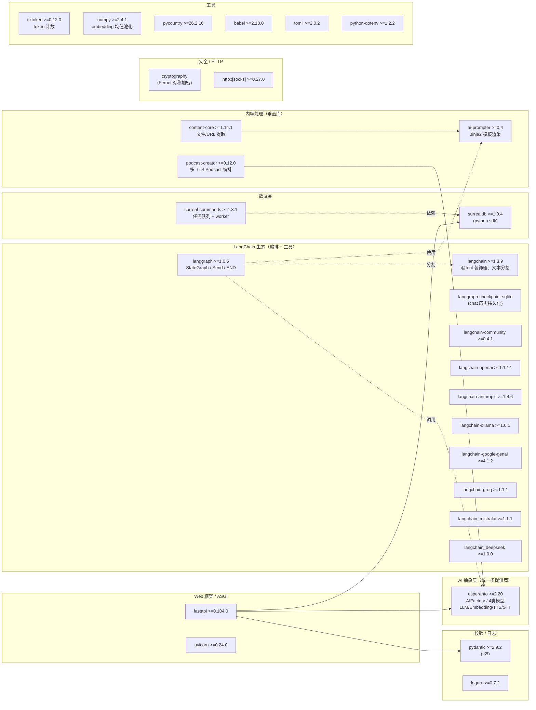
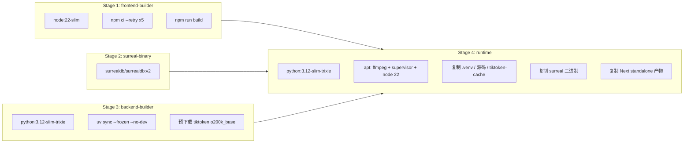
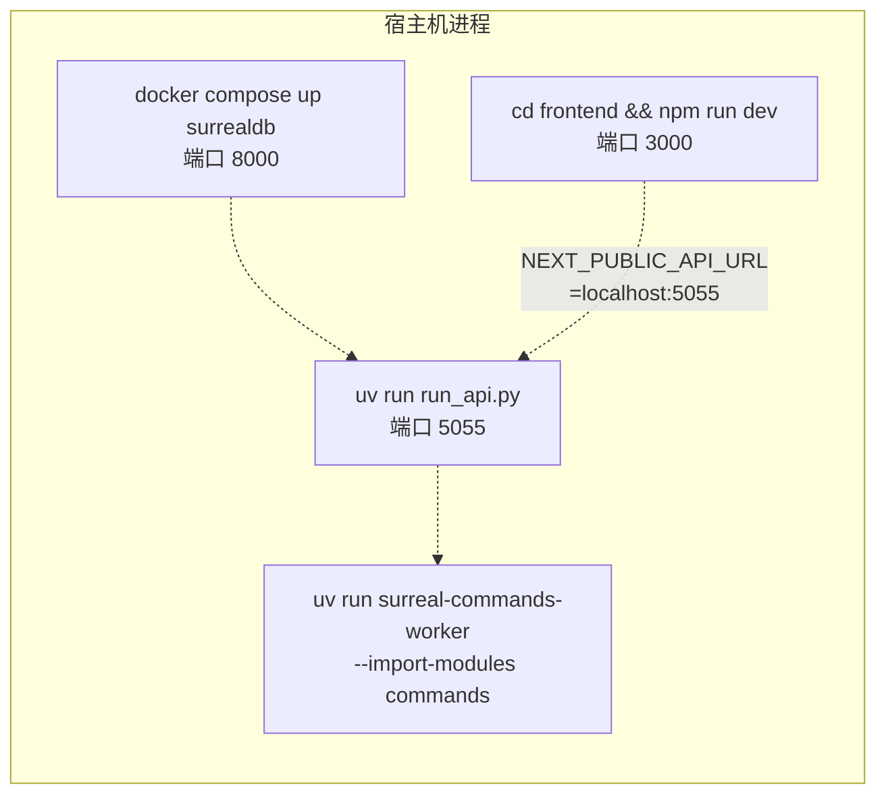

# 04 · 依赖与生态（Dependencies & Ecosystem）

> 一句话总览：Open Notebook 是一个**"组装而非重造"**的项目——后端用 Esperanto 抽象多 AI 提供商、LangGraph 编排状态机、SurrealDB 一站式覆盖文档/向量/图、surreal-commands 充当任务队列、content-core / podcast-creator / ai-prompter 三个垂直库承担内容/Podcast/模板；前端用 Next.js 16 + React 19 + Zustand + TanStack Query + shadcn/ui，全部都是各自生态里"现代但成熟"的选择，没有冷门轮子，也没有重型的"全家桶"框架。

---

## 目录

1. [后端依赖分类图](#1-后端依赖分类图)
2. [前端依赖分类图](#2-前端依赖分类图)
3. [后端核心依赖逐一拆解](#3-后端核心依赖逐一拆解)
4. [前端核心依赖逐一拆解](#4-前端核心依赖逐一拆解)
5. [基础设施与部署依赖](#5-基础设施与部署依赖)
6. [核心决策矩阵](#6-核心决策矩阵)
7. [与替代品深度对比](#7-与替代品深度对比)
8. [运行时拓扑](#8-运行时拓扑)
9. [Gotcha 汇总](#9-gotcha-汇总)

---

## 1. 后端依赖分类图

> 数据源：`pyproject.toml`（L15–L44）。所有版本号都来自 `dependencies = [...]` 段。



**关键观察**：

- `esperanto` 是**整个 AI 抽象层的中心**：所有 LLM/Embedding/TTS/STT 调用都通过它，`langchain-*` 反而只是"被 `.to_langchain()` 转换出来的形状"（见 `open_notebook/ai/provision.py` L61）。
- `langchain` 系列被拆成 **1 主包 + 1 community + 7 厂商包**，这是 LangChain 1.x 的拆包规范——主包只留核心抽象，每个厂商各自发布包，避免互相耦合。
- `surreal-commands` 与 `surrealdb` 是**同一个作者生态**（都基于 SurrealDB），所以 worker 可以把任务状态直接写回数据库，不需要额外的 Redis/RabbitMQ。

---

## 2. 前端依赖分类图

> 数据源：`frontend/package.json`（L14–L60）。版本来自 `dependencies` / `devDependencies`。

```mermaid
flowchart LR
    subgraph 框架核心["框架核心"]
        next["next ^16.2.6<br/>(App Router, standalone)"]
        react["react ^19.2.3 + react-dom"]
    end

    subgraph 数据与状态["数据 / 状态"]
        rq["@tanstack/react-query ^5.83"]
        zustand["zustand ^5.0.6<br/>+ persist middleware"]
        axios["axios ^1.16"]
        deb["use-debounce ^10"]
        zod["zod ^4.0"]
        rhf["react-hook-form ^7.60"]
        hfr["@hookform/resolvers ^5.1"]
    end

    subgraph UI组件库["UI 组件（shadcn/ui 体系）"]
        radix["@radix-ui/react-*<br/>(15+ 个原语)"]
        cva["class-variance-authority"]
        clsx["clsx + tailwind-merge"]
        tw["@tailwindcss/typography"]
        lucide["lucide-react ^0.525"]
        sonner["sonner ^2.0.6 (toast)"]
        cmdk["cmdk ^1.1 (command palette)"]
    end

    subgraph 样式与主题["样式 / 主题"]
        tailwind["tailwindcss ^4"]
        postcss["@tailwindcss/postcss ^4"]
        themes["next-themes ^0.4"]
        twanim["tw-animate-css"]
    end

    subgraph 内容渲染["内容渲染"]
        rmd["react-markdown ^10"]
        remark["remark-gfm + remark-math"]
        katex["katex + rehype-katex"]
        monaco["@monaco-editor/react"]
        mdeditor["@uiw/react-md-editor"]
    end

    subgraph i18n["国际化"]
        i18n["i18next ^25"]
        reacti18n["react-i18next ^16"]
        langdet["i18next-browser-languagedetector"]
    end

    subgraph 工具["工具"]
        datefns["date-fns ^4"]
    end

    subgraph 测试["测试（dev）"]
        vitest["vitest ^4 + @vitest/ui"]
        rtl["@testing-library/react"]
        jsdom["jsdom"]
    end

    next --> react
    next --> radix
    rq --> axios
    zustand -.持久化.-> react
    rhf --> zod
    hfr --> rhf
    radix --> cva
    cva --> clsx
```

**关键观察**：

- 前端几乎完全是 **shadcn/ui 体系**：底层 `@radix-ui/react-*`（无样式原语）+ `tailwindcss` + `class-variance-authority`。这意味着组件源码"长在仓库里"（`frontend/src/components/ui/*.tsx`），可以随便改。
- **没有用 Redux / Jotai / Recoil**——所有跨页面状态都用 Zustand 单一 store；服务端状态全部走 TanStack Query，两者职责严格分开（参考 `frontend/src/lib/stores/CLAUDE.md`）。
- **没有专门的 SSE 库**（如 `@microsoft/fetch-event-source`），`useAsk` 直接 `fetch().getReader()` 手动解析 `data: ...\n` 流（见 `frontend/src/lib/hooks/use-ask.ts` L72–L95）。

---

## 3. 后端核心依赖逐一拆解

### 3.1 `esperanto` — 多 AI 提供商抽象

**What**：统一的 `LanguageModel` / `EmbeddingModel` / `SpeechToTextModel` / `TextToSpeechModel` 接口，通过 `AIFactory.create_*()` 工厂方法实例化；同时提供 `.to_langchain()` 桥接到 LangChain 生态。

**Why not 替代品**：
- **不直接用厂商 SDK**（如 `openai` / `anthropic`）：要支持 8+ 个厂商（OpenAI、Anthropic、Google、Groq、Ollama、Mistral、DeepSeek、xAI、OpenRouter、Azure、Vertex…），自己写抽象成本巨大；Esperanto 已经做了这层。
- **不只用 `langchain-*`**：LangChain 没有抽象 TTS/STT，也没有 `.aparse()` / structured output 的统一管道；而项目需要 STT（音频转写）+ TTS（Podcast 配音）+ LLM + Embedding 四类模型同一家族。
- **不自己造抽象**：项目作者是 Esperanto 的作者，所以选它顺理成章（单点维护、零沟通成本）。

**How 集成**：

```python
# open_notebook/ai/models.py L3-9
from esperanto import (
    AIFactory, EmbeddingModel, LanguageModel,
    SpeechToTextModel, TextToSpeechModel,
)
# open_notebook/ai/provision.py L61
return model.to_langchain()  # 转成 LangChain BaseChatModel
```

`ModelManager.get_model()` 走两条路：
1. **Credential-linked**（首选）：`credential.to_esperanto_config()` 直接传配置给 `AIFactory.create_*()`。
2. **Env var fallback**：`key_provider.provision_provider_keys()` 把数据库里的 key 注入 `os.environ`，再让 Esperanto 读环境变量。

**Gotcha**：
- `key_provider` **会修改 `os.environ`**（突变进程级状态），所以测试时容易互相污染。
- 实际模型实例缓存由 Esperanto 内部管理，`ModelManager` 自己是无状态的。
- `provision_langchain_model()` 的 105_000 token 阈值是**硬编码**（`provision.py` L23），不可配置。

---

### 3.2 `langchain` + 7 个 `langchain-*` 厂商包 — 工具 + 文本分割 + 厂商适配

**What**：核心包提供 `@tool` 装饰器、`HumanMessage`/`SystemMessage`/`AIMessage`、`RunnableConfig`、`PydanticOutputParser`；`langchain_text_splitters`（来自 langchain 主包）提供 `RecursiveCharacterTextSplitter` / `MarkdownHeaderTextSplitter` / `HTMLHeaderTextSplitter`；厂商包只是给 LangChain 提供对应公司的 `ChatModel` 类（实际上项目通过 Esperanto `.to_langchain()` 拿到这些类）。

**Why not 替代品**：
- **不用 `LLlamaIndex`**：它的抽象偏 RAG pipeline，不如 LangGraph 灵活。
- **不用裸厂商 SDK**：会丢掉 LangGraph 节点间的消息类型流转（`add_messages` reducer）。

**How 集成**：

```python
# open_notebook/utils/chunking.py L23-26
from langchain_text_splitters import (
    HTMLHeaderTextSplitter, MarkdownHeaderTextSplitter,
    RecursiveCharacterTextSplitter,
)
# open_notebook/graphs/tools.py L3
from langchain.tools import tool
```

**Gotcha**：`pyproject.toml` 把 8 个 langchain 包的版本都**钉死在 1.x 主版本下**（`langchain>=1.3.9`, `langchain-openai>=1.1.14` …），因为 LangChain 1.0 引入了破坏性 API 变更，必须整体升级。

---

### 3.3 `langgraph` — 工作流编排（状态机）

**What**：LangChain 出品的"有状态图"框架，提供 `StateGraph`、`START`/`END`、`Send`（fan-out）、`add_messages` reducer、`SqliteSaver` checkpointer。项目用它实现了 5 个核心工作流：`source.py` / `chat.py` / `ask.py` / `transformation.py` / `source_chat.py` / `prompt.py`。

**Why not 替代品**：
- **不用裸 LangChain Agent (`AgentExecutor`)**：旧版 Agent 是黑盒，无法精确控制节点顺序、并发 fan-out、断点续跑。
- **不用自研状态机**：`Send` fan-out、`checkpointer`、消息 reducer 这些自研都要几百行代码，而 LangGraph 测试覆盖更好。
- **不用 Temporal / Prefect**：太重，需要单独部署服务；项目偏好"单二进制 + SQLite 文件"。

**How 集成**：

```python
# open_notebook/graphs/chat.py L7-10
from langgraph.checkpoint.sqlite import SqliteSaver
from langgraph.graph import END, START, StateGraph
from langgraph.graph.message import add_messages
# L248
memory = SqliteSaver(conn)
chat_graph = workflow.compile(checkpointer=memory)
```

**Gotcha**：
- **`SqliteSaver` 是同步 API**——`open_notebook/utils/graph_utils.py` L10 注释明确指出"doesn't support async"，所以 `get_state()` 要放到线程里跑。
- checkpoint 文件位置由 `LANGGRAPH_CHECKPOINT_FILE` 控制（`open_notebook/config.py` L9），默认在 `/data/sqlite-db/checkpoints.sqlite`；Docker 部署时该目录必须可写且持久化。
- LangGraph 自身 `>=1.0.5` 才能与 LangChain 1.x 兼容。

---

### 3.4 `surrealdb` (Python SDK) — 数据库驱动

**What**：SurrealDB 的官方 Python 异步驱动，提供 `AsyncSurreal` 客户端、`RecordID` 类型。项目所有数据库操作都经 `open_notebook/database/repository.py` 的 `db_connection()` 异步上下文管理器。

**Why not 替代品**：
- 见 §7.1 深度对比。
- 一句话：SurrealDB 一个数据库同时承担**文档 + 向量 + 图**三角色，避免了 Postgres + pgvector + Neo4j 三件套。

**How 集成**：

```python
# open_notebook/database/repository.py L7
from surrealdb import AsyncSurreal, RecordID  # type: ignore

# L47-58
@asynccontextmanager
async def db_connection():
    db = AsyncSurreal(get_database_url())
    await db.signin({"username": ..., "password": ...})
    await db.use(os.environ["SURREAL_NAMESPACE"], os.environ["SURREAL_DATABASE"])
    try:
        yield db
    finally:
        await db.close()
```

**Gotcha**：
- **没有连接池**——每次 `repo_*` 调用都开新连接（注释明确指出，serverless 友好但不适合批量任务）。
- SDK 仍在 1.x 早期，类型不稳，所以有 `# type: ignore`。
- `RecordID` 与 `str` 的转换必须显式：`ensure_record_id()` / `parse_record_ids()`。

---

### 3.5 `surreal-commands` — 任务队列

**What**：基于 SurrealDB 的轻量任务队列。`@command(name, app=...)` 注册 handler，`submit_command(app, name, args)` 入队，`surreal-commands-worker --import-modules commands` 启动 worker；任务状态直接写回 SurrealDB 的 `_command` 表。

**Why not 替代品**：
- **不用 Celery**：需要 Redis/RabbitMQ broker，多一个组件；Celery 配置复杂。
- **不用 RQ / Dramatiq**：同样需要 Redis。
- **不用 APScheduler**：是定时任务库，不是分布式任务队列。
- **不用 Dramatiq + PostgreSQL**：能做但配置仍然繁琐；surreal-commands 把队列状态写在已经使用的 SurrealDB 里，**零新增依赖**。

**How 集成**：

```python
# commands/podcast_commands.py L8, L69-72
from surreal_commands import CommandInput, CommandOutput, command

@command("generate_podcast", app="open_notebook", retry={"max_attempts": 1})
async def generate_podcast_command(input_data: PodcastGenerationInput) -> PodcastGenerationOutput:
    ...
```

启动 worker：

```bash
# Makefile L145
uv run --env-file .env surreal-commands-worker --import-modules commands
```

**Gotcha**：
- `submit_command()` **校验本地 registry**——API 进程必须 `import commands` 模块才能入队（见 `api/command_service.py` L20 注释）。
- Podcast 任务故意 `max_attempts: 1`，因为重试会**产生重复音频文件**（避免相同 episode 多版本）。
- 任务状态查询用 `get_command_status(command_id)`（`open_notebook/domain/notebook.py` L390）。

---

### 3.6 `ai-prompter` — Prompt 模板

**What**：基于 Jinja2 的 prompt 渲染库，提供 `Prompter` 类，支持模板继承、变量注入、从文件系统加载模板。所有 graph 的 system prompt 都走它。

**Why not 替代品**：
- **不裸用 Jinja2**：缺少模板发现、版本管理、与 AI 调用链的粘合层。
- **不用 `langchain_core.prompts.PromptTemplate`**：`{var}` 占位符语法与 f-string 冲突，且不支持复杂继承。

**How 集成**：

```python
# open_notebook/graphs/chat.py L5
from ai_prompter import Prompter
```

模板文件位于 `prompts/` 目录（详见 `prompts/CLAUDE.md`）。

**Gotcha**：模板变量未传时 Jinja2 默认报错，但 `ai-prompter` 包了一层宽松校验，开发时容易"看起来渲染成功了但变量是空字符串"。

---

### 3.7 `content-core` — 文件/URL 内容提取

**What**：从 PDF / DOCX / PPT / 音频 / 视频 / URL 提取文本 + 元数据的库。支持 50+ 文件类型。

**Why not 替代品**：
- **不用 `unstructured`**：unstructured 重型（依赖 torch、layoutparser），且对中文/复杂 PDF 效果一般；content-core 用更轻的策略 + 调外部 API（如 OpenAI Whisper 转写音频）。
- **不用 LangChain `DocumentLoader`**：每个文件类型要选不同 loader，没有统一接口。
- **不用 `textract` / `pypdf`**：覆盖面窄。

**How 集成**：

```python
# open_notebook/graphs/source.py L4-5
from content_core import extract_content
from content_core.common import ProcessSourceState
```

**Gotcha**：`extract_content()` 是**同步**函数（内部可能跑 Whisper、ffmpeg），所以在异步 graph 节点里会**阻塞事件循环**——这是 CLAUDE.md 明确警告的 "Content processing is sync; may block API briefly"。

---

### 3.8 `podcast-creator` — Podcast 编排

**What**：多 speaker Podcast 生成库，负责 outline 生成、script 拆分、TTS 配音、音频拼接、淡入淡出。

**Why not 替代品**：
- **不自研**：自研要处理 FFmpeg pipeline、TTS 多 provider 适配、对话节奏、字幕同步——至少 2~3 人月工作量。
- **不用 `radio-notices` / `elevenlabs-cookbook`**：太简化，不支持多 speaker。

**How 集成**：

```python
# commands/podcast_commands.py L20
from podcast_creator import configure, create_podcast
# L247
result = await create_podcast(
    content=..., briefing=..., episode_name=...,
    output_dir=..., speaker_config=..., episode_profile=...,
)
```

**Gotcha**：
- `podcast_creator` 必须用 `try/except ImportError` 包裹（L19-23），允许 podcast 模块单独缺失（让 core 系统不依赖它）。
- 模型解析失败的 episode/speaker profile 会被**静默删除**（L168-173），避免 `podcast-creator` 校验时报错。
- GPT-5 类模型的"extended thinking"会把 JSON 包进 `<think>` 标签导致解析失败，错误消息会专门提示用户换 GPT-4o（L292-298）。

---

### 3.9 `pydantic` v2 — 数据校验

**What**：v2 主版本，核心引擎是 Rust 写的 `pydantic-core`。所有领域模型（`domain/base.py`、`domain/notebook.py` 等）和 API schema（`api/models.py`）都继承 `BaseModel`。

**Why not 替代品**：
- **不用 `dataclass`**：缺 validation、JSON schema、`SecretStr`。
- **不用 `attrs`**：缺生态（FastAPI、LangChain 都默认 pydantic）。
- **不用 v1**：v2 性能 5~50 倍；v1 已停止功能更新。

**How 集成**：

```python
# open_notebook/domain/credential.py L22
from pydantic import SecretStr, model_validator
# open_notebook/domain/notebook.py L7
from pydantic import BaseModel, ConfigDict, Field, field_validator
```

**Gotcha**：
- `model_dump()` 取代了 v1 的 `.dict()`；`model_validate()` 取代 `.parse_obj()`。
- `ConfigDict` 取代 v1 的 `class Config:` 内部类。
- `field_validator` / `model_validator` 装饰器签名变了，迁移时容易踩坑。

---

### 3.10 `loguru` — 日志

**What**：零配置日志库，默认输出彩色日志到 stderr，支持 `logger.add()` 多 sink、结构化绑定、文件轮转。

**Why not 替代品**：
- **不用 stdlib `logging`**：stdlib 配置繁琐（`Formatter`/`Handler`/`getLogger`）；loguru 是 `from loguru import logger` 一行搞定。
- **不用 `structlog`**：structlog 偏 JSON 结构化日志，对开发期控制台不友好。

**How 集成**：几乎每个模块都是 `from loguru import logger`（grep 显示 15+ 文件直接 import）。

**Gotcha**：与 stdlib `logging` 不互通——第三方库（如 `uvicorn.access`）的日志不会进 loguru，需要 `InterceptHandler` 转发，但项目没配。

---

### 3.11 `fastapi` + `uvicorn` — Web 框架

**What**：FastAPI 是基于 Starlette + Pydantic 的 ASGI 框架；uvicorn 是 ASGI server。

**Why not 替代品**：
- **不用 Flask**：Flask 2.x 才加 async，且生态偏同步；FastAPI 异步优先 + Pydantic 自动校验。
- **不用 Django**：太重，ORM/admin/auth 都用不上；Django 的 async 支持仍然半成品。
- **不用裸 Starlette**：Starlette 没有自动 OpenAPI 文档和 Pydantic 校验。
- **不用 gunicorn + uvicorn worker**：项目是单容器内部 supervisord 拉起 uvicorn；uvicorn 自带 `--workers N` 也能多进程，gunicorn 在异步 ASGI 场景里只是"再包一层"。

**How 集成**：

```python
# api/main.py（隐含，由 api/routers/*.py 推断）
app = FastAPI(lifespan=...)
app.include_router(notebooks.router)
```

**Gotcha**：
- FastAPI 0.104+ 才稳定支持 `lifespan`（取代 `on_event`）；项目用了 lifespan 在启动时跑 SurrealDB 迁移。
- CORS 在 `api/main.py` allow all origins（开发友好，生产要收紧）。

---

### 3.12 `cryptography` (Fernet) — 对称加密

**What**：Fernet 是 `cryptography` 库提供的"已认证对称加密"（AES-128-CBC + HMAC-SHA256），用来加密数据库里的 API key（`Credential` 表）。

**Why not 替代品**：
- **不用 `itsdangerous`**：那是签名（不加密），任何拿到 token 的人都能 decode payload。
- **不用 `passlib`**：passlib 是密码哈希库（bcrypt/argon2），不是对称加密。
- **不用 RSA / JWT**：场景是"加密落库、解密使用"，不需要非对称。

**How 集成**：

```python
# open_notebook/utils/encryption.py L25, L115-125
from cryptography.fernet import Fernet, InvalidToken

def get_fernet() -> Fernet:
    return Fernet(_ensure_fernet_key(_get_encryption_key()).encode())
```

**Gotcha**：
- `OPEN_NOTEBOOK_ENCRYPTION_KEY` 接受**任意字符串**，内部 SHA-256 派生 Fernet key（`encryption.py` L106 注释）——这意味着**改 key 就解不开旧数据**，且不能用 `Fernet.generate_key()` 直接给。
- `docker-compose.yml` L27 默认 `change-me-to-a-secret-string`，部署时**必须改**。
- 丢 key = 丢所有 API credentials，没有恢复路径。

---

### 3.13 `httpx[socks]` — HTTP 客户端

**What**：同步 + 异步双形态的 HTTP 客户端，`[socks]` extra 启用 SOCKS5 代理。

**Why not 替代品**：
- **不用 `requests`**：纯同步；FastAPI 异步链路会被阻塞。
- **不用 `aiohttp`**：API 设计繁琐（`ClientSession()` 生命周期管理），且与同步代码互操作差。

**How 集成**：6 个文件 import httpx，主要用于：
- `open_notebook/ai/connection_tester.py` — 测试 provider 连通性。
- `open_notebook/ai/model_discovery.py` — 列出 provider 提供的模型。
- `open_notebook/utils/version_utils.py` — 检查新版本。
- `api/chat_service.py` — 转发到上游 LLM API。

**Gotcha**：`httpx[socks]` 需要 `socksio` 依赖；如果 socksio 在目标平台不可用，import 会失败。

---

### 3.14 其他重要依赖

| 依赖 | 作用 | 替代品 | 选它原因 |
|---|---|---|---|
| `tiktoken>=0.12` | OpenAI 分词器，token 计数 | `transformers`、`sentencepiece` | 与 OpenAI 模型天然对齐；docker 镜像里预先下载 o200k_base encoding（`Dockerfile` L39-41）实现离线运行 |
| `numpy>=2.4` | embedding 后处理（mean pooling） | pure-Python list | 向量数学快几个数量级；项目只用了 `np.mean()`、`np.array()` 等少量 API |
| `pycountry>=26.2` | ISO 国家/语言代码 | hard-coded dict | 权威数据库，包含 6000+ 语言；用于 `/languages` API |
| `babel>=2.18` | Unicode 语言名本地化 | 自己维护翻译表 | Python 生态标准（Flask-Babel 也用它） |
| `tomli>=2.0` | 解析 `pyproject.toml` | stdlib `tomllib`（Python 3.11+） | 项目要兼容低版本 Python，留一个 shim；实际上 3.11 已经有 `tomllib` |
| `python-dotenv>=1.2` | 加载 `.env` 文件 | 自己写 `os.environ` 解析 | 标准做法，支持变量插值 |

---

## 4. 前端核心依赖逐一拆解

### 4.1 `next` 16 + `react` 19 — 框架

**What**：Next.js 16（2025 年发布）+ React 19。启用 `output: "standalone"`（`next.config.ts` L5）做 Docker 优化构建。

**Why not 替代品**：
- **不用 CRA (create-react-app)**：CRA 已停止维护。
- **不用 Vite + React Router**：失去 SSR、文件路由、`output: standalone` 等优化。
- **不用 Remix**：Remix 偏 web 标准（Web Fetch API），生态比 Next 小。
- **不用 Next 15**：16 引入了改进的缓存默认值、Turbopack 稳定、新的 `proxyClientMaxBodySize`（项目 `next.config.ts` L11 用了它把上传 limit 改成 100MB）。

**How 集成**：

```ts
// frontend/next.config.ts
const nextConfig: NextConfig = {
  output: "standalone",
  experimental: { proxyClientMaxBodySize: '100mb' } as NextConfig['experimental'],
  async rewrites() {
    return [{ source: '/api/:path*', destination: `${internalApiUrl}/api/:path*` }]
  }
}
```

`rewrites()` 把 `/api/*` 反代到 FastAPI（默认 `http://localhost:5055`，可由 `INTERNAL_API_URL` 覆盖），这让前端部署时**只需要一个端口 8502**。

**Gotcha**：
- Next 16 的 `proxyClientMaxBodySize` 类型滞后（`next.config.ts` L8-13 注释），需要 `as NextConfig['experimental']` 绕过。
- `frontend/start-server.js` 是 standalone 模式的自定义启动器（Docker 里 `CMD ["node", "start-server.js"]`）。

---

### 4.2 `zustand` 5 — 客户端状态

**What**：~1KB 的状态管理库，`create<T>()((set, get) => ({...}))` API；`persist` 中间件自动同步到 localStorage。

**Why not 替代品**：详见 §7.7。

**How 集成**：

```ts
// frontend/src/lib/stores/auth-store.ts L21-22
export const useAuthStore = create<AuthState>()(
  persist((set, get) => ({...}), { name: 'auth-storage' })
)
```

项目有 6 个 store：`auth-store`、`notebook-view-store`、`notebook-columns-store`、`sidebar-store`、`navigation-store`、`theme-store`。

**Gotcha**：
- 必须用 `create<T>()(...)` 的柯里化形式才能开 TS 类型推断。
- `persist` 的 `partialize` 选项只持久化部分字段（auth-store 只存 `token` 和 `isAuthenticated`，不存 `isLoading`）。
- SSR hydration 不匹配问题：用 `hasHydrated` flag 显式标记。

---

### 4.3 `@tanstack/react-query` 5 — 服务端状态

**What**：声明式数据获取 + 缓存库。`useQuery({ queryKey, queryFn })` + `useMutation`。

**Why not 替代品**：详见 §7.8。

**How 集成**：

```ts
// frontend/src/lib/hooks/use-sources.ts (典型模式)
export const useSources = (notebookId) => useQuery({
  queryKey: QUERY_KEYS.sources(notebookId),
  queryFn: () => sourcesApi.list(notebookId),
  refetchOnWindowFocus: true,
})
```

约 22 个 hooks 文件（`frontend/src/lib/hooks/`），全部以 `use-*.ts` 命名。

**Gotcha**：
- 用了**广泛 invalidate** 策略（`queryClient.invalidateQueries({ queryKey: ['sources'] })`），简单但会过度 refetch。
- `staleTime` 默认 0——每次 mount 都 refetch，靠 `refetchOnWindowFocus` 让 UX 容忍这一行为。

---

### 4.4 `axios` + 手写 fetch SSE — HTTP 客户端

**What**：axios 用于所有 REST 请求（`frontend/src/lib/api/client.ts`）；SSE 流（chat / ask）用裸 `fetch().getReader()` 手动解析。

**Why not 替代品**：
- **不用 `fetch` 全替代 axios**：axios 的 interceptor（自动注入 Bearer token、401 重定向）、FormData 自动处理、timeout 配置都方便很多。
- **不用 `@microsoft/fetch-event-source`**：项目里 SSE 协议是自定义的（`data: {json}\n`），EventSource 重连机制反而是负担。
- **不用 `react-query` 的 `useQuery` + stream**：react-query 不擅长流式数据，所以 `useAsk` 用 `useState` + `useCallback` 自己管理。

**How 集成**：

```ts
// frontend/src/lib/api/client.ts
export const apiClient = axios.create({
  timeout: 600000, // 10 分钟，应对 Ollama 慢响应
})
apiClient.interceptors.request.use(async (config) => {
  if (!config.baseURL) config.baseURL = `${await getApiUrl()}/api`
  // 从 localStorage 读 token
  const authStorage = localStorage.getItem('auth-storage')
  // ...
})
```

SSE：

```ts
// frontend/src/lib/hooks/use-ask.ts L72-95
const reader = response.getReader()
const decoder = new TextDecoder()
let buffer = ''
while (true) {
  const { done, value } = await reader.read()
  buffer += decoder.decode(value, { stream: true })
  const lines = buffer.split('\n')
  buffer = lines.pop() || ''
  for (const line of lines) {
    if (line.startsWith('data: ')) {
      const data = JSON.parse(line.slice(6))
      // dispatch by data.type
    }
  }
}
```

**Gotcha**：
- API timeout 默认 10 分钟（应对本地 Ollama 推理），`NEXT_PUBLIC_API_TIMEOUT_MS=0` 显式禁用。
- 401 响应全局拦截：`localStorage.removeItem('auth-storage')` + `window.location.href = '/login'`。

---

### 4.5 `tailwindcss` 4 + shadcn/ui 体系

**What**：Tailwind 4（CSS-first 配置）+ 15+ 个 `@radix-ui/react-*` 原语 + `class-variance-authority`（变体管理）+ `clsx` + `tailwind-merge`（class 合并去重）。组件源码直接放在 `frontend/src/components/ui/`。

**Why not 替代品**：详见 §7.6。

**How 集成**：

```tsx
// frontend/src/components/ui/button.tsx (典型 shadcn 模式)
const buttonVariants = cva("inline-flex items-center justify-center...", {
  variants: {
    variant: { default: "...", destructive: "...", outline: "..." },
    size: { default: "h-10 px-4", sm: "h-9 px-3", lg: "h-11 px-8" },
  },
})
```

**Gotcha**：
- Tailwind 4 用 CSS `@theme` 取代 `tailwind.config.ts`（项目仍保留旧 config 文件兼容）。
- shadcn/ui 不是 npm 包——是"复制粘贴"模式，组件代码完全 owned。

---

### 4.6 `i18next` 25 + `react-i18next` 16

**What**：i18next 是 JS 生态最老的 i18n 库；`react-i18next` 提供 `useTranslation()` hook 和 `<Trans>` 组件。

**Why not 替代品**：
- **不用 `next-intl`**：next-intl 偏 Server Components；项目大量 `'use client'` 组件用 react-i18next 更自然。
- **不用 `FormatJS` (react-intl)**：API 更繁琐，ICU MessageSyntax 学习成本高。

**How 集成**：5 个 locale（en-US、pt-BR、zh-CN、zh-TW、ja-JP），按 feature 分目录。`useTranslation` 是项目自己的薄封装（`frontend/src/lib/hooks/use-translation.ts`）。

**Gotcha**：所有 UI 文案改动都要同步 5 个 locale 文件，否则 `t('key')` 返回 key 本身。

---

### 4.7 `react-hook-form` 7 + `zod` 4 + `@hookform/resolvers` 5

**What**：RHF 是性能最佳的 React 表单库（非受控，避免每次按键 re-render）；zod 是 TS-first schema 校验；resolver 把两者粘合。

**Why not 替代品**：
- **不用 `formik`**：受控模式，慢。
- **不用 `final-form`**：API 老旧。
- **不用 zod v3**：v4 性能更好、错误消息更清晰。

**How 集成**：8+ 个 Dialog 用了它（`grep react-hook-form`），主要在 settings、notebook/source editor、transformation editor。

---

### 4.8 其他前端依赖

| 依赖 | 作用 | 备注 |
|---|---|---|
| `lucide-react` | SVG 图标库 | 1000+ 图标，tree-shakeable，shadcn 默认搭配 |
| `sonner` | toast 通知 | shadcn 推荐；项目里 `toast.success()` / `toast.error()` 随处可见 |
| `cmdk` | Command palette（⌘+K） | shadcn 的 `<Command>` 组件底层 |
| `@uiw/react-md-editor` | Markdown 编辑器 | 用在 note / transformation 编辑 |
| `@monaco-editor/react` | VSCode 同款代码编辑器 | 用在 prompt / JSON 编辑 |
| `react-markdown` + `remark-gfm` + `remark-math` + `rehype-katex` + `katex` | Markdown 渲染管线 | 支持 GFM、数学公式 |
| `next-themes` | 暗黑模式切换 | 实际项目自己写了 `theme-store`（zustand），next-themes 退居底层 |
| `date-fns` 4 | 日期格式化 | 替代 moment.js（已弃用）|
| `use-debounce` 10 | debounce hook | 用在搜索框 |

---

## 5. 基础设施与部署依赖

### 5.1 Docker 多阶段构建（`Dockerfile`）

**策略**：5 个 stage，分离前端、后端、SurrealDB 二进制和运行时。



**关键设计**：
- **tiktoken 预下载**（`Dockerfile` L49-51, L77-78）：`/app/tiktoken-cache` **故意放在 `/app/data/` 之外**，防止用户挂 volume 时把预下载的 encoding 隐藏掉。这是 issue #264 的修复。
- **npm ci 重试 5 次**（`Dockerfile` L14-18）：在 QEMU 模拟 arm64 时经常 ECONNRESET，所以 sleep 15s 重试。
- **三份 Dockerfile**：
  - `Dockerfile` — 多容器版（不含 SurrealDB）
  - `Dockerfile.single` — 单容器版（含 SurrealDB 二进制）
  - 开发用 `docker-compose.dev.yml`（不在文件列表，但 Makefile L130 提及）

### 5.2 `supervisord` — 单容器多进程

**取舍**：

`supervisord.single.conf` 同时拉起 **4 个进程**：`surrealdb` (priority=5) → `api` (priority=10) → `worker` (priority=20) → `frontend` (priority=30)。priority 数字越小越先启动。

**为什么用 supervisord 而不是**：
- **多个 docker container**（多容器模式）：用 `docker-compose.yml` 那种方式，确实更标准。`Dockerfile.single` + `supervisord.single.conf` 是给"我只想要一个 docker run 命令"的用户用的（典型家庭自托管场景）。
- **systemd**：容器里跑 systemd 很别扭。
- **s6-overlay**：更轻但学习成本高。

**Gotcha**：
- `wait-for-api.sh` 必须先 wait（`supervisord.single.conf` L41），否则 frontend 启动时 api 还没 ready。
- supervisord 把所有进程的 stdout 转发到容器 stdout（`stdout_logfile=/dev/stdout`），但 4 个进程的日志会混在一起，需要靠 `[program:xxx]` 标签区分。
- 多容器版（`supervisord.conf`）没有 surrealdb 进程——SurrealDB 在独立的 `surrealdb/surrealdb:v2` 容器里。

### 5.3 docker-compose profile

**当前仓库根目录的 `docker-compose.yml`** 是**多容器版**（不带 profile），两个 service：
- `surrealdb` — SurrealDB v2，端口 8000，volume `./surreal_data`
- `open_notebook` — 主应用（含 API + worker + frontend），暴露 8502 和 5055，volume `./notebook_data`

> 注：CLAUDE.md 提到的 `--profile multi` 在当前 `docker-compose.yml` 里**没有体现**——profile 机制可能在历史版本或 `docker-compose.full.yml` 里（Makefile L133 提到 `full` 目标）。

### 5.4 Makefile 目标概览

| 目标 | 作用 |
|---|---|
| `make database` | docker compose 起 surrealdb 单容器 |
| `make run` / `make frontend` | 只起 frontend dev（会警告不是完整功能）|
| `make api` | `uv run --env-file .env run_api.py` |
| `make worker` / `worker-start` / `worker-stop` / `worker-restart` | surreal-commands worker 控制 |
| `make start-all` | 一键起 surrealdb + api + worker + frontend（4 个进程）|
| `make stop-all` | 一键停（pkill + docker compose down）|
| `make status` | 显示 4 个服务运行状态 |
| `make docker-build-local` | 本地单平台构建 |
| `make docker-push` | 多平台构建（amd64 + arm64）推 Docker Hub + GHCR，**不打 latest tag** |
| `make docker-push-latest` | 同上但更新 `v1-latest` tag |
| `make docker-release` | `docker-push-latest` 的别名 |
| `make tag` | 从 pyproject.toml 读 version，git tag + push |
| `make lint` / `make ruff` | mypy / ruff check |
| `make clean-cache` | 删 __pycache__ / .mypy_cache / .ruff_cache / .pytest_cache |
| `make export-docs` | 运行 `scripts/export_docs.py` |

**关键设计**：
- `PLATFORMS := linux/amd64,linux/arm64` — 多架构是必须的（Apple Silicon 用户多）。
- `docker-push` 和 `docker-push-latest` **分离**——日常 push 不动 latest，发布日才显式 promote。这是 gitops 友好的发布实践。

---

## 6. 核心决策矩阵

> 缩写：Why = 为什么选它；Cost = 代价 / 限制。

| 依赖 | 角色 | 主要替代品 | Why 选它 | Cost / 限制 |
|---|---|---|---|---|
| **esperanto** | AI 抽象层 | 裸 langchain-* / 厂商 SDK / 自研 | 统一 4 类模型；作者同源；`.to_langchain()` 桥接 | 锁定在作者维护节奏；2.x → 3.x 时可能 break |
| **langgraph** | 工作流编排 | 裸 Agent / 自研状态机 / Temporal | `StateGraph` + `Send` + checkpointer 一站式 | SqliteSaver 是同步的；调试栈深 |
| **langchain 1.x** | 消息类型 / 文本分割 | LlamaIndex / 裸 SDK | 与 LangGraph 自然衔接；text splitters 覆盖全 | 1.x 主版本拆 8 个包，依赖管理繁琐 |
| **surrealdb** | 数据库 | Postgres+pgvector / Qdrant / Chroma / Neo4j | 一库覆盖文档+向量+图；Schema-less 灵活 | Python SDK 1.x 早期，`# type: ignore` 多 |
| **surreal-commands** | 任务队列 | Celery / RQ / Dramatiq | 零额外 broker；状态直接写 SurrealDB | 单点：SurrealDB 挂了队列也挂 |
| **ai-prompter** | Prompt 模板 | 裸 Jinja2 / LangChain PromptTemplate | 模板发现 + 与 AI 调用粘合 | 文档少，主要靠源码 |
| **content-core** | 内容提取 | unstructured / LangChain DocumentLoader | 轻量、覆盖广、支持音视频 | 同步阻塞 event loop |
| **podcast-creator** | Podcast 生成 | 自研 TTS 编排 | 节省数月工作量 | 重依赖（FFmpeg、TTS provider）|
| **pydantic v2** | 校验 | dataclass / attrs / v1 | Rust 核心 5-50x；生态默认 | v1→v2 迁移成本（`dict()` → `model_dump()` 等）|
| **loguru** | 日志 | stdlib logging / structlog | 零配置；彩色；结构化 | 与 stdlib logging 不互通 |
| **fastapi** | Web 框架 | Flask / Django / Starlette | async 优先；自动 OpenAPI；Pydantic 校验 | CORS 配置默认全开 |
| **uvicorn** | ASGI server | gunicorn+uvicorn worker / hypercorn | 直接 ASGI；`--workers` 已够用 | 单进程模式不抗突发 |
| **cryptography (Fernet)** | 对称加密 | itsdangerous / passlib / JWT | 已认证加密；Rust 后端 | 改 key 即丢数据 |
| **httpx** | HTTP 客户端 | requests / aiohttp | 同步+异步双形态；interceptor 模式 | `[socks]` extra 依赖 socksio |
| **next 16** | 前端框架 | CRA / Vite / Remix | standalone 优化 Docker；文件路由；Turbopack | 配置项类型滞后 |
| **react 19** | UI 库 | Vue / Svelte | 生态最大；并发渲染；RSC | 19.x 早期，部分库未跟上 |
| **zustand 5** | 客户端状态 | Redux / Jotai / Recoil | ~1KB；TS 友好；persist 中间件 | 无 devtools 内置（需配 redux-devtools）|
| **@tanstack/react-query 5** | 服务端状态 | SWR / RTK Query | DevTools 强大；mutation 模式成熟 | 学习曲线（queryKey 设计）|
| **tailwind 4 + shadcn/ui** | 样式 / 组件 | MUI / Ant Design / Chakra | 组件代码 owned；体积可控；无运行时 CSS-in-JS | 需要熟悉 Tailwind + cva |
| **i18next 25** | 国际化 | next-intl / FormatJS | 生态最大；`react-i18next` 成熟 | 需要自己维护 locale 加载 |
| **react-hook-form 7 + zod 4** | 表单 | Formik / final-form | 非受控性能好；TS-first schema | resolver 配置稍复杂 |
| **axios** | HTTP 客户端 | fetch / ky | interceptor；FormData 自动；timeout | 不能用 react-native fetch polyfill |
| **supervisord** | 单容器多进程 | 多 docker container / s6 / systemd | 一条 docker run 起所有；UX 简单 | 日志混合；进程崩溃不重启容器 |

---

## 7. 与替代品深度对比

### 7.1 SurrealDB vs Postgres+pgvector / Qdrant / Chroma

| 维度 | SurrealDB | Postgres + pgvector | Qdrant / Chroma |
|---|---|---|---|
| 数据模型 | 文档 + 向量 + 图（一库三角色）| 关系 + 向量（pgvector）| 纯向量 |
| 学习曲线 | SurrealQL（类 SQL 但不同）| SQL，最熟 | 各自 API |
| Python SDK | 1.x 早期，类型不完整 | psycopg/asyncpg 成熟 | 官方 SDK 成熟 |
| 自托管 | 单二进制 | Postgres + 扩展 | 单二进制 |
| Schema | Schema-less / Schema-full | 强 schema | Schema-less |
| 图查询 | 原生（`RELATE`）| 需要 recursive CTE | 不支持 |
| 项目里的实际使用 | `Notebook --source--> Source`、`Note --reference--> Source` 等图关系；`DEFINE TABLE ... SCHEMAFULL` 部分强 schema | - | - |

**为什么选 SurrealDB**：
1. **单数据库覆盖三个角色**——避免了 Postgres（文档）+ pgvector（向量）+ Neo4j（图）三件套。
2. **Schema-less 灵活**——领域模型频繁演进（podcast profiles、credentials 迭代），不需要每次跑迁移。
3. **作者偏好**——项目作者同样是 SurrealDB 早期采用者，社区支持直接。

**代价**：
- Python SDK 仍 1.x，类型不稳；`# type: ignore` 多。
- 生态远小于 Postgres，遇到坑只能翻 GitHub issue。
- 向量搜索性能在生产规模下未充分验证（项目用户规模目前还小）。

---

### 7.2 Esperanto vs 裸 LangChain / 直接用厂商 SDK

| 维度 | Esperanto + LangChain 桥 | 裸 langchain-* | 直接厂商 SDK |
|---|---|---|---|
| 模型类型覆盖 | LLM + Embedding + STT + TTS | 仅 LLM + Embedding | 每家不同 |
| 多 provider 切换 | `AIFactory.create_*(provider=...)` | 每家不同 class | 每家不同 API |
| Structured output | `.aparse()` 统一接口 | 各包实现不一 | 自己实现 |
| 模型发现 | `model_discovery` 模块 | 无 | 各家 API 不同 |
| TTS/STT | ✅ | ❌ | 自己写适配 |

**项目里的真实场景**：用户在 UI 上配 OpenAI key 做 LLM、ElevenLabs key 做 TTS、Voyage key 做 Embedding——Esperanto 是**唯一**能统一这三家的库。

---

### 7.3 LangGraph vs 裸 LangChain Agent

| 维度 | LangGraph | 裸 AgentExecutor |
|---|---|---|
| 流程控制 | 显式 `StateGraph.add_node()` / `add_edge()` | 黑盒 |
| Fan-out | `Send()` 让一个节点派发多个子任务 | 不直接支持 |
| 持久化 | `SqliteSaver` / `MemorySaver` | 有限 |
| 时间旅行 | `get_state_hist()` 可回溯 | 不支持 |
| 调试 | 节点级日志清晰 | 难 |

**项目里 `ask.py` 的 Send fan-out**：search 节点派发 N 个并行 retrieve → 每个返回 answer → final_answer 节点合并。裸 Agent 做不到这个。

---

### 7.4 surreal-commands vs Celery / RQ / Dramatiq

| 维度 | surreal-commands | Celery | RQ | Dramatiq |
|---|---|---|---|---|
| Broker | SurrealDB（已有）| Redis / RabbitMQ | Redis | Redis / RabbitMQ |
| 额外组件 | 0 | 1 | 1 | 1 |
| Result backend | SurrealDB（内置）| Redis / Django DB | Redis | Redis |
| 重试策略 | `retry={"max_attempts": N, "wait_strategy": "exponential_jitter", "stop_on": [...]}` | `retry` 装饰器 | `@job(retry=...)` | middleware |
| 任务状态查询 | `get_command_status(cmd_id)` 返回 dict | `AsyncResult.state` | `Job.status` | events |
| Worker 启动 | `surreal-commands-worker --import-modules commands` | `celery -A tasks worker` | `rq worker` | `dramatiq worker` |

**为什么选 surreal-commands**：
1. **零额外组件**——项目已用 SurrealDB，broker / result backend / 状态存储全部免费。
2. **任务状态与业务数据同库**——`PodcastEpisode.command` 字段直接存 `RecordID` 指向 `_command` 记录，JOIN 即可。
3. **配置简单**——一个 `@command` 装饰器 + Pydantic Input/Output 类型。

**代价**：
- 队列规模上限取决于 SurrealDB（不适合百万级任务）。
- Worker 单进程，需要自己起多副本。
- 可观测性弱（没有 Celery Flower 那种 dashboard）。

---

### 7.5 content-core vs unstructured / LangChain DocumentLoader

| 维度 | content-core | unstructured | LangChain DocumentLoader |
|---|---|---|---|
| 安装体积 | 中（FFmpeg 等外部依赖）| 大（torch / layoutparser 可选）| 小 |
| 文件类型覆盖 | 50+（PDF/DOCX/PPT/音视频/URL）| 30+ | 每种 loader 一份代码 |
| OCR/转写 | 委托 OpenAI Whisper 等 | 内置（可选）| 自己写 |
| 同步/异步 | 同步 | 同步 | 各异 |
| 中文支持 | 良好 | 一般 | 看 loader |

**项目选择 content-core 的关键**：**音视频支持**——用户能上传 mp3/mp4，content-core 自动调 Whisper 转写成文字。unstructured 也能做但配置复杂；LangChain 没有统一接口。

---

### 7.6 podcast-creator vs 自研 TTS 编排

**自研需要做的事**：
1. Outline 生成（LLM 调用，让 LLM 把 briefing 拆成多段对话）
2. Script 拆分（每段 < TTS 单次上限）
3. Speaker 分配（多 speaker 对话的轮替）
4. TTS 调用（每段一次，可能跨 provider）
5. 音频拼接（FFmpeg，要处理采样率、淡入淡出）
6. 字幕同步（生成 SRT/VTT）
7. 错误恢复（TTS 失败重试、用静音兜底）

`podcast-creator` 把这 7 件事都做了。自研估计 2~3 人月，且需要持续维护 TTS provider 兼容（elevenlabs / openai / google 各家 API 都在变）。

**代价**：库本身有几百 MB 依赖（FFmpeg binary、音频处理库）；Docker 镜像变大。

---

### 7.7 Zustand vs Redux / Jotai / Recoil

| 维度 | Zustand | Redux Toolkit | Jotai | Recoil |
|---|---|---|---|---|
| Bundle size | ~1KB | ~15KB | ~2KB | ~22KB |
| API | `create<T>()((set,get) => ({...}))` | `configureStore` + slices | `atom()` + `useAtomValue` | `atom()` + `useRecoilValue` |
| 心智模型 | 单 store + selector | 单 store + reducer | atom 网络 | atom 网络 |
| 持久化 | `persist` middleware | redux-persist | 自写 | 不内置 |
| TS 体验 | 极佳 | 良 | 良 | 一般 |
| 学习曲线 | 1 小时 | 1 天 | 半天 | 半天 |
| Devtools | 配合 redux-devtools | 内置 | 第三方 | 第三方 |

**项目选择 Zustand 的关键**：
- **只需要 client 状态**（auth、modal、UI 偏好），不需要时间旅行、复杂 selector。
- **persist 中间件天然支持 localStorage**——auth-store 持久化 token 一行代码搞定。
- **6 个 store 都很小**（< 100 行），Zustand 的 "function + set" 模式最简洁。

---

### 7.8 TanStack Query vs SWR / RTK Query

| 维度 | TanStack Query 5 | SWR | RTK Query |
|---|---|---|---|
| Mutation | `useMutation` 一等公民 | 需要 `useSWRMutation`（后加）| `useXxxMutation` 自动生成 |
| DevTools | 内置（-floating）| 第三方 | redux-devtools 复用 |
| 缓存键 | 数组 `['sources', id]` | 字符串 key | endpoint 自动 |
|乐观更新| `onMutate` / `onError` 回调 | 一般 | 自动 |
| 预取 | `queryClient.prefetchQuery` | `swr.set` | `dispatch(api.util.prefetchQuery)`|
| 学习曲线 | 中 | 低 | 中（要会 RTK）|

**项目选择 TanStack Query 的关键**：
- `useMutation` 模式更灵活——项目有大量"提交后多 key invalidate + toast 反馈"场景。
- 与 Zustand 职责清晰分开（client state vs server state）。
- DevTools 强大，开发体验好。

---

## 8. 运行时拓扑

### 8.1 单容器部署（`Dockerfile.single` + `supervisord.single.conf`）

```mermaid
flowchart TB
    subgraph 容器["Docker container: lfnovo/open_notebook:v1-latest-single"]
        sup[supervisord<br/>PID 1]
        subgraph 进程["4 个进程 (priority 顺序启动)"]
            db[surrealdb<br/>priority=5<br/>rocksdb:/mydata/mydatabase.db<br/>端口: 8000 内部]
            api[uvicorn api.main:app<br/>priority=10<br/>端口: 5055]
            worker[surreal-commands-worker<br/>priority=20<br/>--import-modules commands]
            fe["node server.js<br/>(Next.js standalone)<br/>priority=30<br/>端口: 8502<br/>等 wait-for-api.sh 通过"]
        end
        sup --> db
        sup --> api
        sup --> worker
        sup --> fe
    end
    vol1[(./notebook_data<br/>挂载到 /app/data)]
    vol2[(./surreal_data<br/>挂载到 /mydata)]
    db -.rocksdb.-> vol2
    api -.sqlite checkpoint.-> vol1
    worker -.读 .env.-> vol1

    User([用户浏览器]) -->|"8502 (Web UI) / 5055 (API)"| 容器
```

**关键点**：
- 单容器版 SurrealDB **跑在容器内**，用 rocksdb 引擎存到 `/mydata`。
- 4 个进程通过 supervisord 的 priority 控制启动顺序，frontend 启动前会 `wait-for-api.sh` 等 5055 端口 ready。
- 用户暴露两个端口：8502（前端）+ 5055（API，可选）。

### 8.2 多容器部署（`docker-compose.yml`）

```mermaid
flowchart LR
    User([用户浏览器])
    subgraph Net["Docker network"]
        FeCt["open_notebook 容器<br/>(lfnovo/open_notebook:v1-latest)<br/>含 supervisord + api + worker + frontend<br/>端口: 8502, 5055"]
        DbCt[("surrealdb 容器<br/>(surrealdb/surrealdb:v2)<br/>端口: 8000<br/>volume: ./surreal_data"])
    end
    User -->|"8502 (Web)"| FeCt
    User -->|"5055 (API, 可选)"| FeCt
    FeCt -->|ws://surrealdb:8000/rpc| DbCt
    FeCt -.depends_on.-> DbCt

    Vol1[(./notebook_data<br/>挂载到 /app/data)]
    Vol2[(./surreal_data<br/>挂载到 /mydata)]
    FeCt --> Vol1
    DbCt --> Vol2
```

**关键点**：
- `open_notebook` 容器内**没有 surrealdb 进程**（`supervisord.conf` 而非 `supervisord.single.conf`）。
- 容器之间通过 `ws://surrealdb:8000/rpc` WebSocket 通信（`docker-compose.yml` L32）。
- 默认账号 `root:root`（L8），生产必须通过 `.env` 文件覆盖。

### 8.3 开发模式（`make start-all`）



开发时端口 3000（前端 dev server），生产是 8502（Next standalone）。

---

## 9. Gotcha 汇总

> 按依赖分组，每条都是**实际会咬人的**坑。

### Esperanto / AI 抽象

- **`key_provider` 会修改 `os.environ`**：测试间互相污染，建议测试 fixture 显式 `monkeypatch.delenv`。
- **`provision_langchain_model()` 105_000 token 阈值硬编码**（`open_notebook/ai/provision.py` L23）：要改只能改源码。
- **`DefaultModels.get_instance()` 每次新实例**：故意绕过缓存以读到最新配置；调用方不要缓存它。
- **`get_speech_to_text()` / `get_embedding_model()` 用 `assert`**：生产关闭 assert（`python -O`）会跳过类型检查。

### LangGraph

- **`SqliteSaver` 是同步的**：异步代码里调 `get_state()` 要放到 `asyncio.to_thread()`。
- **checkpoint 文件单 SQLite**：多 worker 进程并发写会有 lock 冲突；目前 worker 只跑一个进程。
- **`Send` fan-out 的目标节点要可重入**：同一节点会被并发调用 N 次。

### SurrealDB

- **每次 `repo_*` 调用都开新连接**：没有连接池，批量操作时延迟累积。
- **`RecordID` vs `str`**：DB 返回的是 `RecordID` 对象，API 响应要 `parse_record_ids()` 转字符串；客户端发来的字符串要 `ensure_record_id()` 转 `RecordID`。
- **migration 文件硬编码在 `AsyncMigrationManager.__init__`**：加新迁移必须改代码（不是自动发现）。
- **事务冲突是 RuntimeError**：在 `repository.py` 里被 catch 后只在 DEBUG 级别打日志，调用方不知道。
- **默认 `root:root` 密码**：`docker-compose.yml` L8 明确警告生产要换。

### surreal-commands

- **`submit_command` 校验本地 registry**：API 进程必须先 `import commands` 包，否则 submit 时报 "unknown command"。
- **Podcast 任务 `max_attempts: 1`**：故意不重试，避免重复音频；用户需要手动 retry。
- **worker 与 API 必须用相同版本**：command 注册名变了会静默失败。

### content-core

- **同步阻塞**：在异步 graph 节点里直接调 `extract_content()` 会阻塞事件循环；高并发下要包 `asyncio.to_thread()`（项目目前没包）。

### podcast-creator

- **GPT-5 类模型 extended thinking 会让 JSON 解析失败**：错误消息会专门提示用户换 GPT-4o（`commands/podcast_commands.py` L292-298）。
- **profile 解析失败被静默删除**（L168-173）：用户看到的是 "profile X not found"，实际是因为某 speaker 的 voice_model 配置错了被剔除。

### cryptography / Fernet

- **改 `OPEN_NOTEBOOK_ENCRYPTION_KEY` 即丢历史数据**：派生 key 用 SHA-256，旧密文无法解。
- **`docker-compose.yml` 默认 `change-me-to-a-secret-string`**：很多自托管用户不改。

### Pydantic v2

- **`ConfigDict` 取代 `class Config:`**：v1 代码迁移时容易遗漏。
- **`field_validator` 装饰器签名变了**：v1 的 `@validator("field")` → v2 的 `@field_validator("field")`，且默认 mode 是 "after"。

### loguru

- **第三方库走 stdlib `logging`**：uvicorn / httpx 的日志**不会**进 loguru，需要 `InterceptHandler` 转发（项目没配）。

### FastAPI

- **CORS 默认 allow all origins**（`api/main.py`）：开发友好，生产必须收紧。
- **没有 rate limiting**：要在反代层（nginx / Caddy）加。

### Next.js 16

- **`proxyClientMaxBodySize` 类型滞后**：`next.config.ts` 需要 `as NextConfig['experimental']` 绕过。
- **`output: "standalone"`** 模式产物路径特殊（`.next/standalone/`），Dockerfile 复制要带 `/app/frontend/.next/static` 和 `/public`。

### Zustand

- **`create<T>()(...)` 柯里化**：少了 `()` 会导致类型推断失效。
- **`persist` middleware 默认序列化整个 state**：要 `partialize` 限制字段，否则把 `isLoading` 等临时状态也持久化。
- **SSR hydration 不匹配**：必须用 `hasHydrated` flag 或 `skipHydration: true` 手动控制。

### TanStack Query

- **广泛 invalidate 会过度 refetch**：`['sources']` 让所有 source 相关 query 都失效；高频操作时性能损失。
- **`staleTime` 默认 0**：每次 mount 都 refetch；不想要这个行为要显式设。

### axios

- **timeout 默认 10 分钟**（应对 Ollama）：在共享 API 后端的场景会让其他正常请求也等很久；要按请求类型设不同 timeout。
- **`withCredentials: false`**（`client.ts`）：跨域 cookie 不会发送，认证完全靠手动 Bearer header。

### SSE 手写解析（`useAsk`）

- **不完整行缓冲**：`buffer.split('\n').pop()` 留最后一行，但**跨 chunk 的多行 JSON** 也可能解析失败（项目代码里 `catch (SyntaxError)` 静默跳过）。
- **没有重连机制**：网络中断即流断，用户要手动重试。

### supervisord

- **4 个进程日志混在 stdout**：排查时需要靠 `[program:xxx]` 前缀。
- **`autorestart=true`**：worker 崩溃会自动重启，但**正在跑的 podcast 任务会丢失**（surreal-commands 自身的重试才会救）。

### Docker

- **tiktoken encoding 必须预下载**：`/app/tiktoken-cache` 不能放在 `/app/data/` 下，否则 volume mount 会隐藏（issue #264）。
- **npm ci 重试 5 次**：QEMU 模拟 arm64 经常 ECONNRESET，所以 sleep 15s 重试。
- **`COPY --from=builder /app/.venv` 整个虚拟环境复制**：layer 很大，但保证可重现。

### uv

- **`uv sync --frozen --no-dev`**：依赖锁文件（`uv.lock`）必须先 commit；CI 上 `--frozen` 防止意外改变依赖。
- **`UV_NO_SYNC=1` / `VIRTUAL_ENV=/app/.venv`**（Dockerfile L96-97）：运行时让 `uv run` 不联网。

---

## 附：依赖版本重要变更

| 依赖 | 旧版本 | 当前 | 破坏性变更 |
|---|---|---|---|
| **Next.js** | 14 / 15 | **16.2.6** | 缓存默认值改为 no-store；`proxyClientMaxBodySize` 加入 experimental |
| **React** | 18 | **19.2** | RSC 默认；ref 作为 prop；`use()` hook |
| **Pydantic** | 1.x | **2.9+** | Rust 核心；`dict()` → `model_dump()` |
| **LangChain** | 0.x（单包）| **1.x（拆包）** | `langchain-openai` / `langchain-anthropic` 等独立包 |
| **LangGraph** | 0.x | **1.0+** | `Send` API 稳定；`add_messages` reducer 内置 |
| **Tailwind CSS** | 3 | **4** | CSS-first 配置（`@theme`）；`tailwind.config.ts` 兼容但仍推荐迁移 |
| **Zod** | 3 | **4** | 错误格式改进；性能提升 |
| **SurrealDB** | 1.x | **2.x**（docker-compose pin）| SurrealQL 语法扩展；GraphQL experimental |
| **Zustand** | 4 | **5** | `create<T>()(...)` 柯里化强制 |
| **i18next** | 24 | **25** | Suspense 支持 |
| **uv** | 0.3 | **latest** | `uv sync` / `uv lock` 命令稳定 |

---

**研究范围说明**：本文档基于 `pyproject.toml`（L1-104）、`frontend/package.json`（L1-79）、`Dockerfile` / `Dockerfile.single`、`docker-compose.yml`、`supervisord.conf` / `supervisord.single.conf`、`Makefile` 以及 `open_notebook/`、`api/`、`commands/`、`frontend/src/` 下的源码分析撰写。未分析 `node_modules/`、`tests/`、`.understand-anything/` 等目录。
