# 05 - 核心工作流（Core Workflows）

> **一句话总览**：Open Notebook 通过 5 条 LangGraph 工作流串联起"内容进入 → 检索问答 → 转换洞察 → 对话互动 → 播客产出"的完整闭环，每条流程的真正业务逻辑都封装在 `open_notebook/graphs/` 下的状态机里，HTTP 层只做参数校验与流式编排。

---

## 0. 五条流程总览图

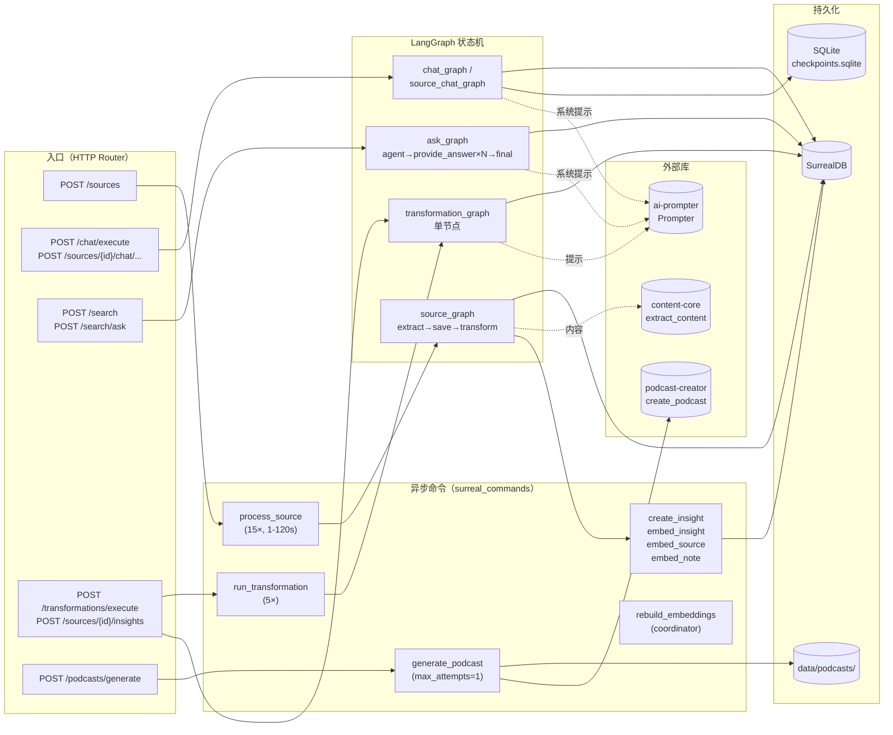

5 条流程的对照速查表：

| # | 流程 | 入口 Router | 业务图（graph） | 异步命令（command） | 默认模型类型 | 持久化主体 |
|---|------|-------------|------------------|----------------------|--------------|------------|
| 1 | Source Ingestion | `routers/sources.py` | `graphs/source.py` | `process_source` + `embed_source` + `create_insight` | stt + embedding + transformation | source / source_embedding / source_insight / reference |
| 2 | Chat（Notebook / Source） | `routers/chat.py`、`routers/source_chat.py` | `graphs/chat.py`、`graphs/source_chat.py` | （无） | chat | chat_session + SQLite checkpoint + refers_to / reference |
| 3 | Ask（搜索问答） | `routers/search.py` | `graphs/ask.py` | （无） | tools（策略/答案/最终） + embedding | 只读 source / note / source_insight；返回纯文本 |
| 4 | Transformation | `routers/transformations.py`、`routers/sources.py:/insights` | `graphs/transformation.py` | `run_transformation` + `create_insight` | transformation（回退到 chat） | source_insight |
| 5 | Podcast | `routers/podcasts.py` | （由 podcast-creator 内部编排） | `generate_podcast` | outline LLM + transcript LLM + TTS | episode + data/podcasts/episodes/{uuid}/ |

---

## 1. 流程 1：Source Ingestion

### 1.1 What / Why / When / Where

- **是什么**：把用户提供的 URL / 上传文件 / 纯文本，统一抽取出 Markdown 全文，按内容类型切块、批量嵌入、再可选地套用一组 Transformation 生成洞察（insight）。
- **为什么需要**：所有下游能力（向量检索、Chat 引用、Ask 综合、Podcast 取材）都依赖"干净的全文 + 可检索的向量 + 结构化的洞察"这三件东西同时存在；这条流程就是把异构原始素材拉齐到同一形态。
- **触发时机**：
  - 用户在前端创建 Source（`POST /sources`），分两条路径：`async_processing=true` 走异步队列，否则在 HTTP 请求线程内同步执行（5 分钟超时）。
  - 失败后从前端点 "Retry"（`POST /sources/{id}/retry`），只走异步路径。
- **结果落点**：
  - `source` 表：`asset`（文件路径/URL）、`full_text`、`title`、`topics`、`command`（指向 surreal_commands 的 job）。
  - `reference` 边表：`source -> notebook`（RELATE，由 API 在提交前预先建立）。
  - `source_embedding` 表：切块后的 chunk + 向量（每个 chunk 一行）。
  - `source_insight` 表：转换出来的洞察内容 + 后续的向量列。
  - 文件系统：上传的文件落到 `UPLOADS_FOLDER`（`open_notebook/config.py:12`）。

### 1.2 端到端序列图

```mermaid
sequenceDiagram
    autonumber
    participant FE as Frontend
    participant R as routers/sources.py<br/>create_source
    participant DB as SurrealDB
    participant SC as surreal_commands
    participant CMD as commands/source_commands.py<br/>process_source_command
    participant G as graphs/source.py<br/>source_graph
    participant CC as content_core.extract_content
    participant SRC as Source domain
    participant EC as commands/embedding_commands.py<br/>embed_source_command
    participant TC as commands/source_commands.py<br/>run_transformation_command

    FE->>R: POST /sources (form: type/notebooks/file/...)
    R->>R: save_uploaded_file → UPLOADS_FOLDER
    R->>DB: Source(title="Processing...").save()
    R->>DB: source.add_to_notebook(notebook_id) × N

    alt async_processing=true（默认）
        R->>SC: submit_command("open_notebook","process_source", input)
        SC-->>R: command_id
        R->>DB: source.command = command_id; source.save()
        R-->>FE: 200 SourceResponse(command_id, status="new")

        SC->>CMD: worker 拉到任务后执行
        CMD->>DB: 加载 source / transformations
        CMD->>G: source_graph.ainvoke(content_state, transformations, embed, source_id)

        G->>CC: extract_content(state)
        CC-->>G: ProcessSourceState{content,url,file_path,title}
        G->>DB: Source.save(asset, full_text, title)

        alt embed=true
            G->>SRC: source.vectorize()
            SRC->>SC: submit_command("open_notebook","embed_source", {source_id})
            SC->>EC: 异步执行（fire-and-forget）
            EC->>DB: 删除旧 source_embedding，切块，批量嵌入，repo_insert
        end

        G-->>CMD: result{source, transformation[]}
        CMD-->>SC: SourceProcessingOutput(success, insights_created, ...)
    else async_processing=false（同步）
        R->>SC: execute_command_sync("open_notebook","process_source", input) via asyncio.to_thread(timeout=300)
        Note over R,SC: 完整走一遍上述流程后串行返回<br/>失败会清理 source 与上传文件
        SC-->>R: result
        R->>DB: Source.get(source.id) 重新读最新状态
        R-->>FE: 200 SourceResponse(embedded_chunks)
    end

    Note over FE,DB: 状态轮询：FE 定时 GET /sources/{id}/status<br/>读 surreal_commands 的 job 状态

    opt 用户点击 Retry（仅异步、失败状态）
        FE->>R: POST /sources/{id}/retry
        R->>SC: submit_command("process_source", {..., transformations:[], embed:true})
        R->>DB: source.command = 新 command_id; save
        R-->>FE: SourceResponse(command_id, status="queued")
    end
```

### 1.3 source_graph 状态图

`open_notebook/graphs/source.py:185-200` 用 `StateGraph(SourceState)` 编排了 3 个节点。`trigger_transformations` 是一个返回 `List[Send]` 的条件边，每路 Send 会并行 fan-out 一个 `transform_content` 实例，对应每个 Transformation。

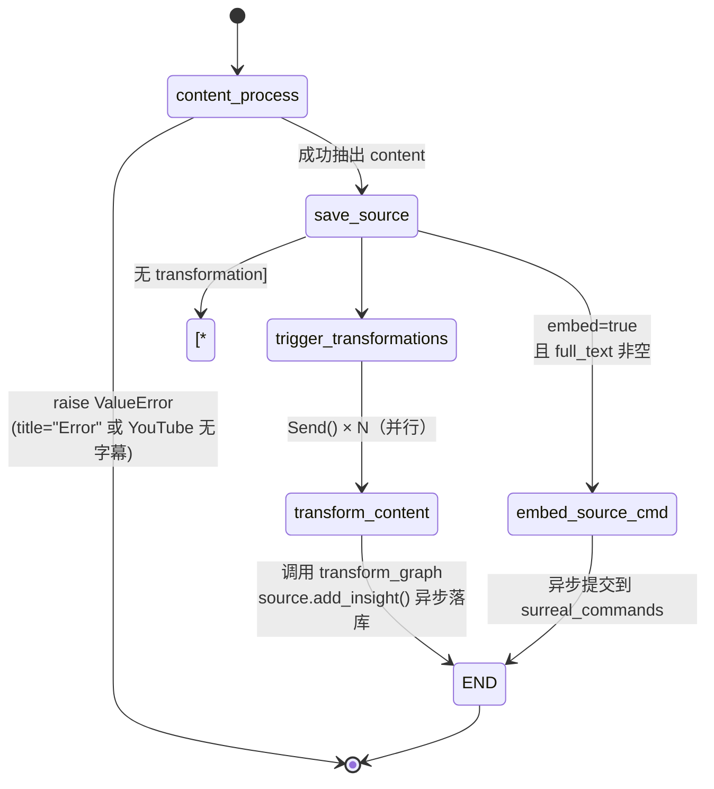

关键细节（来自 `graphs/source.py`）：

- `content_process`（`source.py:34-107`）会先从 `ContentSettings` 取引擎偏好（`auto`、youtube 偏好语言），再从 `ModelManager.get_defaults()` 取 `default_speech_to_text_model` 注入 `audio_provider/audio_model`，最后调用 `content_core.extract_content(state)`。
- 抽取失败有两种软失败需要主动 raise（`source.py:85-105`）：`title=="Error"` + 前缀 `"Failed to extract content:"`，以及 YouTube 链接无字幕的情况；这样 surreal_commands 才会把 job 标记为 `failed`，前端才能 Retry。
- `save_source`（`source.py:110-140`）只更新 `asset / full_text / title`（只在原 title 为空或 `Processing...` 时覆盖用户已填的标题），然后调用 `source.vectorize()`，**不会**重新建 `reference` 边（注释明确说明由 API 层先建以避免重复）。
- `transform_content`（`source.py:162-181`）复用 transformation_graph，落点通过 `source.add_insight()` 提交 `create_insight` 命令（fire-and-forget）。

### 1.4 切块策略

切块由 `open_notebook/utils/chunking.py` 实现，`embed_source_command`（`commands/embedding_commands.py:380-501`）按以下步骤执行：

1. `detect_content_type(full_text, file_path)`：先看扩展名映射（`.md/.html/.txt/...`），扩展名是 PLAIN 时再让启发式打分 ≥0.8 接管（`chunking.py:322-362`）。
2. 选 splitter：
   - `HTMLHeaderTextSplitter`（按 `<h1>/<h2>/<h3>`）
   - `MarkdownHeaderTextSplitter`（按 `# / ## / ###`，`strip_headers=False`）
   - `RecursiveCharacterTextSplitter`（按 `\n\n → \n → ". " → ", " → " "` 递归切）
3. `_apply_secondary_chunking`：HTML/Markdown 切完后，对每个仍超 `CHUNK_SIZE` 的块再用 plain splitter 二次切。
4. `MIN_CHUNK_SIZE` 过滤：丢掉 `< 5` token 的碎片（避免 llama.cpp 这类嵌入器返回 null 向量）。
5. 配置通过环境变量：`OPEN_NOTEBOOK_CHUNK_SIZE`（默认 400 token，留出 512-token BERT 类嵌入器的余量）、`OPEN_NOTEBOOK_CHUNK_OVERLAP`（默认 15%）、`OPEN_NOTEBOOK_MIN_CHUNK_SIZE`。

### 1.5 嵌入模型选择与批处理

- `embed_source_command` 通过 `model_manager.get_embedding_model()` 取默认 embedding 模型（`utils/embedding.py:111-206` 的 `generate_embeddings`）。
- 自动按 `OPEN_NOTEBOOK_EMBEDDING_BATCH_SIZE`（默认 50）分批，每批最多重试 `EMBEDDING_MAX_RETRIES=3` 次，间隔 `EMBEDDING_RETRY_DELAY=2s`。
- `embed_note_command` / `embed_insight_command` 使用 `generate_embedding()`（单数）：超过 `CHUNK_SIZE` 的内容会先 chunking，再 mean pooling（`embedding.py:55-108`，先单位化 → 求均值 → 再单位化）输出单一向量，落库到 `note.embedding` / `source_insight.embedding` 列。
- `embed_source_command` 的存储是分行插入：每个 chunk 在 `source_embedding` 表里对应一条 `{source, order, content, embedding}` 记录（`embedding_commands.py:453-465`）。

### 1.6 模型选择逻辑

| 节点 / 命令 | 默认模型类型 | 覆盖（override）方式 |
|-------------|--------------|----------------------|
| `content_process` 内的 audio STT | `default_speech_to_text_model`（来自 `DefaultModels`） | 直接读 `ModelManager.get_defaults()`，不接受请求级 override |
| `transform_content` | `transformation`（缺省回退到 `chat`，见 `ai/models.py`） | 通过 `RunnableConfig.configurable.model_id`；Source Ingestion 路径下用户不直接传，由 `apply_transformations` 关联的 Transformation 默认值决定 |
| `embed_source/note/insight` | `embedding`（`model_manager.get_embedding_model()`） | 不接受 override，全局唯一 |

### 1.7 数据落点表

| 写入目标 | 写入者 | 关键字段 | 备注 |
|----------|--------|----------|------|
| `source` | `routers/sources.py:create_source`（先建占位记录）+ `graphs/source.py:save_source`（更新内容） | id, title, topics, asset, full_text, command | `command` 字段持久化为 RecordID（`_prepare_save_data` 强制） |
| `reference`（边） | `Source.add_to_notebook()` | in=source, out=notebook | 由 router 在提交命令前先建，避免重复 |
| `source_embedding` | `embed_source_command` | source, order, content, embedding | 每次先 DELETE 再 INSERT（幂等） |
| `source_insight` | `create_insight_command` | source, insight_type, content, embedding | 由 `source.add_insight()` 提交命令 |
| `command`（surreal_commands） | `submit_command` | command_id, status, error_message | 挂到 `source.command` 字段方便前端轮询 |
| 文件系统 `data/uploads/` | `save_uploaded_file` | file_path | 失败时由 router 负责清理 |

### 1.8 错误与重试策略

- `process_source` 命令（`commands/source_commands.py:49-60`）：`max_attempts=15`，`wait_strategy="exponential_jitter"`，`wait_min=1, wait_max=120`，`stop_on=[ValueError, ConfigurationError]`。15 次重试是为了应对 SurrealDB v2 的事务冲突（deep queue workaround）。
- 永久失败时 `raise ValueError`（而不是返回 `success=False`），这一点很重要：`is_success()` 看的是 job 状态而不是 payload，只有 raise 才能让 job 进入 `failed` 状态、UI 上出现 Retry 按钮（`source_commands.py:141-149` 注释）。
- `embed_source/note/insight`：`max_attempts=5`，1-60s 指数抖动；`stop_on` 同上。
- `create_insight`：5 次重试，单独封装是为了缓解并行 Transformation 同时写 `source_insight` 的事务冲突。
- 同步路径：`asyncio.to_thread(execute_command_sync, ..., timeout=300)`（`routers/sources.py:485-491`）；失败时 router 会清理 `source` 记录和上传文件。
- 所有永久失败都会清理上传文件（`os.unlink(file_path)`），见 `routers/sources.py:444-448、500-505、546-550、572-576`。

### 1.9 Gotcha

- **同步路径在 HTTP 线程里跑 `execute_command_sync`**：因为 surreal_commands 内部用了 `asyncio.run()`，会与 FastAPI 已有的事件循环冲突，所以包了一层 `asyncio.to_thread`（`sources.py:482-491`）。
- **`process_source` 返回 `embedded_chunks=0`**：嵌入是 fire-and-forget，命令返回时还没真正写完，所以这里写死 0；UI 需要轮询 `source_embedding` 的 count（`commands/source_commands.py:117-122`）。
- **YouTube 无字幕的 sentinel**：content-core 返回的标题是 `"Error"`、内容前缀 `"Failed to extract content:"`，必须主动 raise 才能进入可重试状态（`graphs/source.py:85-105`）。
- **`source.vectorize()` 不等待**：它只是 `submit_command("embed_source")`，返回 command_id（`domain/notebook.py:477-523`）。整个 Source Ingestion 实际上是"两层异步"：API 提交 `process_source` 命令 → 里面再提交 `embed_source` 命令。
- **上传文件路径校验**：`save_uploaded_file` 用 `os.path.basename` 防穿越，再校验 `resolved.startswith(uploads_root + os.sep)`（`routers/sources.py:65-70`、`338-344`）。

---

## 2. 流程 2：Chat（Notebook 对话 + Source 对话）

Open Notebook 的 Chat 实际上有两个独立 graph：

- **Notebook Chat**（`graphs/chat.py`）：在 Notebook 上下文里多轮对话，session 通过 `refers_to` 关联到 Notebook。
- **Source Chat**（`graphs/source_chat.py`）：聚焦单个 Source，每次回答前用 `ContextBuilder` 现场组装"全文 + insights"上下文。

### 2.1 What / Why / When / Where

- **是什么**：基于 LangGraph + `SqliteSaver` 的有状态多轮对话；用户消息 + 上下文 → LLM → AI 消息，所有消息持久化到本地 SQLite checkpoint 文件。
- **为什么需要**：Chat 是用户与研究材料"互动"的主要入口，必须保留历史、支持引用、能在前端实时流式返回。
- **触发时机**：
  - 前端先 `POST /chat/sessions` 或 `POST /sources/{id}/chat/sessions` 建立 ChatSession（在 DB 里建一条记录，关联 Notebook/Source）。
  - 然后 `POST /chat/execute`（Notebook）或 `POST /sources/{id}/chat/sessions/{sid}/messages`（Source，SSE）。
- **结果落点**：
  - `chat_session` 表：标题、`model_override`、`created/updated`。
  - SQLite `LANGGRAPH_CHECKPOINT_FILE`（`data/sqlite-db/checkpoints.sqlite`）：所有消息原文。
  - `refers_to` 边表（Notebook Chat）/ `refers_to` 边（Source Chat 指向 source，`source_chat.py:112`）。

### 2.2 端到端序列图（Notebook Chat）

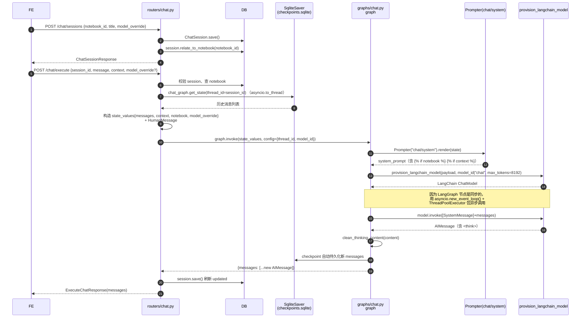

### 2.3 Notebook Chat 状态图

`graphs/chat.py:94-98` 编译出来的 graph 极简：

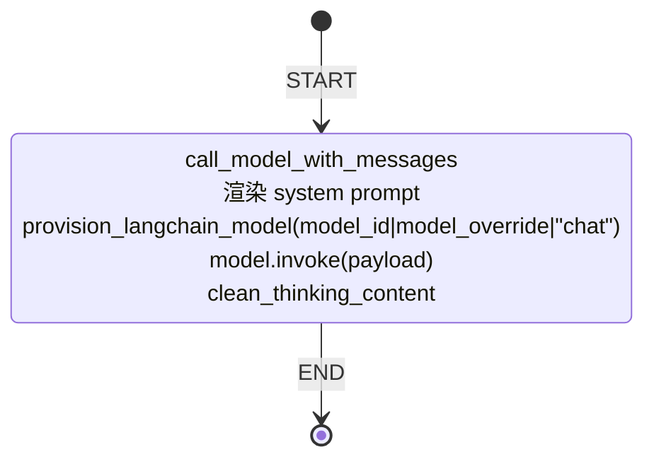

### 2.4 Source Chat 端到端与状态图

Source Chat 的差异在于 graph 节点里多了一步"现场组装上下文"：

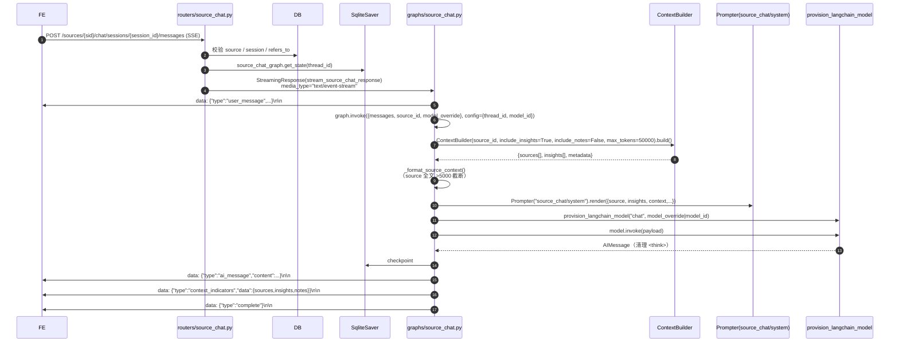

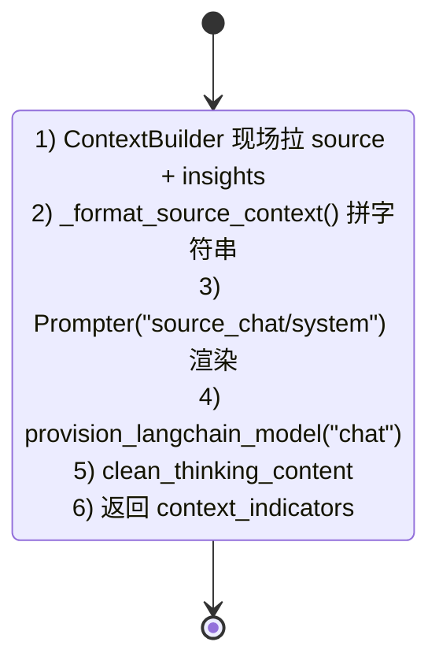

### 2.5 工具与依赖

- **没有 ToolNode**：尽管 `CLAUDE.md` 提到 tools，但当前 `graphs/chat.py` 与 `graphs/source_chat.py` 都没有 `bind_tools()` 调用——Chat 是纯 prompt + history，Ask 才是真正用"模型生成 JSON 策略"的方式（不是 LangChain tools）。
- 唯一的工具痕迹在 `graphs/ask.py:64` 注释掉的 `# model = model.bind_tools(tools)`。
- `graphs/tools.py` 当前只暴露 `get_current_timestamp()`（CLAUDE.md 说明）。

### 2.6 数据落点表

| 写入目标 | 写入者 | 关键字段 | 备注 |
|----------|--------|----------|------|
| `chat_session` 表 | `routers/chat.py:create_session`、`routers/source_chat.py:create_source_chat_session` | id, title, model_override, created, updated | 通过 `relate_to_notebook` 或 `relate("refers_to", source_id)` 关联 |
| SQLite checkpoint | LangGraph `SqliteSaver`（`graphs/chat.py:88-92`，`graphs/source_chat.py:243-248`） | thread_id → messages[] | `LANGGRAPH_CHECKPOINT_FILE = data/sqlite-db/checkpoints.sqlite`；`check_same_thread=False` |
| SSE 流 | `stream_source_chat_response`（`routers/source_chat.py:417-480`） | type=user_message / ai_message / context_indicators / complete / error | Notebook Chat 没有走 SSE，只在 `POST /chat/execute` 同步返回 |

### 2.7 模型选择

- Notebook Chat（`graphs/chat.py:30-86`）：
  - 优先级：`config.configurable.model_id` > `state.model_override` > `provision_langchain_model(default_type="chat")` 的默认 chat 模型。
  - `max_tokens=8192`；如果 payload > 105k tokens，`provision_langchain_model` 会自动切到 `large_context_model`（`ai/provision.py:23-28`）。
- Source Chat：同样优先 `configurable.model_id` > `state.model_override`，再走 `"chat"` 默认；`max_tokens=8192`。
- 用户层 override 透传：
  - `routers/chat.py:execute_chat`（`chat.py:354-389`）：`request.model_override` > `session.model_override`，然后作为 `config.configurable.model_id` 传给 graph。
  - `routers/source_chat.py:send_message_to_source_chat`（`source_chat.py:526-541`）：同样的优先级。

### 2.8 Gotcha

- **Async-in-sync 体操**：LangGraph 节点是 sync，但 `provision_langchain_model` 是 async。代码用 `asyncio.new_event_loop()` + `concurrent.futures.ThreadPoolExecutor` 包了一层（`graphs/chat.py:39-71`，`graphs/source_chat.py:134-171`）。这种写法对正在运行的事件循环敏感。
- **Notebook Chat 不流式**：`POST /chat/execute` 同步返回完整消息列表，只有 Source Chat 走 SSE。前端要做"打字机效果"需要自己处理（或后续改造 `astream`）。
- **`get_state` 是同步调用**：SqliteSaver 没有 async 实现，所有 router 用 `asyncio.to_thread(chat_graph.get_state, ...)` 包装（`routers/chat.py:363-366`、`routers/source_chat.py:424-427`）。
- **Session 与 messages 分离**：`chat_session` 表只存元数据；消息原文 100% 在 SQLite checkpoint。删除 session 不会自动清 checkpoint。
- **`context_indicators`**：Source Chat 在 state 里追加 `{sources, insights, notes}` 的 ID 数组，前端用来展示"这次回答引用了哪些材料"。
- **`clean_thinking_content`**：对支持 `<think>...</think>` 的模型（GPT-5、DeepSeek-R1 等）会剥掉思考段，只把最终回答写回 message。
- **引用提示**：`prompts/chat/system.jinja` 和 `prompts/source_chat/system.jinja` 都反复强调 `[source:id]/[note:id]/[insight:id]` 格式，并给示例 ID，是为了抑制 LLM 捏造 ID（`prompts/CLAUDE.md` 第 3 条）。

---

## 3. 流程 3：Ask（检索问答）

### 3.1 What / Why / When / Where

- **是什么**：用户问一个问题 → LLM 生成搜索策略（多个 term + instructions）→ 每个 term 做向量检索 + 子答案 → 最终 LLM 合成带引用的答案。
- **为什么需要**：与 Chat 的区别——Chat 是"对话 + 用户已选上下文"，Ask 是"系统主动跨整个知识库检索"。Ask 模式更像 RAG：模型决定怎么搜，搜完再合成。
- **触发时机**：`POST /search/ask`（流式）或 `POST /search/ask/simple`（一次性）；底层都是 `ask_graph.astream(stream_mode="updates")`。
- **结果落点**：**不写库**。Ask 是只读流程，只返回最终答案文本（和中间步骤事件）。

### 3.2 端到端序列图

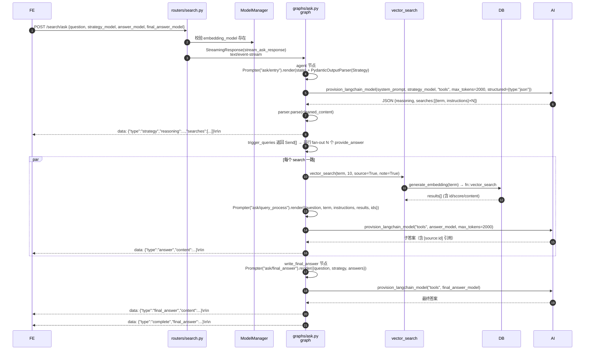

### 3.3 ask_graph 状态图

`graphs/ask.py:146-155` 定义 3 个节点，其中 `agent → provide_answer` 是条件边，通过返回 `List[Send]` 实现并行扇出。

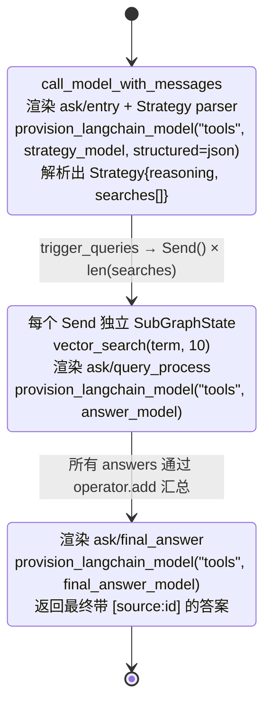

注意：

- `ThreadState.answers: Annotated[list, operator.add]`（`ask.py:47`）：每个 `provide_answer` 返回 `{"answers": [str]}`，LangGraph 自动 concat。
- `SubGraphState` 与 `ThreadState` 共享字段（question、instructions、term、results），`Send` 的 payload 是 SubGraphState 的子集。

### 3.4 检索策略与引用注入

- **只做向量检索**（`graphs/ask.py:104`）：`vector_search(state["term"], 10, True, True)`，不重排（no rerank）、不混合检索。`text_search` 那一行被注释掉了（`ask.py:101-102`）。
- **向量检索实现**（`domain/notebook.py:738-768`）：
  - `generate_embedding(keyword)` 把查询转成向量（支持查询超过 CHUNK_SIZE 时的 mean pooling）。
  - 调用 SurrealDB 自定义函数 `fn::vector_search($embed, $results, $source, $note, $minimum_score)`，默认 `minimum_score=0.2`。
- **引用注入**：
  - `ask/query_process.jinja` 在 prompt 里直接给出本次查询的 `ids` 列表（`prompts/ask/query_process.jinja:48-51`），并强调"如果你引用某个文档，必须是这些 ID 之一"。
  - 子答案带 `[source:id]/[note:id]/[insight:id]` 引用，最终合成时 `ask/final_answer.jinja` 再次强调"Do not make up documents or document ids"。
- 前端最终通过正则把 `[source:id]` 渲染成可点击的 chip（`c993c60` 提交实现了 insight 引用的点击化）。

### 3.5 数据落点表

| 写入目标 | 写入者 | 关键字段 | 备注 |
|----------|--------|----------|------|
| （无） | — | — | Ask 流程不写任何表；结果通过 SSE 或 HTTP response 直接返回 |

读操作：
- `fn::vector_search`（`domain/notebook.py:753-763`）读 `source / note / source_insight` 的 `embedding` 列。

### 3.6 模型选择

Ask 的三段式允许用户在请求里指定 3 个不同模型（`routers/search.py:117-136` 校验全部存在）：

| 节点 | 默认类型 | 请求字段 | 备注 |
|------|---------|----------|------|
| `agent`（策略生成） | `tools`（缺省回退 chat） | `strategy_model` | `max_tokens=2000`，`structured={type:"json"}` 强制 JSON 输出 |
| `provide_answer`（子答案） | `tools` | `answer_model` | `max_tokens=2000` |
| `write_final_answer` | `tools` | `final_answer_model` | `max_tokens=2000` |
| 查询嵌入 | `embedding` | （全局唯一） | 在 `vector_search` 内部使用 |

### 3.7 Gotcha

- **`text_search` 不可达**：`ask.py:101-102` 注释掉了 text 路径，Ask 完全依赖嵌入向量，没有 embedding 模型会直接报 400（`routers/search.py:139-143`）。
- **`text_search` 自身的 fallback**：当 SurrealDB 的 `search::highlight` 触发 "position overflow"（多字节字符），`text_search` 会回退到 `vector_search`，两个都失败则 raise `DatabaseOperationError`，不返回空列表（`domain/notebook.py:710-731`）。
- **`stream_mode="updates"`**：每个节点完成才推送一次 chunk（不是 token 级流式）。如果需要 token 级，要改成 `stream_mode="messages"` 或 `values`。
- **3 个模型字段必须全部带在请求里**：前端如果只传 `strategy_model` 会被 400 拒绝（`routers/search.py:117-136`）。
- **没有 checkpoint**：Ask 不挂 `SqliteSaver`，每次都是无状态运行；不能像 Chat 那样续问。

---

## 4. 流程 4：Transformation

### 4.1 What / Why / When / Where

- **是什么**：用户自定义一段 Jinja2 prompt（"Transformation"），对一段文本或某个 Source 的全文执行 LLM 转换，输出可以直接返回给用户，也可以作为 `source_insight` 落库。
- **为什么需要**：把"重复使用的提示"（摘要、提取关键概念、生成 FAQ 等）沉淀为可命名的资源，避免每次 chat 都重写。
- **触发时机**：
  - **同步**：`POST /transformations/execute`（`routers/transformations.py:81-118`），输入 `input_text + transformation_id + model_id`，**只返回结果不落 insight**。
  - **异步落 insight**：`POST /sources/{source_id}/insights`（`routers/sources.py:1001-1053`），提交 `run_transformation` 命令。
  - **Source Ingestion 时自动跑**：`source_graph.transform_content`（`graphs/source.py:162-181`）会为每个 `apply_default=true` 的 Transformation 生成 insight。
- **结果落点**：
  - `source_insight` 表（仅当 graph 收到 `source` 参数时，`graphs/transformation.py:58-59`）。
  - 同步 `/transformations/execute` 不写库，只返回 `output`。

### 4.2 端到端序列图（异步 Insight 生成）

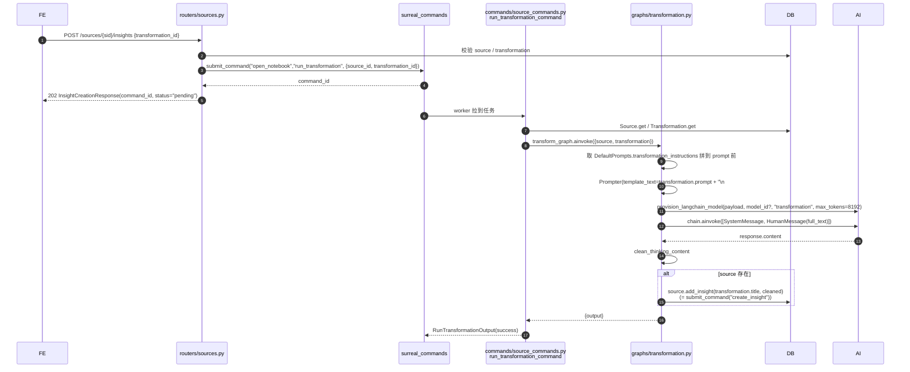

### 4.3 transformation_graph 状态图

`graphs/transformation.py:71-75` 只有一个节点：

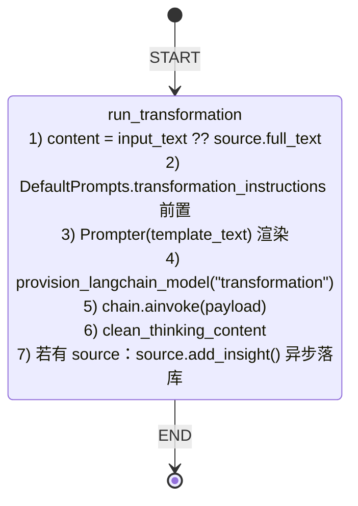

### 4.4 模板来源与组合

- Transformation 自身的 prompt：`Transformation.prompt` 字段（`domain/transformation.py:8-15`），由用户在前端编辑。
- 全局前置指令：`DefaultPrompts.transformation_instructions`（单例 `open_notebook:default_prompts`，`routers/transformations.py:121-156` 提供编辑接口）。
- 拼接顺序（`graphs/transformation.py:34-42`）：
  ```text
  {DefaultPrompts.transformation_instructions}

  {Transformation.prompt}

  # INPUT
  ```
- 渲染时 `Prompter(template_text=...)` 用 `data=state`，意味着模板里可以直接引用 `{{ input_text }}`、`{{ source.title }}` 等变量。
- 内置模板目录 `prompts/` 没有给 transformation 用——它不像 chat/ask/podcast 那样有预制模板，所有 transformation 都是用户自创。

### 4.5 安全（SSTI 防护）

- **Prompter 用 Jinja2 的 SandboxedEnvironment**（`ai_prompter` 库内部默认）：不允许访问以 `_` 开头的属性、禁用 `import` 之类。
- 同步路径 `/transformations/execute` 接受 `input_text`，**不接受** `source_id`，所以不会无意中改库；用户明确要走 insight 流程必须走 `/sources/{id}/insights`。
- `DefaultPrompts` 是 RecordModel 单例，只有一个全局 instruction 字段，没有多租户隔离——所有用户共享同一份前置指令。

### 4.6 输出落点

| 入口 | 节点写库 | 用户看到 |
|------|----------|----------|
| `POST /transformations/execute` | 否 | `output` 文本（直接返回） |
| `POST /sources/{id}/insights` | 是（`source.add_insight` → `create_insight` 命令 → `embed_insight` 命令） | `202 + command_id`，前端轮询 `GET /sources/{id}/insights` |
| `source_graph.transform_content`（Ingestion 时） | 是 | 创建 `source_insight` 行 |

### 4.7 模型选择

- `run_transformation` 节点：`provision_langchain_model(payload, config.configurable.model_id, "transformation", max_tokens=8192)`。
- `routers/transformations.py:96-102` 把请求的 `model_id` 放进 `config.configurable.model_id`。
- 默认 fallback：`ModelManager.get_default_model("transformation")` 会回退到 `default_chat_model`（CLAUDE.md 第 "Fallback chain specificity" 条）。

### 4.8 错误与重试

- `run_transformation` 命令：`max_attempts=5`，`wait_strategy="exponential_jitter"`，`wait_min=1, wait_max=60`，`stop_on=[ValueError, ConfigurationError]`（`commands/source_commands.py:180-190`）。
- graph 节点内部：所有异常都过 `classify_error(e)` → 转成 `OpenNotebookError` 子类 → 被 FastAPI 全局 handler 映射成 HTTP 401/422/429/502 等（`graphs/transformation.py:64-68`）。
- Permanent failure（`ValueError`）返回 `success=False` 的 `RunTransformationOutput`，不重试；其他异常 raise 让 surreal_commands 重试。

### 4.9 Gotcha

- **同一 Transformation 不同入口的行为不同**：`/transformations/execute` 不写库，`/sources/{id}/insights` 写 insight，`source_graph` 内部也写 insight。前端要根据场景选入口。
- **DefaultPrompts 单例**：全局只有一份 transformation_instructions，改了影响所有 Transformation。
- **`input_text` 与 `source` 二选一**：`run_transformation` 节点 assert `source or content`，否则直接 AssertionError（`graphs/transformation.py:27`）——这是 500 错误不是 400，未来可以改成 `InvalidInputError`。
- **Ingestion 时的 Transformation**：`source_graph` 把所有 `apply_transformations` 列表里的都跑一遍，并发提交 `create_insight`；如果其中一个 Transformation 的 prompt 出错，整个 `process_source` 命令会失败、整个 Source 进入 Retry 状态。

---

## 5. 流程 5：Podcast 生成

### 5.1 What / Why / When / Where

- **是什么**：基于 `podcast-creator` 库的端到端播客生成：outline（大纲） → transcript（分角色对话脚本） → TTS（合成音频）。Open Notebook 自己不实现这些节点，而是把 Episode/Speaker Profile 解析好、credentials 注入好后，一次性 `await create_podcast(...)`。
- **为什么需要**：长内容（论文、报告）以音频形式被"听"完，需要专业的多角色对话而非单一 TTS 朗读。
- **触发时机**：
  - `POST /podcasts/generate`（`routers/podcasts.py:41-69`）：用户指定 episode_profile + speaker_profile + 内容/notebook_id。
  - `POST /podcasts/episodes/{id}/retry`（`routers/podcasts.py:215-269`）：删除失败 episode，重新提交。
- **结果落点**：
  - `episode` 表：完整快照（profile、briefing、content、transcript、outline、audio_file 路径、command）。
  - 文件系统：`data/podcasts/episodes/{uuid}/`（UUID 目录名，避免用户输入的特殊字符）。
  - `command` 表（surreal_commands）：job 状态。

### 5.2 端到端序列图

```mermaid
sequenceDiagram
    autonumber
    participant FE
    participant R as routers/podcasts.py
    participant SVC as api/podcast_service.py
    participant DB
    participant SC as surreal_commands
    participant CMD as commands/podcast_commands.py<br/>generate_podcast_command
    participant EP as EpisodeProfile / SpeakerProfile
    participant PC as podcast_creator.create_podcast

    FE->>R: POST /podcasts/generate {episode_profile, speaker_profile, episode_name, content?, notebook_id?}
    R->>SVC: submit_generation_job(...)
    SVC->>DB: EpisodeProfile.get_by_name / SpeakerProfile.get_by_name
    SVC->>DB: 取 notebook context 作为 content（如果没给 content）
    SVC->>SC: submit_command("open_notebook","generate_podcast", args)
    SC-->>SVC: job_id
    SVC-->>R: job_id
    R-->>FE: 200 PodcastGenerationResponse(status="submitted")

    SC->>CMD: worker 拉到任务
    CMD->>DB: 加载 episode_profile / speaker_profile
    CMD->>EP: 校验 outline_llm / transcript_llm / voice_model 全部已配置
    CMD->>EP: resolve_outline_config / resolve_transcript_config / resolve_tts_config<br/>(每路：Model.get → credential.to_esperanto_config() 或 provision_provider_keys)

    CMD->>DB: SELECT * FROM episode_profile / speaker_profile（podcast-creator 校验所有 profile）
    loop 每个 profile
        CMD->>EP: _resolve_model_config(outline_llm/transcript_llm/voice_model)
        opt 失败
            CMD->>CMD: 从 dict 中删除该 profile，避免 podcast-creator 抛错
        end
    end

    CMD->>DB: PodcastEpisode(name, episode_profile, speaker_profile, briefing, content, command).save()
    CMD->>PC: configure("speakers_config", ...); configure("episode_config", ...)
    CMD->>PC: create_podcast(content, briefing, episode_name=uuid, output_dir, speaker_config, episode_profile)
    PC-->>CMD: {final_output_file_path, transcript, outline}

    CMD->>DB: episode.audio_file / transcript / outline 更新；save()
    CMD-->>SC: PodcastGenerationOutput(success, episode_id, audio_file_path,...)

    FE->>R: GET /podcasts/jobs/{job_id} 或 GET /podcasts/episodes
    R->>SC: get_command_status(job_id)
    R-->>FE: status, result, error_message

    FE->>R: GET /podcasts/episodes/{id}/audio
    R-->>FE: FileResponse(audio_path, audio/mpeg)
```

### 5.3 命令状态机

`generate_podcast_command` 是一条单命令，内部没有显式状态机；但可以从代码（`commands/podcast_commands.py:69-300`）抽出隐式状态：

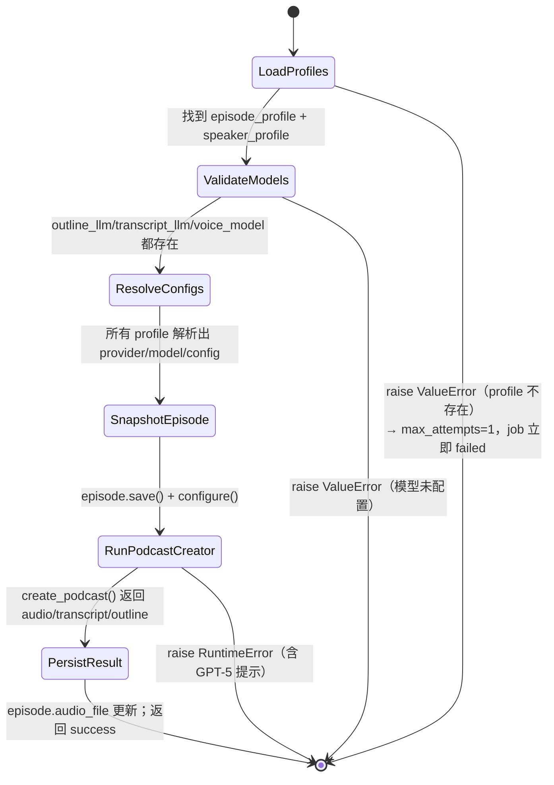

### 5.4 Episode Profile 与 Speaker Profile 的角色

- **EpisodeProfile**（`open_notebook/podcasts/models.py:32-123`）：
  - `outline_llm` / `transcript_llm`：`record<model>` 引用，分别给大纲和对话脚本用不同 LLM。
  - `speaker_config`：字符串，指向 SpeakerProfile.name。
  - `default_briefing`：默认的"创作要求"模板。
  - `num_segments`：3-20 段（Pydantic 验证）。
  - `language`：BCP 47 locale（如 `pt-BR`），决定 podcast-creator 的输出语言。
- **SpeakerProfile**（`models.py:126-199`）：
  - `voice_model`：默认 TTS 模型引用。
  - `speakers[]`：1-4 个说话人，每个含 `name, voice_id, backstory, personality`，可独立 `voice_model` 覆盖。
- **`_resolve_model_config(model_id)`**（`models.py:11-29`）：把模型 ID 解析成 `(provider, name, config_dict)`，优先用 `credential.to_esperanto_config()`，没 credential 时 fallback 到 `provision_provider_keys()`。

### 5.5 长内容分块与多 voice TTS

- Open Notebook 本身**不实现分块**：把 `content` 原样传给 `podcast_creator.create_podcast`，由库内部决定如何按 segment 切分、每个 segment 调用 transcript LLM、再合并多 segment 的 transcript。
- 从 `prompts/podcast/transcript.jinja` 可以看到 podcast-creator 的调用模式：
  - 每个 segment 单独调一次 transcript LLM（`` 传入之前 segment 已生成的内容做衔接）。
  - `` 让最后一段必须收尾。
  - `` 走独白模式，强制只出现一个 speaker name。
- TTS：podcast-creator 根据每段 transcript 的 `speaker` 字段查 SpeakerProfile 的 `voice_id`，用 `voice_model` 指定的 TTS 合成，最后拼接成完整 mp3。

### 5.6 数据落点表

| 写入目标 | 写入者 | 关键字段 | 备注 |
|----------|--------|----------|------|
| `episode` 表 | `commands/podcast_commands.py:216-263` | id, name, episode_profile, speaker_profile, briefing, content, audio_file, transcript, outline, command | `episode_profile/speaker_profile` 是 dict 快照，避免 profile 后续修改影响历史 episode |
| 文件系统 `data/podcasts/episodes/{uuid}/` | podcast-creator | final_output_file_path（mp3）+ 中间片段 | UUID 目录名规避用户输入的特殊字符 |
| `command` 表（surreal_commands） | `submit_command` | status, result, error_message | max_attempts=1，无自动重试 |

### 5.7 模型选择

| 阶段 | 模型来源 | 配置方式 |
|------|----------|----------|
| Outline LLM | `EpisodeProfile.outline_llm` | `episode_profile.resolve_outline_config()` |
| Transcript LLM | `EpisodeProfile.transcript_llm` | `episode_profile.resolve_transcript_config()` |
| TTS | `SpeakerProfile.voice_model` 或 per-speaker `voice_model` | `speaker_profile.resolve_tts_config()` |

所有模型都从 `Model` 表加载，如果 `Model.credential` 有值则用 `credential.to_esperanto_config()`，否则 fallback 到 `provision_provider_keys(provider)` 注入 env var。这套逻辑统一由 `_resolve_model_config`（`podcasts/models.py:11-29`）封装。

### 5.8 错误与重试策略

- **`max_attempts=1`**（`commands/podcast_commands.py:69`）：故意不重试，防止产生重复 episode 记录；用户必须手动 `POST /podcasts/episodes/{id}/retry`。
- **Retry 端点的语义**（`routers/podcasts.py:215-269`）：
  - 先校验当前状态必须是 `failed` 或 `error`。
  - 删除磁盘 audio（如果有）。
  - 删除 episode 数据库记录。
  - 用原 `episode_profile.name / speaker_profile.name / episode_name / content` 重新提交命令。
- **GPT-5 extended thinking 特殊处理**（`podcast_commands.py:292-298`）：如果错误信息包含 `"Invalid json output"` 或 `"Expecting value"`，会在异常 message 后追加提示，建议换 `gpt-4o/gpt-4o-mini/gpt-4-turbo`。这是因为 GPT-5 类模型把所有输出塞进 `<think>` 标签后，外面没有可解析的 JSON。
- **静默音频 fallback**：不在 Open Notebook 代码里，而是 `podcast-creator` 库内部行为——TTS 失败时插入静音片段，保证最终 mp3 时长正确（CLAUDE.md 根文档说明）。
- **Profile 解析失败的"剔除"策略**（`podcast_commands.py:151-193`）：`podcast-creator` 的 `configure("episode_config", ...)` 会校验所有 profile 而不只是当前用的那个，所以 Open Notebook 主动把无法解析 `_resolve_model_config` 的 profile 从 dict 里删掉，避免无关 profile 的配置错误阻塞当前 episode。

### 5.9 Gotcha

- **`max_attempts=1`**：失败后立刻标记为 failed，必须用户手动 Retry；自动重试会因 episode 已写入而产生重复行。
- **Episode Profile 快照**：`episode.episode_profile` 是 dict，不是引用——profile 后续修改不会影响历史 episode，但也意味着"想更新老 episode 的配置"必须重新生成。
- **`briefing_suffix` 拼接**：`briefing = default_briefing + "\n\nAdditional instructions: " + suffix`（`podcast_commands.py:211-213`），不要在 suffix 里写 Markdown 标题，会污染 outline LLM。
- **`audio_file` 可能是 `file://` URI**：`_resolve_audio_path`（`routers/podcasts.py:34-38`）会先 strip `file://` 再 unquote，前端直接拿 path 用会出错。
- **profile 数量上限**：`SpeakerProfile.speakers` 必须 1-4 个，Pydantic validator 在写库前拦截（`podcasts/models.py:158-169`）。
- **`language` 字段**：BCP 47 locale（`pt-BR`、`en-US`），不是展示名；前端要提供下拉（`routers/languages.py` 用 pycountry+babel 生成）。
- **目录名用 UUID 而非 episode_name**：`build_episode_output_dir`（`podcast_commands.py:26-37`）规避了用户在 `episode_name` 里输入空格/中文/特殊字符导致文件系统问题。

---

## 6. 共性机制汇总

### 6.1 `RunnableConfig` 的 override 模式

LangGraph 的 `RunnableConfig` 在 Open Notebook 里几乎只用来传"模型 ID"：

```python
# 典型用法（graphs/ask.py:57-63 等）
config.get("configurable", {}).get("model_id")  # 或 strategy_model/answer_model/final_answer_model
```

优先级（在 `provision_langchain_model` + 各 router 中形成）：

1. 请求级 `model_override`（HTTP body）
2. Session 级 `model_override`（chat_session 表）
3. `config.configurable.model_id`（router 显式塞入）
4. `state.model_override`（graph state）
5. `default_type` 对应的 `DefaultModels` 默认值
6. 如果 content > 105k tokens：强制使用 `large_context_model`（覆盖以上所有）

### 6.2 `SqliteSaver` checkpoint

- 定义位置：`graphs/chat.py:88-98`、`graphs/source_chat.py:243-255`。
- 文件路径：`LANGGRAPH_CHECKPOINT_FILE = data/sqlite-db/checkpoints.sqlite`（`open_notebook/config.py:9`）。
- 连接：`sqlite3.connect(..., check_same_thread=False)`，单连接跨线程共享。
- Thread_id：完整 session ID（含 `chat_session:` 前缀），router 在 `config.configurable.thread_id` 里传入。
- 读取历史：`chat_graph.get_state(config=...)` 是同步方法，router 用 `asyncio.to_thread` 包装。
- **Ask、Source Ingestion、Transformation、Podcast 都不用 checkpoint**——它们要么无状态，要么通过 surreal_commands 的 job 状态跟踪。

### 6.3 SSE 流式

Open Notebook 在两处用 SSE：

| 位置 | 事件类型 | 备注 |
|------|----------|------|
| `routers/source_chat.py:stream_source_chat_response`（417-480） | `user_message` / `ai_message` / `context_indicators` / `complete` / `error` | 整段消息一次推送（不是 token 级） |
| `routers/search.py:stream_ask_response`（61-110） | `strategy` / `answer` / `final_answer` / `complete` / `error` | `stream_mode="updates"`，每节点完成才推 |

两个端点都设置：
```python
return StreamingResponse(
    generator(),
    media_type="text/event-stream",
    headers={
        "Cache-Control": "no-cache",
        "Connection": "keep-alive",
        "X-Accel-Buffering": "no",  # 关键：禁用 nginx 缓冲
    },
)
```

错误事件统一走 `classify_error(e)` → 把 user-friendly message 放进 `data: {"type":"error","message":...}`。

### 6.4 `submit_command`（surreal_commands）

封装在 `api/command_service.py:CommandService.submit_command_job` 里：

```python
import commands.podcast_commands  # noqa: F401  ← 必须先 import 注册命令
cmd_id = submit_command("open_notebook", command_name, args)
```

关键点：
- **必须先 import 命令模块**：`submit_command` 会去本地 registry 校验命令存在，没 import 会报"command not registered"（`command_service.py:21-25`、`sources.py:395-396、458-459`）。
- **App name 固定为 `"open_notebook"`**：所有命令都注册在这个 namespace 下。
- **返回的是 RecordID**：转 str 后即可作为 `source.command`、`episode.command` 持久化。
- **同步 vs 异步**：
  - 异步：`submit_command(...)` 立即返回 command_id，worker 异步执行。
  - 同步：`execute_command_sync(...)`（内部 `asyncio.run`），用在 Source Ingestion 的同步路径，需要 `asyncio.to_thread` 包一层避免与 FastAPI 事件循环冲突。

### 6.5 模型选择决策表

| 流程 | 节点 / 角色 | 默认类型 | Override 字段 |
|------|-------------|----------|----------------|
| Source Ingestion | STT（content-core） | `speech_to_text` | 全局 DefaultModels，不接受 per-request |
| Source Ingestion | Transformation（生成 insight） | `transformation` | `apply_transformations` 关联的 Transformation 默认 |
| Source Ingestion | Embedding | `embedding` | 全局唯一，不接受 override |
| Chat（Notebook/Source） | 对话 LLM | `chat` | `session.model_override` 或 request `model_override` |
| Ask | 策略 LLM | `tools` | request `strategy_model` |
| Ask | 子答案 LLM | `tools` | request `answer_model` |
| Ask | 最终合成 LLM | `tools` | request `final_answer_model` |
| Ask | 查询嵌入 | `embedding` | 全局唯一 |
| Transformation | 转换 LLM | `transformation` | request `model_id`（仅同步入口） |
| Podcast | Outline LLM | — | `EpisodeProfile.outline_llm` |
| Podcast | Transcript LLM | — | `EpisodeProfile.transcript_llm` |
| Podcast | TTS | — | `SpeakerProfile.voice_model` 或 per-speaker override |

### 6.6 错误分类（`classify_error`）

所有 graph 节点都遵循同一模式：

```python
try:
    result = await model.ainvoke(...)
except OpenNotebookError:
    raise  # 已经是 typed error，直接 raise
except Exception as e:
    error_class, user_message = classify_error(e)
    raise error_class(user_message) from e
```

`classify_error` 用关键字匹配把 raw provider 异常映射成：
- `AuthenticationError` → 401
- `ConfigurationError` → 422（如 model name 写错）
- `RateLimitError` → 429
- `NetworkError` → 502
- `ExternalServiceError` → 502
- `NotFoundError` → 404
- `InvalidInputError` → 400
- `OpenNotebookError`（基类）→ 500

FastAPI 全局 handler（`api/main.py`）负责把这些异常转成带 CORS header 的 JSON 响应；前端 `lib/utils/error-handler.ts` 会优先 i18n 映射，回退到展示后端 message。

---

## 7. Gotcha 汇总（跨流程）

### 7.1 异步与同步

- **Chat / Ask / Transformation（同步入口）**：HTTP 请求内直接 `graph.invoke` 或 `graph.astream`，阻塞直到完成（Chat 可能很久，注意前端 httpx 超时设 10 分钟，`api/chat_service.py:138`）。
- **Source Ingestion（异步默认 / 同步可选）**：异步路径两层 surreal_commands（`process_source` 提交 `embed_source`）；同步路径 `execute_command_sync(timeout=300)`，失败清理上传文件。
- **Podcast（纯异步）**：因为生成可能几分钟到十几分钟，必须异步；命令 `max_attempts=1`，不自动重试。
- **Insight 生成（纯异步）**：`POST /sources/{id}/insights` 返回 202 + command_id，前端轮询 `GET /sources/{id}/insights`。

### 7.2 Checkpoint 与状态

- **只有 Chat 走 checkpoint**：SQLite 文件会无限增长，目前没有清理机制；测试环境跑久了 `checkpoints.sqlite` 可能很大。
- **其他流程"无记忆"**：Ask 每次都从零开始；Transformation 每次是独立的 LLM 调用；Source Ingestion 的状态在 surreal_commands 的 job 表里。

### 7.3 上下文窗口

- **105k token 阈值**（`ai/provision.py:23`）：超过这个数自动切到 `large_context_model`，是硬编码、不可配置。
- **Source Chat 的 50k 限制**：`ContextBuilder(source_id, max_tokens=50000)`（`graphs/source_chat.py:67-73`）——超过会按优先级裁剪。
- **Source Chat 全文截断**：`source.full_text > 5000 chars` 时截断（`source_chat.py:211-213`），这是 `_format_source_context` 的展示层截断，不是 LLM 输入截断。

### 7.4 ID 格式

- 引用 ID（`[source:id]`、`[note:id]`、`[insight:id]`）：必须带 type 前缀，prompt 里反复强调"do not modify"。
- Record ID（SurrealDB）：`source:xxx`、`chat_session:xxx`、`episode:xxx`、`command:xxx`；持久化前用 `ensure_record_id()` 转换；`_prepare_save_data` 钩子强制 `source.command` 和 `episode.command` 是 RecordID 而非 str。

### 7.5 重复与幂等

- **`embed_source_command`**：每次先 `DELETE source_embedding WHERE source=$id` 再批量 INSERT，天然幂等（`embedding_commands.py:413-418`）。
- **`process_source_command`**：不幂等——重试会创建新的 insight（除非 `apply_transformations=[]`，如 Retry 路径）。
- **`generate_podcast_command`**：max_attempts=1 + Retry 端点先 delete episode，整体对用户呈现"幂等"。

### 7.6 日志与可观测

- 所有命令都记录 `start_time → processing_time`，写到 `loguru` 日志。
- `rebuild_embeddings_command`（`embedding_commands.py:898-1063`）每 50 个一批打 progress 日志，方便看进度。
- Podcast 命令打印 outline/transcript/tts 的最终 provider+model 名（`podcast_commands.py:130-134`），方便排查"为什么用的是 A 模型而不是 B"。

### 7.7 测试建议

- **Mock graph.ainvoke**：服务层测试主要靠 mock graph，避免真调 LLM（`api/CLAUDE.md` 第 "Testing Patterns" 条）。
- **测试 SurrealDB**：用独立实例或 mock `repo_query`。
- **跑全部命令**：`uv run pytest tests/`（根 CLAUDE.md）；命令本身没单独的 unit test 文件，靠 `tests/test_graphs.py` 覆盖 graph 行为。

---

## 附录：关键文件索引

| 流程 | 关键文件（绝对路径） |
|------|---------------------|
| Source Ingestion | `/Users/shanquan/code/m_code/ai/open-notebook/api/routers/sources.py`<br/>`/Users/shanquan/code/m_code/ai/open-notebook/api/sources_service.py`<br/>`/Users/shanquan/code/m_code/ai/open-notebook/commands/source_commands.py`<br/>`/Users/shanquan/code/m_code/ai/open-notebook/commands/embedding_commands.py`<br/>`/Users/shanquan/code/m_code/ai/open-notebook/open_notebook/graphs/source.py`<br/>`/Users/shanquan/code/m_code/ai/open-notebook/open_notebook/utils/chunking.py`<br/>`/Users/shanquan/code/m_code/ai/open-notebook/open_notebook/utils/embedding.py`<br/>`/Users/shanquan/code/m_code/ai/open-notebook/open_notebook/domain/notebook.py`（Source、Asset、SourceEmbedding、SourceInsight） |
| Chat | `/Users/shanquan/code/m_code/ai/open-notebook/api/routers/chat.py`<br/>`/Users/shanquan/code/m_code/ai/open-notebook/api/routers/source_chat.py`<br/>`/Users/shanquan/code/m_code/ai/open-notebook/api/chat_service.py`<br/>`/Users/shanquan/code/m_code/ai/open-notebook/open_notebook/graphs/chat.py`<br/>`/Users/shanquan/code/m_code/ai/open-notebook/open_notebook/graphs/source_chat.py`<br/>`/Users/shanquan/code/m_code/ai/open-notebook/open_notebook/utils/context_builder.py`<br/>`/Users/shanquan/code/m_code/ai/open-notebook/prompts/chat/system.jinja`<br/>`/Users/shanquan/code/m_code/ai/open-notebook/prompts/source_chat/system.jinja` |
| Ask | `/Users/shanquan/code/m_code/ai/open-notebook/api/routers/search.py`<br/>`/Users/shanquan/code/m_code/ai/open-notebook/api/search_service.py`<br/>`/Users/shanquan/code/m_code/ai/open-notebook/open_notebook/graphs/ask.py`<br/>`/Users/shanquan/code/m_code/ai/open-notebook/open_notebook/domain/notebook.py`（`vector_search`、`text_search`）<br/>`/Users/shanquan/code/m_code/ai/open-notebook/prompts/ask/entry.jinja`<br/>`/Users/shanquan/code/m_code/ai/open-notebook/prompts/ask/query_process.jinja`<br/>`/Users/shanquan/code/m_code/ai/open-notebook/prompts/ask/final_answer.jinja` |
| Transformation | `/Users/shanquan/code/m_code/ai/open-notebook/api/routers/transformations.py`<br/>`/Users/shanquan/code/m_code/ai/open-notebook/api/transformations_service.py`<br/>`/Users/shanquan/code/m_code/ai/open-notebook/open_notebook/graphs/transformation.py`<br/>`/Users/shanquan/code/m_code/ai/open-notebook/open_notebook/domain/transformation.py`（Transformation、DefaultPrompts） |
| Podcast | `/Users/shanquan/code/m_code/ai/open-notebook/api/routers/podcasts.py`<br/>`/Users/shanquan/code/m_code/ai/open-notebook/api/podcast_service.py`<br/>`/Users/shanquan/code/m_code/ai/open-notebook/commands/podcast_commands.py`<br/>`/Users/shanquan/code/m_code/ai/open-notebook/open_notebook/podcasts/models.py`（EpisodeProfile、SpeakerProfile、PodcastEpisode）<br/>`/Users/shanquan/code/m_code/ai/open-notebook/prompts/podcast/outline.jinja`<br/>`/Users/shanquan/code/m_code/ai/open-notebook/prompts/podcast/transcript.jinja` |
| 跨流程基础设施 | `/Users/shanquan/code/m_code/ai/open-notebook/open_notebook/ai/provision.py`（`provision_langchain_model`）<br/>`/Users/shanquan/code/m_code/ai/open-notebook/open_notebook/ai/models.py`（`ModelManager`、`DefaultModels`、`Model`）<br/>`/Users/shanquan/code/m_code/ai/open-notebook/open_notebook/utils/error_classifier.py`（`classify_error`）<br/>`/Users/shanquan/code/m_code/ai/open-notebook/api/command_service.py`（`submit_command_job`）<br/>`/Users/shanquan/code/m_code/ai/open-notebook/api/main.py`（全局 exception handler）<br/>`/Users/shanquan/code/m_code/ai/open-notebook/open_notebook/config.py`（`LANGGRAPH_CHECKPOINT_FILE`、`UPLOADS_FOLDER`、`DATA_FOLDER`） |
