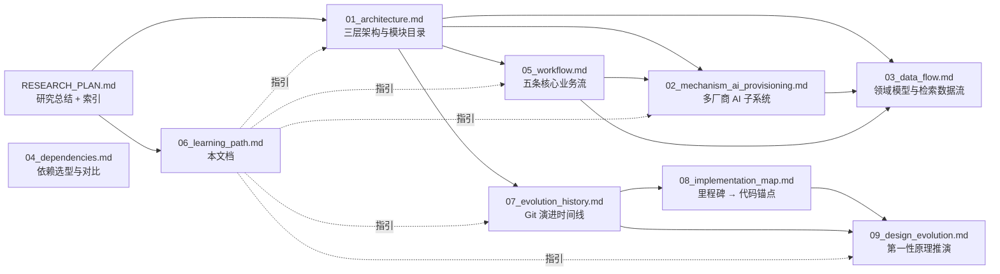

# 学习路径

> 本文档为不同类型的读者给出推荐的阅读顺序、最低前置知识、以及与其它研究专题的导航关系。所有引用指向同目录下的其它 `0X_*.md` 文档或真实代码锚点（`file_path:line_number`）。

---

## 一句话总览

Open Notebook 是一个"多模态资料 → AI 处理 → 多种产出（笔记 / 答案 / 播客）"的系统；要理解它，建议按 **"宏观架构 → 数据落点 → 工作流 → 机制深挖 → 演进与设计动机"** 的顺序阅读，而不是按文件序号 01→09。

---

## 读者画像与推荐路径

### 画像 A：**想快速了解整个项目**（产品经理 / 技术评估 / 新加入者）

**目标**：30 分钟内能说清项目是做什么的、怎么分层、有什么关键设计取舍。

**推荐顺序**：

1. `RESEARCH_PLAN.md` 顶部"研究总结"（Phase 3 产物，约 5 分钟）
2. `01_architecture.md` 的前两节（"一句话总览" + "三层架构"），约 10 分钟
3. `04_dependencies.md` 的"核心决策矩阵"表，约 5 分钟
4. `09_design_evolution.md` 的"设计决策矩阵"表 + "复杂度累积图"，约 10 分钟

**跳过**：所有 Mermaid 序列图、状态机详图、Migration 表、Gotcha 细节。

---

### 画像 B：**想贡献代码**（PR 作者 / 长期协作者）

**目标**：理解项目代码骨架、能定位"某功能在哪个文件"、能避免踩坑。

**推荐顺序**（分阶段）：

#### 阶段 1：建立全景（约 1 小时）

1. `01_architecture.md` 通读 —— 理解三层架构与目录映射
2. `03_data_flow.md` 的"领域模型总览"与"SurrealDB 表结构详表" —— 理解数据落点
3. `05_workflow.md` 的"一句话总览" + "五条流程的总体关系图"

#### 阶段 2：挑一条流程深入（按你的兴趣）

- 想做 **聊天 / 工具调用 / SSE 流式**：`05_workflow.md` §2（Chat 流程）+ `02_mechanism_ai_provisioning.md`（模型供给链）
- 想做 **上传 / 解析 / 切块 / 嵌入**：`05_workflow.md` §1（Source Ingestion）+ `03_data_flow.md` §6（嵌入写入流）
- 想做 **播客 / TTS / 异步任务**：`05_workflow.md` §5（Podcast）+ `04_dependencies.md` 的 podcast-creator 小节
- 想做 **检索 / Ask / 混合检索**：`05_workflow.md` §3（Ask）+ `03_data_flow.md` §7（检索读取流）
- 想做 **Transformations / 模板 / 笔记生成**：`05_workflow.md` §4（Transformation）

#### 阶段 3：理解约束（避免踩坑）

1. `02_mechanism_ai_provisioning.md` 的"Gotcha"小节 —— Credential / Env / 加密的真实行为
2. `03_data_flow.md` 的"Gotcha"小节 —— 异步任务、多字节全文检索 fallback、checkpoint 与 ChatSession 分工
3. `05_workflow.md` 的"跨流程 Gotcha 汇总" —— 异步 / 同步混用、105k 上下文阈值、ID 格式

#### 阶段 4：看历史找上下文

- 任何"为什么代码这样写"的问题，先去 `07_evolution_history.md` 找对应提交
- 再去 `08_implementation_map.md` 找"该里程碑的当前代码落点"
- 最后去 `09_design_evolution.md` 找"从第一性原理推演的设计动机"

---

### 画像 C：**想深度理解架构与设计决策**（架构师 / 技术评审 / 二次设计者）

**目标**：吃透每个关键设计背后的"为什么"。

**推荐顺序**：

1. `09_design_evolution.md` 通读 —— 12 个设计决策的五段式推演
2. `07_evolution_history.md` 的"演进模式总结" —— 系统重复出现的演进路径
3. `02_mechanism_ai_provisioning.md` 通读 —— 最复杂的子系统的完整机制
4. `04_dependencies.md` 的"与替代品深度对比" —— 每个依赖选择的取舍
5. `08_implementation_map.md` 的"跨里程碑协作图" —— 子系统之间的耦合面

---

### 画像 D：**想复用某个子模块**（做自己的 AI 应用）

**目标**：把某个子系统（多厂商 AI、SurrealDB 嵌入、异步任务、播客生成）拆出去用。

**推荐入口**：

| 想复用的能力 | 主要参考文档 | 代码入口 |
|-------------|-------------|---------|
| 多厂商 AI 抽象（Esperanto 集成） | `02_mechanism_ai_provisioning.md` | `open_notebook/ai/provision.py`、`open_notebook/ai/models.py` |
| 加密凭证存储 | `02_mechanism_ai_provisioning.md` §加密机制 | `open_notebook/utils/encryption.py`、`open_notebook/domain/credential.py` |
| DB 优先 + env 回退模式 | `02_mechanism_ai_provisioning.md` §DB 优先决策树 | `open_notebook/ai/key_provider.py` |
| SurrealDB 嵌入 / 向量 / 全文检索 | `03_data_flow.md` §SurrealDB 表结构、§检索读取流 | `open_notebook/database/repository.py`、`open_notebook/domain/base.py:text_search` |
| LangGraph 状态机 + checkpoint | `05_workflow.md` §2（Chat）+ `09_design_evolution.md` §3 | `open_notebook/graphs/chat.py` |
| 异步任务队列（surreal-commands） | `05_workflow.md` §5（Podcast）+ `03_data_flow.md` §异步任务状态机 | `commands/podcast_commands.py`、`commands/source_commands.py` |
| 多 voice 播客生成 | `05_workflow.md` §5 + `04_dependencies.md` podcast-creator | `api/podcast_service.py`、`open_notebook/podcasts/` |
| Jinja2 沙箱（SSTI 防护） | `09_design_evolution.md` §7 | `open_notebook/graphs/transformation.py`、`prompts/` |
| 多模态内容提取 | `04_dependencies.md` content-core | `api/sources_service.py`、`open_notebook/graphs/source.py` |
| 混合检索 + 多策略并行 | `05_workflow.md` §3（Ask）+ `09_design_evolution.md` §10 | `open_notebook/graphs/ask.py` |

---

### 画像 E：**想做安全审计**

**目标**：找出潜在漏洞并理解已修复的洞。

**推荐顺序**：

1. `07_evolution_history.md` §"安全修复集中月"（2026-04 三天内修复 4 个洞）
2. `02_mechanism_ai_provisioning.md` §加密机制、§URL 校验、§错误与降级
3. `05_workflow.md` §4（Transformation）—— SSTI 沙箱
4. `09_design_evolution.md` §4（Credential）、§7（Jinja2 沙箱）
5. 代码侧：`grep -r "SandboxedEnvironment\|_validate_url\|encrypt_value\|classify_error"`

---

### 画像 F：**想理解运维与部署**

**目标**：把项目跑起来、做版本升级、数据迁移。

**推荐顺序**：

1. `04_dependencies.md` §基础设施与部署依赖、§运行时拓扑
2. `07_evolution_history.md` §"Next.js 16 升级"（>10MB 上传修复）、§目录重构
3. `03_data_flow.md` §Migration 影响表（15 条 migration 的作用）
4. `08_implementation_map.md` §里程碑 6（Next.js 16 升级）、§里程碑 4（REST API）

---

## 最低必要前置知识

| 知识点 | 最低水平 | 推荐补充来源 |
|-------|---------|-------------|
| Python 3.11+ async/await | 能读懂 `async def` / `await` | 官方 asyncio 文档 |
| FastAPI 基础 | 能读懂路由 + Pydantic schema | FastAPI 官方教程前 3 章 |
| Pydantic v2 | 知道 `BaseModel`、`field_validator`、`SecretStr` | Pydantic v2 迁移指南 |
| SurrealQL | 知道 RecordID / RELATE / DEFINE INDEX / DEFINE EMBEDDING | SurrealDB 官方文档 SQL 章节 |
| LangGraph | 知道 StateGraph、节点、边、checkpoint | LangGraph 官方 Quickstart |
| Next.js App Router | 能读懂 `app/`、`route.ts`、`page.tsx` | Next.js 16 文档 |
| Zustand + TanStack Query | 知道 store / hooks / mutation | 各自官方文档 |
| LangChain 基础概念 | 知道 ChatModel、Embedding、PromptTemplate | LangChain Overview |
| Docker / docker-compose | 能看懂 compose 文件 | Docker 官方入门 |
| 加密基础 | 知道对称加密 / Fernet / 密钥保管 | cryptography 官方 Fernet 章节 |

> 如果你对其中**任意 3 项以上**完全陌生，建议先看 `01_architecture.md` 的"一句话总览"建立直觉，再按画像 B 的阶段 1 推进；不要一上来就啃 `02_mechanism_ai_provisioning.md`。

---

## 文档间导航关系

---

## 速查：每个文档能回答什么问题

| 文档 | 能回答 | 不能回答 |
|------|-------|---------|
| `01_architecture.md` | 项目分几层？每个目录是干什么的？模块依赖方向？ | 具体某函数怎么实现？为什么这样设计？ |
| `02_mechanism_ai_provisioning.md` | 如何接入新厂商？多 Credential 怎么选？API key 怎么加密？env 和 DB 怎么回退？ | 业务流程细节？数据 schema？ |
| `03_data_flow.md` | 某字段存在哪？关系怎么建？全文/向量检索怎么工作？checkpoint 与 ChatSession 怎么分？ | AI 模型怎么选？业务流怎么编排？ |
| `04_dependencies.md` | 某个库为什么选它？替代品有哪些？版本升级影响？ | 业务流程？代码细节？ |
| `05_workflow.md` | 端到端五条流程怎么走？每步落哪些库？失败怎么处理？ | 为什么这样设计？历史怎么演化？ |
| `06_learning_path.md` | 我该按什么顺序读？需要什么前置知识？ | 任何具体技术问题（本文是索引） |
| `07_evolution_history.md` | 某功能什么时候引入？某 bug 什么时候修复？目录什么时候重组？ | 当前代码怎么实现？为什么这样设计？ |
| `08_implementation_map.md` | 某历史里程碑的代码现在在哪？跨模块怎么协作？ | 设计动机？替代方案？ |
| `09_design_evolution.md` | 某设计为什么这样而不是那样？最小设计是什么？复杂度代价是什么？ | 实际历史时间线（按第一性原理而非时间推演） |

---

## 三条"如果只读一篇"的捷径

- **只读一篇要理解整个项目**：读 `01_architecture.md`
- **只读一篇要理解最复杂的子系统**：读 `02_mechanism_ai_provisioning.md`
- **只读一篇要理解为什么这样设计**：读 `09_design_evolution.md`

---

## 写代码前的"坑列表"速查

写 PR 前务必看一眼：

1. **异步任务可能还在跑**：`Source.save()` 不会自动嵌入；`Note.save()` 会自动 submit `embed_note`，但 fire-and-forget —— 详见 `03_data_flow.md` §异步任务状态机。
2. **多 Credential 同 provider 默认取 created ASC 第一个**：要让用户指定，必须显式绑定 `Model.credential` —— 详见 `02_mechanism_ai_provisioning.md` §多 Credential 策略。
3. **`OPEN_NOTEBOOK_ENCRYPTION_KEY` 未设会 raise**（不是仅警告）—— 详见 `02_mechanism_ai_provisioning.md` §加密机制。
4. **全文检索在大块/multibyte 时会 fallback 到 vector_search**，不会静默返回 `[]` —— 详见 `03_data_flow.md` §检索读取流。
5. **Podcast `max_attempts=1` 故意不重试**，retry 必须先 delete 再 resubmit —— 详见 `05_workflow.md` §5。
6. **Ask 流程目前硬编码只用 vector_search**（text_search 被注释）—— 详见 `05_workflow.md` §3。
7. **Chat 流程没有 ToolNode**（尽管 CLAUDE.md 提及）—— 详见 `05_workflow.md` §2。
8. **provider 名在 DB 存下划线（`openai_compatible`），Esperanto 要连字符** —— 详见 `02_mechanism_ai_provisioning.md` §Gotcha。
9. **更新 Credential 的 api_key 后，已缓存的 Esperanto 实例仍持旧 key**，需重启进程 —— 详见 `02_mechanism_ai_provisioning.md` §Gotcha。
10. **i18n 是硬约束**：任何前端文案都必须走 i18next key，不能硬编码英文字符串 —— 详见 `04_dependencies.md` 前端依赖小节。
