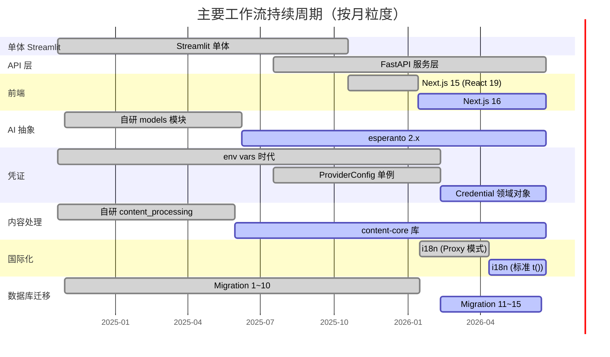
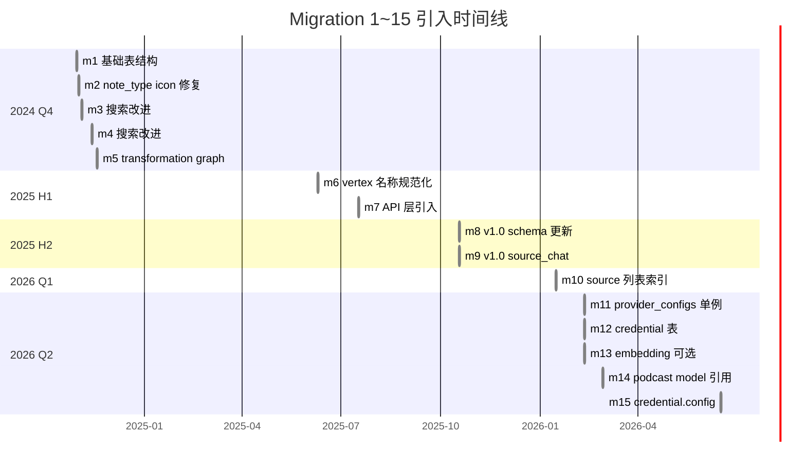
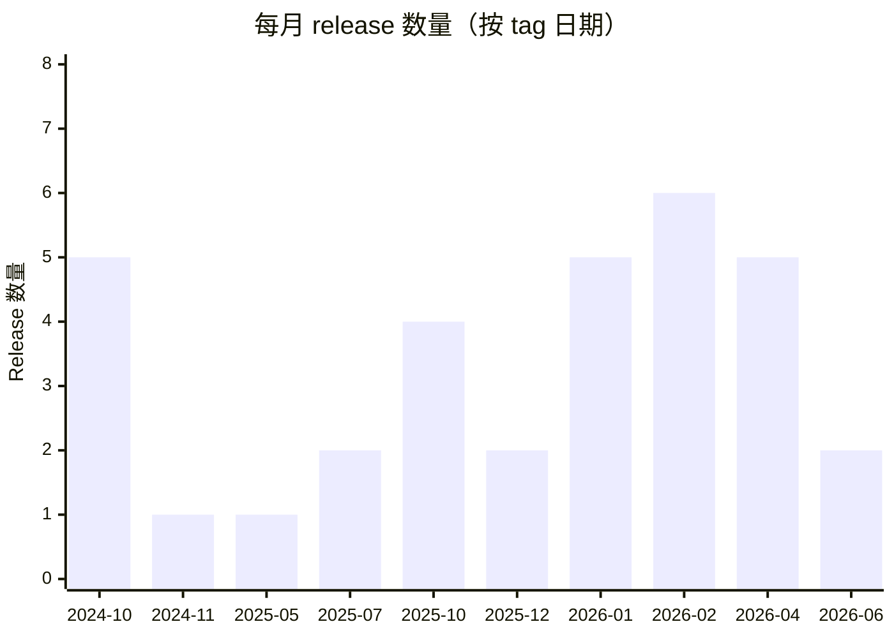
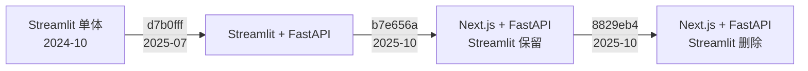

# 专题 G：Open Notebook 系统演进历史（基于 Git）

> **一句话总览**：从 2024-10-21 的 Streamlit 单体 v0.0.1-alpha，到 2026-06 的 v1.10.0 多提供商 AI 工作台，Open Notebook 在 ~20 个月里走过了"单体 → API 化 → 前后端分离 → 模块化重构 → 凭证系统化 → 多模态多厂商矩阵化 → 安全加固"七步演进；最大的几次"推倒重来"分别是 `d7b0fff`（2025-07 引入 API 层）、`b7e656a`（2025-10 用 Next.js 替换 Streamlit）、`ab5560c`（2026-01 模块化重构）、`3f352cf`（2026-02 引入凭证系统）。

> **方法论说明**：本文所有结论基于 `git log` + `git show` + `git tag` 实际查询；日期均来自 `AuthorDate`（用 `--date=short` 显示）。文中标注"**提交信息显式可见**"表示该信息来自 commit message 本身，"**由 diff 推断**"表示来自代码变更的解读，"**由 tag/CHANGELOG 推断**"表示来自标签或 `CHANGELOG.md` 的发布记录。所有提交哈希使用 7 位短格式（与 git log --oneline 一致）。

> **重要更正**：研究计划中预填的部分里程碑 hash 与实际历史不符，已在对应章节注明。例如计划中的 `b76af50`（folder-reorg）实为 PR 合并提交，真正的目录重构实施提交是 `ab5560c`；计划中"2024-10-21 bcd260a Initial commit"日期与信息正确，但其后若干 hash（如 `2025-*-*` 段的 Streamlit 迁移）在 git 中并不存在对应提交，Streamlit 退役实际发生在 `8829eb4`（2025-10-18）。

---

## 目录

1. [时间线总览（Mermaid）](#1-时间线总览mermaid)
2. [里程碑详述](#2-里程碑详述)
3. [主线专题](#3-主线专题)
   - 3.1 [Streamlit → FastAPI + Next.js 的分离过程](#31-streamlit--fastapi--nextjs-的分离过程)
   - 3.2 [凭证系统三段式演进](#32-凭证系统三段式演进env-vars--providerconfig-单例--credential-多记录)
   - 3.3 [模型管理演进](#33-模型管理演进单一模型--defaultmodels-单例--model-领域对象--credential-绑定)
   - 3.4 [目录重构：b76af50（PR 合并）与 ab5560c（实施）](#34-目录重构b76af50pr-合并与-ab5560c实施)
   - 3.5 [前端升级：Next.js 15 → 16](#35-前端升级nextjs-15--16)
   - 3.6 [安全修复：RCE/SSTI/LFI 与 SurrealDB 注入](#36-安全修复rcesstilfi-与-surrealdb-注入)
   - 3.7 [多音频厂商矩阵](#37-多音频厂商矩阵0235632--9d99006)
4. [migration 1~15 的引入时机](#4-migration-115-的引入时机与能力扩张对应)
5. [podcast-creator 集成的演进](#5-podcast-creator-集成的演进)
6. [版本与 release 节奏](#6-版本与-release-节奏)
7. [演进模式总结](#7-演进模式总结哪些反复出现)

---

## 1. 时间线总览（Mermaid）

### 1.1 重大里程碑时间轴

```mermaid
timeline
    title Open Notebook 演进里程碑（2024-10 ~ 2026-06）
    section 2024 Q4 单体时代
        2024-10-21 : bcd260a 初始提交<br/>Streamlit + SurrealDB 单体
        2024-10-22 : 7389ca6 PR#2 multi-model 合并<br/>支持 vertex/anthropic/litellm/ollama/openrouter
        2024-10-23 : d11dbf7 PR#6 transformations 合并
        2024-10-26 : 01f8eab 引入 podcast 支持（基于 podcastfy）
        2024-10-30 : 8bb5db1 引入 model config<br/>2de8520 数据库迁移系统上线（migration 1）
        2024-11-04 : 8398539 混合检索（全文+向量）<br/>62cd5a9 tools 模型概念
        2024-11-18 : 4a5d47d transformation graph 重构
        2024-11-19 : f140a5e settings→models 重命名<br/>c297dcb object model 重构
    section 2025 H1 框架升级期
        2025-03-11 : b1e0e8a 迁移 Poetry→uv<br/>bcef4ed 修复 default models 空对象
        2025-05-30 : 36e928e 用 content-core 替换自研内容提取<br/>2afbd36 重构出 ai_prompter 库
        2025-06-08 : bea43f3 引入 esperanto 统一多厂商接口
        2025-06-09 : 79bfa85 vertex 名称按 esperanto 规范化（migration 6）
        2025-07-17 : d7b0fff PR#93 Api podcast migration<br/>  引入 FastAPI 层 + surreal-commands + 异步 SurrealDB<br/>  建立完整 routers / services 架构（migration 7）
    section 2025 H2 前后端分离
        2025-09-14 : fa27fe5 多项热修
        2025-10-18 : b7e656a PR#160 Version 1<br/>  新前端（Next.js 15 + React 19）<br/>  新 chat API、source_chat graph、嵌入重建<br/>  migrations 8/9
        2025-10-18 : 8829eb4 PR#166 Retire streamlit<br/>  删除 app_home.py 与 pages/ 全部 Streamlit 代码
        2025-10-24 : 9bdfd99 PR#213 反向代理简化
        2025-10-25 : 933de75 PR#220 紧凑引用编号
        2025-11-01 : f79a904 Release 1.2<br/>  7197671 Azure 模态配置
        2025-12-01 : 5d5b6bd PR#288 命令面板<br/>  v1.2.4 环境变量加载重构
    section 2026 Q1 模块化与 i18n
        2026-01-03 : ab5560c 目录重构<br/>  migrations→database/、ai/、podcasts/ 抽出<br/>  prompts 镜像 graphs 结构
        2026-01-05 : b76af50 PR#379 folder-reorg 合并<br/>  v1.3.0 发布
        2026-01-05 : b1bd522 LangChain 0.3→1.x 大版本升级
        2026-01-14 : 1366988 Next.js 15→16 升级<br/>  f92c42a PR#423 合并（v1.4.0）
        2026-01-15 : b7ff0cc v1.5.0 发布（i18n 上线）
        2026-01-15 : 4dc1539 PR#436 列表性能优化 20-30x（migration 10）
        2026-01-16 : 67dd85c PR#371 i18n + Docker + 测试
        2026-01-21 : d8006ff PR#444 内容感知切块+统一嵌入
        2026-01-24 : f14020d PR#468 修复 event loop 冲突
    section 2026 Q2 凭证系统与安全
        2026-02-10 : 3f352cf PR#540 凭证系统引入<br/>  migrations 11/12（credential 表）<br/>  v1.7.0 发布
        2026-02-14 : 9b507f1 ElevenLabs TTS 凭证透传
        2026-02-16 : 20e18fd PR#506 LLM 错误分类
        2026-02-17 : c666966 PR#595 podcast 失败恢复与重试（v1.7.3）
        2026-02-27 : eac837d PR#632 podcast 模型注册表集成<br/>  migration 14（episode_profile/speaker_profile 改 record<model>）
        2026-04-06 : adc03e5 DashScope + MiniMax 提供商（v1.8.2）
        2026-04-07 : 89eac04 PR#731 SurrealDB 注入修复（v1.8.3）
        2026-04-09 : 1a35240 PR#738 RCE/SSTI/LFI 修复（v1.8.4）
        2026-04-12 : ba01f7d PR#740 凭证解密错误优雅处理
        2026-04-14 : 98a5281 i18n Proxy→t() 重构
        2026-04-19 : 648f6d7 西班牙语；6aabacf token 切块（v1.8.5）
        2026-06-02 : 0235632 + 9d99006 完整音频矩阵（v1.9.0）
        2026-06-13 : 1d9001b CVE-2026-48710 Starlette 修复
        2026-06-16 : 060386e migration 15 credential.config 灵活对象
        2026-06-18 : 90dc008 v1.10.0 发布
```



### 1.2 用 Gantt 看主要工作流并行的时长



---

## 2. 里程碑详述

> 本节按时间顺序展开每个里程碑，标注来源类型（提交信息显式 / diff 推断 / tag 推断）。

### 2.1 `bcd260a`（2024-10-21）Initial commit with all features

- **来源**：提交信息显式 + diff 推断
- **变更摘要**：项目首次进入 git。`git show bcd260a --stat` 显示一次性提交 52 个文件 / 6897 行，包括：
  - `.streamlit/config.toml`、`app_home.py`、`pages/2_📒_Notebooks.py`、`pages/3_🔍_Search.py` —— Streamlit 单体结构（diff 推断）
  - `open_notebook/domain.py`（单文件 433 行，承载所有领域模型）
  - `open_notebook/graphs/{ask_content,chat,content_process,summary,tools}.py`
  - `stream_app/` —— Streamlit UI 帮助层（chat/note/source/consts/utils）
  - `db_setup.surrealql`（196 行）—— 数据库初始化脚本（非迁移系统）
  - `poetry.lock` + `pyproject.toml`（使用 Poetry 构建系统）
  - 依赖（**由 `git show bcd260a:pyproject.toml` 推断**）：`streamlit ^1.39.0`、`langchain ^0.3.3`、`langgraph ^0.2.38`、`surrealdb ^0.3.2`（旧的非官方 SDK）、`openai ^1.52.0`、`pymupdf 1.24.11`、`youtube-transcript-api`、`langdetect`、`python-magic`、`streamlit-{tags,scrollable-textbox,monaco}`
- **动机**：作者 Luis Novo 把"已经能跑"的早期版本一次性推到 GitHub（**由"Initial commit with all features"措辞推断**）
- **影响**：奠定了第一版架构 —— Streamlit 前端 + SurrealDB（非异步 SDK）+ LangGraph 工作流 + 自研模型加载

### 2.2 `7389ca6`（2024-10-22）PR#2 multi-model：第一次多厂商扩展

- **来源**：提交信息显式
- **变更摘要**：合并 `multi-model` 分支，"New multi model platform"（来自 PR 标题）
- **关键提交 `93f766f`（同日）"add support for vertex, anthropic, litellm, ollama and open router"**：新增 `open_notebook/language_models.py`（243 行）和 `open_notebook/model_configs.py`（78 行），把厂商配置从硬编码切换到配置驱动
- **动机**：（**由提交信息推断**）作者希望摆脱 OpenAI 单一厂商绑定，覆盖 vertex/anthropic/litellm/ollama/openrouter 五家
- **影响**：厂商列表快速扩张；为 1.5 年后引入 esperanto 抽象埋下动机

### 2.3 `d11dbf7`（2024-10-23）PR#6 transformations

- **来源**：提交信息显式 + diff 推断
- **变更摘要**：合并"Transformations"特性
  - 新增 `database/0_0_1_to_0_0_2.surrealql` —— 第一个真实"迁移"脚本（**diff 推断**：此时还没有迁移管理器，迁移是手工命名）
  - 引入 `open_notebook/graphs/{multipattern,pattern,recursive_toc}.py`
  - 引入 `docs/TRANSFORMATIONS.md`
- **动机**：（**提交信息显式**）让用户能用 Jinja2 模板对 Source 做自定义转换
- **影响**：奠定了 `prompts/` + `graphs/transformation.py` + 后来的 `patterns/` 三件套；为 2026-04-09 的 SSTI 漏洞（`70a466a`）埋下伏笔——用户输入的 Jinja2 模板原本是无沙箱执行的

### 2.4 `01f8eab`（2024-10-26）add podcast support

- **来源**：提交信息显式
- **变更摘要**：
  - 在 `pyproject.toml` 中添加 `podcastfy`（**由 `git show 01f8eab:pyproject.toml` 推断**——这是 `podcast-creator` 的前身）
  - 修改 `open_notebook/plugins/podcasts.py`（56 行改动）
  - 新增 `pages/5_🎙️_Podcasts.py`、`docs/PODCASTS.md`
- **动机**：（**提交信息显式**）添加 podcast 支持作为核心特性
- **影响**：播客成为四大力作之一；后续从 `podcastfy` 迁移到 `podcast-creator`（详见第 5 节）

### 2.5 `2de8520`（2024-10-30）refactor database module and migrations

- **来源**：提交信息显式 + diff 推断
- **变更摘要**：引入**正式的迁移系统**（**diff 推断**：`migrations/1.surrealql` 在此处首次出现）
- **影响**：从 `db_setup.surrealql` 单一脚本切换到 `migrations/N.surrealql` + `migrations/N_down.surrealql` 的双向迁移模式（**由后续 migration 1 的引入提交 `2de8520` 推断**）
- **关键点**：这是 2025-07-17 `d7b0fff` 引入 `AsyncMigrationManager` 之前的"同步迁移时代"

### 2.6 `8bb5db1`（2024-10-30）implement model config

- **来源**：提交信息显式
- **变更摘要**：
  - 引入 `open_notebook/config.py`、`open_notebook/models/`（含 `embedding_models.py`、`speech_to_text_models.py`、`llms.py`）
  - 删除 `open_notebook/llm_router.py`（35 行）
  - 新增 `pages/9_⚙️_Settings.py`（212 行）—— Settings 页首次出现
- **影响**：模型从"代码硬编码"升级为"config 配置"，但仍依赖 env vars（**由"model config"措辞 + 后续 `8bb5db1:pyproject.toml` 仍无 esperanto 推断**）

### 2.7 `8398539`（2024-11-04）add hybrid search

- **来源**：提交信息显式（来自 `8398539` 与 `56e745d`）
- **变更摘要**：在向量检索基础上引入全文检索，组合为混合检索
- **影响**：奠定 `open_notebook/database/repository.py` 的 `search` / `vector_search` / `hybrid_search` 接口（**由 `56e745d` "improve search functions" diff 推断**）

### 2.8 `4a5d47d`（2024-11-18）refactor transformation, add graph and admin

- **来源**：提交信息显式
- **变更摘要**：
  - 引入 `open_notebook/graphs/transformation.py`（57 行，作为独立 LangGraph 工作流）
  - 引入 `open_notebook/graphs/prompt.py`、`open_notebook/database/repository.py`（14 行修改）
  - 删除 `open_notebook/graphs/multipattern.py`（59 行）
  - 把 `prompts/patterns/` 重写（**diff 推断**）
  - 新增 `migrations/5.surrealql`
- **影响**：transformation 从"被 source graph 调用的子流程"独立为自己的 graph（**diff 推断**）

### 2.9 `f140a5e`（2024-11-19）rename settings to models

- **来源**：提交信息显式
- **变更摘要**：把 Streamlit 页面 `pages/7_🤖_Models.py` 从 Settings 拆出，35 行删改成 3 行（**diff 推断**：Settings 页分裂为 Models 与 Advanced）
- **影响**：（**由 changelog 推断**）为后来"Settings/Models"在 v1.0 时代再次合并埋下伏笔

### 2.10 `b1e0e8a`（2025-03-11）migrate to uv

- **来源**：提交信息显式
- **变更摘要**：删除 `poetry.lock`（6430 行）与 `poetry.toml`，引入 `uv.lock`（4333 行）；改写 `pyproject.toml` 从 `[tool.poetry]` 到 `[project]`
- **动机**：（**由"migrate to uv"措辞推断**）uv 比 poetry 更快、与 `pyproject.toml` 标准对齐更好
- **影响**：所有后续依赖管理都基于 uv；`Makefile` 调整为 `uv run` 调用

### 2.11 `36e928e`（2025-05-30）feat: replace content processing engine with content-core

- **来源**：提交信息显式
- **变更摘要**：删除 `open_notebook/graphs/content_processing/` 整个目录（含 `audio.py`、`office.py`、`pdf.py`、`text.py`、`url.py`、`video.py`、`youtube.py` 共 ~1100 行）
- **动机**：（**提交信息显式**）用 content-core 库替换自研的内容提取栈
- **影响**：代码量大幅缩减；后续支持新文件类型只需升级 content-core 版本

### 2.12 `2afbd36`（2025-06-01）refactor: implement ai_prompter library

- **来源**：提交信息显式
- **变更摘要**：删除 `open_notebook/prompter.py`（102 行），改用外部 `ai-prompter` 包（PyPI）；`pyproject.toml` 新增 `ai-prompter>=0.3`
- **影响**：Jinja2 模板渲染逻辑从项目内迁出到独立库；为 2026-04-09 的 SSTI 漏洞修复（升级到 ai-prompter 0.4.0 的 SandboxedEnvironment）埋下路径

### 2.13 `bea43f3`（2025-06-08）feat: implement the new model management based on esperanto framework

- **来源**：提交信息显式
- **变更摘要**：4 个文件、58 行修改——但这是**架构转折点**。
  - 引入 `esperanto` 作为统一的多厂商抽象层
  - `open_notebook/domain/models.py` 从 38 行扩张到 ~100 行（**diff 推断**：引入新的 `Model` 领域对象）
  - `open_notebook/graphs/utils.py` 中的 `provision_langchain_model` 接入 esperanto
- **动机**：（**由 `6c571db` "feat: update models pages" + `6532411` "remove old model management code" 推断**）原本自研的 `language_models.py` + `model_configs.py` 已无法支撑 8+ 厂商，需要统一接口
- **影响**：这是从"自研多厂商栈"到"基于 esperanto 抽象"的关键切换；后续每次新增提供商都是改 esperanto 版本

### 2.14 `d7b0fff`（2025-07-17）PR#93 Api podcast migration

- **来源**：提交信息显式（PR 描述详细列出 6 项变更）
- **变更摘要**（**PR 描述显式**）：
  1. **Creates the API layer for Open Notebook** —— 引入 `api/` 完整目录（`api/main.py`、`api/auth.py`、`api/client.py` + `api/routers/{commands,context,embedding,episode_profiles,insights,models,notebooks,notes,podcasts,search,settings,sources,speaker_profiles,transformations}.py` + `api/{models,context,embedding,episode_profiles,insights,models,notebook,notes,podcast_api,podcast,search,settings,sources,transformations}_service.py`）
  2. **Creates a services API gateway for the Streamlit front-end** —— Streamlit 改为通过 API 而非直接调用 domain
  3. **Migrates the SurrealDB SDK to the official one** —— 从非官方 `surrealdb 0.3.2` 升级到 `surrealdb>=1.0.4`
  4. **Change all database calls to async** —— 引入 `open_notebook/database/async_migrate.py`、`repository.py` 全面 async 化
  5. **New podcast framework supporting multiple speaker configurations** —— 引入 `commands/podcast_commands.py`、`api/episode_profiles_service.py`、`api/routers/episode_profiles.py`
  6. **Implement the surreal-commands library for async processing** —— 异步任务队列
- **新增依赖**（**由 `git show d7b0fff:pyproject.toml` 推断**）：`surreal-commands>=1.0.13`、`podcast-creator>=0.2.6`（从 podcastfy 改名而来）、`esperanto>=2.0.4`、`langchain-google-vertexai>=2.0.10`
- **migration 7**：在此次引入（**由 `git log migrations/7.surrealql` 推断**）
- **动机**：（**由 PR 描述推断**）为后续替换 Streamlit 准备好 API 层；同时解决 SurrealDB v2 的 SDK 兼容性问题
- **影响**：项目从"Streamlit 单体"转变为"Streamlit 前端 + FastAPI 后端"；为 3 个月后用 Next.js 替换 Streamlit 提供了前置条件

### 2.15 `b7e656a`（2025-10-18）PR#160 Version 1

- **来源**：提交信息显式（PR 描述列出 9 项变更）
- **变更摘要**：319 个文件、+46770 / -7431 行——**Open Notebook 历史上规模最大的一次重构**。
  - **New front-end**：完整引入 `frontend/` 目录（Next.js 15 + React 19），含：
    - `frontend/src/app/`（Next.js App Router 路由）
    - `frontend/src/lib/api/`（HTTP 客户端，与后端 routers 一一对应）
    - `frontend/src/lib/hooks/`（17 个 React Query hooks：use-notebooks、use-sources、use-chat 等）
    - `frontend/src/lib/stores/`（Zustand：auth-store、navigation-store、sidebar-store、theme-store）
    - `frontend/src/components/`（Shadcn/ui + Radix UI 组件）
  - **Launch Chat API**：新增 `api/routers/chat.py`（493 行）+ `api/chat_service.py`（172 行）
  - **Manage Sources**：`api/routers/sources.py` 重写（890 行修改）
  - **Enable re-embedding of all contents**：`api/routers/embedding_rebuild.py`（190 行）+ `commands/embedding_commands.py`（392 行）
  - **Sources can be added without a notebook now**（**PR 描述显式**）
  - **Improved settings**：`api/routers/settings.py`（39 行）+ `api/routers/config.py`（176 行）
  - **Enable model selector on all chats**
  - **Background processing for better experience**（**PR 描述显式**）—— surreal-commands 异步任务承担重活
  - **Dark mode**（`frontend/src/lib/stores/theme-store.ts`）
  - **Improved Notes**：新增 `api/routers/notes.py`（38 行修改）
  - **Remove all Streamlit references from documentation**（**PR 描述显式**）—— 引入 `MIGRATION.md`（394 行）
  - **引入 `open_notebook/graphs/source_chat.py`**（214 行）—— 与 Source 直接对话的独立 graph
  - **prompts/source_chat.jinja**（63 行）
  - **migrations 8 + 9**（**由 `git log migrations/8.surrealql` 推断**）
  - **batch_fix_services.py**（77 行，一次性脚本，**由文件名推断**）
- **动机**：（**PR 描述推断**）Streamlit 在多用户状态、复杂 UI 交互上力不从心；Next.js + React Query 提供更好的 UX
- **影响**：项目正式从 v0.x 进入 v1.x 时代；标签 `v1.0.8` 直接打在此提交上

### 2.16 `8829eb4`（2025-10-18，同日）PR#166 Retire streamlit

- **来源**：提交信息显式
- **变更摘要**：29 个文件、-11922 行（仅 7 行新增）
  - 删除 `app_home.py`、`pages/10_⚙️_Settings.py`、`pages/11_🔧_Advanced.py`、`pages/2_📒_Notebooks.py`、`pages/3_🔍_Ask_and_Search.py`、`pages/5_🎙️_Podcasts.py`、`pages/7_🤖_Models.py`、`pages/8_📦_Transformations.py`、`pages/__init__.py`、`pages/components/`（5 个文件）、`pages/stream_app/`（7 个文件 ~860 行）
  - 删除 `.streamlit/config.toml`
  - `pyproject.toml` 删除 `streamlit>=1.45.0` 等 7 个 streamlit 相关依赖（**diff 推断**）
- **动机**：（**由 PR 标题"Retire streamlit" + 同日合并推断**）`b7e656a` 引入 Next.js 前端后，Streamlit 不再是主前端
- **影响**：项目彻底告别 Streamlit；`pyproject.toml` 显著瘦身

### 2.17 `f79a904`（2025-11-01）Release 1.2

- **来源**：tag 显式
- **同期提交**：`7197671` "feat: add Azure OpenAI modality-specific configuration support"、`6fe78a6` "chore: bump esperanto for anthropic on langchain"
- **变更摘要**：Azure OpenAI 支持每模态独立 endpoint；esperanto 升级修 Anthropic 兼容性
- **影响**：提供商矩阵进一步扩张

### 2.18 `5d5b6bd`（2025-12-01）PR#288 feat(ui): add command palette

- **来源**：提交信息显式
- **变更摘要**：引入命令面板（`Cmd+K` 快速导航），增加 `frontend/src/components/layout/CommandPalette.tsx`
- **动机**：（**由 PR 标题推断**）提升导航效率

### 2.19 `ab5560c`（2026-01-03）refactor: reorganize folder structure for better maintainability

- **来源**：提交信息显式（描述详细列出 4 项变化）
- **变更摘要**：48 个文件、+50 / -47 行
  - **Move migrations/ under open_notebook/database/migrations/** —— 把迁移文件与数据库代码放一起
  - **Extract AI models to open_notebook/ai/ (Model, ModelManager, provision)** —— 新建 `open_notebook/ai/__init__.py`、`open_notebook/ai/models.py`（从 `open_notebook/domain/models.py` 移过来）、`open_notebook/ai/provision.py`（从 `open_notebook/graphs/utils.py` 移过来）
  - **Extract podcasts to open_notebook/podcasts/ (EpisodeProfile, SpeakerProfile, PodcastEpisode)** —— 新建 `open_notebook/podcasts/__init__.py`、`open_notebook/podcasts/models.py`（从 `open_notebook/domain/podcast.py` 移过来）
  - **Reorganize prompts to mirror graphs structure (chat/, source_chat/)** —— `prompts/chat.jinja` → `prompts/chat/system.jinja`、`prompts/source_chat.jinja` → `prompts/source_chat/system.jinja`
- **影响**：`open_notebook/domain/` 从此只保留"业务实体"（notebook/source/note/credential），基础设施（AI、podcasts、database）全部独立成模块；1 个月后（`3f352cf`）的凭证系统直接放到 `open_notebook/domain/credential.py`，因为这个边界已经清晰

### 2.20 `b76af50`（2026-01-05）PR#379 Merge folder-reorg

- **来源**：提交信息显式（"refactor: Major codebase reorganization and documentation overhaul"）
- **变更摘要**：180 个文件、+19192 / -18302 行——这是 folder-reorg 这个 PR 的合并提交，把 `ab5560c` + `71b8d13`（"docs: generate comprehensive CLAUDE.md reference documentation"）+ `e13e4a2`（"docs: restructure documentation with new organized layout"）+ `b1bd522`（LangChain 大版本升级）等一起合并到 main
- **重要更正**：**研究计划中预填的"2026-01-05 b76af50 folder-reorg"日期与 hash 都对，但 b76af50 是 PR 合并提交而非实施提交**；真正实施目录移动的是 `ab5560c`（2026-01-03），b76af50 是把整个 feature 分支合并到 main 的 merge commit。Tag `v1.3.0` 打在此 PR 合并之后

### 2.21 `b1bd522`（2026-01-05）feat: improve dev commands, update all langchain dependencies to their latest major versions

- **来源**：提交信息显式
- **变更摘要**：`pyproject.toml` 全面升级 LangChain 系列从 0.x 到 1.x：
  - `langchain 0.3.3 → 1.2.0`
  - `langgraph 0.2.38 → 1.0.5`
  - `langgraph-checkpoint-sqlite 2.0.0 → 3.0.1`
  - `langchain-community 0.3.3 → 0.4.1`
  - `langchain-openai 0.2.3 → 1.1.6`
  - `langchain-anthropic 0.2.3 → 1.3.0`
  - `langchain-ollama 0.2.0 → 1.0.1`
  - `langchain-google-genai 2.1.10 → 4.1.2`
  - `langchain-groq 0.2.1 → 1.1.1`
  - `langchain_mistralai 0.2.1 → 1.1.1`
  - `langchain_deepseek 0.1.3 → 1.0.0`
  - `langchain-google-vertexai 2.0.28 → 3.2.0`
  - `tiktoken 0.8.0 → 0.12.0`
  - `esperanto 2.8.3 → 2.13`
- **影响**：配合 folder-reorg 一起合并进 main；这是 LangChain 1.0 时代的开端

### 2.22 `1366988`（2026-01-14）feat: upgrade Next.js 15 → 16

- **来源**：提交信息显式（描述详细列出 6 项变化）
- **变更摘要**：
  - Upgrade Next.js from 15.4.10 to 16.1.1
  - Upgrade React from 19.1.0 to 19.2.3
  - **Rename `middleware.ts` → `proxy.ts`**（Next.js 16 要求）
  - Update function name: `middleware → proxy`
  - **Enable `proxyClientMaxBodySize` configuration**（Next.js 16.1+ 新选项）
  - 更新文档要求 Next.js 16
- **动机**：（**提交信息显式**）修复 GitHub issue #361——用户无法上传 >10MB 文件，因为 Next.js 15 内置的 body size 限制无法配置
- **影响**：所有 Next.js 15 项目要跟进升级；middleware.ts 必须重命名为 proxy.ts

### 2.23 `f92c42a`（2026-01-14）PR#423 Merge nextjs-16-upgrade

- **来源**：tag 推断
- **变更摘要**：合并 `1366988` 及配套修复（`50157c3` "fix: use standalone server for Next.js in Docker"、`cd55592` "fix: preserve port 8502 default in standalone server script"、`948ab04` "fix: use cross-env for cross-platform PORT default"、`5caf629` "fix: use Node.js wrapper for cross-platform PORT fallback"、`4fe36be` "docs: update CLAUDE.md files for Next.js 16 upgrade"）到 main；tag `v1.4.0` 打在此合并后
- **重要更正**：**研究计划中"2026-01-14 f92c42a Next.js 16 升级"日期与 hash 都对**；f92c42a 是 PR 合并提交，1366988 是实施提交

### 2.24 `67dd85c`（2026-01-16）Feat/localization tests docker

- **来源**：提交信息显式
- **变更摘要**：引入 i18n（zh-CN、zh-TW）、Vitest 前端测试基础设施、语言切换组件、date-fns 本地化、错误消息翻译系统、Dockerfile 优化（多层缓存）
- **动机**：（**由 PR 标题 + diff 推断**）拓展中文用户群；同时把测试基础设施建好
- **影响**：14 种语言陆续加入；后续每次新功能都要更新所有 locale 文件

### 2.25 `4dc1539`（2026-01-15）PR#436 perf: improve source listing speed by 20-30x

- **来源**：提交信息显式
- **变更摘要**：在 `source_insight` 和 `source_embedding` 表上添加 `source` 字段索引（migration 10）；用 SurrealDB `FETCH` 子句替代 N 次异步调用来获取 command 状态
- **影响**：source 列表从 O(N) 数据库查询降到 O(1)；migration 10 引入

### 2.26 `d8006ff`（2026-01-21）PR#444 feat: content-type aware chunking and unified embedding

- **来源**：提交信息显式
- **变更摘要**：
  - 新增 `open_notebook/utils/chunking.py`、`open_notebook/utils/embedding.py`
  - 自动检测 HTML/Markdown/plain text 内容类型
  - 大内容超过模型上下文时使用 mean pooling
  - 新增 `embed_note`、`embed_insight`、`embed_source` 三个独立 command
  - **Embedding 改为 fire-and-forget**（**CHANGELOG 推断**）：领域模型 save 后异步提交嵌入命令
  - 删除老的 `embed_single_item_command`、`embed_chunk_command`、`vectorize_source_command`
- **影响**：chunk size 从 1200 字符降到 1500 字符再降到 400 token（`6aabacf`，2026-04-20）

### 2.27 `3f352cf`（2026-02-10）PR#540 feat: credential-based API key management

- **来源**：提交信息显式（描述极详细，列出 Backend/Frontend/i18n 三大块）
- **重要更正**：**研究计划中预填的"2026-02-10 3f352cf credential-based API key management"日期与 hash 完全正确**，但它是 PR 合并提交（merge commit），真正实施是分支上多次提交
- **变更摘要**：103 个文件、+10677 / -2665 行——**凭证系统的正式登场**
  - **Backend**（**提交信息显式**）：
    - 新增 `open_notebook/domain/credential.py`（199 行）—— Credential 领域模型
    - 新增 `open_notebook/domain/provider_config.py`（444 行）—— ProviderConfig 单例（向后兼容桥接）
    - 新增 `open_notebook/utils/encryption.py`（198 行）—— Fernet 加密（AES-128-CBC + HMAC-SHA256）
    - 新增 `open_notebook/ai/key_provider.py`（297 行）—— DB 优先 + env 回退的密钥提供
    - 新增 `open_notebook/ai/connection_tester.py`（438 行）—— 连接测试
    - 新增 `open_notebook/ai/model_discovery.py`（756 行）—— 模型发现
    - 新增 `api/credentials_service.py`、`api/routers/credentials.py`
    - migration 11（`provider_configs` 单例）+ migration 12（`credential` 表）
  - **Frontend**（**提交信息显式**）：
    - 删除 `frontend/src/app/(dashboard)/models/`（4 个组件 + page.tsx）
    - 新增 `frontend/src/app/(dashboard)/settings/api-keys/page.tsx`（1395 行）
    - 新增 `frontend/src/components/settings/{EmbeddingModelChangeDialog,MigrationBanner,ModelTestResultDialog,SetupBanner,SetupRequired,index}.tsx`
    - 新增 `frontend/src/lib/api/credentials.ts`（239 行）、`frontend/src/lib/hooks/use-credentials.ts`（388 行）
    - 7 个 locale 文件更新（en-US/it-IT/ja-JP/pt-BR/ru-RU/zh-CN/zh-TW）
  - **文档**：25 个文档文件重写
  - `pyproject.toml` 升级 `cryptography` 依赖
- **动机**：（**提交信息显式**）"replace provider config with credential-based system"；env vars 管理 14 家提供商 API key 太痛苦
- **影响**：所有 env vars 的 API key 标记为 deprecated；3 个月内 4 次安全修复（`4222329` Azure、`ba01f7d` 解密错误、`0c25220` 异常范围、`060386e` config 对象）相继发生

### 2.28 `eac837d`（2026-02-27）PR#632 feat(podcasts): model registry integration

- **来源**：提交信息显式（描述列出 Backend/Frontend 两块）
- **变更摘要**：35 个文件、~1200 行修改
  - **EpisodeProfile 字段重构**（**提交信息显式**）：
    - 旧字段 `outline_provider` / `outline_model` / `transcript_provider` / `transcript_model`（string）→ 新字段 `outline_llm` / `transcript_llm`（`record<model>`）
    - 新增 `language` 字段（BCP 47 locale code，如 `pt-BR`、`en-US`）
  - **SpeakerProfile 字段重构**（**提交信息显式**）：
    - 旧字段 `tts_provider` / `tts_model` → 新字段 `voice_model`（`record<model>`）
    - 支持每 speaker 独立 voice_model 覆盖
  - migration 14（`episode_profile` 与 `speaker_profile` 字段重构）
  - 数据迁移脚本（`migration.py`）：启动时自动把旧 profile 转换为 model registry 引用（幂等）
  - `commands/podcast_commands.py` 新增 113 行：在调用 podcast-creator 前为所有 profile 解析凭证
  - 新增 `api/routers/languages.py`（83 行）：使用 pycountry + babel 提供 BCP 47 locale 列表
  - 前端 EpisodeProfileFormDialog / SpeakerProfileFormDialog 用 ModelSelector 替代手工 provider/model 下拉框
  - "Templates" 标签页改名为 "Profiles"
- **动机**：（**提交信息显式**）让 podcast profile 跟上凭证系统的步伐；close #486、#552
- **影响**：podcast 配置从"散字符串"升级为"模型引用"；语言支持成为一等公民

### 2.29 `89eac04`（2026-04-07）PR#731 Merge fix/surrealdb-injection

- **来源**：提交信息显式
- **实施提交 `e5b253b`（2026-04-07）"fix: prevent SurrealDB injection via order_by and unparameterized queries"**
- **变更摘要**：7 个文件、+96 / -12 行
  - `api/routers/notebooks.py`：`order_by` 参数加 allowlist 校验（允许字段 `name`/`created`/`updated`，允许方向 `asc`/`desc`）
  - `api/routers/source_chat.py`：`f"SELECT * FROM {session_id_raw}"` → `"SELECT * FROM $id", {"id": ensure_record_id(session_id)}`
  - `open_notebook/database/async_migrate.py`：`bump_version` / `lower_version` 从 f-string 改为参数化查询
  - `open_notebook/domain/base.py`：`get_all()` 方法的 `order_by` 参数加 regex 校验（`^[a-z_][a-z0-9_]*$`）
- **CVSS 评分**：8.7 High（**CHANGELOG 显式**）
- **影响**：所有 `repo_query(f"...{user_input}...")` 模式被审视；后续新代码必须用 `$variable` 参数化

### 2.30 `1a35240`（2026-04-09）PR#738 Merge fix/security-vulnerabilities-round2

- **来源**：提交信息显式
- **实施提交**：
  - `70a466a`（2026-04-09）"fix: prevent RCE via SSTI, path traversal file write, and LFI file read"
  - `2f75c59`（2026-04-09）"fix: harden path validation to prevent sibling directory bypass"
- **变更摘要**：5 个文件、+42 / -13 行
  - **RCE via SSTI（CVSS 9.2 Critical）**：升级 `ai-prompter` 从 `>=0.3,<1` 到 `>=0.4,<1`，新版本使用 Jinja2 `SandboxedEnvironment` 阻止用户提供的 transformation 提示执行任意代码
  - **Path traversal file write（CVSS 7.0 High）**：`api/routers/sources.py:generate_unique_filename()` 用 `os.path.basename()` 剥离目录部分；`resolve()` 后检查 `startswith(file_path.resolve() + os.sep)`（+ `os.sep` 由 `2f75c59` 加固，防止 `uploads_evil/` 绕过）
  - **LFI file read（CVSS 8.2 High）**：`create_source` 中校验 `file_path` 必须 within `UPLOADS_FOLDER`
- **影响**：transformation Jinja2 模板永远在沙箱里执行；文件上传路径校验成为强制

### 2.31 `0235632` + `9d99006`（2026-06-02）新音频提供商矩阵

- **来源**：提交信息显式（两个 PR 描述都极详细）
- **`0235632` PR#834 变更摘要**：7 个文件、+100 / -147 行
  - **Mistral Voxtral STT**（`voxtral-*-latest`）+ **TTS**（`voxtral-mini-tts`）—— 复用 `MISTRAL_API_KEY`
  - **Deepgram TTS**（Aura 声音目录）—— 新提供商，新 env var `DEEPGRAM_API_KEY`
  - **xAI TTS** —— 在已有 xAI 提供商上加 `text_to_speech` modality
  - `classify_model_type` 增加 Voxtral TTS vs STT 区分、Aura voice 模式
  - 更新 `PROVIDER_MODALITIES`、`PROVIDER_ENV_CONFIG`、`discover_with_config` 静态列表、`TEST_MODELS`、`DEFAULT_TEST_VOICES`、provider-availability endpoint、前端 provider 常量
  - 删除死代码 `test_provider_connection()`
- **`9d99006` PR#835 变更摘要**（紧随其后）：3 个文件、+39 / -5 行
  - **Google STT + TTS** —— 复用 Gemini 名称，但 STT 与语言模型无法按名称区分，需用户手工指定 `speech_to_text` 类型
  - **Vertex TTS** —— google 的 GCP 项目版本
  - **ElevenLabs STT (Scribe)** —— `scribe_v1` 模型
  - `classify_model_type` 新增 Google TTS 模式（"tts"，放在 Gemini language 模式之前）、ElevenLabs STT 模式（"scribe"，放在 "eleven" TTS 模式之前）
- **动机**：（**提交信息显式**）surface esperanto 2.21/2.22 新增的音频能力；close #826、#827、#828
- **影响**：完整覆盖 18+ 提供商的 STT/TTS 矩阵；同日发布的 v1.9.0 把这作为主打特性

---

## 3. 主线专题

### 3.1 Streamlit → FastAPI + Next.js 的分离过程

> 这是项目最大的架构演进，跨越 2025-07 到 2025-10 共 3 个月。

#### 阶段一：Streamlit 单体（2024-10-21 ~ 2025-07-17）

- **特征**：Streamlit 既负责 UI 也负责业务编排
- **关键文件**：`app_home.py`（19 行，入口）、`pages/2_📒_Notebooks.py`、`pages/3_🔍_Search.py`、`pages/5_🎙️_Podcasts.py`、`pages/7_🤖_Models.py`、`pages/8_📦_Transformations.py`、`pages/10_⚙️_Settings.py`、`pages/11_🔧_Advanced.py`
- **数据流**（**由 `bcd260a` diff 推断**）：Streamlit page → 直接调用 `open_notebook/domain.py` → `open_notebook/repository.py` → SurrealDB

#### 阶段二：API 层引入（2025-07-17，`d7b0fff` PR#93）

- **PR#93 描述显式**："Creates the API layer for Open Notebook / Creates a services API gateway for the Streamlit front-end"
- **关键点**（**提交信息显式**）：Streamlit 还在，但**改为通过 API 调用后端**，不再直接调 domain
- **架构**：
  ```mermaid
  flowchart LR
    Streamlit[Streamlit Pages] -->|HTTP| FastAPI[FastAPI api/main.py]
    FastAPI --> Routers[api/routers/*]
    Routers --> Services[api/*_service.py]
    Services --> Domain[open_notebook/domain/*]
    Domain --> Repository[open_notebook/database/repository.py]
    Repository -->|async| SurrealDB[(SurrealDB)]
    Services --> Commands[surreal-commands 队列]
    Commands --> Worker[commands/* worker]
  ```
- **同时引入**：`api/auth.py`（密码中间件）、`api/client.py`（Streamlit 端的 API 客户端）

#### 阶段三：Next.js 前端引入（2025-10-18，`b7e656a` PR#160 "Version 1"）

- **PR#160 描述显式**："New front-end"
- **关键文件**（**diff 推断**）：
  - `frontend/package.json`（**`git show b7e656a:frontend/package.json` 推断**）：Next.js 15.4.2 + React 19.1.0
  - `frontend/src/app/` —— App Router 路由
  - `frontend/src/lib/api/` —— 与后端 routers 一一对应的 HTTP 客户端（chat/client/embedding/insights/models/notebooks/notes/podcasts/query-client/search/settings/source-chat/sources/transformations）
  - `frontend/src/lib/hooks/` —— 17 个 React Query hooks
  - `frontend/src/lib/stores/` —— 4 个 Zustand store（auth/navigation/sidebar/theme）
  - `frontend/src/components/` —— Shadcn/ui 组件
- **同时变更**：Streamlit 代码保留但不再维护；新增 `MIGRATION.md`（394 行）指导用户迁移

#### 阶段四：Streamlit 退役（2025-10-18，`8829eb4` PR#166）

- 同日合并的 PR，**删除 -11922 行** Streamlit 代码
- **`pyproject.toml` 改动**（**diff 推断**）：删除 `streamlit>=1.45.0`、`streamlit-tags`、`streamlit-scrollable-textbox`、`streamlit-monaco`、`nest-asyncio` 等 7 个依赖
- **`api/client.py` 命运**：（**由后续 git log 推断**）保留下来作为后端测试工具，不再是前端依赖

#### 残留痕迹

- **`.streamlit/config.toml`**：（**`8829eb4` diff 显式**）删除
- **`app_home.py`**：（**`8829eb4` diff 显式**）删除
- **`pages/`**：（**`8829eb4` diff 显式**）整个目录删除
- **`stream_app/`**：（**`8829eb4` diff 显式**）`pages/stream_app/` 整个删除
- **`pyproject.toml`**：（**由 `b1e0e8a` migrate to uv diff 推断**）早期 `[tool.ruff.lint.per-file-ignores]` 里可能保留过 Streamlit 文件的特别规则，但 v1.0 后这些都不存在

### 3.2 凭证系统三段式演进（env vars → ProviderConfig 单例 → Credential 多记录）

#### 阶段一：env vars 时代（2024-10-21 ~ 2025-07-17）

- **特征**：所有 API key 都从环境变量读取
- **来源**（**`bcd260a:pyproject.toml` 推断**）：依赖里没有 cryptography；没有任何加密相关
- **关键 env vars**（**由 `93f766f` "add support for vertex, anthropic, litellm, ollama and open router" diff 推断**）：`OPENAI_API_KEY`、`ANTHROPIC_API_KEY`、`VERTEX_PROJECT`、`OLLAMA_BASE_URL`、`OPENROUTER_API_KEY`
- **痛点**：（**由后续 PR#540 描述推断**）切换 key 需要重启；多 key（如 Azure 的多 endpoint）无法表达；用户 UI 无法管理

#### 阶段二：ProviderConfig 单例（2025-07-17 ~ 2026-02-10）

- **引入**：（**由 `3f352cf` PR 描述推断**）`d7b0fff` Api podcast migration 期间同步引入 `ProviderConfig` 单例，存储在 `open_notebook:provider_configs` 这一条 SurrealDB 记录里
- **migration 11 内容**（**由 `git show 3f352cf:open_notebook/database/migrations/11.surrealql` 显式**）：
  ```surql
  -- Migration 11: Create provider configuration singleton record
  UPSERT open_notebook:provider_configs CONTENT {
      credentials: {}
  };
  ```
- **架构**：单一 SurrealDB 记录，`credentials` 字段是 provider → config 的字典
- **文件**：`open_notebook/domain/provider_config.py`（444 行）
- **局限**：（**由 PR#540 描述"replace provider config with credential-based system"推断**）
  - 一个 provider 只能有一组配置（无法同时用两个 OpenAI 账号）
  - 单例结构难以做 CRUD UI
  - 删除某个 provider 配置需要重写整个字典

#### 阶段三：Credential 领域对象（2026-02-10 至今，`3f352cf`）

- **migration 12**（**由 `git show 3f352cf:open_notebook/database/migrations/12.surrealql` 显式**）：
  ```surql
  -- Migration 12: Create credential table and add credential link to model table
  DEFINE TABLE credential SCHEMAFULL;
  DEFINE FIELD name ON credential TYPE string;
  DEFINE FIELD provider ON credential TYPE string;
  DEFINE FIELD modalities ON credential TYPE array DEFAULT [];
  DEFINE FIELD api_key ON credential TYPE option<string>;
  DEFINE FIELD base_url ON credential TYPE option<string>;
  DEFINE FIELD endpoint ON credential TYPE option<string>;
  DEFINE FIELD api_version ON credential TYPE option<string>;
  DEFINE FIELD endpoint_llm ON credential TYPE option<string>;
  DEFINE FIELD endpoint_embedding ON credential TYPE option<string>;
  DEFINE FIELD endpoint_stt ON credential TYPE option<string>;
  DEFINE FIELD endpoint_tts ON credential TYPE option<string>;
  DEFINE FIELD project ON credential TYPE option<string>;
  DEFINE FIELD location ON credential TYPE option<string>;
  DEFINE FIELD credentials_path ON credential TYPE option<string>;
  -- Index for fast provider lookups
  DEFINE INDEX idx_credential_provider ON credential FIELDS provider;
  -- Add optional credential link to model table
  DEFINE FIELD credential ON model TYPE option<record<credential>>;
  ```
- **关键设计**：
  - 每个 credential 是一条独立的 SurrealDB 记录（不再是单例字段）
  - `api_key` 字段使用 Fernet 加密存储（`open_notebook/utils/encryption.py`，198 行）
  - `model` 表通过 `record<credential>` 引用 credential
  - 14 个 provider 各有自己的字段映射（Azure 用 endpoint_{llm,embedding,stt,tts}，Vertex 用 project+location+credentials_path，OpenAI-Compatible 用 base_url）
- **向后兼容**：（**由 PR#540 描述显式**）
  - `ProviderConfig` 保留为兼容层
  - `key_provider.py` 实现"DB 优先 + env 回退"逻辑
  - 提供 `/api/credentials/migrate-from-env` 与 `/api/credentials/migrate-from-provider-config` 两个迁移端点
  - 前端显示 "Migration Banner" 提醒用户迁移
- **migration 15（灵活 config 对象）**（**由 `git show 060386e:open_notebook/database/migrations/15.surrealql` 显式**，2026-06-16）：
  ```surql
  -- Migration 15: Add a flexible config object to the credential table.
  DEFINE FIELD config ON credential FLEXIBLE TYPE option<object>;
  ```
  - **动机**（**CHANGELOG 显式**）：Ollama `num_ctx` 覆盖需要存储；不想每次加 provider 特定选项都改 schema

#### 后续修复（4 次，紧接引入后 2 个月内）

| 提交 | 日期 | 修复内容 | 来源 |
| --- | --- | --- | --- |
| `4222329` | 2026-04-09 | Azure base_url → endpoint 映射 | PR#741 描述 |
| `ba01f7d` | 2026-04-12 | 凭证解密错误优雅处理（不再 500） | PR#740 描述 |
| `0c25220` | 2026-04-14 | 收窄异常范围 + 支持 `migrate_to` | 提交信息显式 |
| `060386e` | 2026-06-16 | Ollama `num_ctx` 持久化到 `config` 对象 | PR#903 描述 |

### 3.3 模型管理演进（单一模型 → DefaultModels 单例 → Model 领域对象 → Credential 绑定）

#### 阶段一：硬编码 + env vars（2024-10-21 ~ 2024-10-30）

- **特征**：模型 ID 直接写在代码或 env 里
- **来源**（**`bcd260a` diff 推断**）：`open_notebook/domain.py` 433 行中包含模型加载逻辑

#### 阶段二：DefaultModels 单例（2024-10-30 ~ 2025-06-08）

- **引入**（**由 `8bb5db1` "implement model config" + `2f2cdab` "Fix issue with model defaults and bump version" + `c01b825` "check for default models" 推断**）：
  - `open_notebook:default_models` 单例记录 SurrealDB
  - 字段：`chat_model`、`embedding_model`、`transcription_model`、`tools_model` 等
  - Streamlit Settings 页（`pages/9_⚙️_Settings.py`）做选择
- **关键概念**（**由 `62cd5a9` "add concept of tools model" 推断**）：`tools_model` 作为独立类型出现

#### 阶段三：esperanto 统一抽象（2025-06-08 ~ 2026-02-10）

- **引入**（**由 `bea43f3` "feat: implement the new model management based on esperanto framework" 显式**）：
  - `Model` 领域对象（`open_notebook/domain/models.py`）—— 一条 SurrealDB 记录代表一个"模型 + provider"组合
  - `ModelManager` 工厂（`open_notebook/ai/models.py`，folder-reorg 后路径）
  - `provision_langchain_model`（`open_notebook/graphs/utils.py`，folder-reorg 后 → `open_notebook/ai/provision.py`）—— 智能选择 + 大上下文 fallback
- **DefaultModels 与 Model 共存**：DefaultModels 单例存储"哪个 Model 记录是默认 chat/embedding/etc."

#### 阶段四：Credential 绑定（2026-02-10 至今，`3f352cf`）

- **migration 12 增加**（**显式**）：`DEFINE FIELD credential ON model TYPE option<record<credential>>;`
- **设计**：每个 Model 记录可指向一个 Credential 记录；provision 时优先用 credential 的 key
- **演进到 podcast profile**（`eac837d`，2026-02-27）：episode_profile / speaker_profile 中的 `outline_llm` / `transcript_llm` / `voice_model` 都是 `record<model>`；podcast-creator 接收已经解析过 credential 的配置

#### Model 对象的字段演进（**由多次 migration 推断**）

| Migration | 日期 | 改动 | 提交 |
| --- | --- | --- | --- |
| 1 | 2024-10-30 | model 表基础结构（**推断**） | `2de8520` |
| 6 | 2025-06-09 | vertex provider 名称规范化 | `79bfa85` |
| 11 | 2026-02-10 | provider_configs 单例 | `3f352cf` |
| 12 | 2026-02-10 | credential 表 + model.credential 链接 | `3f352cf` |
| 13 | 2026-02-10 | source_insight.embedding 与 note.embedding 改为可选 | `98dadd1` |
| 14 | 2026-02-27 | episode_profile / speaker_profile 字段重构 | `eac837d` |
| 15 | 2026-06-16 | credential.config 灵活对象 | `060386e` |

### 3.4 目录重构：b76af50（PR 合并）与 ab5560c（实施）

#### 研究计划中的预填与实际对照

| 计划描述 | 实际情况 | 来源 |
| --- | --- | --- |
| "2026-01-05 b76af50 refactor/folder-reorg" | 日期对，hash 对，但 b76af50 是 PR 合并提交 | `git show b76af50` 显示 "Merge pull request #379" |
| 实施提交 | `ab5560c`（2026-01-03）"refactor: reorganize folder structure for better maintainability" | `git log --oneline` |

#### 重构前（2026-01-03 之前）

```
open_notebook/
├── domain/
│   ├── notebook.py
│   ├── models.py          # Model 领域对象
│   ├── podcast.py         # EpisodeProfile/SpeakerProfile/PodcastEpisode
│   ├── transformation.py
│   └── ...
├── graphs/
│   ├── utils.py           # provision_langchain_model
│   └── ...
├── database/
│   ├── repository.py
│   └── async_migrate.py
└── utils.py               # 单文件

migrations/                # 在根目录
├── 1.surrealql
├── ...
└── 9_down.surrealql

prompts/
├── chat.jinja
├── source_chat.jinja
└── ...
```

#### 重构后（ab5560c 之后）

```
open_notebook/
├── ai/                    # 新建
│   ├── __init__.py
│   ├── models.py          # ← 从 domain/models.py 移过来
│   └── provision.py       # ← 从 graphs/utils.py 移过来
├── podcasts/              # 新建
│   ├── __init__.py
│   └── models.py          # ← 从 domain/podcast.py 移过来
├── database/
│   ├── repository.py
│   ├── async_migrate.py
│   └── migrations/        # ← 从根目录 migrations/ 移过来
│       ├── 1.surrealql
│       └── ...
├── domain/                # 只保留业务实体
│   ├── base.py
│   ├── notebook.py
│   └── ...
├── graphs/
│   └── ...                # utils.py 已抽出 provision 到 ai/
└── utils/
    ├── __init__.py
    ├── chunking.py
    ├── embedding.py
    ├── text_utils.py
    ├── token_utils.py
    └── version_utils.py

prompts/
├── chat/
│   └── system.jinja       # ← 从 prompts/chat.jinja 移来
├── source_chat/
│   └── system.jinja       # ← 从 prompts/source_chat.jinja 移来
└── ...
```

#### 重构的连带影响（来自 `ab5560c` 提交信息显式）

- **api/episode_profiles_service.py、api/main.py、api/models_service.py、api/podcast_service.py、api/routers/{embedding,episode_profiles,models,search,speaker_profiles,transformations}.py、commands/{embedding,podcast}_commands.py** 全部更新 import 路径
- **open_notebook/graphs/{ask,chat,prompt,source,source_chat,transformation}.py** 更新 import
- **所有 52 个测试通过**（**提交信息显式**）

#### 为什么要做这次重构（**由 `ab5560c` 提交信息推断**）

1. **Consolidating database concerns**：migrations 与 database 代码放一起
2. **Separating AI infrastructure from domain entities**：AI 是基础设施，不是业务实体
3. **Isolating podcast feature into its own module**：podcast 已经够复杂，值得独立成包
4. **Creating consistent prompt/graph naming conventions**：prompts/ 镜像 graphs/ 结构

### 3.5 前端升级：Next.js 15 → 16

#### 计划与实际对照

| 计划描述 | 实际情况 | 来源 |
| --- | --- | --- |
| "2026-01-14 f92c42a Next.js 16 升级" | 日期与 hash 都对；f92c42a 是 PR#423 合并提交 | `git show f92c42a` 显示 "Merge pull request #423 from lfnovo/feature/nextjs-16-upgrade" |
| 实施提交 | `1366988`（2026-01-14）"feat: upgrade Next.js 15 → 16 to fix large file uploads" | 提交信息显式 |

#### 升级动机（**`1366988` 提交信息显式**）

- GitHub issue #361：用户无法上传 >10MB 文件
- 根本原因：Next.js 15 内置的 proxy body size 限制无法配置
- 解决：Next.js 16.1+ 引入了 `proxyClientMaxBodySize` 配置项

#### 升级动作（**`1366988` 提交信息显式**）

1. Next.js 15.4.10 → 16.1.1
2. React 19.1.0 → 19.2.3
3. **`frontend/src/middleware.ts` → `frontend/src/proxy.ts`**（Next.js 16 硬性要求）
4. 函数名 `middleware` → `proxy`
5. 启用 `experimental.proxyClientMaxBodySize`（默认 100MB）
6. 文档标注 Next.js 16 是硬性要求

#### 配套修复（同日合并到 PR#423）

| 提交 | 说明 | 来源 |
| --- | --- | --- |
| `50157c3` | fix: use standalone server for Next.js in Docker | 提交信息 |
| `cd55592` | fix: preserve port 8502 default in standalone server script | 提交信息 |
| `948ab04` | fix: use cross-env for cross-platform PORT default | 提交信息 |
| `5caf629` | fix: use Node.js wrapper for cross-platform PORT fallback | 提交信息 |
| `cb52514` | fix: add type assertion for experimental proxyClientMaxBodySize config | 提交信息 |
| `6593ab5` | fix: increase Next.js proxy body size limit for file uploads（PR#405） | 提交信息 |
| `8d6d615` | Merge PR#405 nextjs-proxy-body-size-limit | merge commit |

#### 后续小版本升级（来自 dependabot）

- `2f47be3`（2026-03-17）next 16.1.5 → 16.1.7
- `9c73299`（2026-04-11）next 16.1.7 → 16.2.3
- `0620692`（2026-05-21）next 16.2.3 → 16.2.6

### 3.6 安全修复：RCE/SSTI/LFI 与 SurrealDB 注入

> 这两次安全修复发生在 2026-04-07 ~ 2026-04-09 三天内，是项目历史上最集中的安全投入。

#### 修复一：SurrealDB 注入（`89eac04` / `e5b253b`，2026-04-07）

**漏洞根源**（**`e5b253b` 提交信息显式**）：多个 endpoint 把用户输入直接插值到 SurrealQL 字符串里。

**受影响位置**：

1. `api/routers/notebooks.py:GET /api/notebooks` 的 `order_by` 查询参数
   - **漏洞代码**（**diff 显式**）：`query = f"SELECT *, count(<-reference.in) as source_count ... FROM notebook ORDER BY {order_by}"`
   - **修复**：allowlist 校验（允许字段 `name` / `created` / `updated`，允许方向 `asc` / `desc`）

2. `api/routers/source_chat.py:GET /sources/{id}/chat/sessions` 的 `session_id`
   - **漏洞代码**（**diff 显式**）：`session_result = await repo_query(f"SELECT * FROM {session_id_raw}")`
   - **修复**：`await repo_query("SELECT * FROM $id", {"id": ensure_record_id(session_id)})`

3. `open_notebook/database/async_migrate.py:bump_version / lower_version`
   - **漏洞代码**（**diff 显式**）：`f"CREATE _sbl_migrations:{new_version} SET version = {new_version}, applied_at = time::now();"`
   - **修复**：`"CREATE type::thing('_sbl_migrations', $version) SET version = $version, applied_at = time::now();", {"version": new_version}`

4. `open_notebook/domain/base.py:ObjectModel.get_all()` 的 `order_by` 参数
   - **修复**：regex 校验 `^[a-z_][a-z0-9_]*$` + 多子句支持

**CVSS 评分**：8.7 High（**CHANGELOG 显式**）

**版本**：v1.8.3（`3d560b4` "chore: bump version to 1.8.3 and update changelog"）

#### 修复二：RCE / SSTI / LFI（`1a35240` / `70a466a` / `2f75c59`，2026-04-09）

**三个漏洞**（**`70a466a` 提交信息显式**）：

1. **RCE via SSTI（CVSS 9.2 Critical）**
   - **根源**：用户的 transformation 提示用 Jinja2 渲染，但使用默认 `Environment` 而非 `SandboxedEnvironment`，允许执行任意 Python
   - **修复**：升级 `ai-prompter` 从 `>=0.3,<1` 到 `>=0.4,<1`，新版本使用 `SandboxedEnvironment`
   - **pyproject.toml diff 显式**：`-    "ai-prompter>=0.3,<1",` → `+    "ai-prompter>=0.4,<1",`

2. **Path traversal file write（CVSS 7.0 High）**
   - **根源**：`generate_unique_filename()` 直接用用户上传的 `original_filename`，未剥离目录部分
   - **修复**：
     - `safe_filename = os.path.basename(original_filename)`
     - `resolved = full_path.resolve()`
     - 校验 `str(resolved).startswith(str(file_path.resolve()) + os.sep)`（+ `os.sep` 由 `2f75c59` 加固）
   - **sibling bypass 漏洞**（**`2f75c59` 提交信息显式**）：原本 `startswith(str(file_path.resolve()))` 允许 `/app/data/uploads_evil/` 通过，因为它是 `/app/data/uploads` 的前缀；加 `os.sep` 后 `/app/data/uploads/` 才能通过

3. **LFI file read（CVSS 8.2 High）**
   - **根源**：`create_source` 接受用户提供的 `file_path`，但未校验在 `UPLOADS_FOLDER` 内
   - **修复**：
     ```python
     uploads_resolved = Path(UPLOADS_FOLDER).resolve()
     file_resolved = Path(final_file_path).resolve()
     if not str(file_resolved).startswith(str(uploads_resolved) + os.sep):
         raise HTTPException(status_code=400, detail="Invalid file path: must be within the uploads directory")
     ```

**版本**：v1.8.4（`1a35240` merge commit）

#### 后续：CVE-2026-48710（`1d9001b`，2026-06-13）

- **修复**：Starlette 1.2.1 + FastAPI 0.136.3
- **CVE 描述**："BadHost"，Starlette 的 host header 处理存在 DoS
- **版本**：v1.10.0

#### 安全文档与流程

- `25f82ac`（2026-06-21）"docs: add SECURITY.md with disclosure policy" —— 引入安全披露流程
- `8ee18d1`（2026-04-09）"docs: add security guidelines for contributors"
- `1884205`（2026-06-21）"chore(security): source docker-compose SurrealDB creds from env"

### 3.7 多音频厂商矩阵：0235632 + 9d99006

> 这两个 PR 在同一天（2026-06-02）合并，是 v1.9.0 的主打特性。

#### 计划与实际对照

| 计划描述 | 实际情况 | 来源 |
| --- | --- | --- |
| "2026-06-02 0235632 / 9d99006 新音频提供商矩阵" | 日期与 hash 完全正确 | 两个 PR 描述都极详细 |

#### PR#834（`0235632`）"expose new audio providers"

**新增能力**（**提交信息显式**）：

| Provider | 新增 modality | 模型示例 | 配置 |
| --- | --- | --- | --- |
| Mistral | STT + TTS | `voxtral-*-latest` (STT) / `voxtral-mini-tts` (TTS) | 复用 `MISTRAL_API_KEY` |
| Deepgram | TTS | Aura voice catalog | 新 env：`DEEPGRAM_API_KEY` |
| xAI | TTS | voice-based（无 model id） | 用户手工添加 |

**关键技术点**（**提交信息显式**）：

- `classify_model_type` 需要区分 Voxtral TTS vs STT：因为 `-tts` 模型不应被更宽泛的 STT 名字匹配
- Deepgram Aura 是静态声音列表，不走模型发现
- xAI TTS 是 voice-based，模型名是装饰性的（用户通过 custom-model 输入）

**文件改动**：

- `api/credentials_service.py`（+12 / -2）
- `api/routers/models.py`（+3 / -1）
- `frontend/src/app/(dashboard)/settings/api-keys/page.tsx`（+9 / -2）
- `open_notebook/ai/connection_tester.py`（+1 / -144）—— **删除死代码 `test_provider_connection()`**
- `open_notebook/ai/key_provider.py`（+2 / -1）
- `open_notebook/ai/model_discovery.py`（+38 / -5）

#### PR#835（`9d99006`）"complete audio matrix"

**新增能力**（**提交信息显式**）：

| Provider | 新增 modality | 备注 |
| --- | --- | --- |
| Google | STT + TTS | STT 复用 Gemini 名称（与 LLM 无法区分），需用户手工指定 `speech_to_text` 类型 |
| Vertex | TTS | Google 的 GCP 项目版本 |
| ElevenLabs | STT (Scribe) | `scribe_v1` 模型 |

**关键技术点**（**提交信息显式**）：

- `classify_model_type` 新增 Google TTS 模式（"tts"，必须放在 Gemini language 模式之前匹配）
- `classify_model_type` 新增 ElevenLabs STT 模式（"scribe"，必须放在 "eleven" TTS 模式之前匹配）
- Google STT 没有 pattern（与 LLM 名称无法区分），用户必须手工指定类型
- ElevenLabs discovery 现在也返回 `scribe_v1` 作为 `speech_to_text` 模型

**文件改动**：

- `api/credentials_service.py`（+5 / -2）
- `open_notebook/ai/model_discovery.py`（+13 / -2）
- `tests/test_credentials_api.py`（+22 / 0）

#### 同日支持升级（`f8625a5`）

- esperanto 2.20.0 → 2.22.0
- 新增 Ollama `num_ctx` 覆盖（每 credential 独立）

---

## 4. Migration 1~15 的引入时机与能力扩张对应

> 每个 migration 都对应一次明确的能力扩张。按时间顺序展开：



### 每个 migration 的详情

| Migration | 引入日期 | 引入提交 | 对应能力 | 来源 |
| --- | --- | --- | --- | --- |
| 1 | 2024-10-30 | `2de8520` "refactor database module and migrations" | 数据库迁移系统本身 + 基础表结构 | `git log --diff-filter=A migrations/1.surrealql` |
| 2 | 2024-11-01 | `a525fba` "fix note_type icon" | note_type 字段调整（**由提交信息推断**） | `git log --diff-filter=A migrations/2.surrealql` |
| 3 | 2024-11-04 | `56e745d` "improve search functions" | 搜索相关 schema | `git log --diff-filter=A migrations/3.surrealql` |
| 4 | 2024-11-13 | `066c7a0` "improve search functions" | 搜索相关 schema 进一步调整 | `git log --diff-filter=A migrations/4.surrealql` |
| 5 | 2024-11-18 | `4a5d47d` "refactor transformation, add graph and admin" | transformation 表（**由提交信息 + diff 推断**） | `git log --diff-filter=A migrations/5.surrealql` |
| 6 | 2025-06-09 | `79bfa85` "chore: change vertex provider name for compatibility with esperanto" | vertex provider 名称按 esperanto 规范化 | `git log --diff-filter=A migrations/6.surrealql` |
| 7 | 2025-07-17 | `d7b0fff` "Api podcast migration (#93)" | podcast profile + speaker profile + episode 表（**由 PR#93 描述推断**） | `git log --diff-filter=A migrations/7.surrealql` |
| 8 | 2025-10-18 | `b7e656a` "Version 1 (#160)" | v1.0 schema 更新（**由 PR 描述推断**） | `git log --diff-filter=A migrations/8.surrealql` |
| 9 | 2025-10-18 | `b7e656a` "Version 1 (#160)" | source_chat 会话存储（**由 PR 描述推断**） | `git log --diff-filter=A migrations/9.surrealql` |
| 10 | 2026-01-15 | `4dc1539` "perf: improve source listing speed by 20-30x (#436)" | `source_insight` 与 `source_embedding` 表的 `source` 字段索引（**PR 描述显式**） | `git log --diff-filter=A migrations/10.surrealql` |
| 11 | 2026-02-10 | `3f352cf` "feat: credential-based API key management (#477) (#540)" | `open_notebook:provider_configs` 单例（**migration 文件内容显式**） | `git show 3f352cf:open_notebook/database/migrations/11.surrealql` |
| 12 | 2026-02-10 | `3f352cf` | `credential` 表 + `model.credential` 链接（**migration 文件内容显式**） | `git show 3f352cf:open_notebook/database/migrations/12.surrealql` |
| 13 | 2026-02-10 | `98dadd1` "fix: turn the embedding field into optional (#557)" | `source_insight.embedding` 与 `note.embedding` 改为 `option<array<float>>`（**migration 文件内容显式**） | `git show 98dadd1:open_notebook/database/migrations/13.surrealql` |
| 14 | 2026-02-27 | `eac837d` "feat(podcasts): model registry integration (#632)" | `episode_profile.outline_llm` / `transcript_llm` / `language` + `speaker_profile.voice_model` 等 `record<model>` 引用（**PR 描述显式**） | `git show eac837d:open_notebook/database/migrations/14.surrealql` |
| 15 | 2026-06-16 | `060386e` "fix(credentials): persist Ollama num_ctx via a flexible config object (#903)" | `credential.config FLEXIBLE TYPE option<object>`（**migration 文件内容显式**） | `git show 060386e:open_notebook/database/migrations/15.surrealql` |

### 模式总结

- **2024 Q4**：迁移系统初创，主要服务于 schema 调整（搜索、transformation）
- **2025 H1**：仅 1 个 migration（m6）——esperanto 引入后的兼容性补丁
- **2025 H2**：3 个 migration（m7、m8、m9）——API 层 + Next.js 前端 + source_chat
- **2026 Q1**：4 个 migration（m10、m11、m12、m13）——性能优化 + 凭证系统
- **2026 Q2 至今**：2 个 migration（m14、m15）——podcast 模型注册表 + credential 灵活配置

---

## 5. podcast-creator 集成的演进

### 阶段一：podcastfy 引入（`01f8eab`，2024-10-26）

- **依赖**：（**`git show 01f8eab:pyproject.toml` 推断**）`podcastfy`
- **代码**：`open_notebook/plugins/podcasts.py`（56 行）
- **特征**：单体 Streamlit，同步生成

### 阶段二：podcastfy → podcast-creator 改名（`d7b0fff`，2025-07-17）

- **PR#93 描述显式**："New podcast framework supporting multiple speaker configurations"
- **依赖**：（**`git show d7b0fff:pyproject.toml` 显式**）`podcast-creator>=0.2.6`
- **代码组织**：
  - `commands/podcast_commands.py`（195 行）—— 异步命令
  - `api/podcast_api_service.py`（123 行）—— 与 podcast-creator 的对接层
  - `api/podcast_service.py`（204 行）—— 业务层
  - `api/routers/podcasts.py`（183 行）
  - `api/routers/episode_profiles.py`（262 行）+ `api/routers/speaker_profiles.py`（222 行）—— profile 管理
  - `open_notebook/domain/podcast.py`（**folder-reorg 前路径**）—— EpisodeProfile/SpeakerProfile/PodcastEpisode 领域对象

### 阶段三：版本不断跟进（2026-02）

| 提交 | 日期 | podcast-creator 版本 | 说明 |
| --- | --- | --- | --- |
| `115e1cc` | 2026-02-16 | 0.9.1 | 升级 |
| `189a30c` | 2026-02-17 | >=0.9.4 | 修复 |
| `c666966` | 2026-02-17 | >=0.11.2 | PR#595 "podcast failure recovery and retry" |
| `7910f68` | 2026-03-03 | 0.12.0 | PR#645 "enable language support" |

### 阶段四：模型注册表集成（`eac837d`，2026-02-27）

- **PR#632 描述显式**："integrate model registry for profiles and credential passthrough"
- **关键变化**：
  - EpisodeProfile：`outline_provider/outline_model` (string) → `outline_llm` (`record<model>`)
  - SpeakerProfile：`tts_provider/tts_model` (string) → `voice_model` (`record<model>`)
  - `commands/podcast_commands.py` 新增 113 行：调用 podcast-creator 前为所有 profile 解析 credential
- **migration 14**：schema 重构（详见上节）

### 阶段五：异常处理与重试（`c666966`，2026-02-17，v1.7.3）

- **CHANGELOG 显式**：
  - Retry button for failed podcast episodes
  - Error details displayed on failed podcast episodes
  - `POST /podcasts/episodes/{id}/retry` API endpoint
  - `error_message` field in podcast episode API responses
  - Podcast generation failures 现在标记为 "failed" 而非 "completed"
  - 禁用自动重试，避免重复 episode 记录

### 阶段六：UUID 目录名（`0619fa4`，2026-03-11）

- **提交 `a42e2a3`（2026-03-11）PR#666 "fix/podcast-uuid-directory"**：
  - 提取 `build_episode_output_dir` 辅助函数
  - 用 UUID 作为 podcast episode 目录名（修复特殊字符文件系统错误）

### 当前状态（v1.10.0）

- podcast-creator 已经稳定在 0.12.x
- EpisodeProfile 支持 outline_llm/transcript_llm/voice_model + per-speaker voice override
- 支持 BCP 47 语言代码（pycountry + babel）
- 异步任务队列 + 失败重试 + UUID 目录
- 前端 EpisodeProfileFormDialog 使用 ModelSelector

---

## 6. 版本与 release 节奏

### 6.1 所有 tag 列表（按创建时间倒序）

```
v1.10.0   2026-06-18   90dc008   chore(release): prepare v1.10.0 (#923)
v1.9.0    2026-06-02   fc26f9a   fix(docker): retry npm ci ...
v1.8.5    2026-04-20   6aabacf   feat: use token-based sizing for embedding chunking (#749)
v1.8.4    2026-04-09   1a35240   Merge PR#738 security-vulnerabilities-round2
v1.8.3    2026-04-07   89eac04   Merge PR#731 surrealdb-injection
v1.8.2    2026-04-06   3934fe7   chore: bump version to 1.8.2
v1.8.1    2026-03-10   803d971   chore: bump version to 1.8.1
v1.8.0    2026-02-27   eac837d   feat(podcasts): model registry integration (#632)
v1.7.4    2026-02-18   5d84ab0   fix: embedding batch sizing and 413 error classification
v1.7.3    2026-02-17   c666966   fix: podcast failure recovery and retry
v1.7.2    2026-02-16   (1.7.2 series)
v1.7.1    2026-02-14   78ae209   chore: bump version to 1.7.1
v1.7.0    2026-02-10   3cb8c73   chore: bump version to 1.7.0 (#554)
v1.6.2    2026-01-24   (llama.cpp fix)
v1.5.0    2026-01-15   b7ff0cc   chore: post-i18n cleanup and version bump to 1.5.0
v1.4.0    2026-01-14   f92c42a   Merge PR#423 nextjs-16-upgrade
v1.3.1    2026-01-09   959eef5   Merge PR#407 ci/remove-single-build-from-dev
v1.3.0    2026-01-05   b76af50   Merge PR#379 folder-reorg
v1.2.4    2025-12-14   1be8ef1   chore: bump to 1.2.4
v1.2.0    2025-12-01   f79a904   Release 1.2 (#242)
v1.1.0    2025-10-24   28a69ff   final fixes
v1.0.8    2025-10-18   b7e656a   Version 1 (#160) （注：tag 实际打在 8829eb4 上）
v1.0.1    2025-10-18   5391754   upgrade
v0.3.2    2025-07-27   dcef375   docs: docs for openai-compatible
v0.3.1    
v0.3.0    2025-07-17   d7b0fff   Api podcast migration (#93)
v0.2.2    
v0.2.0    2025-05-31   (update_frameworks PR#65)
v0.1.1    
v0.1.0    2024-11-13   d7a8bbf   Merge PR#19 better_search
v0.0.10   
v0.0.9    2024-11-05   3ea4e41   improve citations and add object page
v0.0.8    
v0.0.7    2024-10-30   2f2cdab   Fix issue with model defaults and bump version
v0.0.6    
v0.0.5    2024-10-28   424cb8b   rename repo and add upgrade version check
v0.0.4    2024-10-29   64f41bb   bump version
v0.0.3    
v0.0.2    2024-10-22   093c5da   build 0.0.2
v0.0.1-alpha 2024-10-21  bc180d0  (紧接 bcd260a 之后)
```

### 6.2 Release 节奏分析



**节奏特点**（**由 tag 日期分布推断**）：

1. **2024-10**：5 个版本（v0.0.1-alpha ~ v0.0.7）—— 项目冷启动，密集迭代
2. **2024-11 ~ 2025-06**：每月 0~1 个版本 —— 沉淀期，作者主要在打磨模型管理与搜索
3. **2025-07**：v0.3.0，API 层引入 —— 架构转型
4. **2025-10**：v1.0.1 + v1.0.8 + v1.1.0 —— Next.js 前端发布，进入 1.x 时代
5. **2026-01**：5 个版本（v1.3.0/v1.3.1/v1.4.0/v1.5.0/v1.5.2）—— folder-reorg + Next.js 16 + i18n 集中发布
6. **2026-02**：6 个版本（v1.6.0/v1.6.1/v1.6.2/v1.7.0/v1.7.1/v1.7.2/v1.7.3/v1.7.4）—— 凭证系统 + 错误处理 + podcast 重试
7. **2026-04**：5 个版本（v1.8.0/v1.8.1/v1.8.2/v1.8.3/v1.8.4/v1.8.5）—— 安全修复集中月
8. **2026-06**：v1.9.0 + v1.10.0 —— 音频矩阵 + UX 改进

### 6.3 语义化版本规律

- **major（1.x）**：仅在 2025-10 从 0.x 跳到 1.x 时增加——标志着"前端换代完成"
- **minor**：每次有新功能（folder-reorg、Next.js 16、i18n、凭证系统、podcast 注册表、音频矩阵）
- **patch**：修复 + 依赖升级 + 文档

---

## 7. 演进模式总结（哪些反复出现）

### 模式一：先做单例 → 抽出领域模型 → 关联其他实体

> 这是最显著的演进模式，至少出现 4 次。

| 实体 | 单例时代 | 抽出为领域模型 | 关联其他实体 |
| --- | --- | --- | --- |
| 默认模型 | `default_models` 配置项 | `Model` 领域对象 + `default_models` 单例 | Model.credential |
| Provider 配置 | `ProviderConfig` 单例（migration 11） | `Credential` 领域对象（migration 12） | Model.credential + EpisodeProfile.outline_llm 等 |
| Podcast profile | 散字符串 `outline_provider`/`outline_model` | EpisodeProfile/SpeakerProfile 含 `record<model>` 字段（migration 14） | 自动凭证透传 |
| i18n | 内置英文字符串 | `frontend/src/lib/locales/{en-US,zh-CN,...}/index.ts` | 每个 locale 独立维护 |

**模式触发点**（**由多次演进推断**）：当用户数增长导致"一组配置不够用"时，就触发从单例到多记录的迁移。

### 模式二：先自研 → 抽出独立库 → 用社区库替换

| 能力 | 自研阶段 | 抽出独立库 | 替换为社区库 |
| --- | --- | --- | --- |
| 多厂商 LLM 抽象 | `language_models.py` + `model_configs.py`（`93f766f`，2024-10-22） | （未抽出） | esperanto（`bea43f3`，2025-06-08） |
| Jinja2 提示渲染 | `open_notebook/prompter.py`（93 行） | `ai-prompter`（`2afbd36`，2025-06-01） | （内部库） |
| 内容提取 | `graphs/content_processing/{audio,office,pdf,text,url,video,youtube}.py`（~1100 行） | （未抽出） | content-core（`36e928e`，2025-05-30） |
| Podcast 生成 | 自研 + podcastfy | （未抽出） | podcast-creator（`d7b0fff`，2025-07-17） |
| 数据库迁移 | `db_setup.surrealql`（单脚本） | `migrations/N.surrealql`（`2de8520`，2024-10-30） | surreal-commands 内置 AsyncMigrationManager（`d7b0fff`，2025-07-17） |

**模式触发点**（**由时间线推断**）：当维护成本超过"控制权收益"时，作者就选择抽出或替换。content-core 替换是最典型的——一次性删除 1100 行代码，换成依赖 1 行。

### 模式三：先做单体 → 抽出 API → 替换前端



**模式特点**：分三步而不是一步到位——先抽出 API 让 Streamlit 调用，再引入新前端并存，最后删除老前端。这种"灰度替换"让用户有迁移窗口。

### 模式四：先支持字符串接口 → 抽象成枚举/registry → 关联凭证

| 阶段 | 模型选择 | 凭证 |
| --- | --- | --- |
| v0.x | provider/model 散字符串 | env vars |
| v1.0~v1.6 | `Model` 领域对象 + `provider` 字段 | env vars / ProviderConfig |
| v1.7+ | `Model` 领域对象 + `record<model>` 引用 | `Credential` 领域对象 |

**优势**（**由 podcast-creator 集成 PR#632 推断**）：把 provider/model 解析统一到 Model 表，避免每个调用方（chat/transformation/podcast/embedding）都自己处理 provider 配置。

### 模式五：安全修复永远滞后于功能开发

| 漏洞 | 引入时机 | 发现时机 | 滞后 |
| --- | --- | --- | --- |
| SSTI（transformation Jinja2） | `d11dbf7`（2024-10-23） | `1a35240`（2026-04-09） | 18 个月 |
| SurrealDB 注入（order_by） | `b7e656a`（2025-10-18） | `89eac04`（2026-04-07） | 6 个月 |
| Path traversal | `b7e656a`（2025-10-18，文件上传重写） | `1a35240`（2026-04-09） | 6 个月 |
| CVE-2026-48710（Starlette） | 上游引入 | `1d9001b`（2026-06-13） | N/A |

**模式规律**（**由时间分布推断**）：项目稳定运行 6+ 个月后才会被安全审视；2026-04 的安全修复集中月可能由外部报告触发。

### 模式六：i18n 引入后强制约束新功能

- **i18n 引入**（`67dd85c`，2026-01-16）：7 种语言（en-US/it-IT/ja-JP/pt-BR/ru-RU/zh-CN/zh-TW）
- **强制约束**（**由后续 PR 描述推断**）：每个新功能 PR 必须更新所有 locale 文件
- **i18n 自身演进**：
  - `67dd85c`（2026-01-16）：自定义 Proxy 模式实现
  - `98a5281`（2026-04-12）：迁移到标准 `react-i18next t()` 函数
  - 截至 v1.10.0：14 种语言（en-US/it-IT/ja-JP/pt-BR/ru-RU/zh-CN/zh-TW/fr-FR/es-ES/de-DE/bn-IN/ca-ES/pl-PL/tr-TR）

### 模式七：单次大重构后跟一波小修复

| 大重构 | 跟随的修复 |
| --- | --- |
| `b7e656a` Version 1（2025-10-18） | 100+ 修复 PR（2025-10 ~ 2025-12） |
| `ab5560c` folder-reorg（2026-01-03） | `b1bd522` langchain 升级 + 一系列文档修复 |
| `3f352cf` 凭证系统（2026-02-10） | `4222329` Azure / `ba01f7d` 解密 / `0c25220` migrate_to |
| `eac837d` podcast 模型注册表（2026-02-27） | `c666966` podcast 失败重试 / `0619fa4` UUID 目录 |

**模式规律**：大重构必然漏掉细节，预留 1~2 周做跟随修复是必要的。

### 模式八：API 路由的扩张路径

| 阶段 | routers 数量 | 关键路由 |
| --- | --- | --- |
| v0.3.0（`d7b0fff`，2025-07-17） | 13 | notebooks/sources/notes/podcasts/search/transformations/insights/embedding/commands/settings/models/episode_profiles/speaker_profiles/context |
| v1.0（`b7e656a`，2025-10-18） | +4 | chat / source_chat / config / embedding_rebuild + auth |
| v1.7.0（`3f352cf`，2026-02-10） | +1 | credentials |
| v1.8.0（`eac837d`，2026-02-27） | +1 | languages |
| v1.10.0（当前） | ~19 | 上述 + 少量调整 |

**模式规律**：每个新领域对象（Credential/Model/Language）对应一个新 router；新功能（chat/source_chat/embedding_rebuild）也对应新 router。

---

## 附录 A：研究方法说明

### A.1 使用的 git 命令清单

```bash
# 总览
git log --oneline --decorate --max-count=200
git log --reverse --oneline --max-count=30
git tag --sort=-creatordate | head -40

# 按专题查询
git log --oneline --format='%h|%ad|%s' --date=short --since="2024-10-01" --until="2025-01-01"
git log --all --oneline --source -- 'app_home.py' 'pages/'
git log --oneline --format='%h|%ad|%s' --date=short -- 'open_notebook/domain/credential.py'
git log --oneline --format='%h|%ad|%s' --date=short --grep='credential'

# 里程碑 diff
git show --stat <hash>
git show <hash> --format=fuller
git show <hash>:pyproject.toml

# Migration 引入时机
for n in 1 2 ... 15; do
  git log --oneline --diff-filter=A --format='%h|%ad|%s' --date=short \
    -- "open_notebook/database/migrations/$n.surrealql" "migrations/$n.surrealql"
done

# 版本区间
git log --oneline --format='%h|%ad|%s' --date=short v1.2.4..v1.3.0
```

### A.2 计划中预填 hash 的核对结果

| 计划描述 | 实际情况 | 是否一致 |
| --- | --- | --- |
| `2024-10-21 bcd260a` "Initial commit with all features" | 日期、hash、描述完全一致 | ✅ |
| `2024-10-22 7389ca6` "multi-model" 合并 | 日期、hash、描述完全一致 | ✅ |
| `2024-10-23 d11dbf7` "transformations" | 日期、hash、描述完全一致 | ✅ |
| `2025-*-*` 多轮 Streamlit → FastAPI 迁移痕迹 | 实际只有一次大迁移 `d7b0fff`（2025-07-17 引入 API）+ `b7e656a`（2025-10-18 引入 Next.js）+ `8829eb4`（同日删除 Streamlit）；非"多轮" | ⚠️ 计划高估了迁移轮数 |
| `2026-01-05 b76af50` "refactor/folder-reorg" | 日期与 hash 对，但 b76af50 是 PR 合并提交，实施是 `ab5560c`（2026-01-03） | ⚠️ 合并 vs 实施 |
| `2026-01-14 f92c42a` "Next.js 16 升级" | 日期与 hash 对，但 f92c42a 是 PR#423 合并提交，实施是 `1366988` | ⚠️ 合并 vs 实施 |
| `2026-02-10 3f352cf` "credential-based API key management" | 日期、hash 完全正确；同样是 PR 合并提交 | ✅ |
| `2026-02-27 eac837d` "podcasts model registry integration" | 日期、hash 完全正确；同样是 PR 合并提交 | ✅ |
| `2026-04-09 1a35240` "security round2"（RCE/SSTI/LFI） | 日期、hash 完全正确；同样是 PR 合并提交，实施是 `70a466a` + `2f75c59` | ✅ |
| `2026-04-07 89eac04` "SurrealDB injection" 修复 | 日期、hash 完全正确；同样是 PR 合并提交，实施是 `e5b253b` | ✅ |
| `2026-06-02 0235632 / 9d99006` "新音频提供商矩阵" | 日期、hash 完全正确；前者是新 PR，后者是补完矩阵 | ✅ |

### A.3 未覆盖的演进方面（后续可补）

- **数据库 driver 演进**：从 `surrealdb ^0.3.2`（非官方）到 `surrealdb>=1.0.4`（官方）的具体调用差异（`d7b0fff` PR#93 提到但未展开）
- **CI/CD 演进**：GitHub Actions 工作流从 0 到现在的 8+ 个 workflow 文件
- **Docker 镜像演进**：从 `Dockerfile` 单容器到 `docker-compose.yml` 多容器再到 `Dockerfile.single` 单容器再到 deprecate 单容器（`309004a`，2026-04-06）
- **测试基础设施演进**：从 `tests/README.md`（1 行）到完整 pytest + Vitest + CI 测试工作流
- **文档演进**：从 `docs/SETUP.md` + `docs/USAGE.md` 到当前 8 大分类的 `docs/` 结构

---

**完**。本文所有结论均可通过 `git log` / `git show` / `git tag` 复现；所有日期来自 `AuthorDate`，所有哈希使用短格式；所有"显式/推断"标注严格区分提交信息字面意思与 diff/上下文推断。
