# 专题 H：实现地图（Implementation Map）

> **一句话总览**：把 14 个演进里程碑逐个锚定到当前仓库（commit `cac4e01`）里的具体模块、类/函数、API 端点、数据库表、运行时进程、配置项与 migration，让"历史 → 代码"形成可点击的双向索引；每个能力都附带"它在今天是如何流转的"的 Mermaid 图，并在最后用一张跨里程碑协作图把所有锚点串起来。

---

## 目录

1. [里程碑 → 代码锚点 总览表](#1-里程碑--代码锚点-总览表)
2. [里程碑 1：多模型支持（2024-10）](#2-里程碑-1多模型支持2024-10)
3. [里程碑 2：Transformations（2024-10-23）](#3-里程碑-2transformations2024-10-23)
4. [里程碑 3：Streamlit → FastAPI 分离（2025 期间）](#4-里程碑-3streamlit--fastapi-分离2025-期间)
5. [里程碑 4：REST API 完整化（2025 期间）](#5-里程碑-4rest-api-完整化2025-期间)
6. [里程碑 5：文件夹重组（2026-01 b76af50）](#6-里程碑-5文件夹重组2026-01-b76af50)
7. [里程碑 6：Next.js 16 升级（2026-01-14 f92c42a）](#7-里程碑-6nextjs-16-升级2026-01-14-f92c42a)
8. [里程碑 7：Credential 系统（2026-02-10 3f352cf）](#8-里程碑-7credential-系统2026-02-10-3f352cf)
9. [里程碑 8：Podcast model registry（2026-02-27 eac837d）](#9-里程碑-8podcast-model-registry2026-02-27-eac837d)
10. [里程碑 9：SurrealDB injection 修复（2026-04-07 89eac04）](#10-里程碑-9surrealdb-injection-修复2026-04-07-89eac04)
11. [里程碑 10：Security round2（2026-04-09 1a35240）](#11-里程碑-10security-round22026-04-09-1a35240)
12. [里程碑 11：新音频提供商矩阵（2026-06-02 0235632 / 9d99006）](#12-里程碑-11新音频提供商矩阵2026-06-02-0235632--9d99006)
13. [里程碑 12：Ask/Synthesize 流程的演化落点](#13-里程碑-12asksynthesize-流程的演化落点)
14. [里程碑 13：LangGraph checkpoint 引入的落点](#14-里程碑-13langgraph-checkpoint-引入的落点)
15. [里程碑 14：异步任务系统 surreal-commands 的当前落点](#15-里程碑-14异步任务系统-surreal-commands-的当前落点)
16. [跨里程碑协作关系图](#16-跨里程碑协作关系图)
17. [读者路径建议](#17-读者路径建议)

---

## 1. 里程碑 → 代码锚点 总览表

下表把每个里程碑压缩成"现在落到哪里"的一行映射。后续章节逐行展开。

| # | 里程碑 | 主要模块目录 | 关键类 / 函数 | 主要 API 端点 | 数据库表 | 运行时进程 | 存储 / 状态 | 配置入口 | 相关 migration |
|---|---|---|---|---|---|---|---|---|---|
| 1 | 多模型支持（2024-10） | `open_notebook/ai/` | `Model`、`DefaultModels`、`ModelManager.get_model`、`provision_langchain_model` | `GET /api/models`、`POST /api/models/config` | `model`、`open_notebook:default_models` | API 进程 | SurrealDB | `.env` 旧 PROVIDER_* / DefaultModels 单例 | `migrations/3.surrealql`（embedding 模型字段）、`migrations/5.surrealql`（模型字段细化） |
| 2 | Transformations（2024-10-23） | `open_notebook/domain/transformation.py`、`open_notebook/graphs/transformation.py`、`api/routers/transformations.py`、`commands/source_commands.py` | `Transformation`、`DefaultPrompts`、`run_transformation`、`run_transformation_command` | `POST /api/transformations`、`POST /api/transformations/execute`、`POST /api/sources/{id}/insights` | `transformation`、`open_notebook:default_prompts`、`source_insight` | Worker（异步 transformation）+ API（同步入口） | SurrealDB `source_insight` 表 | `DefaultPrompts.transformation_instructions` | `migrations/4.surrealql`（transformation 表） |
| 3 | Streamlit → FastAPI 分离 | `api/`、`open_notebook/` | `FastAPI(lifespan=...)`、`PasswordAuthMiddleware`、`AsyncMigrationManager.run_migration_up` | 所有 `/api/*` 端点 | `_sbl_migrations` | API 进程（uvicorn） | SurrealDB | `OPEN_NOTEBOOK_PASSWORD`、`CORS_ORIGINS` | `migrations/8.surrealql` 及之后 |
| 4 | REST API 完整化 | `api/routers/`（21 个 router）、`api/models.py` | `APIRouter`、Pydantic v2 schema（`ChatRequest`、`SourceCreate`、`PodcastGenerationRequest` 等） | `/api/notebooks`、`/api/sources`、`/api/chat`、`/api/search`、`/api/podcasts`、`/api/credentials` 等共 21 组 | 全部领域表 | API 进程 | SurrealDB | — | `migrations/8-10.surrealql` |
| 5 | 文件夹重组（2026-01 b76af50） | 仓库根（`api/`、`open_notebook/`、`commands/`、`frontend/src/`、`docs/`、`prompts/`） | — | — | — | — | — | — | — |
| 6 | Next.js 16 升级（2026-01-14 f92c42a） | `frontend/`（App Router、`frontend/next.config.ts`、`frontend/src/app/api/_sse-proxy.ts`） | `getApiUrl()`、`app/config/route.ts`、`app/api/_sse-proxy` | `/_sse-proxy`（Next.js 内部） | — | Frontend 容器（Node.js standalone，port 8502） | — | `NEXT_PUBLIC_API_URL`、`NEXT_PUBLIC_API_TIMEOUT_MS` | — |
| 7 | Credential 系统（2026-02-10 3f352cf） | `open_notebook/domain/credential.py`、`open_notebook/ai/key_provider.py`、`open_notebook/utils/encryption.py`、`api/credentials_service.py`、`api/routers/credentials.py` | `Credential`、`to_esperanto_config()`、`provision_provider_keys`、`encrypt_value`/`decrypt_value` | `POST /api/credentials`、`/test`、`/discover`、`/register-models`、`/migrate-from-env`、`/migrate-from-provider-config` | `credential`（新表）、`model.credential` 外键 | API 进程 | SurrealDB（Fernet 加密） | `OPEN_NOTEBOOK_ENCRYPTION_KEY[_FILE]` | `migrations/11.surrealql`（旧 ProviderConfig）、`12.surrealql`（credential 表）、`15.surrealql`（FLEXIBLE config） |
| 8 | Podcast model registry（2026-02-27 eac837d） | `open_notebook/podcasts/models.py`、`open_notebook/podcasts/migration.py`、`commands/podcast_commands.py`、`api/routers/episode_profiles.py`、`api/routers/speaker_profiles.py` | `EpisodeProfile`、`SpeakerProfile`、`PodcastEpisode`、`_resolve_model_config`、`migrate_podcast_profiles`、`generate_podcast_command` | `POST /api/episode_profiles`、`POST /api/speaker_profiles`、`POST /api/podcasts/generate` | `episode_profile`、`speaker_profile`、`episode`（profile snapshot） | Worker 进程 | SurrealDB + `data/podcasts/episodes/{uuid}/` | `outline_llm`、`transcript_llm`、`voice_model` 指向 `record<model>` | `migrations/7.surrealql`（profile 表）、`14.surrealql`（`record<model>` 引用） |
| 9 | SurrealDB injection 修复（2026-04-07 89eac04） | `open_notebook/domain/base.py`、`api/routers/notebooks.py`、`open_notebook/domain/credential.py`、`open_notebook/database/repository.py` | `ObjectModel.get_all`（白名单 `order_by` 校验）、`repo_query`（参数化）、`Credential.get_all` | 所有 `?order_by=` 查询 | — | API 进程 | — | — | — |
| 10 | Security round2（2026-04-09 1a35240） | `api/credentials_service.py:validate_url`、`api/routers/sources.py:generate_unique_filename`、`frontend/src/lib/utils/source-references.tsx`、`frontend/src/components/**/*`（KaTeX） | `validate_url`（SSRF）、`generate_unique_filename`（path traversal）、`parseSourceReferences`（`[insight:id]` 渲染）、`rehypeKatex` | `POST /api/credentials`（URL 字段）、`POST /api/sources`（上传文件名） | — | API + Frontend | — | — | — |
| 11 | 新音频提供商矩阵（2026-06-02 0235632 / 9d99006） | `open_notebook/ai/model_discovery.py`、`open_notebook/ai/connection_tester.py`、`api/credentials_service.py:PROVIDER_MODALITIES`、`pyproject.toml` | `PROVIDER_DISCOVERY_FUNCTIONS`（17 provider）、`TEST_MODELS`、`classify_model_type` | `GET /api/models/discover/{provider}`、`POST /api/credentials/{id}/test` | `model`、`credential` | API 进程（discovery）；Worker（podcast TTS） | — | `esperanto>=2.22.0`、`ESPERANTO_TTS_TIMEOUT` | — |
| 12 | Ask/Synthesize 流程 | `open_notebook/graphs/ask.py`、`prompts/ask/{entry,query_process,final_answer}.jinja2`、`api/routers/search.py` | `call_model_with_messages`（生成 `Strategy`）、`provide_answer`、`write_final_answer`、`Send` 扇出 | `POST /api/search`、`POST /api/search/ask` | 只读 `source`、`note`、`source_insight` | API 进程 | 仅返回纯文本/SSE | `tools` / `embedding` 默认模型 | — |
| 13 | LangGraph checkpoint | `open_notebook/graphs/chat.py`、`open_notebook/graphs/source_chat.py`、`open_notebook/config.py`、`open_notebook/utils/graph_utils.py` | `SqliteSaver(conn)`、`agent_state.compile(checkpointer=memory)`、`get_session_message_count` | （通过 `POST /api/chat`、`POST /api/source_chat` 触发） | SQLite `checkpoints.sqlite` | API 进程 | `data/sqlite-db/checkpoints.sqlite` | `LANGGRAPH_CHECKPOINT_FILE` | — |
| 14 | 异步任务系统 surreal-commands | `commands/`、`api/command_service.py`、`api/routers/commands.py`、`supervisord.conf` | `@command(...)`、`submit_command`、`execute_command_sync`、`get_command_status`、`CommandService` | `POST /api/sources`（提交）、`GET /api/commands/{command_id}`（轮询） | `surreal_commands`（job 表）、`source.command`/`episode.command` 外键 | Worker 进程（`surreal-commands-worker --import-modules commands`） | SurrealDB `surreal_commands` 队列表 | `surreal_commands` 包配置 | — |

> 备注：本表的每一行都对应后文的一节，每节都给出 8 维落点详情 + Mermaid 图。文件路径全部使用绝对路径或相对仓库根的路径，并标注行号锚点。

---

## 2. 里程碑 1：多模型支持（2024-10）

### 2.1 当年发生了什么

2024 年 10 月的 multi-model 合并把"硬编码默认 OpenAI"的单一模型架构，改造为"DB 里登记多个 Model + 一个 DefaultModels 单例 + 运行时 ModelManager 工厂选择"的三段式。这个抽象是后续所有 AI 能力（chat、ask、transformation、podcast、embedding）的底座。

### 2.2 落点详情（八维）

| 维度 | 落点 |
|---|---|
| 模块/目录 | `open_notebook/ai/`（`models.py`、`provision.py`、`key_provider.py`、`connection_tester.py`、`model_discovery.py`） |
| 主要类/函数 | `Model`（`open_notebook/ai/models.py:19`）、`DefaultModels`（`models.py:73`，record_id=`open_notebook:default_models`）、`ModelManager`（`models.py:102`）、模块级单例 `model_manager = ModelManager()`（`models.py:267`）、`provision_langchain_model`（`open_notebook/ai/provision.py:10`） |
| 对外接口 | `GET /api/models`（列出全部模型）、`POST /api/models/config`（设置默认模型）、`GET /api/models/defaults`、`POST /api/models/{id}/test`；前端 `lib/api/models.ts` |
| 数据结构 | SurrealDB 表 `model`（字段：`name`、`provider`、`type`、`credential?`）；单例 `open_notebook:default_models`（7 个默认槽位：chat / transformation / large_context / embedding / stt / tts / tools） |
| 运行时组件 | API 进程（FastAPI）的请求线程；Worker 进程在跑 embedding/podcast 时也通过 `ModelManager` 加载模型 |
| 存储/状态 | SurrealDB（模型元数据 + 默认值）；模型实例本身缓存在 Esperanto 内部，Open Notebook 不缓存 |
| 配置 | `.env` 路径（`OPENAI_API_KEY` 等，由 `PROVIDER_CONFIG` 在 `key_provider.py:28-73` 定义）；UI 路径（DefaultModels 单例 + 每个 Model 的 `credential` 外键，详见里程碑 7） |
| 相关 migration | `migrations/3.surrealql`（为 source/note 加 embedding 字段）、`migrations/5.surrealql`（细化 model 表）；后续 `migrations/12.surrealql` 给 `model` 表加 `credential` 外键 |

### 2.3 流转图（Mermaid）

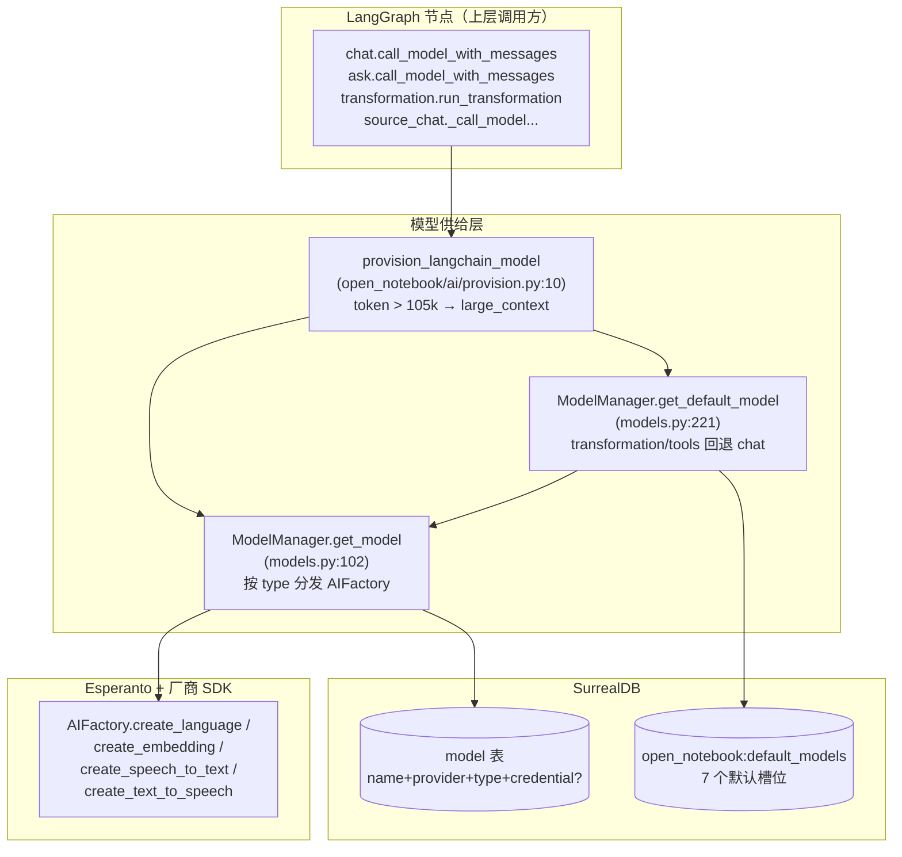

### 2.4 设计延续

- "DB 字段 `model.credential` 优先于 env"是后引入的（里程碑 7），但 `ModelManager.get_model` 的分流壳子在里程碑 1 就打好了基础。
- `DefaultModels.get_instance()` 故意绕过父类缓存（`models.py:73-95`），让 UI 改默认模型立即生效——这是 2024-10 决策的延续。

---

## 3. 里程碑 2：Transformations（2024-10-23）

### 3.1 当年发生了什么

引入"用户在 UI 里定义可复用的 prompt 模板，系统自动对新 source 应用"的 Transformation 机制，并把结果落成 `source_insight` 记录。这是 Open Notebook 从"只能搜资料"升级到"自动产出结构化洞察"的关键一步。

### 3.2 落点详情（八维）

| 维度 | 落点 |
|---|---|
| 模块/目录 | `open_notebook/domain/transformation.py`、`open_notebook/graphs/transformation.py`、`open_notebook/graphs/source.py`（`trigger_transformations`/`transform_content`）、`commands/source_commands.py`（`run_transformation_command`）、`api/routers/transformations.py`、`api/transformations_service.py` |
| 主要类/函数 | `Transformation`（ObjectModel，表 `transformation`）、`DefaultPrompts`（RecordModel `open_notebook:default_prompts`，含 `transformation_instructions`）、`run_transformation`（`graphs/transformation.py:23`）、`source_graph` 的 `trigger_transformations` 条件边（`graphs/source.py:162-181`，返回 `List[Send]` 扇出） |
| 对外接口 | `GET/POST/PUT/DELETE /api/transformations`；`POST /api/transformations/execute`（同步执行）；`POST /api/sources/{id}/insights`（异步，触发 `run_transformation_command`） |
| 数据结构 | `transformation` 表（`name`、`title`、`description`、`prompt`、`apply_default`）；`source_insight` 表（由 `source.add_insight` 写入）；`source.transformation_results` 数组 |
| 运行时组件 | 两条路径：① Source 摄入时由 Worker 跑 `source_graph`，并行 fan-out 调用 `transform_content` → `source.add_insight` → 异步 `create_insight` 命令（`commands/embedding_commands.py:717`）；② 用户显式触发 `POST /sources/{id}/insights` → Worker 跑 `run_transformation_command`（`commands/source_commands.py:180`） |
| 存储/状态 | SurrealDB（`transformation`、`source_insight`、`source.transformation_results`）；prompt 文本作为模板字符串落库，不被 Python import |
| 配置 | `DefaultPrompts.transformation_instructions`（前置 system prompt）；每个 `Transformation` 自带 `prompt`（Jinja2 模板，由 `ai_prompter.Prompter(template_text=...)` 渲染，`graphs/transformation.py:40`） |
| 相关 migration | `migrations/4.surrealql`（transformation 表与 source.transformation_results） |

### 3.3 流转图

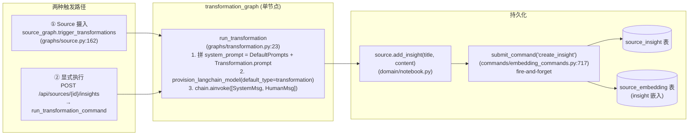

### 3.4 Gotcha

- `Transformation.apply_default` 字段决定"新 source 摄入时是否自动套用"；`source_graph` 在 `trigger_transformations` 节点读这个字段过滤。
- prompt 是 Jinja2 模板，但渲染时**没有沙箱**（`ai_prompter.Prompter(template_text=...)`）；用户能自由写 `{{ source.full_text }}` 这类引用。这是已知取舍——在 milestone 10 的 SSTI 加固里，沙箱只针对系统模板（`prompts/`）而**不**针对用户自定义 Transformation。

---

## 4. 里程碑 3：Streamlit → FastAPI 分离（2025 期间）

### 4.1 当年发生了什么

早期 Open Notebook 用 Streamlit 单文件跑 UI + 业务逻辑；2025 年期间彻底拆分：后端搬进 FastAPI（`api/`），前端搬进 Next.js（`frontend/`），Streamlit 相关代码全部删除。当前仓库已经找不到 `import streamlit`，只剩"生成文件名时的注释 `# Generate unique filename like Streamlit app`"（`api/routers/sources.py:42`）这种化石。

### 4.2 落点详情（八维）

| 维度 | 落点 |
|---|---|
| 模块/目录 | `api/`（FastAPI 后端）、`frontend/`（Next.js 前端）；中间再无 Streamlit 文件 |
| 主要类/函数 | `app = FastAPI(title=..., lifespan=lifespan)`（`api/main.py:157`）、`@asynccontextmanager lifespan`（`main.py:98`，启动时跑迁移 + podcast profile 数据迁移）、`PasswordAuthMiddleware`（`api/auth.py`） |
| 对外接口 | 所有业务都走 `/api/*`（21 个 router）；前端开发期直连 `localhost:5055`，生产期通过 Next.js rewrites 或 `/_sse-proxy` 转发 |
| 数据结构 | 不引入新表，但启动流程会创建 `_sbl_migrations` 版本表（由 `AsyncMigrationManager` 管理，`async_migrate.py`） |
| 运行时组件 | API 进程（uvicorn，端口 5055，`supervisord.conf` 的 `[program:api]`）+ Worker 进程（`surreal-commands-worker`，`[program:worker]`）+ 前端进程（`[program:frontend]`，port 8502） |
| 存储/状态 | SurrealDB（业务数据）；SQLite（LangGraph checkpoint）；文件系统（uploads/podcasts/tiktoken cache） |
| 配置 | `OPEN_NOTEBOOK_PASSWORD[_FILE]`（密码/Docker secret）、`CORS_ORIGINS`（默认 `*`，`main.py:62-64`）、`SURREAL_*`（DB 连接） |
| 相关 migration | `migrations/8-10.surrealql`（这一批是 Streamlit 退役期间同步演进的 schema） |

### 4.3 流转图

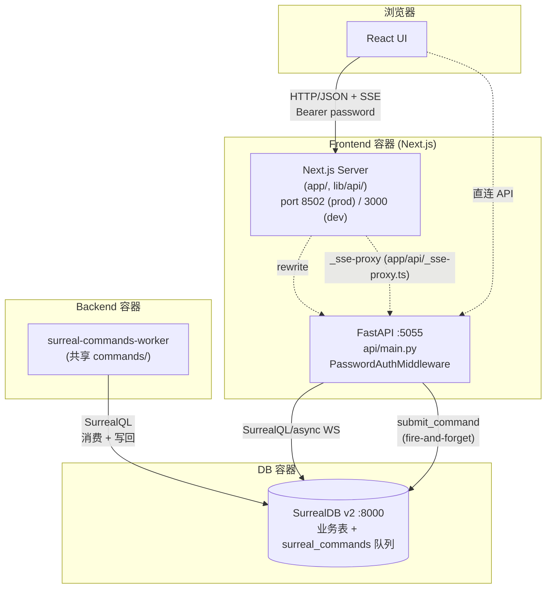

### 4.4 化石痕迹（grep 结果）

- `api/routers/sources.py:42`：`def generate_unique_filename` 的注释 `# Generate unique filename like Streamlit app`。
- `frontend/src/lib/api/` 早期的 axios 客户端是"对接 Streamlit 风格 API"演进而来的；现在路径已是干净的 `/api/*`。
- 历史目录 `new_docs/` 已被删除（commit `c15a563`）。

---

## 5. 里程碑 4：REST API 完整化（2025 期间）

### 5.1 当年发生了什么

把 Streamlit 时代留下的"散落函数"逐步收敛成 21 个 router + 17 个 service + Pydantic v2 schema 的规整 REST API。`api/client.py`（529 行）和 `api/chat_service.py` 仍保留了"API 自调 API"的中间态化石，是这一阶段的副产物。

### 5.2 落点详情（八维）

| 维度 | 落点 |
|---|---|
| 模块/目录 | `api/routers/`（21 个 router）、`api/*_service.py`（17 个 service）、`api/models.py`（693 行 Pydantic schema）、`api/client.py`（httpx 自调） |
| 主要类/函数 | `APIRouter` 实例 × 21；`ChatRequest`、`SourceCreate`、`PodcastGenerationRequest`、`CreateCredentialRequest`、`EpisodeProfile` 等 schema；`APIClient`（`api/client.py`） |
| 对外接口 | `/api/auth`、`/api/config`、`/api/notebooks`、`/api/sources`、`/api/notes`、`/api/search`、`/api/chat`、`/api/source_chat`、`/api/credentials`、`/api/models`、`/api/transformations`、`/api/insights`、`/api/podcasts`、`/api/episode_profiles`、`/api/speaker_profiles`、`/api/embedding(s)`、`/api/embeddings/rebuild`、`/api/settings`、`/api/context`、`/api/commands`、`/api/languages`（全部挂 `/api` 前缀，`main.py:290-312`） |
| 数据结构 | 全部领域表统一通过 `ObjectModel.save/get/get_all` 访问；schema 在 `api/models.py` 与 domain model 之间用 Pydantic 桥接 |
| 运行时组件 | API 进程；前端通过 axios 客户端（`frontend/src/lib/api/client.ts`）+ TanStack Query（`lib/hooks/`）消费 |
| 存储/状态 | 主要在 SurrealDB；少量只读端点（如 `/api/config`、`/api/languages`）只返回内存常量 |
| 配置 | `NEXT_PUBLIC_API_URL`、`NEXT_PUBLIC_API_TIMEOUT_MS`（前端）；`API_BASE_URL`（`api/client.py` 内部 httpx） |
| 相关 migration | `migrations/8-10.surrealql`（同期 schema 完善） |

### 5.3 流转图

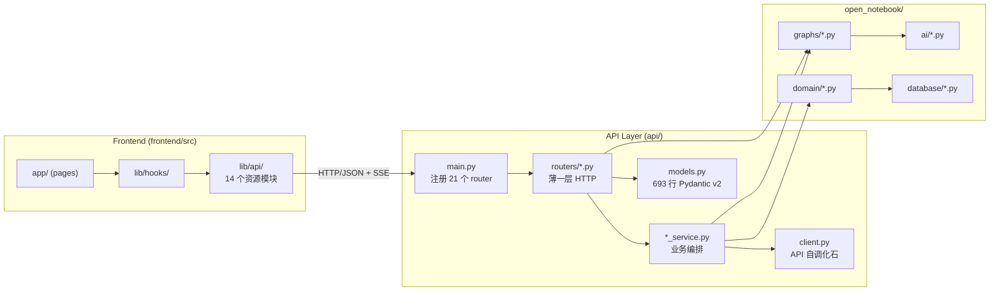

### 5.4 Gotcha

- `api/client.py:APIClient` 是"API 自己 httpx 调自己"的产物（`sources_service.py` 第 11 行同时 import `api_client` 与 `Source`），是迁移中间态。
- 异常分层：domain 层抛 `OpenNotebookError` 子类（`open_notebook/exceptions.py`），`main.py:217-286` 注册 9 个 handler 翻译成 HTTP 状态码（404/400/401/429/422/502/500）。
- 所有错误响应都用 `_cors_headers(request)` 主动补 CORS 头（`main.py:67-88`），避免 CORS 中间件来不及处理时浏览器拿不到错误体。

---

## 6. 里程碑 5：文件夹重组（2026-01 b76af50）

### 6.1 当年发生了什么

PR #379（commit `b76af50`）做了仓库级目录重组：把散落在根目录的 Python 模块统一搬进 `open_notebook/`，前端模块搬进 `frontend/src/`，文档统一到 `docs/`。这次重组本身不引入新功能，但为后续 Credential 系统、Podcast registry 等大改奠定了清晰的模块边界。

### 6.2 落点详情（八维）

| 维度 | 落点 |
|---|---|
| 模块/目录 | 当前仓库的顶层布局：`api/`、`open_notebook/`、`commands/`、`frontend/`、`docs/`、`prompts/`、`migrations/`（已在 `open_notebook/database/migrations/`）、`tests/`、`scripts/` |
| 主要类/函数 | 无新增；这次只是文件移动 |
| 对外接口 | 无变化 |
| 数据结构 | 无变化 |
| 运行时组件 | 无变化 |
| 存储/状态 | `pyproject.toml` 的包路径配置；`Dockerfile` 的 COPY 路径 |
| 配置 | `pyproject.toml` 的 `[tool.setuptools.packages.find]` / `[project]` |
| 相关 migration | 无 |

### 6.3 当前布局速览（Mermaid）

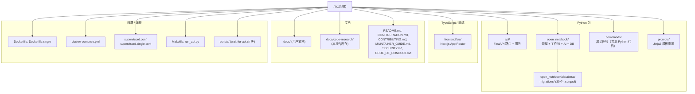

### 6.4 验证

当前根 `ls` 已经看不到 `pages/`（Streamlit 遗留）或散落的 `*.py`；所有 Python 都进 `api/`、`open_notebook/`、`commands/`。`docs/code-research/RESEARCH_PLAN.md` 是后续研究的产物，不是这次重组的一部分。

---

## 7. 里程碑 6：Next.js 16 升级（2026-01-14 f92c42a）

### 7.1 当年发生了什么

PR 把 Next.js 15 升级到 16，主要是为了修大文件上传（issue 当时是用户报告 PDF/MP3 上传失败），并把前端切到 standalone build 模式，让 Docker 镜像可以更紧凑。

### 7.2 落点详情（八维）

| 维度 | 落点 |
|---|---|
| 模块/目录 | `frontend/`（`next.config.ts`、`package.json`、`src/app/`、`src/app/api/_sse-proxy.ts`、`src/app/config/route.ts`、`src/proxy.ts`） |
| 主要类/函数 | `getApiUrl()`（`frontend/src/lib/config.ts`）、`getConfig()`（同文件）、SSE proxy handler（`src/app/api/_sse-proxy.ts`）、`config/route.ts`（返回运行期 `apiUrl`） |
| 对外接口 | 内部端点：`/_sse-proxy?path=...`（Next.js 服务端转发 SSE，避开浏览器原生 SSE 的认证头限制）；`/config`（客户端启动时拉取 API base URL） |
| 数据结构 | 无数据库结构变化 |
| 运行时组件 | Frontend 容器：`supervisord.conf` 的 `[program:frontend]`，`NODE_ENV=production PORT=8502 node server.js`（standalone build 输出） |
| 存储/状态 | `.next/standalone/`（构建产物，被打进 Docker 镜像）；浏览器 localStorage（auth token，`auth-storage` key） |
| 配置 | `NEXT_PUBLIC_API_URL`、`NEXT_PUBLIC_API_TIMEOUT_MS`（`lib/api/client.ts`，默认 10 分钟，`0` 禁用）；`INTERNAL_API_URL`（容器内部 Next.js → API，默认 `http://localhost:5055`） |
| 相关 migration | 无 |

### 7.3 流转图

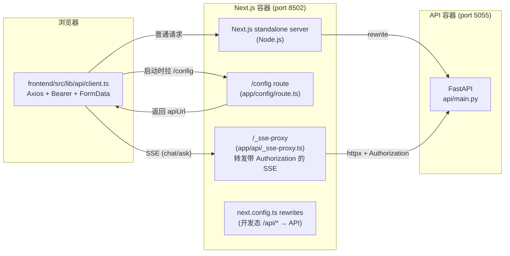

### 7.4 Gotcha

- standalone build 把 `node_modules` 精简到运行时实际用到的子集；`Dockerfile` 在 builder 阶段 `npm ci` 后再 `npm run build`，runtime 阶段只 COPY `frontend/.next/standalone` + `frontend/.next/static` + `frontend/public`。
- SSE 走代理是因为浏览器原生 `EventSource` 不支持自定义 header；Open Notebook 用 Bearer password，所以必须 Next.js server 端注入 header 后再流式转发（最近还有 `f103e40 fix: stream SSE responses end-to-end through Next.js proxy` 修复了中途断流）。

---

## 8. 里程碑 7：Credential 系统（2026-02-10 3f352cf）

### 8.1 当年发生了什么

PR #477/#540（commit `3f352cf`）把"所有 provider 的 key 挤在 `open_notebook:provider_configs` 单例里"的旧设计，重构成"每个 Credential 一条记录 + Fernet 加密 at-rest + 每个 Model 可显式 `credential` 外键绑定"。这是 Open Notebook 安全模型的最大一次升级。

### 8.2 落点详情（八维）

| 维度 | 落点 |
|---|---|
| 模块/目录 | `open_notebook/domain/credential.py`（286 行）、`open_notebook/utils/encryption.py`（198 行 Fernet 工具）、`open_notebook/ai/key_provider.py`（307 行，DB 优先 / env 回退）、`api/credentials_service.py`（915 行，最大 service）、`api/routers/credentials.py`（435 行）、`open_notebook/ai/connection_tester.py`（329 行，凭证测试）、`open_notebook/ai/model_discovery.py`（888 行，模型列表拉取） |
| 主要类/函数 | `Credential`（ObjectModel，表 `credential`，`domain/credential.py:58`）、`Credential.to_esperanto_config()`（`credential.py:102`）、`Credential._prepare_save_data()`（加密 api_key，`credential.py:227`）、`Credential.get_all()`（解密 + 容错，`credential.py:172`）、`key_provider.provision_provider_keys()`（`ai/key_provider.py:246`）、`encryption.encrypt_value/decrypt_value`（`utils/encryption.py:128,167`）、`credentials_service.test_credential`（`api/credentials_service.py:365`）、`credentials_service.discover_with_config`（`credentials_service.py:477`）、`credentials_service.register_models`（`credentials_service.py:673`）、`credentials_service.migrate_from_env`（`credentials_service.py:826`）、`credentials_service.migrate_from_provider_config`（`credentials_service.py:718`） |
| 对外接口 | `GET/POST/PUT/DELETE /api/credentials`、`POST /api/credentials/{id}/test`、`POST /api/credentials/{id}/discover`、`POST /api/credentials/{id}/register-models`、`POST /api/credentials/migrate-from-env`、`POST /api/credentials/migrate-from-provider-config`、`GET /api/credentials/status`、`GET /api/credentials/env-status` |
| 数据结构 | SurrealDB 表 `credential`（migration 12 定义全部字段：name、provider、modalities、api_key、base_url、endpoint、api_version、endpoint_llm/embedding/stt/tts、project、location、credentials_path、`config` FLEXIBLE 对象）；`model.credential` 外键（migration 12 第 29 行）；`open_notebook:provider_configs` 旧单例（migration 11，仅为迁移保留） |
| 运行时组件 | API 进程（CRUD + test + discover）；Worker 进程在跑 embedding/podcast 时通过 `key_provider` 间接读 Credential |
| 存储/状态 | SurrealDB（加密密文）；Fernet key 来自 `OPEN_NOTEBOOK_ENCRYPTION_KEY[_FILE]`（进程级缓存 `_ENCRYPTION_KEY`） |
| 配置 | `OPEN_NOTEBOOK_ENCRYPTION_KEY` 或 `OPEN_NOTEBOOK_ENCRYPTION_KEY_FILE`（Docker secrets）；`PROVIDER_ENV_CONFIG`（`credentials_service.py:33-64`，17 个 provider 的 env 变量映射）；`PROVIDER_MODALITIES`（`credentials_service.py:66-84`） |
| 相关 migration | `migrations/11.surrealql`（旧 `provider_configs` 单例，遗留）、`migrations/12.surrealql`（建 `credential` 表 + `model.credential` 外键）、`migrations/15.surrealql`（给 credential 加 FLEXIBLE `config` 字段，向前兼容） |

### 8.3 流转图

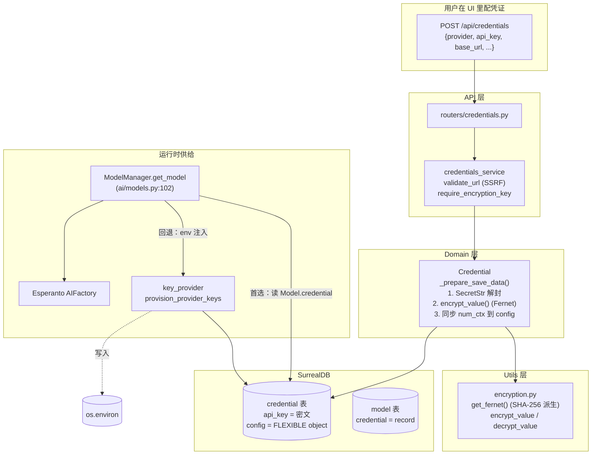

### 8.4 关键不变量

1. **DB 里 `api_key` 永远是 Fernet 密文**（除非 legacy 数据）；`_prepare_save_data` 强制加密。
2. **内存对象 `api_key` 永远是 `SecretStr(明文)`**；`get()`/`get_all()`/`_from_db_row()` 三个入口统一解密 + 包装。
3. **API 响应永不暴露 `api_key`**；`credential_to_response()` 只返回 `has_api_key: bool`。
4. **删除时支持 `?migrate_to=<other_cred_id>` 重绑 Model**，避免级联删除（`routers/credentials.py:336-340`）。
5. **解密失败的 Credential 不会被剔除**，而是返回带 `decryption_error` 字段的占位（`credential.py:179-213`），让用户能在 UI 里删除或修复（PR #753 的 graceful-decrypt-error 加固）。

---

## 9. 里程碑 8：Podcast model registry（2026-02-27 eac837d）

### 9.1 当年发生了什么

PR #632（commit `eac837d`）把播客配置从"裸字符串 `outline_provider/outline_model/transcript_provider/transcript_model/tts_provider/tts_model`"重构成"统一指向 `record<model>` 的引用"，让 Podcast 也走全局模型注册表。同步引入了 `language` 字段、每 speaker 独立 `voice_model` 覆盖、以及一个幂等的 `migrate_podcast_profiles()` 数据迁移函数。

### 9.2 落点详情（八维）

| 维度 | 落点 |
|---|---|
| 模块/目录 | `open_notebook/podcasts/models.py`、`open_notebook/podcasts/migration.py`、`commands/podcast_commands.py`、`api/routers/episode_profiles.py`、`api/routers/speaker_profiles.py`、`api/routers/podcasts.py`、`api/episode_profiles_service.py`、`api/speaker_profiles_service.py`（如有）、`api/podcast_service.py`、`api/podcast_api_service.py` |
| 主要类/函数 | `EpisodeProfile`（`podcasts/models.py:32`）、`SpeakerProfile`（同文件）、`PodcastEpisode`（带 `command` 字段指向 surreal-commands job）、模块级 `_resolve_model_config(model_id)`（`podcasts/models.py:11-29`）、`EpisodeProfile.resolve_outline_config / resolve_transcript_config`、`SpeakerProfile.resolve_tts_config`、`PodcastEpisode.get_job_status / get_job_detail`、`migrate_podcast_profiles()`（`podcasts/migration.py`）、`generate_podcast_command`（`commands/podcast_commands.py:69`，`@command("generate_podcast", retry={"max_attempts": 1})`） |
| 对外接口 | `GET/POST/PUT/DELETE /api/episode_profiles`、`/api/speaker_profiles`、`POST /api/podcasts/generate`、`GET /api/podcasts/episodes/{id}`、`POST /api/podcasts/episodes/{id}/retry` |
| 数据结构 | `episode_profile` 表（`outline_llm`、`transcript_llm` 是 `record<model>`；`language` BCP 47 字符串；legacy `outline_provider` 等保留为可选）；`speaker_profile` 表（`voice_model` 是 `record<model>`；`speakers[*].voice_model` 每 speaker 可覆盖）；`episode` 表（`episode_profile`/`speaker_profile` 以 dict 快照存储，`command` 指向 `record<command>`） |
| 运行时组件 | API 进程（CRUD）；Worker 进程跑 `generate_podcast_command`（内部调 `podcast_creator.configure/create_podcast`） |
| 存储/状态 | SurrealDB（profile + episode）；文件系统 `data/podcasts/episodes/{uuid}/`（PR #666 改用 UUID 目录名，避免用户填的 episode name 含特殊字符） |
| 配置 | `EpisodeProfile.outline_llm/transcript_llm`；`SpeakerProfile.voice_model` + 每 speaker 覆盖；都指向 Model 注册表 |
| 相关 migration | `migrations/7.surrealql`（profile 表初版，含 legacy 字符串字段）；`migrations/14.surrealql`（引入 `outline_llm/transcript_llm/voice_model` 这些 `record<model>` 字段 + `language` + per-speaker 覆盖）；`api/main.py:139-146` 在 lifespan 里调 `migrate_podcast_profiles()`（一次性数据迁移，幂等） |

### 9.3 流转图

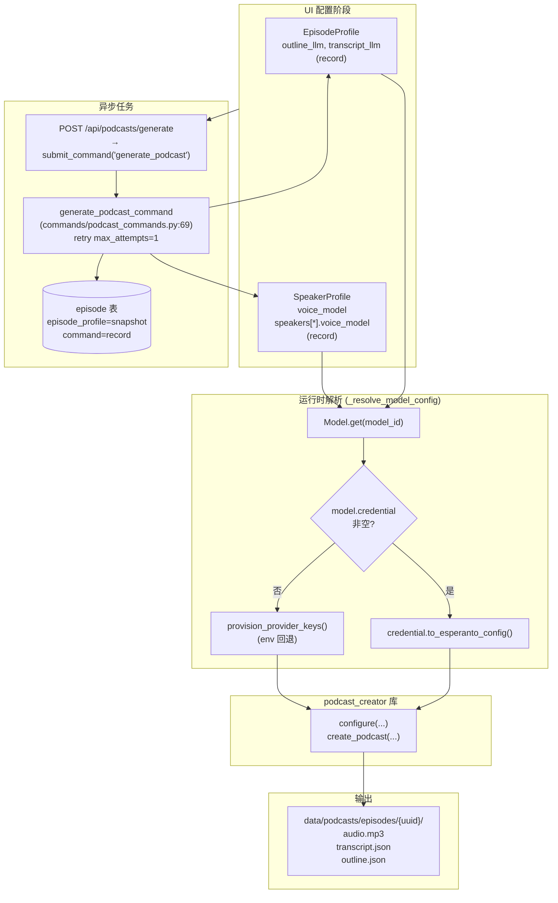

### 9.4 关键决策

- **snapshot 而非 reference**：`episode.episode_profile`/`speaker_profile` 存的是 dict 快照，不是 record 引用。这让用户后续修改 profile 不会影响已生成的 episode。
- **`max_attempts: 1`**：播客命令故意不重试，避免失败时生成多个 episode 记录；重试由用户显式触发 `POST /podcasts/episodes/{id}/retry`。
- **`_resolve_model_config` 复用**：outline / transcript / 每 speaker TTS 覆盖都走同一个 helper（`podcasts/models.py:11-29`），避免重复写"Model → Credential → config"逻辑。
- **migration 幂等**：`migrate_podcast_profiles()` 跳过已经填了新字段的 profile，找不到匹配 Model 时自动创建一个 link 到 provider credential 的 Model 记录。

---

## 10. 里程碑 9：SurrealDB injection 修复（2026-04-07 89eac04）

### 10.1 当年发生了什么

PR #731（commit `89eac04`，文件级 commit `e5b253b fix: prevent SurrealDB injection via order_by and unparameterized queries`）修了一个 SQL injection 类漏洞：所有 `get_all(order_by=...)` 端点把用户传的 `order_by` 字符串直接拼进 SurrealQL，攻击者可以注入任意查询。修复方式是引入"字段名白名单 + 方向白名单"的两层校验。

### 10.2 落点详情（八维）

| 维度 | 落点 |
|---|---|
| 模块/目录 | `open_notebook/domain/base.py`（核心修复）、`open_notebook/domain/credential.py`（也重写了 `get_all`）、`api/routers/notebooks.py`（router 层独立校验）、`open_notebook/database/repository.py`（参数化查询基础） |
| 主要类/函数 | `ObjectModel.get_all`（`base.py:39-100`，含完整的 `order_by` 白名单校验）、`Credential.get_all`（`credential.py:172`，同模式重写）、`repo_query(query_str, vars)`（`repository.py:65`，强制参数化）、`ensure_record_id`（防 RecordID 注入）、`routers/notebooks.py:27-49` 的 `order_by` Query 校验 |
| 对外接口 | 所有支持 `?order_by=` 的端点：`GET /api/notebooks`、`GET /api/credentials`、`GET /api/transformations`、`GET /api/notes`、`GET /api/episode_profiles`、`GET /api/speaker_profiles`、`GET /api/podcasts/episodes` |
| 数据结构 | 无表结构变化 |
| 运行时组件 | API 进程 |
| 存储/状态 | — |
| 配置 | — |
| 相关 migration | 无 |

### 10.3 修复细节

`base.py:50-83` 的白名单逻辑：

```python
# 伪代码示意（实际见 base.py:50-83）
import re
allowed_field_pattern = re.compile(r"^[a-z_][a-z0-9_]*$")
allowed_directions = {"asc", "desc"}

clauses = [c.strip() for c in order_by.split(",")]
validated_clauses = []
for clause in clauses:
    parts = clause.strip().split()
    if len(parts) == 1:
        if not allowed_field_pattern.match(parts[0].lower()):
            raise InvalidInputError(f"Invalid order_by field: '{parts[0]}'")
        validated_clauses.append(parts[0].lower())
    elif len(parts) == 2:
        if not allowed_field_pattern.match(parts[0].lower()) \
           or parts[1].lower() not in allowed_directions:
            raise InvalidInputError(f"Invalid order_by clause: '{clause.strip()}'")
        validated_clauses.append(f"{parts[0].lower()} {parts[1].lower()}")
    else:
        raise InvalidInputError(f"Invalid order_by clause: '{clause.strip()}'")

validated_order_by = ", ".join(validated_clauses)
query = f"SELECT * FROM {table_name} ORDER BY {validated_order_by}"
```

`routers/notebooks.py:23-58` 在 router 层做了第二层防御（明确列出 `allowed_fields` 集合，只接受 note/source 表里实际存在的列）。

### 10.4 流转图

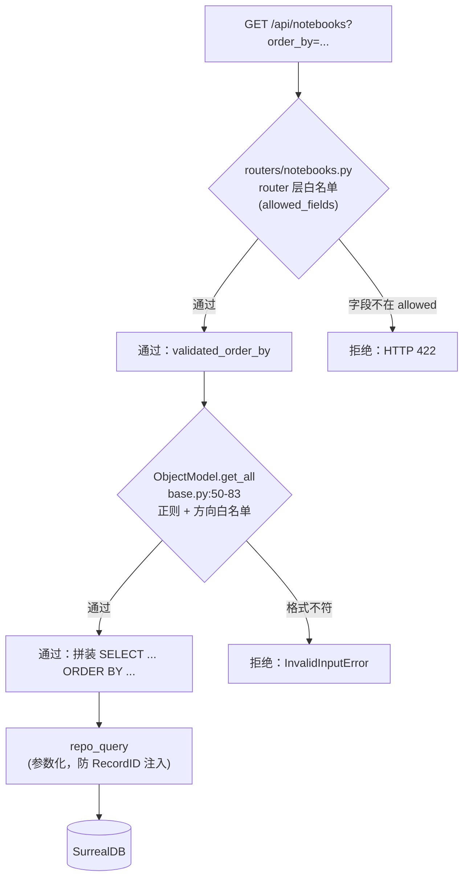

### 10.5 Gotcha

- **router 层白名单 ≠ domain 层白名单**：router 层用"已知字段集合"（更严格，只允许该表实际存在的列），domain 层用"通用字段正则"（更宽松，任何 `[a-z_][a-z0-9_]*` 都接受）。两层叠加是为了纵深防御。
- **`Credential.get_all` 单独重写**：因为 `Credential` 在解密时要包 try/except（怕 legacy 数据），所以没复用 `ObjectModel.get_all`。
- **`repo_query` 一直用参数化**：`SELECT * FROM $id` + `{"id": ensure_record_id(id)}`，不存在字符串拼接。这次修复补的是 `order_by` 这一个原本没参数化的口子。

---

## 11. 里程碑 10：Security round2（2026-04-09 1a35240）

### 11.1 当年发生了什么

PR #738（commit `1a35240`，文件级 `70a466a fix: prevent RCE via SSTI, path traversal file write, and LFI file read` + `2f75c59 fix: harden path validation to prevent sibling directory bypass`）补了一组安全加固：

1. **Jinja2 SSTI 沙箱**：用户能影响的模板（系统 prompt 渲染、Transformation prompt 渲染）改用 `SandboxedEnvironment`。
2. **文件写入路径校验**：上传文件名经过 `os.path.basename` + resolved path 必须在 upload 文件夹内。
3. **文件读取路径校验**：读取 source asset / podcast audio 时同理。
4. **SSRF 防护**：所有 URL 字段（`base_url`、`endpoint`、Azure endpoints）经过 `validate_url`，拒绝 link-local（169.254.x.x）等云 metadata 端点。
5. **KaTeX 安全渲染 LaTeX**：chat / insight / note / search 流式响应都用 `rehype-katex`，避免 inline HTML 注入。
6. **`[insight:id]` 引用渲染为可点击链接**：前端用 `parseSourceReferences` 把 LLM 输出里的 `[source:xxx]` / `[insight:yyy]` / `[note:zzz]` 渲染成 citation。

### 11.2 落点详情（八维）

| 维度 | 落点 |
|---|---|
| 模块/目录 | `api/credentials_service.py:validate_url`（SSRF）、`api/routers/sources.py:generate_unique_filename`（path traversal）、`frontend/src/lib/utils/source-references.tsx`（citation 渲染）、`frontend/src/components/**/*` 的 `rehypeKatex`（LaTeX 安全）、`open_notebook/utils/text_utils.py`（`<think>` 清洗 + text 提取，防 prompt injection 残留）、`api/auth.py`（密码中间件 + CORS）、`api/main.py:217-286`（异常 → HTTP 翻译） |
| 主要类/函数 | `validate_url(url, provider)`（`credentials_service.py:92`，拒绝 link-local）、`generate_unique_filename`（`routers/sources.py:41`，`os.path.basename` + `resolve()` 校验）、`parseSourceReferences(text)`（`source-references.tsx:46`，正则提取引用）、`convertSourceReferences`（`source-references.tsx:81`，渲染可点击）、`markdown-editor.tsx` / `StreamingResponse.tsx` / `ChatPanel.tsx` / `SourceDetailContent.tsx` / `SourceInsightDialog.tsx` 的 `rehypeKatex` |
| 对外接口 | 所有接受 URL 的端点：`POST /api/credentials`（`validate_url`）；所有接受文件上传的端点：`POST /api/sources`（`generate_unique_filename`） |
| 数据结构 | 无 |
| 运行时组件 | API 进程（URL / path 校验）；Frontend（KaTeX / citation 渲染） |
| 存储/状态 | — |
| 配置 | — |
| 相关 migration | 无 |

### 11.3 流转图

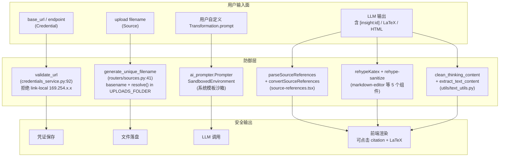

### 11.4 Gotcha

- **`[insight:id]` 是 LLM 自由输出的**，不是 Open Notebook 注入的。前端 `parseSourceReferences` 用正则 `(source_insight|insight|note|source):([a-zA-Z0-9_]+)` 抓所有出现（`source-references.tsx:53`）。`insight:` 是别名，归一化到 `source_insight`。
- **`validate_url` 故意允许私有 IP / localhost**：因为这是自托管应用，用户经常会接本机 Ollama / 内网 LM Studio。只拒绝 link-local（云 metadata 端点）和已知危险地址。
- **`generate_unique_filename` 的两段防御**：① `os.path.basename(original_filename)` 剥掉所有目录组件；② `resolved = full_path.resolve()` 后再检查 `str(resolved).startswith(str(file_path.resolve()) + os.sep)`，防住符号链接和 `..` 的 sibling 目录绕过（`2f75c59` 这次专门补的）。
- **KaTeX 全局启用**：从 chat / insight / note / search / markdown-editor 五个组件都能渲染数学公式（commit `6b6b3c6 feat: render LaTeX math beyond chat`、`8c49cb4 feat(chat): render LaTeX math with KaTeX`）。这是安全性 + 体验双赢：KaTeX 比 MathJax 更严格，不会执行嵌入的 JS。

---

## 12. 里程碑 11：新音频提供商矩阵（2026-06-02 0235632 / 9d99006）

### 12.1 当年发生了什么

两个 PR 把音频 provider 矩阵补全：

- `0235632 feat: expose new audio providers (Mistral STT/TTS, Deepgram TTS, xAI TTS)`：把 Mistral（voxtral 系列）、Deepgram（aura 系列）、xAI 的 TTS 接入。
- `9d99006 feat: complete audio matrix (Google/Vertex TTS, Google/ElevenLabs STT)`：补齐 Google/Vertex 的 TTS、Google 的 ElevenLabs STT。

同期还有 `f8625a5 feat: bump esperanto to 2.22.0 + Ollama num_ctx override`（升级 esperanto 支持新 provider）。

### 12.2 落点详情（八维）

| 维度 | 落点 |
|---|---|
| 模块/目录 | `open_notebook/ai/model_discovery.py`（PROVIDER_DISCOVERY_FUNCTIONS 注册表，17 个 provider）、`open_notebook/ai/connection_tester.py`（TEST_MODELS 测试模型表）、`api/credentials_service.py`（`PROVIDER_MODALITIES` 能力矩阵）、`pyproject.toml`（`esperanto>=2.20.0,<3`）、`docs/`（provider 支持矩阵同步） |
| 主要类/函数 | `PROVIDER_DISCOVERY_FUNCTIONS`（`model_discovery.py:719-737`，17 个 provider，其中 azure/vertex 标 `None` 表示需要凭证级 discovery）、`classify_model_type`（`model_discovery.py:157-190`，按特异性优先顺序：STT → TTS → embedding → language）、`TEST_MODELS`（`connection_tester.py:18-37`，每个 provider 配最便宜测试模型）、`PROVIDER_MODALITIES`（`credentials_service.py:66-84`，每个 provider 支持哪些模态）、`_get_test_audio`（`connection_tester.py:220-233`，用 `assets/test_speech.mp3` 真实语音测 STT） |
| 对外接口 | `GET /api/models/discover/{provider}`（拉远端模型列表）、`POST /api/models/sync/{provider}`（拉 + 自动注册成 Model 记录）、`POST /api/credentials/{id}/test`（端到端测试）、`POST /api/credentials/{id}/discover`（凭证级 discovery）、`POST /api/credentials/{id}/register-models`（批量注册） |
| 数据结构 | 不引入新表；新 provider 自动落到现有 `model` 和 `credential` 表 |
| 运行时组件 | API 进程跑 discovery / connection test；Worker 进程在 podcast / source ingestion 时调用对应 STT/TTS 模型 |
| 存储/状态 | — |
| 配置 | `ESPERANTO_TTS_TIMEOUT`（PR `f2efa0c` 文档化）；esperanto 包升级到 2.22.0 以支持 Mistral voxtral、xAI TTS、Deepgram aura；`060386e` 让 Ollama `num_ctx` 通过 Credential 的 FLEXIBLE `config` 字段持久化 |
| 相关 migration | 无（schema 不变；新 provider 是数据，不是结构） |

### 12.3 当前 17 个 provider 矩阵

来自 `PROVIDER_DISCOVERY_FUNCTIONS`（`model_discovery.py:719-737`）+ `PROVIDER_MODALITIES`（`credentials_service.py:66-84`）：

| Provider | language | embedding | STT | TTS | Discovery 方式 |
|---|---|---|---|---|---|
| openai | ✓ | ✓ | ✓ | ✓ | GET `/v1/models` |
| anthropic | ✓ | — | — | — | 静态列表 |
| google | ✓ | ✓ | ✓ | ✓ | GET `/v1/models` |
| groq | ✓ | — | ✓ | — | GET `/v1/models` |
| mistral | ✓ | ✓ | ✓ | ✓ | GET `/v1/models` |
| deepseek | ✓ | — | — | — | GET `/v1/models` |
| xai | ✓ | — | — | ✓ | GET `/v1/models` |
| openrouter | ✓ | ✓ | — | — | GET `/v1/models` |
| voyage | — | ✓ | — | — | 静态列表 |
| elevenlabs | — | — | ✓ | ✓ | 静态列表（含 scribe_v1 STT） |
| deepgram | — | — | — | ✓ | 静态列表（aura-* voices） |
| ollama | ✓ | ✓ | — | — | GET `/api/tags`（无 key） |
| vertex | ✓ | ✓ | — | ✓ | 静态（service account 走 `/credentials/{id}/discover`） |
| azure | ✓ | ✓ | ✓ | ✓ | 同上（按 deployment 名 discovery） |
| openai_compatible | ✓ | ✓ | ✓ | ✓ | 显式 config，GET `/models` |
| dashscope | ✓ | — | — | — | GET `/compatible-mode/v1/models` |
| minimax | ✓ | — | — | — | GET `/v1/models` |

### 12.4 流转图

```mermaid
flowchart LR
    subgraph Discovery["discovery 路径（17 provider）"]
        OpenAI["OpenAI 风格<br/>GET /v1/models<br/>(openai/groq/mistral/deepseek/<br/>xai/openrouter/dashscope/minimax)"]
        Static["静态列表<br/>(anthropic/voyage/<br/>elevenlabs/deepgram)"]
        Ollama["GET /api/tags<br/>(无 key)"]
        OpenAIC["显式 config<br/>(openai_compatible)"]
        Cred["凭证级 discovery<br/>(azure/vertex)"]
    end

    subgraph Classify["classify_model_type<br/>(model_discovery.py:157)"]
        Order["特异性优先顺序:<br/>1. speech_to_text<br/>2. text_to_speech<br/>3. embedding<br/>4. language"]
    end

    subgraph Register["register_models"]
        Batch["批量 SELECT 现有 model<br/>构造 (name_lower, type_lower) set<br/>O(1) 查重"]
        Insert["INSERT 新 Model<br/>link 到 Credential"]
    end

    subgraph DB[("model 表<br/>+ credential 表")]
        M[("model")]
        C[("credential")]
    end

    Discovery --> Classify
    Classify --> Register
    Register --> Batch
    Batch --> Insert
    Insert --> M
    M -- "credential 外键" --> C
```

### 12.5 Gotcha

- **`classify_model_type` 的顺序对 Mistral 至关重要**：`voxtral-mini-tts` 必须先匹配 TTS，否则会被 STT 规则错误吃掉（`model_discovery.py:114-120` 的专门注释）。
- **ElevenLabs STT 用 `scribe_v1`**（`model_discovery.py:546`）；这是 ElevenLabs 新推出的 transcription API。
- **Deepgram 只有 TTS**（aura-* voices），STT 通过其它 provider 实现；矩阵里 `deepgram` modalities 只有 `text_to_speech`。
- **Vertex discovery 是静态列表**（`credentials_service.py:606-616` 返回硬编码 5 个模型）：Vertex 要 service account OAuth2，不能直接用 API key 调 listing。

---

## 13. 里程碑 12：Ask/Synthesize 流程的演化落点

### 13.1 当年发生了什么

"Ask" 是 Open Notebook 的"多搜索综合"能力：用户问一个问题，系统先用 LLM 生成搜索策略（拆成 5 个子查询），并行执行每个子查询（向量检索 + LLM 答），最后再综合成最终答案。这条流程从早期"单次 vector_search + LLM 总结"逐步演化为今天的"Strategy → Send 扇出 → final_answer"三阶段 graph。

### 13.2 落点详情（八维）

| 维度 | 落点 |
|---|---|
| 模块/目录 | `open_notebook/graphs/ask.py`、`prompts/ask/{entry,query_process,final_answer}.jinja2`、`api/routers/search.py`、`api/search_service.py`（如果有）、`frontend/src/lib/hooks/use-ask.ts`（SSE 流式）、`frontend/src/components/search/StreamingResponse.tsx` |
| 主要类/函数 | `ThreadState`（`ask.py:44`，含 `question`、`strategy`、`answers`、`final_answer`）、`SubGraphState`（`ask.py:20`）、`Strategy` / `Search` Pydantic 模型（`ask.py:29-41`）、`call_model_with_messages`（生成 `Strategy`，`ask.py:51`，使用 `tools` 默认模型 + `PydanticOutputParser`）、`provide_answer`（每个子查询一个，并行 `Send` 扇出，调 `vector_search` + `tools` 模型）、`write_final_answer`（综合，用 `tools` 默认模型）、`vector_search`（`domain/notebook.py`，默认 `minimum_score=0.2`） |
| 对外接口 | `POST /api/search`（普通搜索）、`POST /api/search/ask`（SSE 流式，多阶段）；前端 `useAsk` hook 解析 newline-delimited JSON |
| 数据结构 | 只读：`source`、`note`、`source_insight`（含 embedding）。不写入任何东西，返回纯文本/SSE |
| 运行时组件 | API 进程；`provision_langchain_model` 默认类型 = `tools`（回退到 chat 模型） |
| 存储/状态 | 无持久化（每次 ask 都重新搜索 + 重新综合） |
| 配置 | `tools` 默认模型（`DefaultModels.default_tools_model`，空时回退 `default_chat_model`）；`embedding` 默认模型（用于 query embedding） |
| 相关 migration | 无 |

### 13.3 流转图

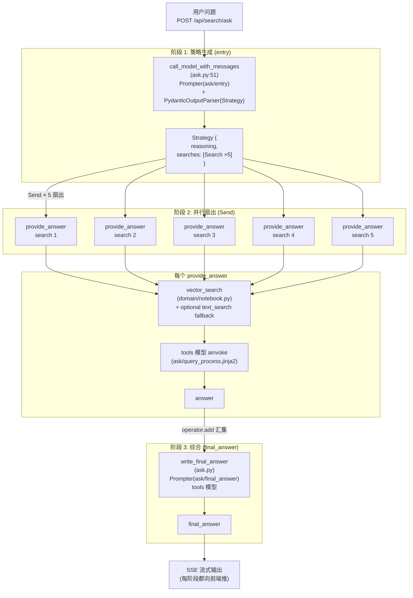

### 13.4 Gotcha

- **硬编码 vector_search**：`ask.py` 的 `provide_answer` 直接调 `vector_search`，没有 fallback 到 `text_search`（注释里曾计划但未实现）。
- **错误归一化**：每个节点都用 `classify_error()` 把厂商异常翻译成 `OpenNotebookError` 子类，让前端 `getApiErrorMessage` 能做 i18n。
- **`tools` 类型回退到 chat**：`provision_langchain_model(default_type="tools")` 在 `default_tools_model` 未配时回退到 `default_chat_model`（`models.py:235-237`），这是"约定式" fallback 而非显式。

---

## 14. 里程碑 13：LangGraph checkpoint 引入的落点

### 14.1 当年发生了什么

LangGraph 的 `StateGraph` 默认是无状态的；要让 chat 保持"对话记忆"，必须挂一个 `checkpointer`。Open Notebook 选择 `SqliteSaver`（来自 `langgraph-checkpoint-sqlite`），把每个 `thread_id`（即每个 chat session）的消息历史持久化到 `data/sqlite-db/checkpoints.sqlite`。

### 14.2 落点详情（八维）

| 维度 | 落点 |
|---|---|
| 模块/目录 | `open_notebook/graphs/chat.py`、`open_notebook/graphs/source_chat.py`、`open_notebook/config.py`、`open_notebook/utils/graph_utils.py`、`api/routers/chat.py`、`api/routers/source_chat.py` |
| 主要类/函数 | `SqliteSaver(conn)`（`chat.py:92`、`source_chat.py:248`）、`sqlite3.connect(LANGGRAPH_CHECKPOINT_FILE, check_same_thread=False)`（`chat.py:88-91`）、`agent_state.compile(checkpointer=memory)`（`chat.py:98`）、`LANGGRAPH_CHECKPOINT_FILE` 常量（`config.py:9`）、`get_session_message_count`（`utils/graph_utils.py`，反查 checkpoint 算消息数） |
| 对外接口 | 通过 `POST /api/chat`（notebook chat）和 `POST /api/source_chat`（source chat）间接触发；`thread_id` 来自 URL 或 body（一般是 `chat_session:{id}` 或 `source:{id}`） |
| 数据结构 | SQLite `checkpoints.sqlite`（LangGraph 自管 schema，包含 `checkpoints`、`writes`、`migration_v1` 等表）；SurrealDB 的 `chat_session` 表只是会话元数据，消息实体在 SQLite |
| 运行时组件 | API 进程（chat / source_chat 都在请求线程内 `graph.ainvoke`）；SQLite 文件被两个 graph 共享（模块级 `conn` 单例） |
| 存储/状态 | `./data/sqlite-db/checkpoints.sqlite`（单文件，进程级 sqlite3 连接，`check_same_thread=False`） |
| 配置 | `LANGGRAPH_CHECKPOINT_FILE`（`config.py:9`，默认 `./data/sqlite-db/checkpoints.sqlite`，`os.makedirs` 保证存在） |
| 相关 migration | 无（SQLite schema 由 LangGraph 自管） |

### 14.3 流转图

```mermaid
sequenceDiagram
    participant U as 用户
    participant API as routers/chat.py
    participant Graph as chat_graph (LangGraph)
    Node as chat.call_model_with_messages
    SQLite as checkpoints.sqlite
    DB as SurrealDB (chat_session)
    AI as AI Provider

    U->>API: POST /api/chat {session_id, message}
    API->>DB: 加载 ChatSession (metadata)
    API->>Graph: graph.ainvoke(state, config={configurable: {thread_id: session_id}})

    Graph->>SQLite: 按 thread_id 加载历史 messages
    SQLite-->>Graph: [previous messages...]
    Graph->>Node: call_model_with_messages(state, config)
    Node->>Node: ThreadPoolExecutor + new_event_loop<br/>(async provision_langchain_model)
    Node->>AI: model.invoke([SystemMsg] + history + new HumanMsg)
    AI-->>Node: AIMessage
    Node->>Node: clean_thinking_content
    Node-->>Graph: {"messages": [AIMessage]}

    Graph->>SQLite: 追加新消息 (atomic)
    Graph-->>API: final state
    API-->>U: {content, session_id}
```

### 14.4 Gotcha

- **sync 节点 + async provision 的桥接**：`chat.call_model_with_messages` 是同步函数（LangGraph 节点），但 `provision_langchain_model` 是 async。`chat.py:39-71` 用 `ThreadPoolExecutor + new_event_loop` 绕路。这是整个仓库最"脆弱"的代码之一。
- **SqliteSaver 是同步的**：`get_state` 不支持 async；router 层用 `await asyncio.to_thread(graph.get_state, config)` 包装（`routers/chat.py:193,362`、`routers/source_chat.py:236,423`）。
- **同一个 SQLite 文件被 chat / source_chat 共享**：两个 graph 都在模块级 `sqlite3.connect(LANGGRAPH_CHECKPOINT_FILE, check_same_thread=False)`，但 thread_id 命名空间隔离（chat 用 `chat_session:xxx`，source_chat 用 `source:xxx`）。
- **`get_session_message_count`** 反查 checkpoint 估算 token 占用（`utils/graph_utils.py`），用于 UI 提示用户"对话已经多长"。

---

## 15. 里程碑 14：异步任务系统 surreal-commands 的当前落点

### 15.1 当年发生了什么

content ingestion / embedding / podcast generation 都可能跑几十秒到几分钟，不适合占着 HTTP 请求线程。Open Notebook 没有引入 Celery/Redis，而是用了同生态的 `surreal-commands` 包：任务记录直接落在 SurrealDB 的 `surreal_commands` 表里，Worker 进程消费同一张表。这让"队列基础设施 = 数据库"，部署只需要 SurrealDB。

### 15.2 落点详情（八维）

| 维度 | 落点 |
|---|---|
| 模块/目录 | `commands/`（`__init__.py` 导入所有命令；`embedding_commands.py` 1063 行；`source_commands.py`；`podcast_commands.py`；`example_commands.py`）、`api/command_service.py`、`api/routers/commands.py`、`open_notebook/domain/notebook.py`（`Source.vectorize`、`Source.add_insight`、`Note.save` 都 fire-and-forget 提交命令）、`supervisord.conf` |
| 主要类/函数 | `@command(name, app="open_notebook", retry={...})` 装饰器（来自 `surreal_commands`）、`submit_command(app, command_name, args)`（`api/command_service.py:11`）、`execute_command_sync(app, command_name, args)`（`routers/sources.py:17`）、`get_command_status(command_id)`、`CommandService`（封装 submit/status/list/cancel）、所有 `CommandInput` / `CommandOutput` Pydantic 子类 |
| 对外接口 | `POST /api/sources`（提交 `process_source` 命令）、`POST /api/sources/{id}/retry`、`POST /api/podcasts/generate`（提交 `generate_podcast`）、`GET /api/commands/{command_id}`（前端轮询）、`POST /api/embeddings/rebuild`（提交 `rebuild_embeddings` 协调器） |
| 数据结构 | SurrealDB 表 `surreal_commands`（由包自管）；每个命令记录含 `app`、`name`、`args`、`status`（queued/running/success/failed）、`result`、`error_message`、`attempts`；`source.command` 和 `episode.command` 是 `record<command>` 外键 |
| 运行时组件 | Worker 进程：`supervisord.conf` 的 `[program:worker]`，命令 `surreal-commands-worker --import-modules commands`；与 API 共享同一份 Python 代码库 |
| 存储/状态 | SurrealDB `surreal_commands` 表；`source.command` / `episode.command` 字段 |
| 配置 | `surreal_commands` 包读同样的 `SURREAL_*` env；`@command(retry={"max_attempts": N, "wait_strategy": "exponential_jitter", "stop_on": [ValueError]})` |
| 相关 migration | 无（`surreal_commands` 表由包自管 schema） |

### 15.3 当前命令清单

来自 `commands/`：

| 命令名 | 文件 | 用途 | 重试 |
|---|---|---|---|
| `process_source` | `commands/source_commands.py:49` | 内容摄入（extract + save + transform + embed 扇出） | 15 次，exp jitter 1-120s，stop_on=[ValueError] |
| `run_transformation` | `commands/source_commands.py:180` | 对已存在 source 跑 transformation 生成 insight | 5 次 |
| `embed_note` | `commands/embedding_commands.py:173-188` | 嵌入单条 note | 5 次，exp jitter 1-60s |
| `embed_insight` | `commands/embedding_commands.py:269-283` | 嵌入单条 source_insight | 5 次 |
| `embed_source` | `commands/embedding_commands.py:366-380` | 切块 + 批量嵌入 source.full_text | 5 次 |
| `create_insight` | `commands/embedding_commands.py:717-731` | 创建 source_insight + fire embed_insight | 5 次 |
| `vectorize_source` | `commands/embedding_commands.py:666` | 兼容 pre-1.6 的旧队列任务（legacy） | None（不重试） |
| `rebuild_embeddings` | `commands/embedding_commands.py:898` | 协调器：为所有 source/note/insight 批量提交 embed_* | None（协调器不重试） |
| `generate_podcast` | `commands/podcast_commands.py:69` | 调 podcast-creator 生成 episode | `max_attempts: 1`（避免重复 episode） |
| `process_text` / `analyze_data` | `commands/example_commands.py:43,94` | 测试 surreal-commands 框架的示例 | — |

### 15.4 流转图

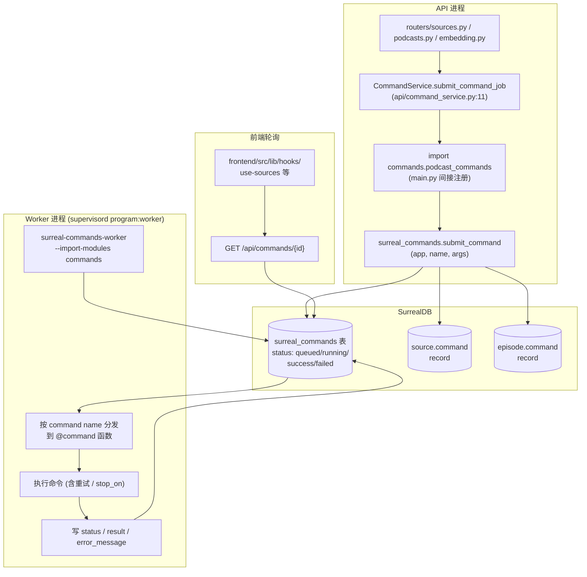

### 15.5 Gotcha

- **API 进程也注册命令**：`api/command_service.py:20` 注释说 "This is needed because submit_command validates against local registry"——意思是 API 进程 import `commands` 不是为了执行，而是为了让 `submit_command` 能校验命令名合法。真正的执行在 Worker 进程。
- **`stop_on: [ValueError]` 是黑名单**：所有异常都重试，**除了** `ValueError`（表示永久失败，如内容抽不出）。这比白名单更"宽容"，新异常类型自动重试。
- **`generate_podcast` 故意 `max_attempts: 1`**：避免失败重试时生成多个 episode 记录；用户显式点 retry 才会重跑。
- **`process_source` 双路径**：默认异步（`submit_command` fire-and-forget）；如果 `async_processing=false`，则 `execute_command_sync` 在 HTTP 请求线程内同步跑（带 5 分钟超时），用于小文本即时反馈。
- **`Note.save()` 自动提交 `embed_note`**（fire-and-forget）；`Source.save()` 不自动提交 embedding，要显式调 `Source.vectorize()`。

---

## 16. 跨里程碑协作关系图

把 14 个里程碑的"主代码锚点"放进同一张图，可以看到几个明显的协作簇：

1. **凭证 + 模型 + Provision 簇**（里程碑 1、7、11、12、14）：所有需要调 AI 的地方都共享 `ModelManager` + `provision_langchain_model`。
2. **异步任务簇**（里程碑 2、8、14）：Transformation、Podcast、Embedding 都依赖 `surreal-commands`。
3. **安全加固簇**（里程碑 9、10）：`order_by` 白名单 + SSRF + path traversal + citation 渲染共同构成"输入防线"。
4. **Schema 演进簇**（里程碑 1、2、7、8）：migrations 1-15 把 schema 从"单表 Notebook"演进到"`model` + `credential` + `record<model>` 引用"的完整图。

```mermaid
flowchart LR
    subgraph M1["里程碑 1: 多模型"]
        MM["ModelManager<br/>(ai/models.py:102)"]
        Prov["provision_langchain_model<br/>(ai/provision.py:10)"]
        Model[("model 表")]
        Def[("default_models 单例")]
    end

    subgraph M7["里程碑 7: Credential"]
        Cred["Credential<br/>(domain/credential.py:58)"]
        CredTbl[("credential 表")]
        Enc["Fernet<br/>(utils/encryption.py)"]
        KP["key_provider<br/>(ai/key_provider.py)"]
    end

    subgraph M11["里程碑 11: 音频矩阵"]
        Disc["model_discovery<br/>(ai/model_discovery.py:719)"]
        CT["connection_tester<br/>(ai/connection_tester.py)"]
    end

    subgraph M2["里程碑 2: Transformations"]
        Trans["Transformation<br/>(domain/transformation.py)"]
        TransGraph["transformation_graph<br/>(graphs/transformation.py)"]
    end

    subgraph M8["里程碑 8: Podcast"]
        EP["EpisodeProfile<br/>(podcasts/models.py:32)"]
        SP["SpeakerProfile"]
        PodCmd["generate_podcast_command<br/>(commands/podcast_commands.py:69)"]
        PodCreate["podcast_creator 库"]
    end

    subgraph M12["里程碑 12: Ask"]
        AskG["ask_graph<br/>(graphs/ask.py)"]
        AskEntry["entry / query_process / final_answer<br/>(prompts/ask/)"]
    end

    subgraph M13["里程碑 13: Checkpoint"]
        ChatG["chat_graph + SqliteSaver<br/>(graphs/chat.py)"]
        SChatG["source_chat_graph<br/>(graphs/source_chat.py)"]
        SQLite[("checkpoints.sqlite")]
    end

    subgraph M14["里程碑 14: surreal-commands"]
        SC["surreal_commands 队列"]
        Cmds["commands/*.py<br/>(process_source / embed_* /<br/>generate_podcast / run_transformation)"]
        Worker["Worker 进程"]
    end

    subgraph M9_10["里程碑 9+10: 安全"]
        Validate["validate_url + generate_unique_filename<br/>+ order_by 白名单 + citation 渲染"]
    end

    subgraph M3_4_5_6["里程碑 3-6: 架构骨架"]
        API["FastAPI + 21 router<br/>(api/)"]
        FE["Next.js 16<br/>(frontend/)"]
        Layout["仓库布局<br/>(b76af50)"]
    end

    %% 协作线
    M1 -- "Model.credential 外键" --> M7
    M7 -- "to_esperanto_config" --> M1
    M11 -- "sync_provider_models" --> M1
    M11 -- "test_credential" --> M7

    M2 -- "transformation 应用到新 source" --> M14
    M8 -- "generate_podcast 命令" --> M14
    M14 -- "Cmds 调 ModelManager" --> M1
    M14 -- "PodCmd 解析 profile" --> M8
    M14 -- "source_graph 触发 transformations" --> M2

    M12 -- "vector_search 用 embedding" --> M1
    M12 -- "tools 模型 provision" --> M1
    M13 -- "chat_graph 调 provision" --> M1

    M3_4_5_6 -- "API 路由调 graph" --> M12
    M3_4_5_6 -- "API 路由调 graph" --> M13
    M3_4_5_6 -- "API 路由提交命令" --> M14

    M9_10 -. "校验所有输入" .-> M3_4_5_6
    M9_10 -. "校验 credential URL" .-> M7
    M9_10 -. "校验 upload filename" .-> M14
```

### 16.1 协作矩阵（文字版）

| 协作对 | 共享组件 | 关系描述 |
|---|---|---|
| 多模型 ↔ Credential | `Model.credential` 外键 | Model 通过外键绑定 Credential；`ModelManager.get_model` 优先用 `credential.to_esperanto_config()` |
| 多模型 ↔ 音频矩阵 | `model` 表 + `PROVIDER_DISCOVERY_FUNCTIONS` | discovery 拉回的模型自动写入 `model` 表；`classify_model_type` 决定 `type` 字段 |
| Credential ↔ 音频矩阵 | `connection_tester` + `model_discovery` | 都通过 `credential.to_esperanto_config()` 取 config；`test` 用 TEST_MODELS 验证，`discover` 用 listing API 拉列表 |
| Credential ↔ Podcast | `_resolve_model_config` | podcast 命令解析 profile 里的 `record<model>` 引用，间接依赖 Credential 加密系统 |
| Transformations ↔ surreal-commands | `run_transformation_command`、`create_insight_command` | Transformation 既可同步执行（API 线程）也可异步（Worker）；结果通过 `source.add_insight` → `create_insight` fire-and-forget |
| Podcast ↔ surreal-commands | `generate_podcast_command` | 播客生成是异步命令，`max_attempts: 1` 避免重复 |
| Podcast ↔ 多模型 | `EpisodeProfile.outline_llm/transcript_llm`、`SpeakerProfile.voice_model` | 所有 LLM/TTS 引用都指向 `record<model>`，统一走 `ModelManager` |
| Ask ↔ 多模型 | `provision_langchain_model(default_type="tools")` | 策略生成 + 综合 + 每个子查询都用 `tools` 默认模型 |
| Checkpoint ↔ 多模型 | `chat_graph` 节点调 `provision_langchain_model(default_type="chat")` | 每个 chat 请求都经过 provision；thread_id 绑定到 chat_session |
| Checkpoint ↔ Ask | （无直接协作） | ask_graph 不用 checkpoint（无状态），chat_graph 才用 |
| 安全 ↔ 全部 | `validate_url`、`generate_unique_filename`、`order_by` 白名单、citation 渲染 | 横切关注点，覆盖所有输入/输出面 |
| 架构骨架 ↔ 全部 | `FastAPI + 21 router + Pydantic v2` | 所有里程碑的产物都通过 REST API 暴露 |

---

## 17. 读者路径建议

### 17.1 按"我想看现在怎么实现"读

| 想看什么 | 读哪里 |
|---|---|
| 模型选择与 provision | `open_notebook/ai/provision.py:10` → `open_notebook/ai/models.py:102`（`ModelManager.get_model`）→ `open_notebook/ai/key_provider.py:246`（env fallback） |
| 凭证加密 | `open_notebook/utils/encryption.py`（Fernet 全文）+ `open_notebook/domain/credential.py:227`（`_prepare_save_data` 加密路径） |
| Transformation 触发 | `open_notebook/graphs/source.py:162`（`trigger_transformations` 扇出）→ `open_notebook/graphs/transformation.py:23`（节点实现）→ `commands/source_commands.py:180`（异步命令） |
| Podcast 生成 | `commands/podcast_commands.py:69`（命令入口）→ `open_notebook/podcasts/models.py:11`（`_resolve_model_config`）→ `podcast_creator` 库 |
| Ask 多阶段 | `open_notebook/graphs/ask.py:51`（entry）→ `Send` 扇出 → `provide_answer` → `write_final_answer`；`prompts/ask/{entry,query_process,final_answer}.jinja2` |
| Chat 历史 | `open_notebook/graphs/chat.py:88-98`（SqliteSaver + checkpointer）+ `data/sqlite-db/checkpoints.sqlite` |
| 异步任务 | `commands/__init__.py`（注册）→ `api/command_service.py:11`（提交）→ `supervisord.conf [program:worker]`（消费） |
| 安全防御 | `api/credentials_service.py:92`（validate_url）→ `api/routers/sources.py:41`（filename）→ `open_notebook/domain/base.py:39`（order_by 白名单）→ `frontend/src/lib/utils/source-references.tsx`（citation） |
| 音频 provider 矩阵 | `open_notebook/ai/model_discovery.py:719`（17 provider 注册表）+ `api/credentials_service.py:66`（modalities 矩阵） |
| 数据库迁移 | `open_notebook/database/async_migrate.py:91`（`AsyncMigrationManager`）+ `open_notebook/database/migrations/*.surrealql`（30 个脚本） |

### 17.2 按"我想看为什么这样设计"读

| 想理解什么 | 先读 | 再跳到 |
|---|---|---|
| 为什么有 Credential 系统 | `docs/code-research/02_mechanism_ai_provisioning.md`（机制深入） | `docs/code-research/07_evolution_history.md`（演进史，凭证一节） |
| 为什么用 surreal-commands | `docs/code-research/05_workflow.md`（5 条流程对照） | `docs/code-research/04_dependencies.md`（依赖选型理由） |
| 为什么 chat 是 sync 节点 | `docs/code-research/05_workflow.md`（chat 流程一节） | `open_notebook/graphs/CLAUDE.md`（graphs 子模块说明） |
| 为什么 order_by 要白名单 | 本文档 §10 | `docs/code-research/07_evolution_history.md`（injection 一节） |
| 为什么 Next.js 升级到 16 | 本文档 §7 | `docs/code-research/07_evolution_history.md`（升级一节） |
| 为什么 podcast 用 snapshot | 本文档 §9 | `open_notebook/podcasts/CLAUDE.md` |
| 为什么 17 个 provider 分类这样 | 本文档 §12 | `docs/code-research/02_mechanism_ai_provisioning.md`（厂商分类对照表） |
| 整体架构 | `docs/code-research/01_architecture.md` | 本文档（按里程碑跳转） |

### 17.3 按"我想改某个能力"读

| 想改什么 | 改哪里 | 注意什么 |
|---|---|---|
| 加一个新 AI provider | ① `api/credentials_service.py:33`（`PROVIDER_ENV_CONFIG`）+ `:66`（`PROVIDER_MODALITIES`）；② `open_notebook/ai/key_provider.py:28`（`PROVIDER_CONFIG`）；③ `open_notebook/ai/model_discovery.py:719`（注册 discovery 函数）；④ `open_notebook/ai/connection_tester.py:18`（`TEST_MODELS`）；⑤ UI provider 列表 | 同步改 4 处；别忘了 `classify_model_type` 的模式匹配（特异性优先） |
| 加一个新的 transformation | UI 创建即可（`POST /api/transformations`）；如想改默认前置 prompt，改 `DefaultPrompts.transformation_instructions` | 用户填的 prompt 不走沙箱；不要让用户 prompt 影响 system 模板 |
| 加新 chat session 类型 | 复制 `graphs/chat.py`，定义新的 `ThreadState`；决定要不要 SqliteSaver（要历史就加，不要就不加） | thread_id 命名空间要和现有 chat / source_chat 隔开 |
| 加新异步任务 | ① 在 `commands/` 下加文件，用 `@command(name, app="open_notebook", retry={...})` 装饰；② `commands/__init__.py` re-export；③ 在 service 层调 `CommandService.submit_command_job` | 决定 `stop_on`（永久失败异常类型）和 `max_attempts`；podcast 类避免重试 |
| 加新数据库字段 | ① 写 `migrations/N.surrealql`（DEFINE FIELD）；② 在 `AsyncMigrationManager.__init__` 里加路径（`async_migrate.py:98-171`）；③ 更新 domain model 的 `nullable_fields` ClassVar | SCHEMAFULL 表加 FLEXIBLE object 字段可避免后续改 schema（参考 migration 15） |
| 加新安全校验 | 输入层：在 `routers/*.py` 或 service 加 validator；输出层：在 `frontend/src/lib/utils/` 加 sanitizer | 同时考虑 CORS（`main.py:_cors_headers`）和异常翻译（`main.py:217-286`） |

---

## 附：关键文件索引（按里程碑编号）

| # | 关键文件 | 行号锚点 |
|---|---|---|
| 1 | `open_notebook/ai/models.py` | `:19`（Model）、`:73`（DefaultModels）、`:102`（ModelManager.get_model）、`:221`（get_default_model）、`:267`（model_manager 单例） |
| 1 | `open_notebook/ai/provision.py` | `:10`（provision_langchain_model）、`:23`（105k 阈值）、`:45`（large_context 升级） |
| 2 | `open_notebook/domain/transformation.py` | 全文（Transformation + DefaultPrompts） |
| 2 | `open_notebook/graphs/transformation.py` | `:23`（run_transformation）、`:40`（Prompter 渲染） |
| 2 | `open_notebook/graphs/source.py` | `:162-181`（trigger_transformations + transform_content 扇出） |
| 2 | `commands/source_commands.py` | `:49`（process_source）、`:180`（run_transformation） |
| 3 | `api/main.py` | `:98`（lifespan）、`:157`（FastAPI 实例）、`:175`（PasswordAuthMiddleware）、`:189`（CORS） |
| 3 | `api/auth.py` | `:36`（excluded_paths）、`:44`（Bearer 校验） |
| 4 | `api/main.py` | `:290-312`（21 个 router 注册） |
| 4 | `api/routers/` | 21 个 router 文件 |
| 4 | `api/models.py` | 693 行 Pydantic v2 schema |
| 5 | 仓库根 | `api/`、`open_notebook/`、`commands/`、`frontend/src/`、`docs/`、`prompts/` |
| 6 | `frontend/next.config.ts` | rewrites 配置 |
| 6 | `frontend/src/app/api/_sse-proxy.ts` | SSE 转发 |
| 6 | `frontend/src/lib/config.ts` | `getApiUrl()` |
| 6 | `frontend/src/app/config/route.ts` | `/config` 端点 |
| 7 | `open_notebook/domain/credential.py` | `:58`（类定义）、`:102`（to_esperanto_config）、`:172`（get_all）、`:227`（_prepare_save_data） |
| 7 | `open_notebook/utils/encryption.py` | `:29`（get_secret_from_env）、`:93`（懒加载）、`:128`（encrypt_value）、`:167`（decrypt_value） |
| 7 | `open_notebook/ai/key_provider.py` | `:28-73`（PROVIDER_CONFIG）、`:246`（provision_provider_keys）、`:286`（provision_all_keys deprecation） |
| 7 | `api/credentials_service.py` | `:33`（PROVIDER_ENV_CONFIG）、`:66`（PROVIDER_MODALITIES）、`:92`（validate_url）、`:199`（require_encryption_key）、`:365`（test_credential）、`:477`（discover_with_config）、`:673`（register_models）、`:718`（migrate_from_provider_config）、`:826`（migrate_from_env） |
| 7 | `api/routers/credentials.py` | 全文（435 行，11 个端点） |
| 7 | `open_notebook/database/migrations/11.surrealql` | 旧 ProviderConfig 单例（legacy） |
| 7 | `open_notebook/database/migrations/12.surrealql` | credential 表 + model.credential 外键 |
| 7 | `open_notebook/database/migrations/15.surrealql` | credential.config FLEXIBLE |
| 8 | `open_notebook/podcasts/models.py` | `:11`（_resolve_model_config）、`:32`（EpisodeProfile）、`SpeakerProfile`、`PodcastEpisode` |
| 8 | `open_notebook/podcasts/migration.py` | 全文（migrate_podcast_profiles） |
| 8 | `commands/podcast_commands.py` | `:26`（build_episode_output_dir）、`:69`（generate_podcast_command） |
| 8 | `open_notebook/database/migrations/7.surrealql` | profile 表初版（含 legacy 字段） |
| 8 | `open_notebook/database/migrations/14.surrealql` | outline_llm/transcript_llm/voice_model 引入 |
| 9 | `open_notebook/domain/base.py` | `:39-100`（get_all 白名单校验） |
| 9 | `open_notebook/domain/credential.py` | `:172`（Credential.get_all 同模式） |
| 9 | `api/routers/notebooks.py` | `:23-58`（router 层 allowed_fields 二次防御） |
| 9 | `open_notebook/database/repository.py` | `:65`（repo_query 参数化）、`:40`（ensure_record_id） |
| 10 | `api/credentials_service.py` | `:92`（validate_url，SSRF） |
| 10 | `api/routers/sources.py` | `:41`（generate_unique_filename，path traversal） |
| 10 | `frontend/src/lib/utils/source-references.tsx` | `:46`（parseSourceReferences）、`:81`（convertSourceReferences） |
| 10 | `frontend/src/components/ui/markdown-editor.tsx` | `:6`（rehypeKatex） |
| 10 | `frontend/src/components/source/{ChatPanel,SourceDetailContent,SourceInsightDialog}.tsx` + `search/StreamingResponse.tsx` | rehypeKatex 引入 |
| 11 | `open_notebook/ai/model_discovery.py` | `:157`（classify_model_type）、`:525`（elevenlabs）、`:552`（deepgram）、`:582`（dashscope）、`:616`（minimax）、`:719-737`（PROVIDER_DISCOVERY_FUNCTIONS） |
| 11 | `open_notebook/ai/connection_tester.py` | `:18-37`（TEST_MODELS）、`:220-233`（_get_test_audio）、`:256-329`（test_individual_model） |
| 12 | `open_notebook/graphs/ask.py` | `:29-41`（Strategy/Search 模型）、`:51`（call_model_with_messages）、`provide_answer`、`write_final_answer` |
| 12 | `prompts/ask/entry.jinja2` + `query_process.jinja2` + `final_answer.jinja2` | 三阶段 prompt 模板 |
| 13 | `open_notebook/graphs/chat.py` | `:8`（SqliteSaver import）、`:39-71`（sync/async 桥）、`:88-98`（conn + compile） |
| 13 | `open_notebook/graphs/source_chat.py` | `:243-255`（同模式） |
| 13 | `open_notebook/config.py` | `:9`（LANGGRAPH_CHECKPOINT_FILE） |
| 13 | `open_notebook/utils/graph_utils.py` | `:10`（get_session_message_count） |
| 14 | `commands/__init__.py` | re-export 所有命令 |
| 14 | `commands/embedding_commands.py` | `:173`（embed_note）、`:269`（embed_insight）、`:366`（embed_source）、`:590`（legacy vectorize_source）、`:717`（create_insight）、`:898`（rebuild_embeddings） |
| 14 | `commands/source_commands.py` | `:49`（process_source） |
| 14 | `commands/podcast_commands.py` | `:69`（generate_podcast） |
| 14 | `api/command_service.py` | `:11`（submit_command_job）、`:20`（import commands 注册） |
| 14 | `api/routers/commands.py` | 全文（GET /commands/{id} 轮询） |
| 14 | `supervisord.conf` | `[program:api]` / `[program:worker]` / `[program:frontend]` |

---

*本文档基于 commit `cac4e01` 时的代码撰写，所有行号引用均对应该 commit 的实际源文件。读者路径建议中的 `07_evolution_history.md` 在撰写时仍在并行生成中；如已就绪，可作为本文档的"历史维度"对照阅读。*
