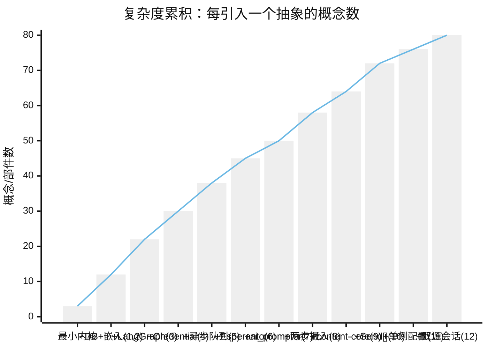
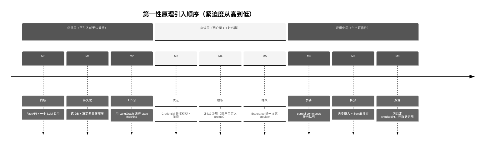
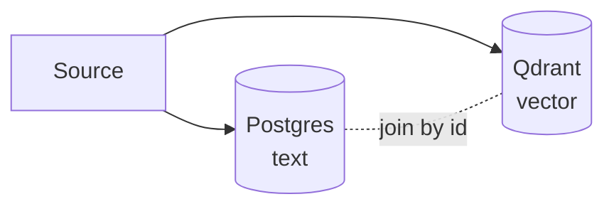
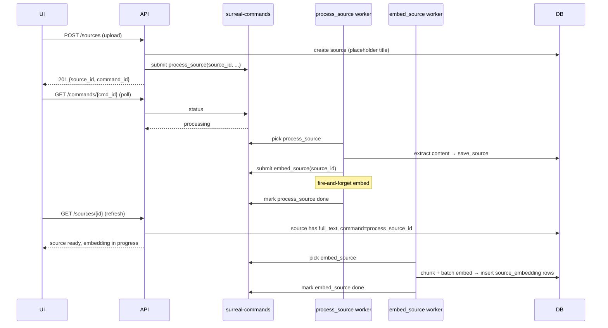

# 09 · 设计演化（第一性原理推演）

> 一句话总览：Open Notebook 不是被"设计"出来的，而是被一连串具体问题"逼"出来的——从"一个能跑的本地 LLM 助理"出发，每暴露一类问题就引入一层抽象，最终叠加成 SurrealDB + LangGraph + Esperanto + surreal-commands + ai_prompter + Credential 这套看似复杂但每层都有不可替代职责的栈。

本文档刻意忽略演进时间线，按 **最小设计 → 暴露问题 → 增量设计 → 复杂度代价 → 当前代码落点** 五段式重新推演 12 个核心设计决策。每一段都从"如果只解决这个问题，最少需要什么"开始，逼出抽象本身的真实成本。

---

## 目录

1. [设计决策矩阵](#1-设计决策矩阵)
2. [复杂度累积图](#2-复杂度累积图)
3. [第一性原理路线图](#3-第一性原理路线图)
4. [12 个决策的五段式推演](#4-12-个决策的五段式推演)
5. [反思：折中与未来演化方向](#5-反思折中与未来演化方向)

---

## 1. 设计决策矩阵

| # | 设计决策 | 最小设计 | 关键暴露问题 | 引入的抽象 | 主要复杂度代价 | 当前代码落点 |
|---|----------|----------|--------------|------------|----------------|--------------|
| 1 | 嵌入存进 SurrealDB 而非独立向量库 | Postgres + Qdrant | 双写一致性、备份协调 | SurrealDB 内建 `embedding array<float>` + `vector::similarity::cosine` | 生态小、SQL 弱、需手写 `fn::vector_search` | `open_notebook/database/migrations/1.surrealql:16-26` |
| 2 | 用图数据库（SurrealDB）而非 pgvector + 关系表 | `note_sources` 多对多中间表 | 多种边类型、级联删除策略 | `DEFINE TABLE reference TYPE RELATION` / `artifact` / `refers_to` | 关系语义靠 schema 约束，删除策略要手写 | `open_notebook/database/migrations/1.surrealql:54-60`、`repository.py:106-120` |
| 3 | 用 LangGraph 而非裸 LangChain | 单次 `model.invoke()` | 状态持久化、并行 fan-out、流式分片 | `StateGraph` + `Send[]` + `SqliteSaver` | 节点粒度选择、async/sync 桥接 hack | `open_notebook/graphs/chat.py:88-98`、`ask.py:146-155` |
| 4 | API key 做成 Credential 领域模型而非 .env | `.env` 文件 | 多套凭证切换、UI 管理、加密 | `Credential(ObjectModel)` + Fernet + `Model→credential` 链接 | 加密密钥管理、env 兼容、解密失败处理 | `open_notebook/domain/credential.py:29-287` |
| 5 | Podcast 异步（surreal-commands）而 Chat 同步 | 同步 TTS | 超长脚本、多 voice、UI 反馈 | `@command` + `max_attempts=1` + retry 端点 | 任务状态机、用户主动重试 | `commands/podcast_commands.py:69-300`、`api/routers/podcasts.py:215-269` |
| 6 | 引入 Esperanto 抽象层 | 直接用 langchain-community | 厂商能力差异（流式/工具/JSON/STS/TTS）、版本漂移 | `AIFactory` + `to_langchain()` 桥接 | 多一层映射、调试链变长 | `open_notebook/ai/models.py:102-176`、`provision.py:10-62` |
| 7 | Jinja2 沙箱（ai_prompter）而非 f-string | `f-string` | 用户自定义 prompt 的 SSTI 风险 | `ai_prompter.Prompter` 内置 `SandboxedEnvironment` | 模板语法学习成本、自定义过滤器受限 | `open_notebook/graphs/transformation.py:1,40`、`ask.py:54` |
| 8 | Source ingestion 拆成 process_source + embed_source 两步 | 同步提取 + 嵌入 | 大文件超时、UI 阻塞、失败重试粒度 | 两步 surreal-commands 任务 + `Source.command` 字段 | 两套状态、用户需理解"处理 vs 向量化"两阶段 | `commands/source_commands.py:49-155`、`open_notebook/domain/notebook.py:477-523` |
| 9 | content-core 而非 langchain DocumentLoader | langchain DocumentLoader | 多模态（PDF/音视频/网页）格式差异大 | content-core `extract_content()` + `ProcessSourceState` | 多一层依赖、错误传播需 sentinel 检测 | `open_notebook/graphs/source.py:1,4,78` |
| 10 | Ask 用 Send[] 并行多策略而 Chat 不用 | 单次 LLM 调用 | 多视角检索覆盖度不足 | `Strategy` Pydantic 模型 + `Send[]` fan-out + `write_final_answer` 合成 | 状态 schema 分两层（ThreadState/SubGraphState） | `open_notebook/graphs/ask.py:44-155` |
| 11 | ContentSettings 做成单例 RecordModel | config.py 静态值 | UI 运行时修改、版本化、按实例隔离 | `RecordModel` 单例 + `_load_from_db` + `update()` | 单例缓存 vs DB 刷新的取舍 | `open_notebook/domain/content_settings.py:8-26`、`base.py:239-362` |
| 12 | ChatSession 元数据在 SurrealDB，消息在 SqliteSaver | 全 SurrealDB | 消息流式追加 vs 元数据结构化关系 | `LANGGRAPH_CHECKPOINT_FILE` (SQLite) + `refers_to` 边 (SurrealDB) | 两个数据源、备份/迁移要协调 | `open_notebook/graphs/chat.py:88-98`、`open_notebook/database/migrations/2.surrealql:1-7` |

---

## 2. 复杂度累积图

每引入一个设计，系统的"概念数 / 移动部件数 / 故障模式数"都跳一个台阶。下图按第一性原理引入顺序展示复杂度的累积：



```mermaid
%%{init: {"theme": "neutral"}}%%
flowchart TB
    classDef base fill:#e0f2fe,stroke:#0369a1,color:#0369a1
    classDef layer fill:#fef3c7,stroke:#b45309,color:#7c2d12
    classDef cost fill:#fee2e2,stroke:#b91c1c,color:#7f1d1d

    subgraph L0["L0 · 最小内核：FastAPI + LLM + 文件"]
        A1[POST /chat] --> A2[OpenAI SDK]
    end

    subgraph L1["L1 · 持久化层（决策 1, 2）"]
        B1[(SurrealDB)]
        B2[embedding array<float>]
        B3[RELATE 边]
    end

    subgraph L2["L2 · 工作流层（决策 3, 7, 9, 10）"]
        C1[LangGraph StateGraph]
        C2[ai_prompter 沙箱]
        C3[content-core]
        C4[Send[] 并行]
    end

    subgraph L3["L3 · AI 抽象层（决策 4, 6）"]
        D1[Esperanto AIFactory]
        D2[Credential 加密]
        D3[Model 链接 Credential]
    end

    subgraph L4["L4 · 异步与配置（决策 5, 8, 11, 12）"]
        E1[surreal-commands 队列]
        E2[两步摄入 process→embed]
        E3[ContentSettings 单例]
        E4[SQLite checkpoint + SurrealDB 元数据]
    end

    L0 --> L1 --> L2 --> L3 --> L4

    class L0 base
    class L1,L2 layer
    class L3,L4 cost
```

**读图要点**：
- 0 → 12 不是 12 步均匀增长，而是几段陡升（特别是引入 Credential、surreal-commands、Send[]）；
- 每个 L 级别都有自己的"故障面"——L1 故障是数据丢失、L2 是 workflow 卡死、L3 是凭证泄漏、L4 是任务悬空；
- 真正不可避免的只有 L0 和 L1 的一部分；L2-L4 的每一层都是"被某个具体问题逼出来"的，下一节逐个还原。

---

## 3. 第一性原理路线图

如果从 0 重做，应该按下面的顺序引入这些设计。**顺序由"不引入就立刻失效"的紧迫程度决定**：



```mermaid
%%{init: {"theme": "neutral"}}%%
flowchart LR
    M0[M0 内核<br/>1 个端点] --> M1[M1 持久化<br/>SurrealDB]
    M1 --> M2[M2 工作流<br/>LangGraph]
    M2 --> M3[M3 凭证<br/>Credential+Fernet]
    M3 --> M4[M4 模板<br/>ai_prompter]
    M4 --> M5[M5 抽象<br/>Esperanto]
    M5 --> M6[M6 异步<br/>surreal-commands]
    M6 --> M7[M7 拆分<br/>两步+Send[]]
    M7 --> M8[M8 双源<br/>SQLite+ SurrealDB]

    M0:::must
    M1:::must
    M2:::must
    M3:::should
    M4:::should
    M5:::should
    M6:::scale
    M7:::scale
    M8:::scale

    classDef must fill:#dcfce7,stroke:#15803d,color:#14532d
    classDef should fill:#fef9c3,stroke:#a16207,color:#422006
    classDef scale fill:#fee2e2,stroke:#b91c1c,color:#7f1d1d
```

**为什么是这个顺序**：
- M0-M2 是"必须层"：不解决就跑不起来；
- M3-M5 是"应该层"：第二个用户上手时就会暴露；
- M6-M8 是"规模化层"：长任务、大文件、多视角检索时才暴露。

注意：实际历史演进顺序与此不同（例如 ContentSettings 单例和 ai_prompter 比想象中早），本文档**只关心逻辑顺序**，不关心时间线。

---

## 4. 12 个决策的五段式推演

### 决策 1：嵌入存进同一数据库（SurrealDB）而不是独立向量库

**最小设计**
源文本进 Postgres，嵌入进 Qdrant/Chroma。两边各自索引，应用层做 join：



**暴露问题**
1. **双写一致性**：写 Postgres 成功、写 Qdrant 失败时，源已存在但不可搜索。要么引入分布式事务（重），要么容忍"幽灵 source"。
2. **备份/恢复协调**：备份 Postgres 后还要备份 Qdrant，且时间戳必须对齐，否则恢复后向量指向不存在的源。
3. **运维两套系统**：两套 Docker 容器、两套鉴权、两套监控、两套索引调优。
4. **跨库 join 性能**：检索返回 100 个 chunk → 应用层反查 100 次源元数据 → N+1 问题。

**增量设计**
SurrealDB 内建 `array<float>` 字段类型和 `vector::similarity::cosine` 函数。同一行里既有 `content`（文本）又有 `embedding`（向量），单条 SQL 同时拿到文本 + 相似度：

```surql
DEFINE FIELD embedding ON TABLE source_embedding TYPE array<float>;
-- 检索时：
SELECT source.id, content, vector::similarity::cosine(embedding, $query) as similarity
FROM source_embedding
WHERE vector::similarity::cosine(embedding, $query) >= $min_similarity
ORDER BY similarity DESC LIMIT $match_count
```

**复杂度代价**
1. **SurrealDB 相对新颖**：相比 Postgres + pgvector，社区小、文档稀、生产案例少；
2. **复杂查询能力弱**：没有 Postgres 那种 JOIN/CTE/窗口函数成熟度，`fn::vector_search` 要手写多步 array::union 聚合；
3. **向量索引仍是暴力扫描**：当前 `fn::vector_search` 没用 ANN 索引（如 HNSW），全表 `vector::similarity::cosine` 比较——百万级 chunk 时会慢；
4. **schema 演进靠手写 migration**：每次改 `vector_search` 函数都要 `REMOVE FUNCTION` + 重定义（见 migrations 1→2→3→9 的多次重写）。

**当前代码落点**
- 字段定义：`open_notebook/database/migrations/1.surrealql:20`（`embedding ON TABLE source_embedding TYPE array<float>`）、`:26`（source_insight）、`:39`（note）
- 检索函数：`open_notebook/database/migrations/9.surrealql:4-65`（`fn::vector_search` 最终版，含 `embedding != none` 和 `array::len` 守卫）
- Python 入口：`open_notebook/domain/notebook.py:738-768`（`vector_search()` 调 `fn::vector_search`）
- 注意：迁移 2/3/4/9 都重写了 `fn::vector_search`，体现了"向量检索策略本身在反复演进"——这正是同库的代价之一。

---

### 决策 2：用图数据库（SurrealDB）而非 pgvector + 关系表

**最小设计**
关系表 + 中间表：

```sql
CREATE TABLE note_sources (
  note_id UUID,
  source_id UUID,
  PRIMARY KEY(note_id, source_id)
);
```

**暴露问题**
1. **多种关系类型，每种语义不同**：
   - `source → notebook`：源属于笔记本（reference）
   - `note → notebook`：笔记属于笔记本（artifact）
   - `chat_session → notebook|source`：会话引用某容器（refers_to）
   - 这些边未来还会扩展（如 `insight → note`、`source → source` 引用链）
2. **级联删除策略复杂**：删 notebook 时，源是 exclusive 还是 shared？笔记永远删？共享源只 unlink？中间表模式要手写多条 DELETE，易漏。
3. **多态引用难**：`refers_to` 既可指向 notebook 也可指向 source，关系表要么两张表，要么用字符串 type 字段（失去 FK）。
4. **图查询天然递归**：找"笔记本 N 里所有源的所有 insight"在关系模型里要三层 join，图模型是 `notebook<-reference<-source->source_insight`。

**增量设计**
SurrealDB 的 `DEFINE TABLE ... TYPE RELATION FROM ... TO ...`：

```surql
DEFINE TABLE reference TYPE RELATION FROM source TO notebook;
DEFINE TABLE artifact TYPE RELATION FROM note TO notebook;
DEFINE TABLE refers_to TYPE RELATION FROM chat_session TO notebook|source;
```

`repo_relate()` 一行创建边：

```python
await repo_relate(source="source:abc", relationship="reference", target="notebook:xyz")
```

**复杂度代价**
1. **边没有独立索引/约束的全部能力**：不能像 Postgres 那样给中间表加复合唯一约束（`UNIQUE(note_id, source_id)`），靠业务层防重；
2. **关系语义靠 schema 约束，删除策略要手写**：见 `Notebook.delete()`（`open_notebook/domain/notebook.py:204-296`），含 exclusive/shared 判断、批量删边、逐个删 note——逻辑比 `ON DELETE CASCADE` 复杂得多；
3. **图查询语法需学习**：`<-reference.in` 这种反向遍历对新人不友好；
4. **`DEFINE EVENT source_delete` 残留**：早期靠数据库事件做级联（`migrations/1.surrealql:29-32`），后来改成应用层级联，留下了历史包袱。

**当前代码落点**
- 三种边的定义：`open_notebook/database/migrations/1.surrealql:54-60`（reference, artifact）、`2.surrealql:4-6`（refers_to 单指向 notebook）、`8.surrealql:5-7`（refers_to 改为 `notebook|source` 多态）
- `repo_relate()` 实现：`open_notebook/database/repository.py:106-120`（构造 `RELATE {source}->{rel}->{target} CONTENT $data`）
- 应用层级联：`open_notebook/domain/notebook.py:204-296`（含 `assigned_others` 计数判断 exclusive）
- 反向图查询示例：`get_sources()` 用 `select in as source from reference where out=$id`（`notebook.py:30-45`）、`get_chat_sessions()` 用 `<- chat_session` 双层遍历（`notebook.py:131-152`）

---

### 决策 3：为什么需要 LangGraph 而不是裸 LangChain

**最小设计**
裸 LangChain Agent + 一个 system prompt：

```python
from langchain_openai import ChatOpenAI
model = ChatOpenAI(...)
response = await model.ainvoke([SystemMessage(...), HumanMessage(user_input)])
```

**暴露问题**
1. **状态难持久化**：用户关浏览器再打开，消息历史丢了。裸 LangChain 不管 checkpointing。
2. **工具循环（agentic loop）难控制**：Agent 调用工具 → 拿结果 → 再调用 → ... 没有清晰的终止条件和重试边界。
3. **流式分片（streaming）跨节点**：用户想看到"边检索边回答"的实时流，裸 chain 做不到节点间流。
4. **分支并行（fan-out）**：Ask 流程要并行跑 5 个搜索策略再合成——裸 LangChain 是线性 chain，不支持。
5. **节点级错误处理**：某节点失败要分类（永久 vs 暂时），不能整条 chain 一刀切。

**增量设计**
LangGraph 的 `StateGraph`：
- **State schema**：TypedDict 显式声明每个字段，节点只返回要更新的字段（自动 reducer）；
- **Checkpointer**：`SqliteSaver` 自动把每个节点的状态写入 SQLite，重启可恢复；
- **`Send[]`**：conditional edges 返回 `Send` 列表实现 fan-out 并行；
- **节点级异常**：每个节点用 `classify_error()` 转 `OpenNotebookError`，全局 handler 映射 HTTP 状态码。

**复杂度代价**
1. **状态 schema 设计成本**：要分 `ThreadState`（顶层）和 `SubGraphState`（fan-out 子图），字段映射要清晰（见 ask.py 的两套 TypedDict）；
2. **节点粒度选择**：太粗（一个大节点做所有事）失去 LangGraph 价值；太细（每行一个节点）调试地狱。Open Notebook 选择"功能级"粒度（content_process / save_source / transform_content）；
3. **async/sync 桥接 hack**：LangGraph 节点是 sync 的，但 `provision_langchain_model` 是 async——`chat.py` 用 `concurrent.futures.ThreadPoolExecutor` + `asyncio.new_event_loop()` 绕开（`chat.py:39-71`），是公认脆弱点；
4. **checkpoint SQLite 单文件**：多 worker 并发写同一个 SQLite 文件靠 `check_same_thread=False`，规模化时是瓶颈。

**当前代码落点**
- Chat 工作流：`open_notebook/graphs/chat.py:88-98`（`SqliteSaver(conn)` + `agent_state.compile(checkpointer=memory)`）
- Ask fan-out：`open_notebook/graphs/ask.py:146-155`（`agent_state.compile()` 无 checkpointer 因为无状态跨调用）
- Source ingestion graph：`open_notebook/graphs/source.py:185-200`（用 `add_conditional_edges` + `trigger_transformations` 返回 Send[] 列表）
- Transformation 单节点 graph：`open_notebook/graphs/transformation.py:71-75`（最小可用 graph，体现"先有图、再填节点"的可扩展模式）
- async/sync hack：`open_notebook/graphs/chat.py:39-71`、`source_chat.py` 同模式

---

### 决策 4：为什么把 API key 做成领域模型（Credential）而不是 config 文件

**最小设计**
`.env` 文件：

```
OPENAI_API_KEY=sk-xxx
ANTHROPIC_API_KEY=sk-yyy
```

`python-dotenv` 启动时加载，`os.environ.get()` 直接读。

**暴露问题**
1. **多套凭证切换**：用户有个人 OpenAI key 和公司 OpenAI key，想按笔记本选择——.env 只有单值；
2. **UI 管理**：每次改 key 要 SSH 进服务器改 .env 重启——非技术用户无法用；
3. **按 provider 分类**：Azure 需 `endpoint + api_version + endpoint_llm + endpoint_embedding + ...` 共 7 个字段，flat env 难组织；
4. **加密**：.env 是明文，磁盘镜像泄漏 = key 泄漏；
5. **多 provider 多 modality**：一个 key 可能用于 LLM 也可能用于 Embedding，需要 `modalities: ["language", "embedding"]` 字段。

**增量设计**
- **Credential(ObjectModel)**：一张 `credential` 表，每条记录一组凭证，字段含 `name`、`provider`、`modalities`、`api_key`（加密）、`base_url`、`endpoint_*`；
- **Fernet 加密**：`OPEN_NOTEBOOK_ENCRYPTION_KEY` 派生密钥，`encrypt_value()` 写、`decrypt_value()` 读；
- **Model→Credential 链接**：`model` 表加 `credential` 字段（record 引用），模型知道用哪把钥匙；
- **env 兜底**：找不到 Credential 就走 `key_provider.provision_provider_keys()` 写 env var，Esperanto 读 env。

**复杂度代价**
1. **加密密钥管理**：`OPEN_NOTEBOOK_ENCRYPTION_KEY` 一旦丢失，所有 api_key 不可解密——`Credential.get_all()` 必须返回 `decryption_error` 标记（`credential.py:171-213`）；
2. **env 兼容的脆弱**：`provision_provider_keys()` 把 DB 里的 key 写回 `os.environ`——多 worker 时会互相覆盖、删了 Credential 但 env 仍存旧 key（`key_provider.py:283-307` 的 deprecation 注释直接承认）；
3. **多凭证策略**：每个 provider 多条 Credential 时，"用哪条"由 `Model.credential` 显式链接（避免歧义），但 `get_by_provider()` 仍返回列表给 UI 选；
4. **解密失败的优雅降级**：`get_all()` 捕获每行的解密异常并构造"error credential"占位（`credential.py:188-213`），保证 UI 不全崩；
5. **Schema 演进的兜底**：`config: FLEXIBLE TYPE option<object>`（migrations/15）的引入就是为了不再为每个 provider-specific 字段加 migration——但代价是字段在 Pydantic 和 DB 之间双向同步（`_mirror_config_to_fields`、`_prepare_save_data`，`credential.py:86-100, 227-259`）。

**当前代码落点**
- 加密原语：`open_notebook/utils/encryption.py:128-180`（`encrypt_value`/`decrypt_value` 用 Fernet + SHA-256 派生）
- Credential 模型：`open_notebook/domain/credential.py:29-287`（含 `to_esperanto_config()` 转换、`_from_db_row` 解密、`_mirror_config_to_fields` 双向同步）
- DB schema：`open_notebook/database/migrations/12.surrealql:6-29`（建 credential 表 + model 加 credential 字段）、`13.surrealql`（model→credential 链接的强化）、`15.surrealql`（FLEXIBLE config 对象）
- env 兜底：`open_notebook/ai/key_provider.py:246-280`（`provision_provider_keys()` 分发到 `_provision_simple_provider` / `_provision_vertex` / `_provision_azure` / `_provision_openai_compatible`）
- 模型 provisioning 入口：`open_notebook/ai/models.py:102-176`（`ModelManager.get_model()` 优先 credential.to_esperanto_config()，否则 env 兜底）

---

### 决策 5：为什么 Podcast 必须异步化（surreal-commands）而 Chat 可以同步

**最小设计**
同步 TTS：

```python
@app.post("/podcast")
async def make_podcast(req):
    audio = await generate_podcast(req.content)  # 5-10 分钟阻塞
    return FileResponse(audio)
```

**暴露问题**
1. **超长脚本**：一篇 30 分钟的 podcast 涉及 outline 生成、transcript 多轮对话、TTS 多 voice 合成、音频拼接，总时长 5-15 分钟——HTTP 请求早就超时；
2. **UI 反馈**：用户提交后看到 spinner 转 10 分钟，没有进度反馈——产品体验不可接受；
3. **失败重试**：TTS 厂商偶发 503，整个流程要重试还是只重试失败段？同步模式下用户已等待 5 分钟，无法优雅重试；
4. **资源隔离**：长任务占用 worker，普通 chat 请求被饿死；
5. **音频文件落盘**：要存到磁盘特定路径，同步模式下 HTTP timeout 后文件路径丢失。

**增量设计**
- **surreal-commands 任务队列**：`@command("generate_podcast", app="open_notebook", retry={"max_attempts": 1})` 注册到独立 worker；
- **fire-and-forget 提交**：API 返回 `command_id`，前端轮询 `/commands/{id}` 看状态；
- **`max_attempts: 1`**：失败不自动重试——因为部分 TTS 已合成音频，自动重试会产生重复 episode 记录；
- **用户主动重试端点**：`POST /podcasts/episodes/{id}/retry` 删除失败 episode 后重新提交。

**复杂度代价**
1. **任务状态机**：要维护 `queued | processing | completed | failed | cancelled`，每个状态对应 UI 不同视图；
2. **重试策略分裂**：embed_* 命令 `max_attempts=5`（幂等），podcast 命令 `max_attempts=1`（非幂等）——开发者要记住哪个是哪个；
3. **中间状态可见性**：用户看 episode 时要 `episode.get_job_detail()` 查 `surreal-commands` 拿状态（`podcasts/models.py`），是两套系统耦合点；
4. **`EpisodeProfile` 模型解析链**：所有 profile 的所有模型引用都要在命令开始时解析（`podcast_commands.py:120-208`），一个 profile 解析失败会导致 podcast-creator 验证全失败——代码用 "失败就 del profile" 兜底（`:170-193`）。

**为什么 Chat 不用异步？**
- Chat 单次响应通常 < 30 秒，HTTP 流式（SSE）可以边生成边推送；
- Chat 没有持久化产物（不像 podcast 的音频文件），不需要落盘；
- Chat 有 checkpoint（SqliteSaver），失败后用户重发即可，不需要显式重试端点。

**当前代码落点**
- Podcast 命令：`commands/podcast_commands.py:69-300`（`@command("generate_podcast", ..., retry={"max_attempts": 1})`，含 briefing 生成、profile 解析、UUID 输出目录）
- 重试端点：`api/routers/podcasts.py:215-269`（校验 failed 状态、删旧音频、删 episode 记录、重新提交）
- embed/source 命令（对比）：`commands/embedding_commands.py:177, 272, 369, 508, 594`（`max_attempts: 5` + 指数退避）
- source process 命令：`commands/source_commands.py:49-60`（`max_attempts: 15`，因为 SurrealDB v2 事务冲突需要长退避）

---

### 决策 6：为什么需要 Esperanto 这个额外抽象层

**最小设计**
直接用 langchain-community：

```python
from langchain_openai import ChatOpenAI
from langchain_anthropic import ChatAnthropic
```

每个 provider 一个包，应用层 switch。

**暴露问题**
1. **厂商能力差异**：
   - OpenAI 有原生 tools，Anthropic 用自己的 tool_use 格式；
   - Gemini 的 JSON mode 叫 `response_mime_type`，OpenAI 叫 `response_format`；
   - TTS：OpenAI 是 `tts-1`，ElevenLabs 是 `eleven_multilingual_v2`，Deepgram 又不同；
   - STT：每家参数完全不同。
2. **版本漂移**：langchain-openai 0.1.x → 0.2.x 改了 streaming API；如果直连，每次升级要改业务代码；
3. **同时支持 4 种模型类型**：LanguageModel / EmbeddingModel / SpeechToText / TextToSpeech，langchain 只擅长第一种；
4. **配置矩阵爆炸**：8 providers × 4 modality = 32 个 if 分支。

**增量设计**
- **Esperanto**：`AIFactory.create_language/embedding/speech_to_text/text_to_speech(model_name, provider, config)` 统一入口；
- **`to_langchain()` 桥接**：返回的对象有 `.to_langchain()` 方法，与 LangGraph 兼容（LangGraph 期待 LangChain Runnable）；
- **`Model` 领域对象**：DB 存 `name + provider + type + credential`，provisioning 时按 type 分发到不同 create_*。

**复杂度代价**
1. **多一层映射**：业务代码 → Esperanto → langchain_* → 实际 SDK，调试时栈深；
2. **Esperanto 自己的版本漂移**：依赖 `esperanto` 包，升级时也要测；
3. **`to_langchain()` 不是无损**：某些 provider-specific 特性（如 Anthropic 的 prompt caching hint）在 Esperanto 抽象层看不到，要用 `config` dict 透传；
4. **类型断言脆弱**：`get_speech_to_text()` 用 `assert isinstance(model, SpeechToTextModel)`（`models.py:192-194`），配置错误时才会爆，不是启动期检查。

**当前代码落点**
- 工厂方法分发：`open_notebook/ai/models.py:151-176`（按 `model.type` 分支到 `AIFactory.create_*`）
- LangChain 桥接：`open_notebook/ai/provision.py:61`（`return model.to_langchain()`）
- 类型断言：`open_notebook/ai/models.py:192-194, 204-206, 217-219`
- 大上下文自动升级：`open_notebook/ai/provision.py:23-28`（token > 105_000 时切 `large_context_model`）
- 配置 override 链：`models.py:120-145`（credential 优先 → key_provider 写 env → Esperanto 读 env）

---

### 决策 7：为什么用 Jinja2 沙箱（ai_prompter）而不是 str.format 或 f-string

**最小设计**
f-string：

```python
prompt = f"Summarize: {user_input}"
```

或 `str.format()`：

```python
template = "Summarize: {content}"
prompt = template.format(content=user_input)
```

**暴露问题**
1. **SSTI（Server-Side Template Injection）风险**：Transformation 的 prompt 字段是用户可编辑的（见 migrations/5.surrealql:19-156 的 6 个内置 transformation，用户可改可加）。如果用户在 prompt 里写 `{{ ''.__class__.__mro__[1].__subclasses__() }}`，f-string 不会执行（因为是字面量），但 Jinja2 不加沙箱时会 RCE；
2. **条件渲染需求**：根据是否有 source.full_text 决定渲染哪段——f-string 没有 if；
3. **循环渲染**：列出 sources/insights 列表时，要 for 遍历——f-string 没有 for；
4. **过滤器**：要 truncate、escape、capitalize——内置过滤器比重写好；
5. **模板复用**：`prompts/ask/entry.jinja` 等多个 jinja 文件被代码按名引用，统一加载机制。

**增量设计**
- **ai_prompter 库**：内置 `SandboxedEnvironment`（禁用 `__import__`、`subprocess` 等危险属性访问）；
- **`Prompter(prompt_template="ask/entry")` 或 `Prompter(template_text=...)`**：两种入口（按文件名 vs 按字符串）；
- **`Prompter(parser=PydanticOutputParser(...))`**：可注入 parser 自动生成 format instructions；
- **`.render(data=state)`**：渲染为字符串。

**复杂度代价**
1. **模板语法学习成本**：用户写自定义 transformation prompt 要懂 Jinja2 语法；
2. **自定义过滤器受限**：沙箱禁止任意 Python 调用，复杂逻辑要预定义过滤器；
3. **`parser` 注入与 parser 自身的脆弱**：PydanticOutputParser 用正则解析 LLM 返回的 JSON，遇到 `<think>` 标签会爆，所以全局 `clean_thinking_content()` 是必备补丁（`graphs/ask.py:70, 119, 138`、`transformation.py:56`）。

**当前代码落点**
- 模板文件结构：`prompts/ask/{entry,final_answer,query_process}.jinja`、`prompts/chat/system.jinja`、`prompts/source_chat/system.jinja`
- 使用入口：`open_notebook/graphs/ask.py:54-56`（带 parser）、`chat.py:32`（按名加载）、`transformation.py:40-42`（`Prompter(template_text=...)` 字符串模式）
- 思考标签清洗：`open_notebook/utils/__init__.py` 的 `clean_thinking_content()`（多处调用）

---

### 决策 8：为什么把 Source ingestion 拆成 process_source + embed_source 两步异步

**最小设计**
同步提取 + 嵌入：

```python
async def ingest(file):
    text = await extract(file)
    chunks = chunk(text)
    embeddings = await embed(chunks)
    save_source(text)
    save_embeddings(embeddings)
```

一个 HTTP 请求搞定。

**暴露问题**
1. **大文件超时**：100 页 PDF 提取 30 秒、分块嵌入 200 个 chunk 又要 1 分钟，HTTP 1 分钟就超时；
2. **UI 阻塞**：用户上传后看 spinner 90 秒，无反馈；
3. **失败重试粒度**：嵌入阶段失败时，文本提取已完成——整体重试浪费提取成本，整体放弃又丢了提取成果；
4. **HTTP 连接池耗尽**：长任务占用 worker，其他请求被排队（见 `Source.vectorize()` 的注释 `domain/notebook.py:481`："prevent HTTP connection pool exhaustion"）；
5. **进度反馈**：用户想知道"提取完成、正在嵌入"——同步模式下无法区分。

**增量设计**
两步 surreal-commands 任务：



- **process_source**：提取 → 保存 → 触发 transformations（Send[]）→ 提交 embed_source 命令（fire-and-forget）；
- **embed_source**：独立 worker 处理，分块、批量嵌入、批量插入；
- **Source.command 字段**：记录当前 process_source 命令 ID，UI 用它查状态；
- **状态可见**：`Source.get_status()` / `get_processing_progress()` 直接调 surreal-commands API。

**复杂度代价**
1. **两套状态**：source 状态（process_source 的 `queued/processing/completed/failed`）和 embed 状态（embed_source 的同样四态）——用户要理解"内容已就绪但还没嵌入"的中间态；
2. **失败处理分裂**：process_source 失败用 `stop_on: [ValueError]`（永久失败，标记 failed 让 UI 可重试）；embed_source 失败用 `max_attempts: 5`（暂时失败，自动退避）；
3. **fire-and-forget 的副作用**：`Source.vectorize()` 不 await embed_source 命令完成，所以 `process_source_command` 的 output 里 `embedded_chunks=0`（`commands/source_commands.py:138`，注释承认"hasn't completed yet"）；
4. **命令耦合**：`Source.command` 只指向 process_source，embed_source 的命令 ID 不存 Source 表——查嵌入进度要单独走 surreal-commands 列表查询；
5. **stop_on 策略的取舍**：早期 `process_source_command` 失败返回 `success=False` 而非 raise，导致任务被标记 `completed` 而 source 内容是错误字符串（`commands/source_commands.py:142-149` 注释详细记录了这个 bug 的修复）。

**当前代码落点**
- process_source 命令：`commands/source_commands.py:49-155`（`max_attempts: 15` 是为 SurrealDB v2 事务冲突留退避空间）
- embed_source 命令：`commands/embedding_commands.py:366-380`（`@command("embed_source", ...)` 入口）
- 命令提交：`open_notebook/domain/notebook.py:502-514`（`Source.vectorize()` 调 `submit_command("open_notebook", "embed_source", ...)`）
- Source→command 关联：`open_notebook/domain/notebook.py:362-372`（`command` 字段 + `parse_command` validator），`commands/source_commands.py:92-97`（命令开始时写 `source.command = command_id`）
- 状态查询：`open_notebook/domain/notebook.py:384-425`（`get_status`/`get_processing_progress` 调 `surreal_commands.get_command_status`）

---

### 决策 9：为什么需要 content-core 而不是 langchain DocumentLoader

**最小设计**
langchain DocumentLoader：

```python
from langchain_community.document_loaders import PyPDFLoader, WebBaseLoader
docs = PyPDFLoader("file.pdf").load()
```

**暴露问题**
1. **多模态格式差异大**：
   - PDF：PyPDFLoader / PyMuPDF / docling 几种引擎，效果天差地别；
   - YouTube：要拿 transcript，没字幕时调 STT API 转写音频；
   - 音视频（mp3/mp4）：要先提音频再 STT；
   - 网页：firecrawl vs jina vs 简单 fetch，效果和成本差异大；
   - DOCX/PPTX/EPUB/Markdown：每种都要专门 loader。
2. **引擎切换需求**：用户要按内容类型选引擎（"PDF 用 docling，URL 用 firecrawl"）——DocumentLoader 是按文件类型固定 loader；
3. **元数据统一**：每个 loader 返回的 metadata 字段不同，下游处理要适配 N 种结构；
4. **fallback 链**：docling 失败 → fallback 到 simple extractor——langchain 不内置；
5. **State 传递**：长流程要把 `ProcessSourceState` 在节点间传递，DocumentLoader 的接口是同步的 list[Document]，不友好。

**增量设计**
- **content-core 的 `extract_content(state)`**：单一入口，state 含 `url`、`file_path`、`url_engine`、`document_engine`、`output_format`；
- **`ProcessSourceState`**：TypedDict 模式，节点间流转的统一 state；
- **引擎选择**：`ContentSettings.default_content_processing_engine_doc/url` 控制（"auto" 让 content-core 智能选）；
- **STT 集成**：content-core 调用 Open Notebook 配置的 STT model 转写音频/视频。

**复杂度代价**
1. **多一层依赖**：content-core 是独立包，自己的依赖矩阵（docling 依赖 torch，巨大）；
2. **错误传播的 sentinel 模式**：content-core 不抛异常，而是返回 `title="Error"` + `content="Failed to extract content: ..."`——Open Notebook 必须主动检测这个 sentinel 并转 raise（`graphs/source.py:84-91`），否则错误内容会被当成正常文本嵌入；
3. **YouTube 软失败的歧义**：YouTube 没字幕时返回空 content，Open Notebook 要区分"空内容"vs"YouTube 没字幕，建议配 STT"（`graphs/source.py:93-105`）；
4. **STT model 注入耦合**：`content_process` 节点要先查 `DefaultModels.default_speech_to_text_model`，把 provider/name 写入 state 给 content-core（`graphs/source.py:62-77`）——这是 Open Notebook 与 content-core 的隐式契约。

**当前代码落点**
- 调用入口：`open_notebook/graphs/source.py:4`（`from content_core import extract_content`）、`:78`（`processed_state = await extract_content(content_state)`）
- sentinel 检测：`open_notebook/graphs/source.py:84-91`（`title == "Error"` + `startswith("Failed to extract content:")`）
- STT 注入：`open_notebook/graphs/source.py:62-77`（从 `DefaultModels` 拿 STT，写入 `content_state["audio_provider"]`、`audio_model`）
- 引擎配置：`open_notebook/domain/content_settings.py:10-15`（`default_content_processing_engine_doc/url`）

---

### 决策 10：为什么 Ask 流程用 Send[] 并行多策略而 Chat 不用

**最小设计**
单次 LLM 调用：

```python
results = await vector_search(question, 10)
answer = await model.ainvoke(system_prompt + results + question)
```

**暴露问题**
1. **单次检索覆盖不足**：用户的"问题"往往有多种解读视角——
   - "量子计算对密码学的影响" → 既需要量子计算原理，也需要 RSA/ECC 密码学背景；
   - 单次 vector_search 用原始问题的 embedding，可能只召回一个视角的文档。
2. **检索词 vs 自然语言问题**：用户问"为什么 X 不工作"，但库里是"X 的故障模式"——直接 embed 整个问句不如拆成多个搜索词；
3. **多步推理**：先搜索 → 看结果 → 发现缺信息 → 再搜索，单次调用做不到。

**增量设计**
Ask 的两阶段 LangGraph：

```mermaid
flowchart LR
    Q[用户问题] --> A[agent 节点<br/>LLM 生成 Strategy]
    A -->|Strategy.searches: List[Search]| T[trigger_queries<br/>返回 Send[]]
    T --> P1[provide_answer #1<br/>vector_search + LLM]
    T --> P2[provide_answer #2<br/>vector_search + LLM]
    T --> P3[provide_answer #3<br/>vector_search + LLM]
    T --> P4[provide_answer #4<br/>vector_search + LLM]
    T --> P5[provide_answer #5<br/>vector_search + LLM]
    P1 --> F[write_final_answer<br/>合成 N 个答案]
    P2 --> F
    P3 --> F
    P4 --> F
    P5 --> F
    F --> Ans[最终答案]
```

- **agent 节点**：LLM 生成 `Strategy(searches: List[Search])` Pydantic 对象，每个 Search 含 `term`（搜索词）+ `instructions`（告诉 LLM 找什么）；
- **trigger_queries**：conditional edge，返回 N 个 `Send("provide_answer", {...})`；
- **provide_answer（并行）**：每个子任务 `vector_search(term)` → LLM 用 instructions 提取答案；
- **write_final_answer**：把 N 个部分答案合并为最终答案。

**为什么 Chat 不用？**
- Chat 是对话式，每轮响应 < 30 秒，并行 fan-out 反而增加延迟；
- Chat 的上下文是累积的消息历史，不是单次问答；
- Chat 已经有 notebook context 提供"所有源"，不需要 fan-out 检索。

**复杂度代价**
1. **状态 schema 分两层**：`ThreadState`（顶层，含 strategy、answers）和 `SubGraphState`（每个 provide_answer 子任务的状态），fan-out 时要做字段映射；
2. **成本爆炸**：每个 question 触发 N+2 次 LLM 调用（1 次 agent + N 次 provide_answer + 1 次 final），OpenAI 成本线性涨；
3. **`operator.add` reducer 必需**：`answers: Annotated[list, operator.add]` 让 N 个子任务的返回 list 能合并（`ask.py:47`）；
4. **硬编码 vector_search**：`provide_answer` 里 `vector_search` 是硬编码，注释里有"以后加 text_search fallback"但未实现（`ask.py:101-104`）；
5. **JSON 解析脆弱**：agent 节点用 `PydanticOutputParser`，LLM 返回带 `<think>` 标签时要 `clean_thinking_content` 清洗（`ask.py:70`），清洗失败则整个流程崩溃。

**当前代码落点**
- Strategy/Search 模型：`open_notebook/graphs/ask.py:29-41`
- agent 节点：`ask.py:51-80`（带 PydanticOutputParser、clean_thinking_content、classify_error）
- trigger_queries（Send[]）：`ask.py:83-95`
- provide_answer（并行子节点）：`ask.py:98-124`
- write_final_answer（合并）：`ask.py:127-143`
- 图编译：`ask.py:146-155`（无 checkpointer——Ask 是无状态单次问答）

---

### 决策 11：为什么把 ContentSettings 做成单例（RecordModel）而不是 config 文件

**最小设计**
`config.py` 静态值：

```python
CONTENT_PROCESSING_ENGINE_DOC = "auto"
EMBEDDING_OPTION = "ask"
```

环境变量覆盖，启动时读一次。

**暴露问题**
1. **UI 运行时修改**：用户在 Settings 页改"默认 PDF 引擎" → 想立刻生效不重启——config.py 做不到；
2. **版本化**：每次改设置要留 audit log（谁改的、什么时候、改了什么）——config 文件改了不留痕；
3. **按实例隔离**：未来多租户时，每个 workspace 有自己的 ContentSettings——config 文件全局单值；
4. **类型安全**：`Literal["auto", "docling", "simple"]` 这种枚举约束，config.py 用字符串没校验；
5. **与其他领域对象的关系**：ContentSettings 是项目域的一部分，逻辑上属于数据库而不是部署配置。

**增量设计**
- **RecordModel 基类**：固定 record_id（如 `open_notebook:content_settings`），`__new__` 返回单例，`_load_from_db()` 懒加载；
- **`update()` 方法**：UPSERT 到数据库，再回填字段；
- **`get_instance()`**：每次都从 DB 拉最新（避开单例缓存）——`DefaultModels.get_instance()` 重写了这个（`ai/models.py:73-95`）；
- **Pydantic 校验**：Literal 类型保证只有合法值能存。

**复杂度代价**
1. **单例缓存 vs DB 刷新的取舍**：基类 `RecordModel.__new__` 缓存实例（`base.py:254-267`），但 `DefaultModels.get_instance()` 重写为每次新建（`ai/models.py:73-95`）——两种行为并存，子类要自己选；
2. **异步加载的尴尬**：`__init__` 不能 await，所以 `_load_from_db()` 要单独显式调用——容易忘记；
3. **测试隔离**：单例跨测试污染，需要 `clear_instance()` 在 fixture 里手动清（`base.py:351-355`）；
4. **`auto_save` 的误导**：基类有 `auto_save` ClassVar 但因为是异步不能真自动保存（`base.py:314-321`），只是发警告——历史包袱。

**当前代码落点**
- ContentSettings 定义：`open_notebook/domain/content_settings.py:8-26`（5 个 Literal 字段，固定 `record_id = "open_notebook:content_settings"`）
- RecordModel 基类：`open_notebook/domain/base.py:239-362`（`__new__` 单例、`_load_from_db`、`update`、`clear_instance`）
- 重写 get_instance 的特例：`open_notebook/ai/models.py:73-95`（`DefaultModels` 强制每次新建）
- 使用示例：`open_notebook/graphs/source.py:35-60`（`content_process` 节点每次新建 `ContentSettings(...)` 实例并读字段——单例保证只拉一次 DB）

---

### 决策 12：为什么 ChatSession 用 SqliteSaver 存消息、用 SurrealDB 存元数据

**最小设计**
全 SurrealDB：

```
chat_session:abc
  - messages: [...]
  - notebook: notebook:xyz
```

一条记录搞定。

**暴露问题**
1. **消息是流式追加**：LLM 边生成边吐 token，每条消息要 incrementally append——SurrealDB 的 array append 性能不如 SQLite 的 INSERT；
2. **LangGraph 自带 SqliteSaver**：checkpoint 已实现"每节点状态快照、可回滚、可分叉"——重写一遍成本高；
3. **元数据是结构化关系**：`chat_session -> notebook` 是图边（refers_to），要用 RELATE；`model_override` 是字符串字段——这些用 SurrealDB 自然；
4. **消息体量大**：长对话几百条消息，每条含 tokens、metadata、tool_calls——和元数据混在一起会让 chat_session 行变得巨大；
5. **分叉/恢复**：用户想"从第 5 条消息分叉出新对话"——LangGraph checkpoint 原生支持，SurrealDB 要手写。

**增量设计**
双源分工：

| 数据 | 存储 | 理由 |
|------|------|------|
| 消息历史（messages, tool calls, tokens） | SQLite via SqliteSaver | 流式追加、checkpoint、分叉 |
| 会话元数据（title, model_override） | SurrealDB `chat_session` 表 | 结构化字段、Pydantic 模型 |
| 会话→容器关系 | SurrealDB `refers_to` 边 | 图关系 |
| 会话→任务（如 podcast 关联） | SurrealDB command 字段 | 跨系统引用 |

**复杂度代价**
1. **两个数据源**：删 chat_session 时要同时清 SQLite checkpoint（否则孤儿 checkpoint 留在文件里）；
2. **备份/迁移协调**：备份 SurrealDB 后还要备份 `checkpoints.sqlite`，时间戳对齐；
3. **`thread_id` 桥接**：LangGraph 用 `config["configurable"]["thread_id"]` 找 checkpoint，这个 ID 要和 `chat_session.id` 关联——业务层负责；
4. **SQLite 单文件并发**：`check_same_thread=False` + 单文件，多 worker 写竞争靠 SQLite 自己的 WAL——规模化瓶颈；
5. **路径硬编码**：`LANGGRAPH_CHECKPOINT_FILE = f"{sqlite_folder}/checkpoints.sqlite"`（`config.py:9`），不能多机分布。

**当前代码落点**
- SqliteSaver 初始化：`open_notebook/graphs/chat.py:88-98`（`sqlite3.connect(LANGGRAPH_CHECKPOINT_FILE, check_same_thread=False)` + `SqliteSaver(conn)` + `compile(checkpointer=memory)`）
- ChatSession 元数据：`open_notebook/domain/notebook.py:679-693`（`ChatSession(ObjectModel)` 含 `title`、`model_override`、`relate_to_notebook`、`relate_to_source`）
- refers_to 边：`open_notebook/database/migrations/2.surrealql:4-6`（初版单指向 notebook）、`8.surrealql:5-7`（改为 `notebook|source` 多态）
- 路径配置：`open_notebook/config.py:9`（`LANGGRAPH_CHECKPOINT_FILE`）
- model_override 字段：`open_notebook/database/migrations/8.surrealql:10`（migration 8 添加）

---

## 5. 反思：折中与未来演化方向

### 5.1 当前设计的主要折中


**高复杂度 + 高收益（保持现状）**：
- Credential 加密：复杂但不可替代，是隐私-first 的基石；
- 两步摄入：长任务必备，无法简化；
- LangGraph 状态机：编排必需，复杂度集中在几个 graphs/*.py 文件，可接受。

**高复杂度 + 中收益（重点简化对象）**：
- **双源会话（决策 12）**：SQLite + SurrealDB 双写是公认痛点。未来可考虑：(a) SurrealDB 自带 checkpoint 适配器；(b) 改用 Postgres + pgvector，关系表和 checkpoint 同库；
- **Esperanto 抽象（决策 6）**：调试链长、版本漂移。可考虑直接用 langchain 0.2+ 的统一 `init_chat_model()` 接口（已经支持多 provider），但 STS/TTS 仍需 Esperanto。

**低复杂度 + 高收益（最佳投资）**：
- SurrealDB 同库：少运维一套系统；
- ai_prompter 沙箱：投入小，安全收益大。

### 5.2 未来可能的演化方向

```mermaid
%%{init: {"theme": "neutral"}}%%
mindmap
    root((未来演化))
    持久化
      SurrealDB 加 ANN 索引 HNSW
      或迁移到 Postgres + pgvector
      checkpoint 适配 SurrealDB
    工作流
      LangGraph 节点全面 async 化
      干掉 ThreadPoolExecutor hack
      Ask 加入 text_search fallback
    AI 抽象
      langchain 0.2 init_chat_model 替代部分 Esperanto
      或 Esperanto 内置 langchain 兼容层
      Structured Output 走原生 JSON Schema
    凭证
      引入 KMS 而非静态 Fernet key
      per-workspace 凭证隔离
      凭证轮换审计日志
    异步
      embed_source 改幂等 支持自动重试
      Source.command 同时记录 embed 命令 ID
      任务优先级队列
    UI 状态
      双源会话合并为单源
      ChatSession 软删除而非物理删除
      checkpoint 自动 GC
```

### 5.3 设计哲学小结

回头看，Open Notebook 的 12 个设计决策遵循三条隐含原则：

1. **"被问题逼出来，不为完美而设计"**：每个抽象都有明确的"暴露问题"驱动。Esperanto 不是为了"统一抽象"而引入，是因为 8 个 provider 的 TTS/STS 接口真的不可调和。
2. **"复杂度集中、边界清晰"**：复杂度没有消失，只是被压缩到几个文件（credential.py、graphs/ask.py、commands/podcast_commands.py）。每个文件内部复杂，但对外接口干净。
3. **"保留多个逃生通道"**：
   - Credential 失败 → env var 兜底；
   - text_search 失败 → vector_search 兜底；
   - podcast 自动重试关闭 → 用户手动 retry 端点兜底；
   - process_source 永久失败 → UI 显示 failed 让用户重新提交。

这种"主路径 + fallback"的设计是 Open Notebook 在多 provider、多模态、多用户场景下仍能稳定运行的关键。

---

## 附录：关键代码路径速查

| 设计决策 | 关键文件 | 关键行 |
|----------|----------|--------|
| 嵌入同库 | `open_notebook/database/migrations/9.surrealql` | 4-65（`fn::vector_search` 最终版） |
| 图关系 | `open_notebook/database/repository.py` | 106-120（`repo_relate`） |
| LangGraph | `open_notebook/graphs/chat.py` | 88-98（SqliteSaver + compile） |
| Credential | `open_notebook/domain/credential.py` | 29-287（全部） |
| Podcast 异步 | `commands/podcast_commands.py` | 69-300 |
| Esperanto | `open_notebook/ai/models.py` | 102-176（`ModelManager.get_model`） |
| ai_prompter | `open_notebook/graphs/ask.py` | 54-56（Prompter + parser） |
| 两步摄入 | `commands/source_commands.py` | 49-155 |
| content-core | `open_notebook/graphs/source.py` | 4, 78, 84-91 |
| Send[] 并行 | `open_notebook/graphs/ask.py` | 83-95, 146-155 |
| ContentSettings 单例 | `open_notebook/domain/content_settings.py` | 8-26 |
| 双源会话 | `open_notebook/graphs/chat.py` + `domain/notebook.py` | 88-98 + 679-693 |

---

*文档版本：1.0 · 基于 main 分支 cac4e01 提交 · 2026-06-22*
