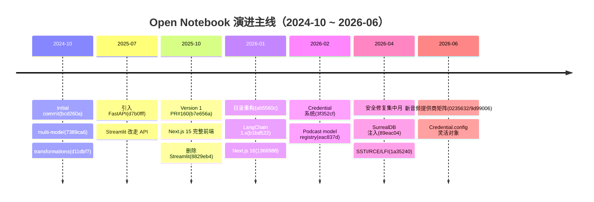
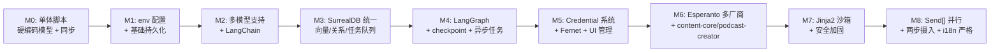

# 研究计划

> 本文件包含两部分：顶部是 **Phase 3 研究总结**（项目核心价值、各专题索引、设计亮点、演进主线、第一性原理路线）；底部是 **Phase 1 研究计划**（专题目标与执行计划）。
>
> 所有输出文档位于同目录 `docs/code-research/`，全部以中文撰写，图表用 Mermaid。

---

## 研究总结（Phase 3）

### 项目核心价值

**一句话定位**：Open Notebook 是一个"开源、隐私优先、可自托管、可程序化、可多厂商混搭"的 AI 研究助理 —— 它把"上传多模态资料 → AI 处理 → 多种产出"的整条流水线交还给用户掌控。

**三个差异化支柱**：

1. **数据主权**：研究资料、嵌入向量、聊天历史、生成播客全部落在用户自己的 SurrealDB / 文件系统里；可本地、可私有云、可断网运行（Ollama / LM Studio）。
2. **模型自主**：通过 **Esperanto + Credential 系统** 支持 18+ 厂商、4 类模态（LLM / Embedding / STT / TTS）任意混搭，避免厂商锁定；凭证加密入库、UI 管理、DB 优先 / env 回退。
3. **可程序化 / 可改造**：开源 + 模块化 + 完整 REST API（NotebookLM 没有）；LangGraph 状态机可改造、Jinja2 模板可自定义、`surreal-commands` 异步任务可追踪。

### 各专题索引

| # | 文档 | 回答的核心问题 | 篇幅 |
|---|------|--------------|------|
| 01 | [01_architecture.md](01_architecture.md) | 项目分几层？每个目录是干什么的？ | 483 行 |
| 02 | [02_mechanism_ai_provisioning.md](02_mechanism_ai_provisioning.md) | 多厂商 AI 怎么接入？API key 怎么加密？DB 与 env 怎么回退？ | 1006 行 |
| 03 | [03_data_flow.md](03_data_flow.md) | 数据存在哪？关系怎么建？检索怎么工作？ | 1100 行 |
| 04 | [04_dependencies.md](04_dependencies.md) | 每个依赖为什么选它？替代品是什么？ | 1188 行 |
| 05 | [05_workflow.md](05_workflow.md) | 五条核心业务流端到端怎么走？ | 934 行 |
| 06 | [06_learning_path.md](06_learning_path.md) | 不同读者按什么顺序读？ | 250 行 |
| 07 | [07_evolution_history.md](07_evolution_history.md) | 项目从初始提交到现在经历了什么？ | 1275 行 |
| 08 | [08_implementation_map.md](08_implementation_map.md) | 每个历史里程碑对应现在的哪些代码？ | 1244 行 |
| 09 | [09_design_evolution.md](09_design_evolution.md) | 每个关键设计从第一性原理怎么推演？ | 846 行 |

**合计约 8300 行中文研究**，所有结论基于真实代码与 git 历史，引用一律带 `file_path:line_number` 或提交 hash。

### 设计亮点（读完所有专题后值得单独强调的）

1. **SurrealDB 一库多用**：同一数据库同时承担"记录存储 / 关系图 / 向量索引 / 全文检索 / 异步任务队列"五种角色，省掉了 Postgres + pgvector + Qdrant + Redis 四件套。代价：SurrealDB 生态小、复杂查询能力弱于 Postgres。
2. **Credential 三段式架构**：`Credential` 领域对象 + Fernet 字段级加密 + `key_provider` 的"DB 优先 / env 回退" —— 让 UI 管理、多套凭证切换、安全存储、向下兼容同时达成。
3. **Esperanto + LangChain 桥接**：用 `esperanto` 统一 18+ 厂商接口，再用 `.to_langchain()` 桥接到 LangChain 生态 —— 既屏蔽了厂商差异，又复用了 LangChain 的工具 / 模板 / 流式抽象。
4. **LangGraph + SqliteSaver**：聊天状态用 SQLite checkpoint 持久化（消息流式追加），元数据用 SurrealDB 存（结构化关系）—— 通过 `thread_id = "chat_session:<id>"` 对齐两边。
5. **Ask 流程的 Send[] 并行 fan-out**：agent 节点生成 N 个检索 Strategy → 并行 `provide_answer` → `write_final_answer` 合成 —— 在单次用户请求内完成多视角检索。
6. **Podcast 故意 `max_attempts=1`**：防止重复 episode 记录；retry 端点先 delete 再 resubmit。这是"幂等性 > 自动重试"的设计取舍。
7. **ai_prompter 内置 Jinja2 SandboxedEnvironment**：用户可自定义 Transformation prompt 而不会触发 SSTI —— 把安全下沉到依赖库。
8. **两步异步摄入**：`process_source`（提取 + 切块）→ `embed_source`（嵌入）拆开，每步独立重试（前者 15 次应对 SurrealDB 事务冲突，后者独立）—— 重试粒度对齐失败模式。
9. **curl-free SSE**：前端**没有**引入 `@microsoft/fetch-event-source`，而是手写 `fetch().getReader()` 解析 SSE —— 少一个依赖，多一份控制力。
10. **i18n 是硬约束**：14 种语言、所有前端文案必须走 i18next key —— 根因见演进史（多轮 i18n 回归 bug 后才形成的纪律）。

### 演进主线（来自 07_evolution_history.md）

**几条反复出现的演进模式**（详见 `07_evolution_history.md` §演进模式总结）：

- **单例 → 领域模型**：env vars → ProviderConfig 单例 → Credential 领域对象；string model name → DefaultModels 单例 → Model 领域对象。
- **自研 → 社区库**：早期自研的 ingestion / podcast / AI 抽象，陆续被 content-core / podcast-creator / esperanto 取代（且这几个库都是同一作者维护）。
- **单体 → API → 前端**：Streamlit 单体 → 引入 FastAPI → Next.js 完整前端。
- **安全滞后于功能**：每次引入新能力（自定义 prompt、URL 摄入、文件上传）都先跑通功能再补安全（2026-04 集中修了 4 个洞）。
- **大重构 → 跟随修复**：folder-reorg、Next.js 16 升级都伴随一连串小修复。
- **i18n 强制约束**：多轮回归 bug 之后，"前端改动必须带 i18n key"成为硬规则。

### 当前实现地图 Highlights（来自 08_implementation_map.md）

14 个里程碑全部映射到了当前代码锚点（共 8 个维度：模块 / 类与函数 / API 接口 / 数据结构 / 运行时 / 存储状态 / 配置 / migration）。最有代表性的 5 个映射：

| 里程碑 | 当前代码落点（示例） |
|-------|------------------|
| 多模型（2024-10） | `open_notebook/ai/models.py` `ModelManager` + `open_notebook:default_models` 单例 |
| Credential 系统（2026-02） | `open_notebook/domain/credential.py` + `open_notebook/ai/key_provider.py` + `migrations/11-15.surrealql` |
| LangGraph checkpoint | `open_notebook/graphs/chat.py:88-98` SqliteSaver @ `LANGGRAPH_CHECKPOINT_FILE` |
| SurrealDB injection 修复 | 参数化查询 `repo_query(query_str, vars)` + `_validate_url()` |
| Podcast model registry | `open_notebook/domain/episode_profile.py` + `open_notebook/domain/speaker_profile.py` + `Model.credential` 链接 |

### 第一性原理路线（来自 09_design_evolution.md）

**最小可行设计 → 暴露问题 → 增量设计 → 复杂度代价 → 当前代码落点** —— 12 个关键决策的五段式推演：

**三条设计哲学**（详见 `09_design_evolution.md` §反思）：

1. **把数据交还用户** —— 凡是"可以放在用户自己基础设施里"的（DB、向量、任务队列、文件），就不再外置。
2. **把安全下沉到依赖** —— 凡是"社区库已经解决得更好"的（Jinja2 沙箱、Fernet 加密、SSRF 校验），就不再自研。
3. **把幂等性置于便利性之上** —— 凡是"重复执行会破坏数据正确性"的（podcast 生成、嵌入入库），宁可要求用户手动 retry，也不要默认重试。

### 推荐阅读起点

- **如果你只有 30 分钟**：读本文件 + `01_architecture.md` 前 2 节 + `09_design_evolution.md` 的"设计决策矩阵"表
- **如果你有 2 小时想理解整个项目**：按 `06_learning_path.md` 画像 B 的阶段 1 推进
- **如果你要贡献代码**：`06_learning_path.md` 画像 B 全程 + 选一条流程在 `05_workflow.md` 深读
- **如果你要复用某子系统**：直接看 `06_learning_path.md` 画像 D 的映射表

---

## Phase 1 研究计划（原始计划，保留作为参考）

## 项目概述

**它是什么**：Open Notebook 是一个开源、隐私优先、可完全自托管的"AI 研究助理"，定位为 Google NotebookLM 的开源替代品。用户把多模态资料（PDF、音频、视频、网页、YouTube 等）汇入一个"笔记本"，系统对其做切块/嵌入/检索，进而支持语义搜索、与资料对话、自动生成笔记与摘要、以及生成多人播客。

**解决什么问题**：
- 数据主权：把"上传到某家云"的研究资料收回自己手里（可本地或私有部署）。
- 模型自主：不绑死某一家 AI 厂商，支持 OpenAI、Anthropic、Google、Groq、Ollama、Mistral、DeepSeek、xAI、OpenRouter、Azure、Vertex、ElevenLabs、Deepgram 等 18+ 提供方，可在 LLM/嵌入/TTS/STT 各维度混搭。
- 可程序化：提供完整 REST API（而 NotebookLM 没有），方便自动化与二次集成。
- 可改造：开源 + 模块化，可改造与扩展（如自定义 transformation、播客脚本控制）。

**谁在使用**：研究工作者、知识工作者、内容创作者（尤其播客制作者）、注重隐私的 AI 用户、以及自托管/本地 LLM 玩家（Ollama、LM Studio 等）。社区在 GitHub 与 Discord 活跃。

---

## 技术栈速览（来自 `pyproject.toml` / `frontend/package.json`）

- 后端：Python 3.11+，FastAPI，LangGraph（状态机/Agent 编排），Pydantic v2，Loguru
- 数据层：SurrealDB（图/文档/向量库一体）；`surreal-commands` 作为异步任务队列
- AI：`esperanto`（统一多厂商接口）、`langchain-*`、`ai-prompter`（Jinja2 模板）、`content-core`（文件/URL 提取）、`podcast-creator`（播客合成）
- 前端：Next.js 16 / React 19，Zustand + TanStack Query，Tailwind + Shadcn/ui，i18next（14 种语言）

---

## 研究专题

> 所有输出文件均位于 `docs/code-research/`，全部以中文撰写。

### 专题 A：架构全景
- 目标：把项目拆成模块，说清"每个模块是什么 / 为什么存在 / 与谁协作"
- 范围：`api/`、`open_notebook/`（`ai/`、`database/`、`domain/`、`graphs/`、`podcasts/`、`utils/`）、`frontend/src/`、`commands/`、`prompts/`、`migrations/`
- 输出：`docs/code-research/01_architecture.md`

### 专题 B：核心机制 —— 多厂商 AI 提供与凭证系统
- 目标：理解 Esperanto 适配层、ModelManager 工厂、Credential 加密存储、key_provider 的"DB 优先 + env 回退"机制、connection_tester、模型发现与注册的完整调用链
- 范围：`open_notebook/ai/{models,provision,key_provider,connection_tester,model_discovery}.py`、`open_notebook/domain/credential.py`、`api/credentials_service.py`、`api/routers/credentials.py`
- 输出：`docs/code-research/02_mechanism_ai_provisioning.md`

### 专题 C：数据流与状态管理
- 目标：核心领域模型（Notebook / Source / Note / SourceEmbedding / SourceInsight / ChatSession / Credential / EpisodeProfile / SpeakerProfile）的字段、关系图、嵌入与全文检索的数据流、SurrealDB 图边（`reference` / `artifact` / `refers_to`）、LangGraph checkpoint 的角色
- 范围：`open_notebook/domain/*.py`、`open_notebook/database/{repository,async_migrate}.py`、`open_notebook/database/migrations/*.surrealql`
- 输出：`docs/code-research/03_data_flow.md`

### 专题 D：依赖与生态
- 目标：核心依赖各自解决了什么、为什么选它而不是替代品（Esperanto vs LangChain 原生、SurrealDB vs Postgres+pgvector、LangGraph vs LangChain Agent、content-core vs unstructured、podcast-creator vs 自研、surreal-commands vs Celery/RQ 等）
- 范围：`pyproject.toml`、`frontend/package.json`、`Dockerfile`、`docker-compose.yml`、`supervisord.conf`、Makefile
- 输出：`docs/code-research/04_dependencies.md`

### 专题 E：核心工作流
- 目标：端到端追踪五条核心业务流：
  1. Source ingestion（上传/URL → content-core 提取 → 切块 → 嵌入 → 入库）
  2. Chat（带 Source/Note 上下文 + 工具 + 历史 + SSE 流式）
  3. Ask（全文 + 向量混合检索 → 合成答案）
  4. Transformation（自定义 Jinja2 提示对内容做转换）
  5. Podcast 生成（outline → transcript → TTS 合成，异步任务）
- 范围：`open_notebook/graphs/*.py`、`api/{chat,podcast,sources,transformations,search}_service.py`、`commands/*.py`、`prompts/**/*.jinja`
- 输出：`docs/code-research/05_workflow.md`

### 专题 F：学习路径（最后执行，依赖前面专题）
- 目标：给"想贡献代码 / 想深度理解 / 想复用某子模块"的几类读者一条推荐阅读顺序与最低必要前置知识
- 输出：`docs/code-research/06_learning_path.md`

### 专题 G：系统演进历史（基于 Git）
- 目标：基于 `git log` 时间线 + CHANGELOG + 关键 diff 梳理真实演进路线（如：从 Streamlit 单体 → API + Next.js 前端、env vars → Credential 系统、单模型 → 多模型 → 模型注册表、文件夹大重构、Next.js 15→16、若干安全洞的发现与修复等）
- 输出：`docs/code-research/07_evolution_history.md`
- 关键参考提交：
  - `2024-10-21 bcd260a` "Initial commit with all features"
  - `2024-10-22 7389ca6` "multi-model" 合并
  - `2024-10-23 d11dbf7` "transformations"
  - `2025-*-*` 多轮 Streamlit → FastAPI 迁移痕迹
  - `2026-01-05 b76af50` "refactor/folder-reorg"
  - `2026-01-14 f92c42a` "Next.js 16 升级"
  - `2026-02-10 3f352cf` "credential-based API key management"
  - `2026-02-27 eac837d` "podcasts model registry integration"
  - `2026-04-09 1a35240` "security round2"（RCE/SSTI/LFI 修复）
  - `2026-04-07 89eac04` "SurrealDB injection" 修复
  - `2026-06-02 0235632 / 9d99006` "新音频提供商矩阵"

### 专题 H：实现地图（演进 → 现在的代码）
- 目标：把演进史里每个里程碑能力，落到当前仓库的具体模块、接口、数据结构、运行时组件、存储/状态上（读者能从历史条目跳到代码锚点）
- 输出：`docs/code-research/08_implementation_map.md`

### 专题 I：从 0 设计这套系统（第一性原理）
- 目标：忽略时间线，按"最小设计 → 暴露问题 → 增量设计 → 复杂度代价 → 当前代码落点"重新推演：为什么要把嵌入存进同一数据库？为什么用图数据库而非 pgvector？为什么需要 LangGraph 而不是裸 LangChain？为什么把 API key 做成领域模型而不是 config 文件？为什么 Podcast 必须异步化？等等
- 输出：`docs/code-research/09_design_evolution.md`

---

## 执行计划

1. **Phase 2（并行）**：A、B、C、D、E、G、H、I 八个专题同时派出独立 Explore Agent；专题 F（学习路径）等其余专题都回来后再做。
2. **Phase 3**：在文件顶部补写"研究总结"，包含：项目核心价值、各专题索引、设计亮点、演进主线、第一性原理路线。

## 待解决疑问

- 历史流：早期是 Streamlit 单体（`app_home.py`/`pages/**` 的 ruff/per-file-ignores 还留着痕迹），具体在哪个提交完成"API + 前端"分离？
- 凭证系统迁移：env → ProviderConfig（单例）→ Credential（多记录）的真实演进步骤与向下兼容路径。
- `surreal-commands` 与 `commands/` 目录的关系，以及它与 LangGraph checkpoint 在"任务状态"上的职责划分。
- `open_notebook:default_models` 单例与 `Model` 领域对象、`Credential` 三者之间的引用关系。
